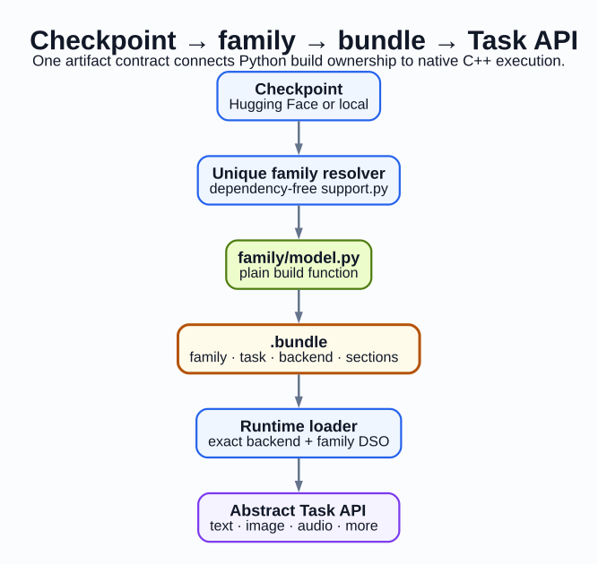

# TensorRT-Model-Connect

> Take a supported Hugging Face checkpoint. Build a TensorRT deployment bundle.
> Run it through task-oriented C++ APIs without an ONNX conversion step.



[Documentation](https://nvidia.github.io/TensorRT-Model-Connect/) |
[Quick Start](https://nvidia.github.io/TensorRT-Model-Connect/getting-started/quick-start) |
[Model Support](https://nvidia.github.io/TensorRT-Model-Connect/getting-started/model-support) |
[API Reference](https://nvidia.github.io/TensorRT-Model-Connect/api/overview)

TensorRT-Model-Connect is a reference implementation. Users are responsible
for trusting the checkpoints, bundles, native libraries, and local environment
they provide when building or running models.

## What is TensorRT-Model-Connect?

TensorRT-Model-Connect (TRTMC) turns a supported Hugging Face or local
checkpoint into a deployable `.bundle` bundle, then runs that bundle through
task-oriented C++ APIs. Python owns checkpoint resolution and TensorRT engine
construction at build time. Native profiles execute model inference in C++
without PyTorch. A small number of hybrid profiles explicitly invoke a helper
Python executable; their E2E manifests declare that runtime dependency.

The `.bundle` bundle is the handoff between those environments. Native bundles
resolve their matching model and TensorRT backend DSOs at runtime; exactly
qualified optimized-runtime bundles can carry their implementation DSO. Both
forms still require a compatible NVIDIA driver, CUDA/TensorRT cohort, dynamic
loader, and system libraries.

There is no intermediate ONNX export step. Applications load a bundle and call
task APIs such as `generate()`, `transcribe()`, `generate_image()`,
`embed()`, or `solve()` instead of maintaining conversion stages and
model-specific application glue.

## How does it fit into the TensorRT ecosystem?

Choose the import path that matches the model boundary you already own. Each
path targets TensorRT execution, but the development and deployment interfaces
are different.

| Starting point | Interface | When to use it |
| --- | --- | --- |
| Hugging Face or local checkpoint | **TensorRT-Model-Connect** | Build a supported checkpoint into a `.bundle` bundle for native C++ task inference. |
| PyTorch model | **Torch-TensorRT** | Keep the model in the PyTorch ecosystem while compiling its execution with TensorRT. |
| Portable framework interchange | **ONNX** | Use an exchange format when portability across originating frameworks is the primary requirement. |

## Who is this for?

TRTMC is designed for teams that:

- need inference in a C++ service, embedded application, robotics stack, or
  edge system and can select a profile with the required deployment boundary;
- want to move a supported Hugging Face model into production without owning an
  ONNX or TorchScript conversion pipeline;
- target NVIDIA aarch64 systems such as Jetson Thor or GB300, where dependency
  size, startup behavior, and runtime integration matter;
- want one versioned bundle boundary between a Python-first build environment
  and a native production application; or
- need a common task API across text, vision, audio, diffusion, segmentation,
  time-series, and other model families.

TRTMC may not be the right boundary when inference already lives entirely in a
Python/PyTorch deployment, or when ONNX is a required interchange artifact.

## What problems does it solve?

A conventional research-to-production path can accumulate several conversion
and integration boundaries:

```text
PyTorch → ONNX or TorchScript → TensorRT → model-specific C++ integration
```

TRTMC reduces that path to:

```text
Hugging Face checkpoint → .bundle artifact → native C++ task API
```

| Traditional pain point | TRTMC boundary |
| --- | --- |
| ONNX export failures and unsupported conversion gaps | Family-owned builders compile supported checkpoints directly with TensorRT APIs. |
| Repeated model-specific application integration | Applications load a bundle and use a task-oriented runtime API. |
| Validation across several conversion artifacts | Build, runtime, and E2E manifests identify one bundle contract and its evidence. |
| Python framework dependencies in native inference paths | Native profiles execute model inference in C++; manifests explicitly flag hybrid profiles that require helper Python. |
| Opaque deployment artifacts | `trtmc inspect` exposes bundle kind, model family, precision, runtime identity, and engines. |

## Broad model coverage

The current repository snapshot declares 78 Python family plugins, 79
unique native runtime strategy keys, and 205 E2E model manifests. These are
discovery counts, not a claim that every model is qualified on every platform.
See [Model Support](website/docs/getting-started/model-support.md) for evidence
levels and the generated inventory.

The build-and-run design spans decoder and hybrid language models,
encoder/embedding/reranking models, translation, vision-language and OCR,
speech recognition and synthesis, diffusion image and video generation,
segmentation, time-series forecasting, and neural operators.

Model knowledge remains in family-owned builder, runtime, and E2E descriptors.
The repository also includes agent instructions and model-local validation
contracts so contributors can extend one family without editing a hand-written
global registry.

## Quick Start

Use [Getting Started](website/docs/getting-started/overview.md) for
prerequisites and the complete first-inference path. The source-build outline
is:

```bash
git clone https://github.com/NVIDIA/TensorRT-Model-Connect.git
cd TensorRT-Model-Connect

./scripts/docker_build_gb300.sh
./scripts/docker_run_gb300.sh

pip install -e . -C py-only=true
cmake -S . -B build -G Ninja -DCMAKE_BUILD_TYPE=Release
cmake --build build -j

./build/trtmc build Qwen/Qwen3-0.6B
./build/trtmc inspect Qwen3-0.6B.bundle
./build/trtmc run Qwen3-0.6B.bundle \
  --prompt "The capital of France is" \
  --max-new-tokens 20 \
  --greedy
```

Success means the final command prints generated text. The first build
downloads checkpoint assets unless they are already cached and compiles
platform-specific TensorRT engines; it is much slower and more
resource-intensive than normal bundle loading.

## Performance snapshot by model and platform

This table is a dated performance snapshot from the completed July 29, 2026
release comparison on NVIDIA GB300 at source revision
`508613d0bcc7003b123cf5be3d1b3f6e6c6cb667`. It covers 105 unique
single-process release model profiles across 76 families. Distributed profiles
and shorter L0 smoke profiles are outside this matrix; absence from the table
does not mean a model is unsupported.

Each light compares TRTMC inference p50 with the row's declared reference under
matching workload, output, and timing contracts:

- **🟢 Green:** TRTMC is more than 5% faster than the reference.
- **🟡 Yellow:** TRTMC is within 5% of the reference.
- **🔴 Red:** TRTMC is more than 5% slower than the reference.
- **— Not supported:** the model profile is explicitly unsupported on that
  platform.

Bundle preparation, model loading, compilation when used, and warmup are
excluded from these infer-p50 values. Baselines are declared per row and are
not uniformly `torch.compile`: this snapshot contains 59 `torch.compile`, 34
Hugging Face eager, and 12 PyTorch eager references. The
[release comparison contract at the measured revision](https://github.com/NVIDIA/TensorRT-Model-Connect/blob/508613d0bcc7003b123cf5be3d1b3f6e6c6cb667/benchmarks/performance/release.yaml)
identifies the reference and measurement policy for every row; its
[revision-matched documentation](https://github.com/NVIDIA/TensorRT-Model-Connect/blob/508613d0bcc7003b123cf5be3d1b3f6e6c6cb667/benchmarks/performance/README.md)
explains how to reproduce and interpret the matrix.

A traffic light is emitted only after the row's output and measurement
contracts match. It is performance evidence for this exact snapshot, not a
general correctness or compatibility guarantee.

| Model profile | GB300 |
| --- | --- |
| `albert-base` | 🟢 Green |
| `all-minilm-l6-v2` | 🟢 Green |
| `all-mpnet-base-v2` | 🟢 Green |
| `bark-large` | 🟢 Green |
| `bark-small` | 🟢 Green |
| `bart-base` | 🟢 Green |
| `bert-base-uncased` | 🟢 Green |
| `bge-small-en-v1.5` | 🟢 Green |
| `bloom-560m` | 🟢 Green |
| `camembert-base` | 🟢 Green |
| `canary-1b-v2` | 🟢 Green |
| `chronos-bolt-tiny-official` | 🟢 Green |
| `codegen-350m` | 🟢 Green |
| `convbert-base` | 🟢 Green |
| `deberta-base` | 🟢 Green |
| `deepseek-ocr` | 🟢 Green |
| `deepseek-v2-lite` | 🟢 Green |
| `deepseek-v2-tiny` | 🟢 Green |
| `distilbert-base-uncased` | 🟢 Green |
| `distilgpt2` | 🟢 Green |
| `dpr-ctx-encoder` | 🟢 Green |
| `electra-base-discriminator` | 🟢 Green |
| `falcon-rw-1b` | 🟢 Green |
| `falcon3-1b` | 🟢 Green |
| `flux-2-dev` | 🟢 Green |
| `flux-2-dev-fp8` | 🟢 Green |
| `flux-schnell` | 🟢 Green |
| `fnet-base` | 🟢 Green |
| `gemma-2-2b` | 🟢 Green |
| `glm-4-9b` | 🟢 Green |
| `gpt-neo-125m` | 🟢 Green |
| `gpt-oss-20b` | 🟢 Green |
| `gpt2-125m` | 🟢 Green |
| `granite-3.1-2b` | 🟢 Green |
| `internlm2-1.8b` | 🟢 Green |
| `internvl3-2b` | 🟢 Green |
| `internvl3-8b` | 🟢 Green |
| `lance-3b-x2t-image` | 🟢 Green |
| `locateanything-3b` | 🟢 Green |
| `magpie-tts-357m` | 🟢 Green |
| `mamba-130m` | 🟢 Green |
| `marian-en-ru` | 🟢 Green |
| `minitron-4b-depth` | 🟢 Green |
| `minitron-4b-width` | 🟢 Green |
| `mistral-7b` | 🟢 Green |
| `mixtral-stories-15m` | 🟢 Green |
| `modernbert-base` | 🟢 Green |
| `nemotron-3.5-asr-streaming-0.6b` | 🟢 Green |
| `nemotron-embed-vl-1b-v2` | 🟢 Green |
| `nemotron-h-nano-9b` | 🟢 Green |
| `nemotron-hindi-4b` | 🟢 Green |
| `nemotron-labs-diffusion-8b` | 🟢 Green |
| `nemotron-mini-4b` | 🟢 Green |
| `nemotron-nano-4b` | 🟢 Green |
| `nemotron-rerank-vl-1b-v2` | 🟢 Green |
| `nemotron-speech-streaming-en-0.6b` | 🟢 Green |
| `nllb-200-distilled-600m` | 🟢 Green |
| `olmo-1b` | 🟢 Green |
| `olmo2-1b` | 🟢 Green |
| `opt-125m` | 🟢 Green |
| `paraphrase-multilingual-minilm-l12-v2` | 🟢 Green |
| `patchtsmixer-granite-official` | 🟢 Green |
| `patchtst-etth1-regression-distribution` | 🟢 Green |
| `patchtst-granite-official` | 🟢 Green |
| `personaplex-7b` | 🟢 Green |
| `phi-moe` | 🟢 Green |
| `phi3-mini` | 🟢 Green |
| `phi4-multimodal` | 🟢 Green |
| `pixart-sigma-1024` | 🟢 Green |
| `pythia-70m` | 🟢 Green |
| `qwen-image` | 🟢 Green |
| `qwen-image-2512` | 🟢 Green |
| `qwen-image-edit-2511` | 🟢 Green |
| `qwen25vl-3b` | 🟢 Green |
| `qwen3-0.6b-fp16` | 🟢 Green |
| `qwen3-0.6b-fp8` | 🟢 Green |
| `qwen3-0.6b-topp` | 🟢 Green |
| `qwen3-4b-instruct-2507` | 🟢 Green |
| `qwen3-moe-30b-a3b` | 🟢 Green |
| `qwen3-moe-tiny-random` | 🟢 Green |
| `qwen3-omni-30b-a3b-instruct` | 🔴 Red |
| `qwen3-vl-2b` | 🟢 Green |
| `qwen35-9b` | 🟢 Green |
| `riva-translate-4b` | 🟢 Green |
| `roberta-base` | 🟢 Green |
| `roberta-large` | 🟢 Green |
| `rwkv-169m` | 🟢 Green |
| `sam-vit-base` | 🟢 Green |
| `sam3` | 🟢 Green |
| `sana-wm-bidirectional` | 🟡 Yellow |
| `segformer-b0-ade` | 🟢 Green |
| `stablelm2-1.6b` | 🟢 Green |
| `starcoder2-3b` | 🟢 Green |
| `t5-small` | 🟢 Green |
| `timesfm-2.0-500m-official` | 🟢 Green |
| `timm-vit-base-p16-224-augreg-in21k-ft-in1k` | 🟢 Green |
| `tinyllama-1.1b` | 🟢 Green |
| `wan21-t2v-1.3b` | 🟢 Green |
| `wan22-ti2v-5b` | 🟢 Green |
| `whisper-large-v3-turbo` | 🟢 Green |
| `whisper-tiny-fp16` | 🟢 Green |
| `xglm-564m` | 🟢 Green |
| `xlm-roberta-base` | 🟢 Green |
| `xlnet-base` | 🟢 Green |
| `z-image-turbo` | 🔴 Red |
