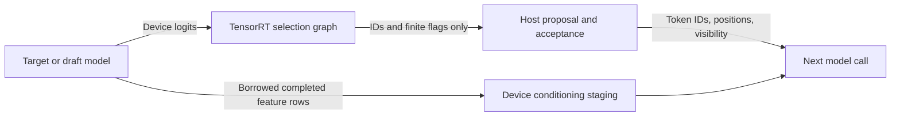

# Device-resident speculative runtime

The runtime retains target and draft features on the GPU and reuses conditioning,
prompt, mask and cache-compaction storage. An optional TensorRT selection engine
reduces full-vocabulary logits to compact greedy decisions. Both changes preserve
the attention/KV ABI and use standard TensorRT and CUDA runtime operations.

## Compiler/runtime boundary

Build with `--greedy-selection device_v1` on the existing `llama build-speculative`
command. The default `host` retains full-logit CPU selection; old manifests missing
this field retain that behavior. Features use device transport in either mode.
Both single and split execution-profile configurations are supported.

Each engine contract records `greedy_selection`. `device_v1` requires a matching
`target_selection.plan` or `draft_selection.plan` bundle section. These are small,
stateless TensorRT graphs. The model plans still output their original logits
and features; their state bindings and alias guarantees are unchanged. The
selector can therefore be compiled independently without retuning a model plan.
An older runtime does not implement this optional capability; use the updated
runtime to enable it.

| Selector binding | Type/shape | Meaning |
|---|---|---|
| `logits` | input FP32 `[M,V]` | Borrowed device output of the model, in selected query-row order. |
| `selection` (target) | output INT32 `[M,2]` | Best vocabulary index, then an all-finite flag. |
| `selection` (draft) | output INT32 `[M,3]` | Best and second-best distinct vocabulary indices, then an all-finite flag. |

The selector has one dynamic row profile, MIN=1, OPT=min(5, MAX), and MAX equal
to the largest selected-logit bound in the model profiles (legacy: `max_query`).
It never writes logits, features or KV state. IDs remain in the model's vocabulary;
EAGLE3 owns the draft-to-target vocabulary mapping.

Selection is descending by value, with lowest vocabulary index first on ties,
including signed zero. MAX, equality, integer MIN and select graph operations
make the tie rule explicit. The second rank excludes the first selected index.
`abs(logit) < infinity`, cast and MIN reduction produce a per-row all-finite flag.
NaN and either infinity make the flag zero; IDs on such rows are unspecified.
The runtime rejects a non-finite row when the policy consumes it, as the host
implementation does. Unvisited verification branches need not be consumed.
This is greedy selection, not a probability/sampling contract. Full logits and
the host path remain available for future techniques that need distributions.

## Buffer ownership and ordering

- `Engine::run` returns a completed `FeatureView`: FP16, dense rows on the current
  execution device. It owns no storage and expires at the producer's next run,
  reset or destruction. It is ordinary model data, not persistent KV state.
- Draft conditioning is copied or gathered into reusable input buffers on the
  draft stream before enqueue. Recurrence copies the last output row before
  that output can be overwritten. Empty conditioning means explicit zeros.
- Prompt accumulation uses independent pipeline-owned device storage, so later
  target prefill chunks cannot invalidate earlier feature rows. Its stream is
  synchronized once before draft prefill reads the accumulated prompt.
- The selector binds the model's device logits directly. An event recorded after
  model enqueue and waited on by the selector orders different streams. A final
  checked selector-stream synchronization completes both model outputs and the
  compact readback. Host selection also synchronizes before returning a view.
- Compact readback uses reusable pinned memory. Input preparation and policy
  still execute on the host, and each model step still ends at a host decision.
  This change does not implement an asynchronous scheduler or CUDA graph replay.

The separation allows a future fused model-output selection graph without
changing KV semantics. Such fusion would rebuild model engines and needs its own
performance and parity comparison; it is not required for this implementation.

## Validation and performance

A September 22 same-GPU ablation reused byte-identical OOTB model plans.
FP16/B1/TP1, IST=1024, 101 output IDs, split1024 profiles, CUDA graphs off;
three warm-ups and ten timed requests per mode:

| MC OOTB runtime | AR median, ms | Chain median, ms | Tree median, ms |
|---|---:|---:|---:|
| Allocation fix only | 787.10 | 330.41 | 360.01 |
| Device features and host selection | 780.10 | 306.31 | 338.13 |
| Device features and GPU selection | **758.90** | **282.34** | **292.63** |

Chain latency fell 14.5% and tree latency 18.7%. The feature-transport ablation
also includes buffer reuse and does not isolate every allocation or copy.
Acceptance paths matched the prior runtime exactly. Clock variation and this
single high-acceptance fixture limit generalization.

OOTB AR/chain/tree, reset and short prompts passed with GPU selection and
legacy host-selection bundles. Split64 additionally exercised accumulation of
borrowed feature rows across prefill chunks. All full-prompt AR/chain/tree
outputs matched across 101 IDs. C++ policy tests and 13 Python contract tests passed.

The GPU selector probe passed 168 cases against independent stable NumPy
sorting: target/draft vocabulary sizes, a two-token vocabulary, ties, signed
zero, float32 extremes, NaNs, infinities and changing row counts. Policy tests
cover consumed versus unused invalid rows, rank interpretation, manifest
compatibility and feature-view bounds.

The [updated graph profile](SPECULATIVE_GRAPH_PROFILE.md) records GPU busy/idle,
transfers and remaining optimization targets. The later
[AR/EAGLE3 remeasurement](SPECULATIVE_PERFORMANCE.md) has more repetitions on
a different worker; use its own controls rather than mixing absolute times.

Scripts, plan/source/binary hashes and raw evidence remain in
`/home/trentl/Working/specdecode-resident-runtime/`. These historical results
measure the residency change, not the subsequent review cleanup.
