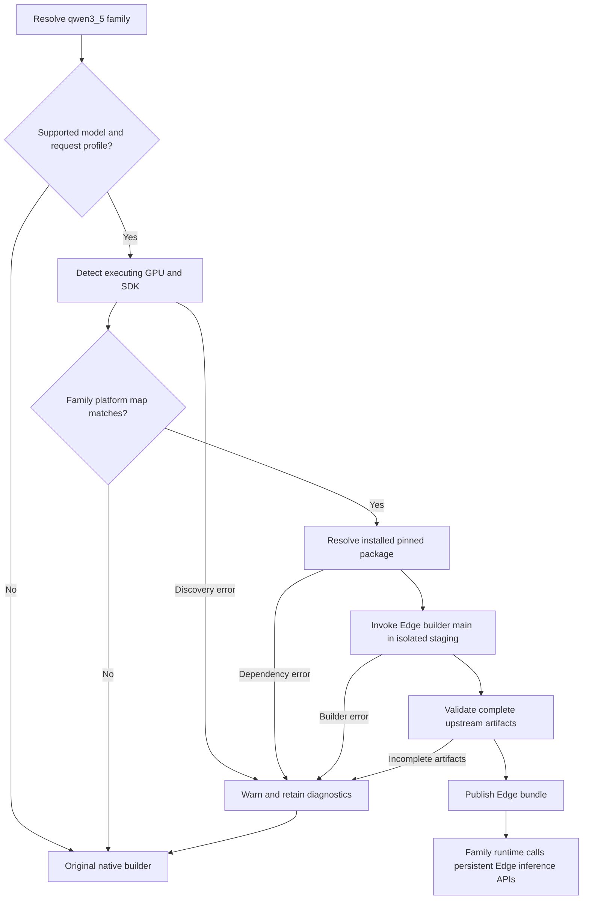

# Qwen3.5 Edge-LLM adapter

This family owns its dispatch map, builder argument mapping, runtime adapter,
and tests. Qwen3 and older retain their original native implementation.

## Install once, dispatch automatically

Provision the optional, pinned native SDK using the
[CMake dependency instructions](../../cmake/edgellm/README.md). Cross compilation
is unsupported. Normal model build and inference never clone or install Edge.

Set `CMAKE_PREFIX_PATH` to that installation, then use the ordinary commands:

```bash
export CMAKE_PREFIX_PATH=/path/to/edge-install
python -m tensorrt_model_connect build /path/to/Qwen3.5-0.8B \
  --precision fp16 --max-sequence-length 1024 -o qwen35.bundle
/path/to/model-connect-build/trtmc run qwen35.bundle \
  --runtime-root /path/to/model-connect-build \
  --prompt "What is the capital of France? Answer in one word." \
  --max-new-tokens 10 --temperature 0 --top-k 1 \
  --use-chat-template true --enable-thinking false
```

The runtime build must also have `TRTMC_ENABLE_EDGELLM=ON`. The package pin is
Edge-LLM v0.10.1, commit `e8b29522938901f6df19ebeedd4b69bc8edbcd97`.
The bundle contains `edge_llm.json` and complete upstream engine/checkpoint
assets, rather than a native-family engine. An Edge-marked bundle requires an
Edge-enabled runtime on its recorded native platform and SDK.

## Selection and API boundaries



- `dispatch.py` owns the exact platform map and model/request admission checks.
  The initial profile is dense, unquantized FP16 text generation, batch/TP/CP 1,
  with the pinned builder's 128-dimensional GDN state contract. Unsupported
  quantization, graph transforms, explicit FP32 layers, dynamic KV or multimodal
  requests remain native. Actual configuration, not a marketing-name comparison,
  distinguishes this family from Qwen3.8.
- `edge_llm.py` calls `experimental.builder.cli.main` in the CMake-installed
  isolated Python environment. It maps model/output directories, sequence
  capacity, batch size and FP16 precision. Edge owns conversion, topology,
  TensorRT engine building, tokenizer/template processing and external weights.
- Ordinary preparation failures warn before one native retry with the **same
  request**. Diagnostics stay beside the requested output as `.NAME.edge-*.log`.
  If native also fails, its error retains the Edge cause. Cancellation and bundle
  publication failures propagate without retry.
- `runtime/edge_llm` directly owns one `LLMInferenceRuntime`, maps requests to
  `countPromptTokens` and `handleRequest`, and returns Edge text/token IDs.
  It supports token limits, temperature, top-k/top-p and chat/thinking controls;
  unsupported non-default controls are rejected, not silently ignored.
  **Inference errors never switch to native.**

## Validation scope

The real Qwen/Qwen3.5-0.8B checkpoint has built and generated `Paris` through
ordinary Model Connect dispatch on A30 SM80, Ubuntu 24.04 x86_64, CUDA 13.3 and
TensorRT 11.1.0.106. This is not qualification evidence for every platform in
the candidate map. Persistent Model Connect requests match direct Edge API text
and greedy token IDs for raw prompts, chat and EOS termination, including repeat
requests after unsupported controls and capacity overruns are rejected. To
repeat this check with the compiled family validation drivers:

```bash
python -m families.qwen3_5.tests.edge_validation \
  --bundle qwen35.bundle --runtime-root /path/to/model-connect-build \
  --output /tmp/qwen35-edge-validation-new
```

The output directory must not already exist. The harness rejects native bundles
and retains commands, logs and JSON evidence. Family CPU tests cover admission,
API argument mapping, failure isolation, bundle publication and runtime contracts.

Independent CPU FP32 Hugging Face output also passes this family's existing
normalized-text quality criterion (maximum edit distance 0.15), without changing
its assertions. Add `--hf-checkpoint /path/to/Qwen3.5-0.8B` to run that reference;
this optional validation requires PyTorch and the model's Transformers support
in the validation interpreter, not in the production Edge builder environment.
Exact token-ID parity is required against direct Edge, not across different HF
and TensorRT numerical implementations.
