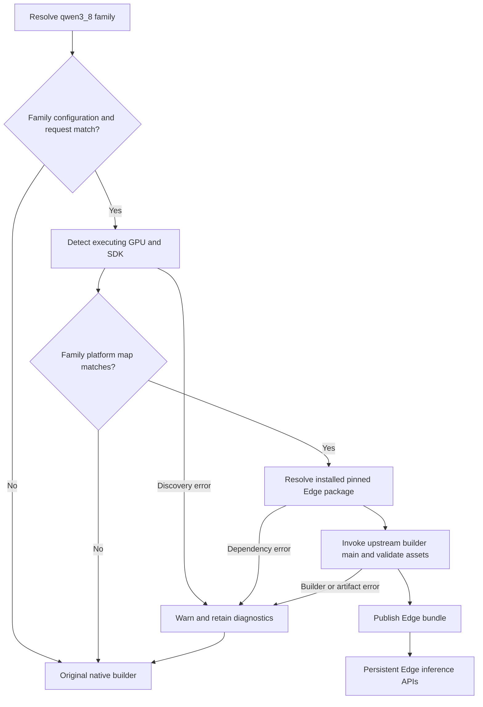

# Qwen3.8 Edge-LLM adapter

This family independently owns `dispatch.py`, `edge_llm.py`,
`runtime/edge_llm/` and their tests. It does not route through the Qwen3.5 or
legacy Qwen implementation.

Provision the optional native SDK using the
[CMake dependency instructions](../../cmake/edgellm/README.md). The pin is
Edge-LLM v0.10.1, commit `e8b29522938901f6df19ebeedd4b69bc8edbcd97`.
Cross compilation is unsupported; normal model builds and inference do not
download or install dependencies.

The initial profile is dense unquantized FP16 text generation with batch/TP/CP 1
and 128-dimensional GDN state. The owning family recognizes Qwen3.8 via its
configuration markers (`output_gate_type` present, `mlp_only_layers` absent),
not a numerical comparison of model names. Quantized, transformed, multimodal
and other unmapped configurations retain native behavior.

After setting `CMAKE_PREFIX_PATH` to the installed package, ordinary
`python -m tensorrt_model_connect build MODEL --precision fp16 -o MODEL.bundle`
selects the adapter automatically for a matching native platform. Build the
runtime with `TRTMC_ENABLE_EDGELLM=ON` and use ordinary `trtmc run` commands.

The adapter maps arguments to `experimental.builder.cli.main`; Edge owns all
model conversion and engine/artifact construction. The runtime directly calls
`LLMInferenceRuntime`, `countPromptTokens` and `handleRequest`, retaining one
instance across requests. Token limits, sampling and chat/thinking controls map
to Edge arguments. Unsupported non-default controls fail explicitly.

Ordinary Edge preparation failures emit a warning and retain a `.NAME.edge-*.log`
beside the output before exactly one native retry with the unchanged request.
Native failure chains the Edge cause. Cancellation, publication errors and
runtime/inference failures do not trigger fallback.

Both native-only and Edge-enabled runtime compilation and CPU contract tests
have passed. **Real Qwen3.8 GPU inference is not yet validated**: the available
A30 cannot hold the selected 27B checkpoint in the initial FP16 profile. The
Qwen3.5-0.8B GPU result must not be presented as Qwen3.8 quality evidence.
