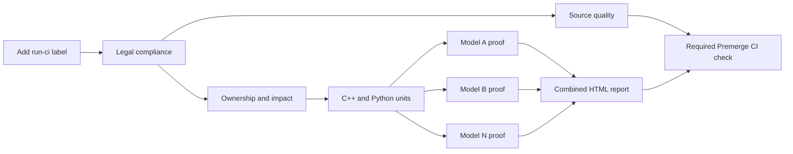

# CI orchestration tutorial

This directory contains the Python control plane for TensorRT Model Connect CI.
Its job is to make the workflow readable: GitHub Actions chooses **when** a job
runs, while these classes define **what** that job does.

The shortest useful reading order is:

1. `.github/workflows/trtmc-ci.yml` — the pre-merge job graph.
2. `tools/ci/__main__.py` — the public command-line interface.
3. `tools/ci/pipeline.py` — the named non-model stages and their ordered steps.
4. `tools/ci/model_proof.py` and `model_proof_inner.py` — one isolated model proof.

## The system at a glance



Each model box is a separate matrix job. Jobs share the machine's four GPUs
through file-backed leases, but each proof sees only its selected model source,
private cache view, build directory, and artifacts.

## Try the interface

All public commands use one entry point:

```bash
python3 -m tools.ci --help
python3 -m tools.ci pipeline source-quality
python3 -m tools.ci image ensure
python3 -m tools.ci container start
python3 -m tools.ci stage premerge-unit
python3 -m tools.ci model-proof --model patchtsmixer --suite premerge
```

`pipeline` runs in the current environment. `stage` is the host-side bridge
that enters the run-owned container and invokes `pipeline` there.

## Pre-merge, step by step

### 1. Pin and authorize the PR

Adding the `run-ci` label starts `.github/workflows/trtmc-ci.yml`. The Legal job
captures one merge commit SHA, removes the one-shot label, checks out that exact
snapshot, and verifies legal documents and source headers. Every later job uses
the captured SHA.

Commits pushed after the label was consumed do not alter the active run. Add the
label again to test the newer snapshot.

### 2. Select the work

The Ownership and Impact job runs `tools/model_ci.py impact` against the pinned
base and tested revisions. It emits:

- directly affected models;
- representative fallback models for shared-platform changes;
- the dynamic model matrix;
- whether source-only units are required and their scope.

This is why a model-only change validates that model, while a CI-platform change
selects a small representative set instead of all models.

### 3. Reject cheap failures first

Source Quality runs `python3 -m tools.ci pipeline source-quality` on a CPU runner
in parallel with impact analysis. `CiPipeline` makes its order explicit:

1. cyclomatic-complexity checks;
2. changed-file formatting and lint;
3. static model-architecture contracts.

The source-only unit job then uses three commands:

```text
image ensure  ->  container start  ->  stage premerge-unit
```

`DockerImageManager` fingerprints and verifies the CI image. `CiContainer`
starts a clean, hardened, GPU-free container with a read-only source mount.
`ContainerStageRunner` enters that container, and `CiPipeline` delegates the
actual unit work to `UnitTestRunner` and `CoverageRunner`.

The unit gate admits the model matrix. Source Quality joins the final required
`Premerge CI` check, so it cannot be bypassed even though it runs in parallel.

### 4. Prove each affected model in isolation

Each matrix job runs:

```bash
python3 -m tools.ci model-proof \
  --model <model> \
  --suite premerge \
  --revision <pinned-sha>
```

The host half, `ModelProofRunner`, performs trusted setup:

1. Create a positive source projection with `tools/model_ci.py project`.
2. Validate that the projection contains the requested model and approved
   platform files, but no peer model source.
3. Select the model-owned runtime, Python tests, E2E cases, resource class, and
   optional reference checkout.
4. Warm only the selected Hugging Face repositories and reflink them into a
   proof-private cache view.
5. Acquire either shared GPU slots or a whole GPU through `GpuLease`.
6. Start a read-only, network-disabled proof container.

The container half, `ModelProofInnerPipeline`, then runs linearly:

1. Revalidate projection, cache, reference, and GPU-lease evidence.
2. Configure a new build directory from projected source.
3. Build the requested model plugin DSO once.
4. Verify that only the requested model DSO was produced and loaded.
5. Run model-owned C++ and Python tests.
6. Run the model-owned E2E inference and reference comparison.
7. Run eligible nightly task evaluation when the suite is `nightly`.
8. Generate `proof.json`, status evidence, logs, and the per-model HTML report.

Failure at any step produces a fallback status and HTML artifact before the job
fails. The matrix uses fail-fast, so the first failing model cancels its peers.

### 5. Compose one report

After every selected model passes, the Combined HTML Report job downloads all
per-model artifacts and generates one report. Certification checks require:

- exactly the expected model set;
- the pinned source revision and requested suite;
- a passing proof for every model;
- no missing report sections or evidence.

The report is an Actions artifact. GitHub Pages remains reserved for project
documentation.

## What nightly adds

`.github/workflows/nightly.yml` uses the same image, container, pipeline, model
proof, scheduling, and reporting classes. It broadens selection to the full
model inventory and adds package, coverage, full-E2E, semantic media assessment,
and eligible task-evaluation work.

Pre-merge and nightly therefore exercise the same implementation; only their
selection and breadth differ.

## Module map

| Module | Responsibility | Execution boundary |
|---|---|---|
| `__init__.py` | Identify the package and point readers to this tutorial | Import only |
| `__main__.py` | Parse the public CLI and dispatch one class | Host or container |
| `pipeline.py` | Declare named stages as short ordered method lists | Container |
| `process.py` | Run commands and write GitHub file commands | Shared primitive |
| `context.py` | Hold repository, environment, state, and command access | Shared primitive |
| `environment.py` | Allowlist host variables forwarded into containers | Host/container boundary |
| `docker_image.py` | Fingerprint, build, cache, and verify the CI image | Host |
| `container.py` | Construct trusted or hardened long-lived containers | Host |
| `stage.py` | Enter a container and propagate cancellation | Host |
| `quality.py` | Run impact support, source quality, and unit tests | Container |
| `coverage.py` | Select tests, collect coverage, and enforce thresholds | Container |
| `package.py` | Build, validate, install, and smoke-test wheels | Container |
| `e2e.py` | Choose selective or full E2E policy | Container |
| `e2e_schedule.py` | Calculate balanced GPU/worker assignments | Pure planning |
| `e2e_scheduler.py` | Launch workers, enforce timeouts, and merge results | Container |
| `isolation.py` | Queue projected model groups for isolated validation | Container |
| `gpu_lease.py` | Allocate FIFO shared slots or exclusive GPUs | Host processes |
| `model_proof_selection.py` | Resolve and validate one model's proof contract | Projected source |
| `model_proof.py` | Prepare caches, projection, lease, and proof container | Trusted host |
| `model_proof_inner.py` | Build, test, compare, and report one model | Hermetic container |
| `task_eval.py` | Prepare and run eligible nightly ETTh1 parity | Host and container |

`scripts/schedule_e2e.py` is a compatibility entry point. The implementation is
package-local in `tools/ci/e2e_schedule.py`, which avoids collisions with
third-party packages named `scripts`.

## Component contracts

Each block below is a small unit design. **Inputs** are data the module accepts;
**Outputs** include return values, durable files, and intentional side effects;
**Boundary** states where the module must hand responsibility to another unit.
Paths are relative to the checked-out repository unless an absolute container
path is shown. JSON examples are abridged to the fields that define the handoff;
the producing class remains the source of truth for optional evidence fields.

### `__init__.py`

- **Functionality / units:** Defines `tools.ci` as the orchestration package and
  points imports to this tutorial.
- **Inputs:** Python imports of `tools.ci`; it accepts no runtime data.
- **Outputs:** Package metadata only; it creates no process, file, or CI result.
- **Boundary:** It contains no executable workflow behavior. CLI execution starts
  in `__main__.py`.

### `__main__.py`

- **Functionality / units:** `CiCommand` defines the public command tree and
  creates exactly one owning class for `image`, `container`, `stage`,
  `pipeline`, `e2e`, `coverage`, or `model-proof`.
- **Inputs:** `sys.argv` strings plus `os.environ`. A model-proof request, for
  example, is `{model: str, suite: "premerge"|"nightly", revision: str,
  output_dir: Path|None, inner: bool}`.
- **Outputs:** Process status `0` on success, `1` for `CiError`, or argparse
  status `2` for invalid syntax. Domain files come from the delegated class.
- **Boundary:** It validates CLI shape and dispatches. It must not select tests,
  define stage order, or implement a proof.

### `pipeline.py`

- **Functionality / units:** `CiPipeline` maps a stage name such as
  `source-quality`, `premerge-unit`, `package`, or `full-e2e` to a short
  ordered list of class methods.
- **Inputs:** A `CiContext` and one stage-name string from
  `python3 -m tools.ci pipeline <stage>`.
- **Outputs:** The ordered operations' files and process side effects. If
  `e2e_artifacts/` exists, the finalizer also attempts to write
  `e2e_artifacts/e2e_report.html`. Unknown stages raise `CiError`.
- **Boundary:** It owns ordering and GitHub log grouping only. Each called class
  owns its command, validation, and artifacts.

### `process.py`

- **Functionality / units:** `CommandRunner` standardizes subprocess execution;
  `GitHubFiles` writes GitHub environment, output, and summary file commands;
  `CiError` is the user-facing failure type.
- **Inputs:** A command as `Sequence[str]`, optional cwd/environment/timeout,
  and GitHub file paths supplied through `GITHUB_ENV`, `GITHUB_OUTPUT`, or
  `GITHUB_STEP_SUMMARY`.
- **Outputs:** `subprocess.CompletedProcess[str]` with
  `{returncode, stdout, stderr}`, or `CiError` when `check=True`. GitHub
  records are newline-delimited text such as `image_ref=sha256:...\n`.
- **Boundary:** It owns execution mechanics and error normalization, never which
  command should run or whether its result is acceptable to CI.

### `context.py`

- **Functionality / units:** `CiContext` carries the repository root,
  environment, command runner, shared-directory setup, JSON helpers, and
  reusable state directory.
- **Inputs:** `repository: Path|None`, `env: Mapping[str, str]`, command
  argument lists, and JSON-serializable objects.
- **Outputs:** Captured output strings or completed processes; ordinary JSON
  files; and typed state files under `.ci/` (or `TRTMC_CI_STATE_DIR`), for
  example `{"wheel": "/src/dist/trtmc.whl", "installed_at": "..."}`.
- **Boundary:** It owns filesystem and subprocess primitives. It has no knowledge
  of stage order, model ownership, or pass thresholds.

### `environment.py`

- **Functionality / units:** Declares `COMMON_ENVIRONMENT`,
  `TRUSTED_ENVIRONMENT`, and `OPTIONAL_HUGGING_FACE_ENVIRONMENT`.
- **Inputs:** Reviewed environment-variable names; the container and stage
  modules read the matching values from their caller's `dict[str, str]`.
- **Outputs:** Immutable tuples of names used to build explicit Docker `-e`
  arguments. It emits no file and does not mutate the environment.
- **Boundary:** This is only the host-to-container allowlist. Producers,
  validation, defaults, and secret handling remain with the owning modules and
  GitHub workflow.

### `docker_image.py`

- **Functionality / units:** `DockerImageManager` fingerprints image inputs,
  serializes concurrent builds with `WorkflowImageLock`, verifies dependency
  versions, and reuses only a matching local image.
- **Inputs:** Repository files such as the Dockerfile, `.dockerignore`, Python
  profile registry and requirements, plus `DockerImageConfig` values resolved
  from the environment.
- **Outputs:** Returns an immutable Docker ID shaped as
  `sha256:<64 lowercase hex characters>`. It exports a fingerprinted
  `TRTMC_CI_IMAGE` tag through `GITHUB_ENV`, may write
  `image_ref=sha256:...` through `GITHUB_OUTPUT`, and maintains a local
  verification stamp.
- **Boundary:** It proves image identity and contents. It neither starts a
  container nor chooses a CI stage.

### `container.py`

- **Functionality / units:** `ContainerConfig` resolves run identity, workspace,
  image, and hardening; `CiContainer` constructs and starts the long-lived
  trusted or GPU-free unit container.
- **Inputs:** Environment fields including `GITHUB_RUN_ID`,
  `GITHUB_RUN_ATTEMPT`, `TRTMC_CI_IMAGE`, `GITHUB_WORKSPACE`, and
  `TRTMC_CI_HARDENED`, plus the allowlists from `environment.py`.
- **Outputs:** Returns the container-name string, starts one `sleep infinity`
  Docker container, and exports `TRTMC_CI_CONTAINER_NAME=<name>` through
  `GITHUB_ENV`. Hardened mode mounts source read-only and scratch at `/work`.
- **Boundary:** It owns Docker runtime configuration and mounts. It does not
  execute a pipeline stage or define stage contents.

### `stage.py`

- **Functionality / units:** `ContainerStageRunner` attaches a named stage to
  the run-owned container and propagates cancellation safely.
- **Inputs:** `stage: str`, the same container environment used by
  `ContainerConfig`, and a running container name.
- **Outputs:** Returns the inner pipeline's integer exit status. On SIGINT or
  SIGTERM it removes only that run-owned container and exits `130` or `143`.
- **Boundary:** It bridges host execution to
  `python3 -m tools.ci pipeline <stage>`; stage policy remains in
  `pipeline.py`.

### `quality.py`

- **Functionality / units:** `EnvironmentVerifier` checks the fixed tool
  runtime; `ImpactAnalyzer` materializes selective coverage;
  `SourceQualityChecks` runs complexity/lint/contracts; `UnitTestRunner`
  builds and runs source-level units.
- **Inputs:** Source tree and Git diff against `CI_BASE_REF`, optional
  `coverage_map.json`, test ownership metadata, unit scope, timeouts, and
  worker counts from the environment.
- **Outputs:** Commands either pass or raise `CiError`. Impact writes
  `impact.json` with this stable top-level shape:

  ```json
  {
    "e2e_models": ["qwen3_5"],
    "e2e_test_ids": ["tests/e2e/models/qwen3_5/test_qwen3_5_e2e.py::test_model_e2e[qwen3_5]"],
    "unit_tiers": ["cpp", "builder"],
    "cpp_tests": ["test_name"],
    "builder_tests": ["tests/builder/test_name.py"],
    "tools_tests": [],
    "fallback_tiers": [],
    "rebuild_cpp": true,
    "cap_applied": false,
    "matched_rules": []
  }
  ```

- **Boundary:** It decides pre-model CPU coverage and executes units. Model
  projection, GPU allocation, reference inference, and proof reporting are
  outside this module.

### `coverage.py`

- **Functionality / units:** `CoverageRunner` selects impacted tests and exposes
  the public coverage commands. `CppCoverageEngine` configures, builds, tests,
  and runs `gcovr`; `PythonCoverageEngine` runs pytest through `coverage.py`.
  All three enforce the reviewed line/function/branch thresholds in Python.
- **Inputs:** `impact.json`, event/environment threshold values, selected test
  paths, and optional trailing pytest or CTest arguments. The standalone
  commands are `python3 -m tools.ci coverage python [pytest args...]`,
  `coverage cpp [ctest args...]`, and `coverage all`.
- **Outputs:** Files under `coverage/`: `python-cobertura.xml`,
  `python-coverage.txt`, `python-html/`, `cpp-cobertura.xml`,
  `cpp-coverage-summary.txt`, and `cpp-coverage.html`. Map generation writes
  and validates `coverage_map.json`.
- **Boundary:** It owns coverage collection, external compiler/test tool calls,
  report generation, and numeric gates. No coverage behavior is delegated to a
  shell script; ordinary unit policy and model E2E correctness remain outside.

### `package.py`

- **Functionality / units:** Archive and installed-wheel validators inspect
  native contents; `WheelPackageManager` builds tagged wheels, installs once,
  records reusable build state, and runs package smoke tests.
- **Inputs:** Source tree, TensorRT/CUDA include and library paths, Python tags,
  wheel architecture, package build directory, and an existing `CiContext`.
- **Outputs:** `dist/*.whl` plus two state contracts:

  ```json
  {
    ".ci/wheel-build.json": {
      "wheel_tag": "py312",
      "conan_out_dir": "...",
      "cmake_build_dir": "...",
      "trt_include_dir": "...",
      "trt_library": "...",
      "cuda_include_dir": "...",
      "cudart_library": "..."
    },
    ".ci/wheel-installed.json": {
      "wheel": "/src/dist/package.whl",
      "installed_at": "ISO-8601 UTC timestamp"
    }
  }
  ```

- **Boundary:** It certifies packaging and installed runtime reuse. It does not
  decide affected models or perform model/reference comparison.

### `e2e.py`

- **Functionality / units:** `E2ERunner` chooses selective versus full E2E,
  warms the selected HF cache, prepares model plugins, invokes parallel E2E,
  optionally runs strict isolation, and performs diffusion/VLM assessment.
- **Inputs:** `impact.json`, `FULL_E2E`, engine/cache paths, timeouts,
  rebuild flags, model manifests, and semantic-assessment configuration.
- **Outputs:** Selection files `e2e_models.txt`, `e2e_test_ids.txt`, and
  `e2e_isolation_models.txt`; then `e2e_artifacts/` containing plugins,
  worker results, media/reference artifacts, JUnit, and assessment results.
- **Boundary:** It owns high-level E2E phase policy. Scheduling belongs to
  `e2e_schedule.py`/`e2e_scheduler.py`; isolated build mechanics belong to
  `isolation.py`.

### `e2e_schedule.py`

- **Functionality / units:** Pure functions classify manifests, apply timing
  weights, reserve exclusive GPUs, and balance shared tests using
  longest-processing-time-first assignment.
- **Inputs:** `list[str]` pytest node IDs, manifest directory, GPU count,
  workers per GPU, and optional `{model_name: estimated_seconds}` JSON. The
  compatibility CLI reads one node ID per stdin line.
- **Outputs:** A JSON-serializable schedule; the split form looks like:

  ```json
  {
    "phases": [
      {"name": "exclusive_gpu", "schedule": {"0": [["test_id_a"]]}},
      {"name": "shared", "schedule": {"0": [["test_id_b"], ["test_id_c"]]}}
    ]
  }
  ```

  The CLI writes JSON to stdout and human-readable load estimates to stderr.
- **Boundary:** It is deterministic planning only: no subprocess, GPU lock,
  engine build, or test execution.

### `e2e_scheduler.py`

- **Functionality / units:** `E2EParallelConfig` parses runtime configuration;
  `E2EParallelRunner` discovers healthy GPUs, collects tests, persists the
  plan, starts pytest workers, enforces timeout, and merges results.
- **Inputs:** Config fields such as `engine_dir`, `result_dir`,
  `trtmc_binary`, `hf_python`, GPU/worker counts, timeout, optional
  newline-delimited models/tests files, and extra pytest arguments.
- **Outputs:** Returns the number of failed workers. It writes
  `schedule.json`, `console-gpu*-w*.log`, `junit-gpu*-w*.xml`, merged
  `junit.xml`, `timing-summary.json`, and per-case `artifacts/*/result.json`.
- **Boundary:** It owns worker lifecycle and aggregation. Assignment policy is a
  pure call into `e2e_schedule.py`; each pytest E2E case owns inference and
  comparison.

### `isolation.py`

- **Functionality / units:** `IsolatedModelRunner` plans GPU queues, stages a
  positive source projection for each selected group, builds exactly one model
  DSO, runs its canonical E2E offline, and audits the result.
- **Inputs:** A newline-delimited models file, result directory, reusable
  `.ci/wheel-build.json`, isolation timing estimates, and GPU/build limits.
- **Outputs:** `.ci/model-isolation/plan.json` and schedule files; under
  `e2e_artifacts/model_isolation/<group>/`, it writes `group.json`,
  `source-projection.json`, `console.log`, `junit.xml`, and
  `verification.json`.
- **Boundary:** It handles grouped isolation inside the older selective/full E2E
  lane. The one-job-per-model hermetic certification used by the dynamic matrix
  is owned by `model_proof.py`.

### `gpu_lease.py`

- **Functionality / units:** `FileLock` wraps advisory locks; `GpuLease`
  provides FIFO admission and holds either one shared slot or every slot of one
  GPU until release.
- **Inputs:** `model: str`, `resource_class: "shared"|"exclusive_gpu"`, GPU
  IDs, slots per GPU, lock directory, timeout, and poll interval from the
  environment.
- **Outputs:** An acquired `GpuLease`, lock files under
  `TRTMC_MODEL_PROOF_GPU_LOCK_DIR`, and evidence shaped as:

  ```json
  {
    "schema_version": 1,
    "model": "qwen3_5",
    "source_revision": "<commit>",
    "gpu_id": "2",
    "gpu_slot": 1,
    "gpu_slot_ids": [1],
    "slots_per_gpu": 4,
    "resource_class": "shared"
  }
  ```

- **Boundary:** It allocates capacity and proves ownership only. It never starts
  a container, builds an engine, or runs a model.

### `model_proof_selection.py`

- **Functionality / units:** `ModelProofSelector` validates a positive
  one-model projection and resolves runtime/Python/E2E owners, tests, reference
  cache contract, and required GPU resource class.
- **Inputs:** `model`, `suite`, pinned `revision`, projected source path
  containing `.trtmc-model-projection.json` and one owner manifest per layer,
  plus optional lease evidence.
- **Outputs:** `ModelProofSelection` and `selection.json`, for example:

  ```json
  {
    "requested_model": "qwen3_5",
    "owners": {"python": "qwen3_5", "runtime": "qwen3_5", "e2e": "qwen3_5"},
    "runtime_library": "libtrtmc_model_qwen3_5.so",
    "runtime_tests": ["test_qwen3_5"],
    "python_tests": ["tests/e2e/models/qwen3_5/test_contract.py"],
    "suite": "premerge",
    "resource_class": "shared",
    "e2e_cases": [{"name": "qwen3_5", "model": "qwen3_5"}],
    "e2e_test": "tests/e2e/models/qwen3_5/test_qwen3_5_e2e.py"
  }
  ```

- **Boundary:** It reads and validates ownership metadata. It does not copy
  caches, acquire a GPU, compile source, or execute tests.

### `model_proof.py`

- **Functionality / units:** `ModelProofRunner` performs trusted host setup;
  `ModelReferenceCache` copies only a pinned model-owned reference checkout;
  `ModelProofContainerCleaner` removes containers matching exact run labels.
- **Inputs:** `ModelProofRequest {model, suite, revision, output_dir}`, full
  repository checkout, CI image, shared HF/reference cache roots, workflow
  identity, and model-proof GPU settings.
- **Outputs:** A positive `projection/`, proof-private `work/`, and
  `artifacts/` containing at least `selection.json`, `gpu-lease.json`,
  cache/reference evidence, `console.log`, `proof.json`, and
  `model-proof-report.html`. Host failures still attempt a fallback report.
- **Boundary:** This is the trusted host/security boundary. It may read shared
  caches and Docker state, but model build and inference occur only in the
  network-disabled inner container.

### `model_proof_inner.py`

- **Functionality / units:** `ModelProofInnerPipeline` runs the linear proof;
  `ProofStatus` records every phase so report generation can fail closed.
- **Inputs:** Read-only projected source at `/src`, writable `/work`, output
  mount `/artifacts`, selected offline HF cache, optional private reference
  tree, one visible GPU, lease environment fields, and `ModelProofRequest`.
- **Outputs:** Build/test/reference evidence plus these certification records:

  ```json
  {
    "model-proof-status.json": {
      "model": "qwen3_5",
      "source_revision": "<commit>",
      "suite": "premerge",
      "outcome": "passed",
      "steps": {
        "scratch_build": {"status": "passed", "evidence": "build.log"},
        "e2e_reference": {"status": "passed", "evidence": "e2e/junit.xml, e2e/*/result.json"},
        "html_report": {"status": "passed", "evidence": "model-proof-report.html"}
      }
    }
  }
  ```

  The complete output also includes the single DSO audit, C++/Python JUnit,
  engine-build verification, `proof.json`, and the per-model HTML report.
- **Boundary:** It can see only the projected model and private resources. It
  cannot reach the network, peer model source, or host-wide cache; artifact
  upload and matrix aggregation stay in GitHub Actions.

### `task_eval.py`

- **Functionality / units:** `TaskEvalPolicy` maps eligible time-series
  runtimes; `TaskEvalDatasetPreparer` obtains and validates ETTh1 before the
  offline proof; `TaskEvalRunner` runs the reviewed nightly parity suite using
  prebuilt bundles.
- **Inputs:** `suite`, runtime-model ID, projected source, CI image, GB300 GPU,
  private work/artifact paths, and the verified ETTh1 dataset.
- **Outputs:** Returns `None`/a dataset path during preparation and
  `False`/`True` when evaluation is skipped/run. Durable outputs include
  `task-eval-dataset.log`, `task-eval/eval_summary.json`, and associated
  task-evaluation evidence.
- **Boundary:** Network access is limited to pre-proof dataset preparation.
  Task evaluation supplements nightly coverage and never replaces the standard
  model E2E/reference comparison.

## Data passed between stages

The orchestration favors small files over hidden global state:

| Data | Producer | Consumer |
|---|---|---|
| GitHub outputs | Legal and impact jobs | Downstream job graph |
| `.ci/*.json` | Package and stage classes | Later stages in the same checkout |
| `impact.json` | `ImpactAnalyzer` | Selective unit/E2E policy |
| `selection.json` | `ModelProofSelector` | Inner model proof |
| `gpu-lease.json` | `GpuLease` | Inner lease validation and report |
| `proof.json` | Inner model proof | Per-model and combined certification |
| `model-proof-report.html` | Report generator | Actions artifact and combined report |

Environment forwarding is explicit in `environment.py`. Add a variable there
only when code inside the container must receive it.

## Making a CI change

### Add a non-model stage

1. Put the operation on the class that owns the behavior.
2. Add a short `(display name, method)` entry in `CiPipeline.stages`.
3. Invoke it with `python3 -m tools.ci stage <name>` from the workflow.
4. Add a focused test under `tests/tools/`.

Do not put orchestration logic in workflow YAML or `__main__.py`.

### Change model isolation

Read these files in order:

1. `model_proof_selection.py` — what is allowed and selected;
2. `model_proof.py` — trusted preparation and security boundary;
3. `model_proof_inner.py` — linear proof and evidence;
4. `tests/tools/test_model_proof_runner.py` — fail-closed contracts.

Isolation changes must not make a missing source, cache, DSO, comparison, or
report silently pass.

### Change E2E parallelism

Keep planning in `e2e_schedule.py` and process lifecycle in
`e2e_scheduler.py`. Timing estimates can change assignment order, but they must
not remove selected models or tests.

## Local checks

Fast documentation and orchestration checks:

```bash
python3 -m ruff check tools/ci tests/tools/test_github_actions_ci.py
PYTHONPATH=python:. python3 -m pytest \
  tests/tools/test_github_actions_ci.py \
  tests/tools/test_schedule_e2e.py \
  tests/tools/test_model_proof_runner.py -q
```

Use the container-backed commands for environment-sensitive build, GPU, or E2E
validation. A local unit test proves orchestration logic; the pre-merge workflow
proves the real image, mount, permission, GPU, and artifact boundaries.

## Reading a failure

1. Start with the graph node: it identifies the stage or exact model.
2. Read the first failed step, not the final aggregate check.
3. For model proofs, download the per-model artifact and open
   `model-proof-status.json` before reading the full console log.
4. Treat `phase` and `steps` in the status file as the authoritative boundary
   that failed.
5. Fix the implementation. Never weaken comparison, isolation, coverage, or
   report-certification criteria to make CI pass.

## Intentional shell boundary

Workflow YAML retains small host-only snippets for GitHub outputs, registry
login, cleanup, and artifact safeguards. Some low-level developer test engines
also remain shell commands behind Python classes. Pipeline decisions, ordering,
selection, isolation, and certification belong in this package.
