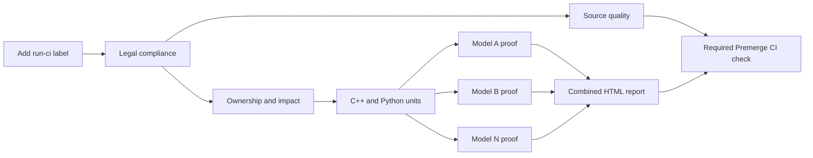

# CI orchestration tutorial

This directory contains the Python control plane for TensorRT Model Connect CI.
Its job is to make the workflow readable: GitHub Actions chooses **when** a job
runs, while these classes define **what** that job does.

The shortest useful reading order is:

1. `.github/workflows/trtmc-ci.yml` — the pre-merge job graph.
2. `tools/ci/__main__.py` — the public command-line interface.
3. `tools/ci/pipeline.py` — the named non-model stages and their ordered steps.
4. `tools/ci/model_proof.py` and `model_proof_inner.py` — one isolated model proof.

## The system at a glance



Each model box is a separate matrix job. Jobs share the machine's four GPUs
through file-backed leases, but each proof sees only its selected model source,
private cache view, build directory, and artifacts.

## Try the interface

All public commands use one entry point:

```bash
python3 -m tools.ci --help
python3 -m tools.ci pipeline source-quality
python3 -m tools.ci image ensure
python3 -m tools.ci container start
python3 -m tools.ci stage premerge-unit
python3 -m tools.ci model-proof --model patchtsmixer --suite premerge
```

`pipeline` runs in the current environment. `stage` is the host-side bridge
that enters the run-owned container and invokes `pipeline` there.

## Pre-merge, step by step

### 1. Pin and authorize the PR

Adding the `run-ci` label starts `.github/workflows/trtmc-ci.yml`. The Legal job
captures one merge commit SHA, removes the one-shot label, checks out that exact
snapshot, and verifies legal documents and source headers. Every later job uses
the captured SHA.

Commits pushed after the label was consumed do not alter the active run. Add the
label again to test the newer snapshot.

### 2. Select the work

The Ownership and Impact job runs `tools/model_ci.py impact` against the pinned
base and tested revisions. It emits:

- directly affected models;
- representative fallback models for shared-platform changes;
- the dynamic model matrix;
- whether source-only units are required and their scope.

This is why a model-only change validates that model, while a CI-platform change
selects a small representative set instead of all models.

### 3. Reject cheap failures first

Source Quality runs `python3 -m tools.ci pipeline source-quality` on a CPU runner
in parallel with impact analysis. `CiPipeline` makes its order explicit:

1. cyclomatic-complexity checks;
2. changed-file formatting and lint;
3. static model-architecture contracts.

The source-only unit job then uses three commands:

```text
image ensure  ->  container start  ->  stage premerge-unit
```

`DockerImageManager` fingerprints and verifies the CI image. `CiContainer`
starts a clean, hardened, GPU-free container with a read-only source mount.
`ContainerStageRunner` enters that container, and `CiPipeline` delegates the
actual unit work to `UnitTestRunner` and `CoverageRunner`.

The unit gate admits the model matrix. Source Quality joins the final required
`Premerge CI` check, so it cannot be bypassed even though it runs in parallel.

### 4. Prove each affected model in isolation

Each matrix job runs:

```bash
python3 -m tools.ci model-proof \
  --model <model> \
  --suite premerge \
  --revision <pinned-sha>
```

The host half, `ModelProofRunner`, performs trusted setup:

1. Create a positive source projection with `tools/model_ci.py project`.
2. Validate that the projection contains the requested model and approved
   platform files, but no peer model source.
3. Select the model-owned runtime, Python tests, E2E cases, resource class, and
   optional reference checkout.
4. Warm only the selected Hugging Face repositories and reflink them into a
   proof-private cache view.
5. Acquire either shared GPU slots or a whole GPU through `GpuLease`.
6. Start a read-only, network-disabled proof container.

The container half, `ModelProofInnerPipeline`, then runs linearly:

1. Revalidate projection, cache, reference, and GPU-lease evidence.
2. Configure a new build directory from projected source.
3. Build the requested model plugin DSO once.
4. Verify that only the requested model DSO was produced and loaded.
5. Run model-owned C++ and Python tests.
6. Run the model-owned E2E inference and reference comparison.
7. Run eligible nightly task evaluation when the suite is `nightly`.
8. Generate `proof.json`, status evidence, logs, and the per-model HTML report.

Failure at any step produces a fallback status and HTML artifact before the job
fails. The matrix uses fail-fast, so the first failing model cancels its peers.

### 5. Compose one report

After every selected model passes, the Combined HTML Report job downloads all
per-model artifacts and generates one report. Certification checks require:

- exactly the expected model set;
- the pinned source revision and requested suite;
- a passing proof for every model;
- no missing report sections or evidence.

The report is an Actions artifact. GitHub Pages remains reserved for project
documentation.

## What nightly adds

`.github/workflows/nightly.yml` uses the same image, container, pipeline, model
proof, scheduling, and reporting classes. It broadens selection to the full
model inventory and adds package, coverage, full-E2E, semantic media assessment,
and eligible task-evaluation work.

Pre-merge and nightly therefore exercise the same implementation; only their
selection and breadth differ.

## Module map

| Module | Responsibility | Execution boundary |
|---|---|---|
| `__main__.py` | Parse the public CLI and dispatch one class | Host or container |
| `pipeline.py` | Declare named stages as short ordered method lists | Container |
| `process.py` | Run commands and write GitHub file commands | Shared primitive |
| `context.py` | Hold repository, environment, state, and command access | Shared primitive |
| `environment.py` | Allowlist host variables forwarded into containers | Host/container boundary |
| `docker_image.py` | Fingerprint, build, cache, and verify the CI image | Host |
| `container.py` | Construct trusted or hardened long-lived containers | Host |
| `stage.py` | Enter a container and propagate cancellation | Host |
| `quality.py` | Run impact support, source quality, and unit tests | Container |
| `coverage.py` | Select tests, collect coverage, and enforce thresholds | Container |
| `package.py` | Build, validate, install, and smoke-test wheels | Container |
| `e2e.py` | Choose selective or full E2E policy | Container |
| `e2e_schedule.py` | Calculate balanced GPU/worker assignments | Pure planning |
| `e2e_scheduler.py` | Launch workers, enforce timeouts, and merge results | Container |
| `isolation.py` | Queue projected model groups for isolated validation | Container |
| `gpu_lease.py` | Allocate FIFO shared slots or exclusive GPUs | Host processes |
| `model_proof_selection.py` | Resolve and validate one model's proof contract | Projected source |
| `model_proof.py` | Prepare caches, projection, lease, and proof container | Trusted host |
| `model_proof_inner.py` | Build, test, compare, and report one model | Hermetic container |
| `task_eval.py` | Prepare and run eligible nightly ETTh1 parity | Host and container |

`scripts/schedule_e2e.py` is a compatibility entry point. The implementation is
package-local in `tools/ci/e2e_schedule.py`, which avoids collisions with
third-party packages named `scripts`.

## Data passed between stages

The orchestration favors small files over hidden global state:

| Data | Producer | Consumer |
|---|---|---|
| GitHub outputs | Legal and impact jobs | Downstream job graph |
| `.ci/*.json` | Package and stage classes | Later stages in the same checkout |
| `impact.json` | `ImpactAnalyzer` | Selective unit/E2E policy |
| `selection.json` | `ModelProofSelector` | Inner model proof |
| `gpu-lease.json` | `GpuLease` | Inner lease validation and report |
| `proof.json` | Inner model proof | Per-model and combined certification |
| `model-proof-report.html` | Report generator | Actions artifact and combined report |

Environment forwarding is explicit in `environment.py`. Add a variable there
only when code inside the container must receive it.

## Making a CI change

### Add a non-model stage

1. Put the operation on the class that owns the behavior.
2. Add a short `(display name, method)` entry in `CiPipeline.stages`.
3. Invoke it with `python3 -m tools.ci stage <name>` from the workflow.
4. Add a focused test under `tests/tools/`.

Do not put orchestration logic in workflow YAML or `__main__.py`.

### Change model isolation

Read these files in order:

1. `model_proof_selection.py` — what is allowed and selected;
2. `model_proof.py` — trusted preparation and security boundary;
3. `model_proof_inner.py` — linear proof and evidence;
4. `tests/tools/test_model_proof_runner.py` — fail-closed contracts.

Isolation changes must not make a missing source, cache, DSO, comparison, or
report silently pass.

### Change E2E parallelism

Keep planning in `e2e_schedule.py` and process lifecycle in
`e2e_scheduler.py`. Timing estimates can change assignment order, but they must
not remove selected models or tests.

## Local checks

Fast documentation and orchestration checks:

```bash
python3 -m ruff check tools/ci tests/tools/test_github_actions_ci.py
PYTHONPATH=python:. python3 -m pytest \
  tests/tools/test_github_actions_ci.py \
  tests/tools/test_schedule_e2e.py \
  tests/tools/test_model_proof_runner.py -q
```

Use the container-backed commands for environment-sensitive build, GPU, or E2E
validation. A local unit test proves orchestration logic; the pre-merge workflow
proves the real image, mount, permission, GPU, and artifact boundaries.

## Reading a failure

1. Start with the graph node: it identifies the stage or exact model.
2. Read the first failed step, not the final aggregate check.
3. For model proofs, download the per-model artifact and open
   `model-proof-status.json` before reading the full console log.
4. Treat `phase` and `steps` in the status file as the authoritative boundary
   that failed.
5. Fix the implementation. Never weaken comparison, isolation, coverage, or
   report-certification criteria to make CI pass.

## Intentional shell boundary

Workflow YAML retains small host-only snippets for GitHub outputs, registry
login, cleanup, and artifact safeguards. Some low-level developer test engines
also remain shell commands behind Python classes. Pipeline decisions, ordering,
selection, isolation, and certification belong in this package.
