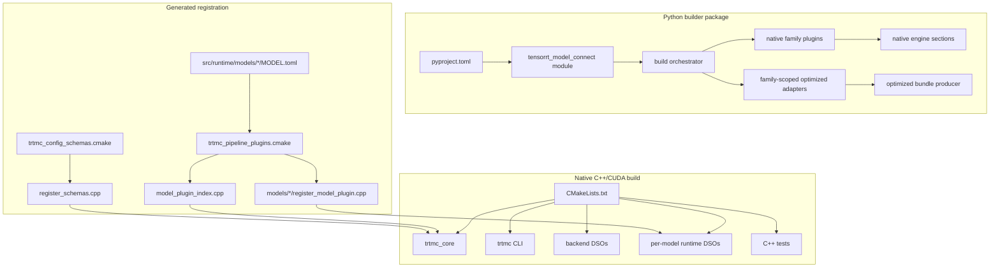
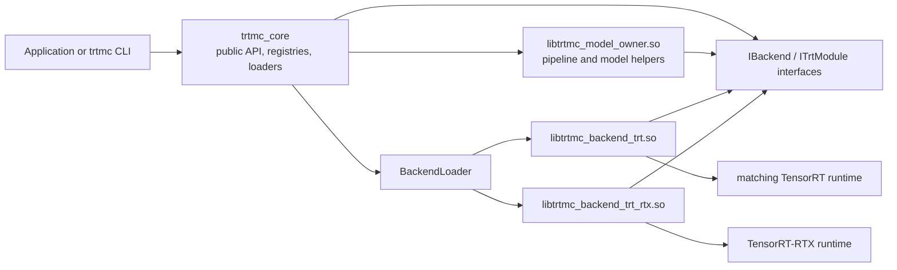
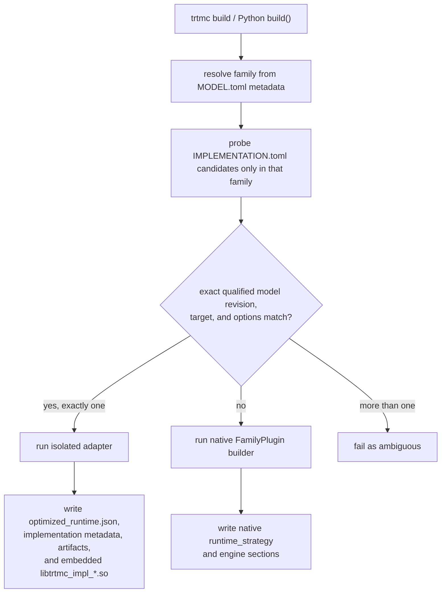

The repository has a CMake build for native runtime code and a Python packaging flow for builder code.

## Native targets

Important CMake targets:

| Target | Purpose |
| --- | --- |
| `trtmc_core` | Shared public API, bundle/config handling, registries, plugin/backend loaders, tokenizers, and common runtime infrastructure. Model pipelines are not linked into it. |
| `trtmc` | CLI executable implemented under `src/cli/`. |
| `trtmc_dataset_benchmark` | Dataset benchmark executable, built when `TRTMC_BUILD_BENCHMARKS=ON` (the default). |
| `trtmc_benchmark_worker` | Benchmark worker executable used by the benchmark tooling. |
| `trtmc_model_plugins` | Aggregate target that builds every manifest-discovered model DSO. |
| `trtmc_model_<owner>` | One model-owned runtime shared-library target, emitted under `build/models/<owner>/`. |
| `trtmc_backend_trt` | Standard TensorRT backend DSO when TensorRT headers/libs are available. |
| `trtmc_backend_rtx` | Optional TensorRT-RTX backend target. It outputs `libtrtmc_backend_trt_rtx.so`. |
| `trtmc_tvm_ffi_plugin` | Optional TVM-FFI TensorRT plugin shared library. |

These model targets belong to the native path. A qualified optimized
implementation instead supplies an isolated `libtrtmc_impl_*.so` through its
family-owned adapter and embeds that exact DSO in the produced bundle. It is not
registered as a `trtmc_model_<owner>` target or a native `runtime_strategy`.

## Link boundaries

`trtmc_core` depends on CUDA runtime and optional CUDA libraries, but standard TensorRT engine execution is behind backend DSOs. The build prints whether the standard TRT backend and TRT-RTX backend are enabled.

The intended boundary is:

The public runtime uses `IBackend` and `ITrtModule` interfaces. TensorRT headers
and ABI-sensitive runtime calls stay behind backend shared objects. Core loads
the selected backend DSO and injects its `IBackend*` through `PipelineContext`;
model DSOs call that interface at runtime and do not link directly to backend
DSOs. Model pipelines, helpers, and CUDA kernels stay in separate
`libtrtmc_model_<owner>.so` files and link back to `trtmc_core`.

## Python package

The repository-root `pyproject.toml` is the only Python packaging entry point.
The source package lives under `python/tensorrt_model_connect/`.

The build backend is a small repository-local wrapper:

- normal wheel and source-distribution builds delegate to `conan-py-build`
- default editable builds follow the native build backend path
- `pip install -e . -C py-only=true` creates a lightweight developer editable install for Python files only

Use the py-only editable install for source development when you are also
building `./build/trtmc` with CMake. It intentionally does not run Conan, run
CMake, install the native executable, or stage backend DSOs.

Release wheels use `conan-py-build` and the root `conanfile.py` to run the
native CMake build, then stage runtime artifacts in a `bin/` subdirectory of
the installed Python package: the native `trtmc` executable, `libtrtmc_core`,
TensorRT backend DSOs, the benchmark worker, and all model DSOs. The same
native `trtmc` executable is also staged into the wheel scripts directory so
pip installs it directly into the target environment's `bin/` directory. The
release wheel metadata declares TensorRT and the other Python builder
dependencies.

The Conan package recipe manages `nlohmann_json` for native wheel builds. TensorRT and CUDA are still supplied by the build environment and by pip/host runtime dependencies rather than by Conan recipes.
Release wheel builds disable the optional libtorch-backed multinomial sampler so the wheel does not link against PyTorch's native DSOs or inherit their platform floor.
CI jobs build and use `TRTMC_CI_IMAGE` from the repository `Dockerfile` for
package and test stages. The workflow derives it from repository variable
`TRTMC_MANYLINUX_CI_IMAGE` or default `trtmc-dev-gb300:manylinux_2_39`.
That image is Ubuntu 24.04 / glibc 2.39 with the TensorRT 11 CUDA 13 stack so
`auditwheel` can verify the `manylinux_2_39_aarch64` tag instead of inheriting a
newer general-purpose CI image floor. PR and nightly workflows build the wheel
first, install that wheel, and then run Python, C++, graph-op, and E2E stages
against the installed artifact.

To build the release wheel manually, run `python -m build --wheel .` from the repository root with `WHEEL_PYVER`, `WHEEL_ABI`, `WHEEL_ARCH`, and the `TRTMC_TRT_*` / `TRTMC_CUDA_*` paths set. See [Installation](../getting-started/installation.md#2-build-wheel-from-source) for the full command.

## Build-path selection

The public CLI and Python `build()` API resolve the checkpoint's owning family
before choosing an implementation:

An optimized candidate is eligible only when its family-local
`IMPLEMENTATION.toml` and `profiles/*.toml` claim the exact immutable model
revision, active target, and effective public options with current
qualification state. The matching producer proof is declared by
`tests/e2e/models/<family>/<adapter>/QUALIFICATION.<target>.toml`. If no
candidate claims the request, build continues through the native path. Once an
optimized adapter is selected, its build failure is terminal.

This optimized route is additive to an existing family. It does not require a
synthetic native `runtime_strategy`, a corresponding
`src/runtime/models/<family>/MODEL.toml` entry, or a
`tests/e2e/models/<family>/MODEL.toml` manifest merely to represent the exact
optimized implementation/profile.

## Native generated registration files

CMake uses:

- `src/runtime/models/*/MODEL.toml`
- `cmake/trtmc_pipeline_plugins.cmake`
- `cmake/model_plugin_index.cpp.in`
- `cmake/register_model_plugin.cpp.in`
- `cmake/trtmc_config_schemas.cmake`
- `cmake/trtmc_registration_manifest.cmake`
- `cmake/register_schemas.cpp.in`

These inputs keep native model-plugin ownership and shared-schema registration
declarative. Optimized implementation/profile discovery does not consume this
generated native index.

## Why native generated registration exists

Without generated registration, a new native runtime strategy would require
editing a central source file. The current design discovers per-model manifests and
generates both the lookup index in `trtmc_core` and the exported registrar in
each model DSO.

The current design makes registration data-driven:

| Input | Consumed by | Result |
| --- | --- | --- |
| `src/runtime/models/<owner>/MODEL.toml` | `cmake/trtmc_pipeline_plugins.cmake` | Validated native model target data, unique strategy ownership, generated strategy/DSO index, and a generated per-model entrypoint. |
| `cmake/trtmc_config_schemas.cmake` | CMake configure step | Generated registration calls for shared config schemas. |
| Model plugin source macro | Compiler | A typed function that registers the model's declared strategy or strategies. |

This is why a native model extension changes local source plus the three owning
`MODEL.toml` descriptors in the Python, runtime, and E2E trees, not
`PipelineFactory` or a hand-maintained central plugin list. A delegated
optimized implementation for an existing family uses its family-local
implementation/profile and qualification descriptors instead.

## Build artifacts to recognize

| Artifact | Meaning |
| --- | --- |
| `build/trtmc` | CLI executable that exercises the public C++ API. |
| `libtrtmc_core.*` | Main runtime library. |
| `libtrtmc_backend_trt.so` | Standard TensorRT backend DSO. |
| `libtrtmc_backend_trt_rtx.so` | Optional TensorRT-RTX backend DSO. |
| `build/models/<owner>/libtrtmc_model_<owner>.so` | Model-owned runtime plugin and pipeline DSO. |
| Optimized `.trtfb` sections | `optimized_runtime.json`, implementation metadata, an integrity-bound artifact tree, and its embedded `libtrtmc_impl_*.so`. |
| `libtrtmc_tvm_ffi_plugin.so` | Optional TensorRT plugin for TVM-FFI kernels. |
| `dist/tensorrt_model_connect-*.whl` | Python wheel containing the builder package, native executables, `libtrtmc_core`, backend DSOs, and flattened model DSOs under package `bin/`. |
| `website/build/` | Static Docusaurus production output from `npm run build` in `website/`. |
