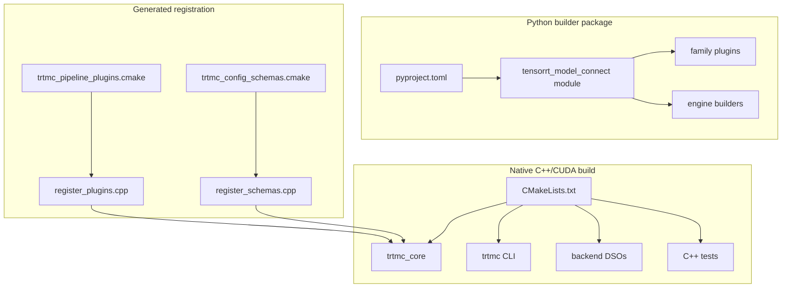
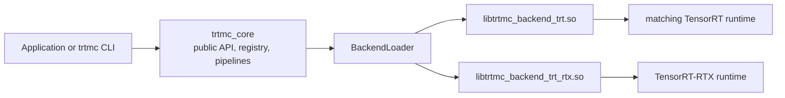

The repository has a CMake build for native runtime code and a Python packaging flow for builder code.

## Native targets

Important CMake targets:

| Target | Purpose |
| --- | --- |
| `trtmc_core` | Core runtime library, public API, registry, plugins, pipelines, tokenizers, CUDA helpers. |
| `trtmc` | CLI executable implemented under `src/cli/`. |
| `trtf_dataset_benchmark` | Dataset benchmark executable. |
| `trtmc_backend_trt` | Standard TensorRT backend DSO when TensorRT headers/libs are available. |
| `trtmc_backend_rtx` | Optional TensorRT-RTX backend target. It outputs `libtrtmc_backend_trt_rtx.so`. |
| `trtmc_tvm_ffi_plugin` | Optional TVM-FFI TensorRT plugin shared library. |

## Link boundaries

`trtmc_core` depends on CUDA runtime and optional CUDA libraries, but standard TensorRT engine execution is behind backend DSOs. The build prints whether the standard TRT backend and TRT-RTX backend are enabled.

The intended boundary is:

The public runtime uses `IBackend` and `ITrtModule` interfaces. TensorRT headers and ABI-sensitive runtime calls stay behind the backend shared objects.

## Python package

The repository-root `pyproject.toml` is the only Python packaging entry point.
The source package lives under `python/tensorrt_model_connect/`.

The build backend is a small repository-local wrapper:

- normal wheel and source-distribution builds delegate to `conan-py-build`
- default editable builds follow the native build backend path
- `pip install -e . -C py-only=true` creates a lightweight developer editable install for Python files only

Use the py-only editable install for source development when you are also
building `./build/trtmc` with CMake. It intentionally does not run Conan, run
CMake, install the native executable, or stage backend DSOs.

Release wheels use `conan-py-build` and the root `conanfile.py` to run the
native CMake build, then stage runtime artifacts under the wheel-internal
package directory named tensorrt_model_connect/bin: the native `trtmc` executable
and TensorRT backend DSOs. The same native `trtmc` executable is also staged into the wheel
scripts directory so pip installs it directly into the target environment's
`bin/` directory. The release wheel metadata declares TensorRT and the other
Python builder dependencies.

The Conan package recipe manages `nlohmann_json` for native wheel builds. TensorRT and CUDA are still supplied by the build environment and by pip/host runtime dependencies rather than by Conan recipes.
Release wheel builds disable the optional libtorch-backed multinomial sampler so the wheel does not link against PyTorch's native DSOs or inherit their platform floor.
CI jobs build and use `TRTMC_CI_IMAGE` from the repository `Dockerfile` for
package and test stages. The workflow derives it from repository variable
`TRTMC_MANYLINUX_CI_IMAGE` or default `trtmc-dev-gb300:manylinux_2_39`.
That image is Ubuntu 24.04 / glibc 2.39 with the TensorRT 11 CUDA 13 stack so
`auditwheel` can verify the `manylinux_2_39_aarch64` tag instead of inheriting a
newer general-purpose CI image floor. PR and nightly workflows build the wheel
first, install that wheel, and then run Python, C++, graph-op, and E2E stages
against the installed artifact.

To build the release wheel manually, run `python -m build --wheel .` from the repository root with `WHEEL_PYVER`, `WHEEL_ABI`, `WHEEL_ARCH`, and the `TRTMC_TRT_*` / `TRTMC_CUDA_*` paths set. See [Installation](../getting-started/installation.md#2-build-wheel-from-source) for the full command.

## Generated registration files

CMake uses:

- `cmake/trtmc_pipeline_plugins.cmake`
- `cmake/trtmc_config_schemas.cmake`
- `cmake/trtmc_registration_manifest.cmake`
- `cmake/register_plugins.cpp.in`
- `cmake/register_schemas.cpp.in`

These generated files keep plugin and schema registration declarative.

## Why generated registration exists

Without generated registration, a new runtime strategy would usually require editing a central source file. That creates merge conflicts and makes ownership unclear.

The current design makes registration data-driven:

| Manifest | Consumed by | Result |
| --- | --- | --- |
| `cmake/trtmc_pipeline_plugins.cmake` | CMake configure step | Generated C++ calls to each plugin registrar. |
| `cmake/trtmc_config_schemas.cmake` | CMake configure step | Generated schema registration calls. |
| Plugin source macro | Compiler | A typed function that registers one plugin for one or more strategies. |

This is why extension work normally changes local plugin/schema files plus a manifest entry rather than the factory core.

## Build artifacts to recognize

| Artifact | Meaning |
| --- | --- |
| `build/trtmc` | CLI executable that exercises the public C++ API. |
| `libtrtmc_core.*` | Main runtime library. |
| `libtrtmc_backend_trt.so` | Standard TensorRT backend DSO. |
| `libtrtmc_backend_trt_rtx.so` | Optional TensorRT-RTX backend DSO. |
| `libtrtmc_tvm_ffi_plugin.so` | Optional TensorRT plugin for TVM-FFI kernels. |
| `dist/tensorrt_model_connect-*.whl` | Python wheel containing the builder package, directly installed native `trtmc` executable, packaged native executable copy, and backend DSOs. |
| website build output | Static Docusaurus docs output generated under `website/` when Docusaurus runs. |
