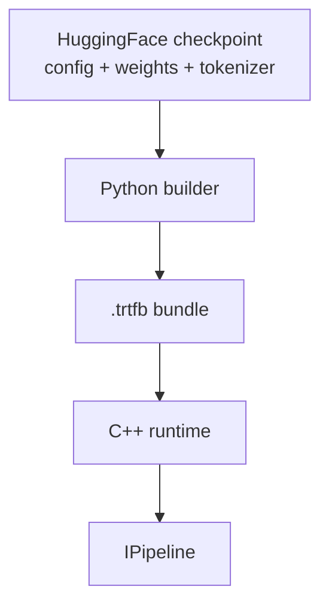
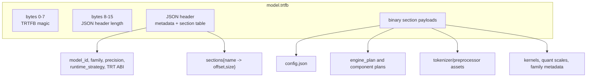
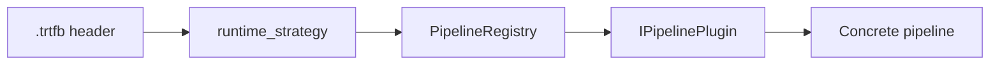

`.trtfb` is the repository's build/runtime contract. It carries everything the C++ runtime needs to select and construct a pipeline.



The bundle is not just an engine file. It is a container with a JSON header and named binary sections.



## What a bundle contains

Typical sections include:

- `config.json`
- One or more TensorRT engine plans
- Tokenizer assets
- Family-specific metadata
- Optional config artifacts such as effective config output

Different strategies expect different section sets:

| Strategy style | Typical sections |
| --- | --- |
| Decoder text generation | `engine_plan`, tokenizer files, `config.json`. |
| Vision-language | Text decoder engine, optional `vision_engine_plan`, image preprocessing metadata, tokenizer assets. |
| Diffusion | Text encoder plans, `denoiser_plan`, `vae_decoder_plan`, scheduler and latent config. |
| Speech-to-text | Encoder/decoder or RNNT plans, mel/filterbank metadata, tokenizer assets. |
| Text-to-audio | Semantic/acoustic/codec plans, tokenizer or phoneme assets, audio generation metadata. |
| Torch-TRT time-series | Torch-TRT engine plan plus model-specific context and horizon configuration. |

The public bundle inspection API is in `include/trtmc/bundle.h`:

```cpp
trtmc::BundleInfo info = trtmc::InspectBundle("/tmp/model.trtfb");
bool ok = trtmc::IsBundle("/tmp/model.trtfb");
```

## Core metadata

`BundleInfo` exposes:

| Field | Meaning |
| --- | --- |
| `model_id` | Source model identifier. |
| `model_type` | HuggingFace model type when available. |
| `family` | Python builder family plugin. |
| `precision` | Build precision. |
| `trt_version`, `trt_abi` | Build-time TensorRT metadata. |
| `gpu_name` | GPU metadata captured by the builder. |
| `vocab_size`, `hidden_size`, `num_layers` | Common model dimensions. |
| `max_cache_length` | Default cache capacity for decoder-like models. |
| `runtime_strategy` | Runtime plugin dispatch key. |

## Runtime strategy

The most important bundle field is `runtime_strategy`. It selects the C++ runtime plugin, not the Python family plugin. Many Python families can share a runtime strategy. For example, Qwen, LLaMA, Mistral, GPT-2, OPT, Bloom, and several other decoder families can all route through `decoder_kv_cache`.



If runtime creation fails, inspect `runtime_strategy` first. A valid strategy must have a registered C++ plugin in the binary you are running.

## Header versus config section

The bundle has both a JSON header and a `config.json` section.

| Location | Purpose |
| --- | --- |
| Header | Fast inspection metadata and the section table. C++ can read this without loading every engine section. |
| `config.json` section | Runtime construction details such as tensor IO names, modality-specific fields, engine backend, scheduler settings, and strategy-specific config. |

The runtime reads both. `ReadBundleFile()` parses the container, while `PipelineFactory` extracts `config.json` and passes both the parsed base config and raw JSON to the plugin through `PipelineContext`.

## Compatibility boundaries

Bundles are deployable artifacts, but they are not universally portable binaries.

| Boundary | What it means |
| --- | --- |
| TensorRT version and ABI | The runtime checks bundle TensorRT metadata and backend DSO metadata before executing. |
| GPU and shape profile | TensorRT engines are built for optimization profiles and target capabilities selected at build time. |
| Tokenizer/preprocessor assets | A bundle must include the assets the runtime plugin expects. |
| Runtime strategy support | The running binary must include the plugin registered for the bundle strategy. |
| Config schema | New schema-controlled runtime knobs should have defaults so older bundles can still load when possible. |

## How to reason about a bundle

Use this checklist when debugging:

1. Does `./build/trtmc inspect` report the expected model, family, precision, and runtime strategy?
2. Does `./build/trtmc inspect` parse the same bundle from the C++ side?
3. Are the expected engine sections present for the strategy?
4. Does the runtime binary register the strategy?
5. Does TensorRT ABI detection select a compatible backend DSO?
6. Are tokenizer, image, audio, or scheduler assets present for the concrete pipeline?
