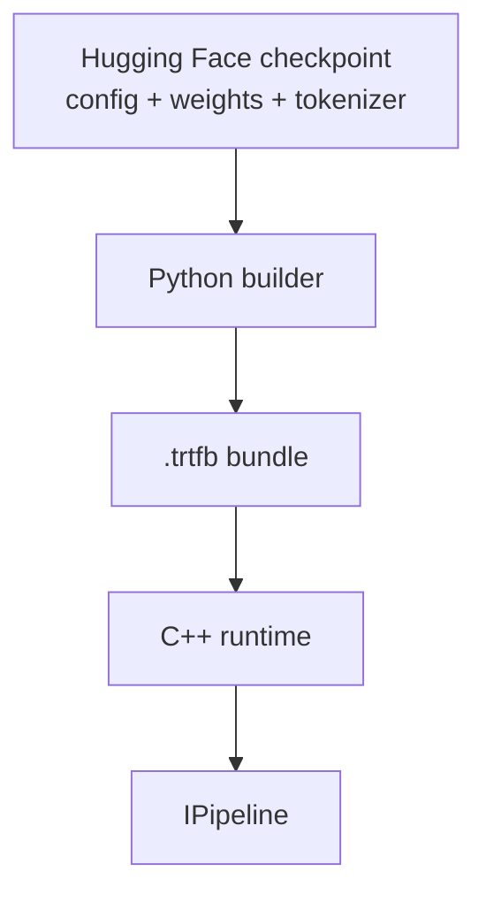
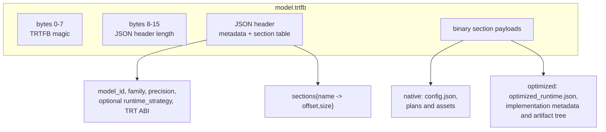
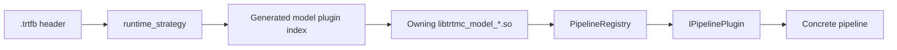
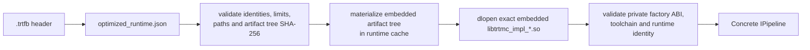

`.trtfb` is the repository's build/runtime artifact contract. It has two
supported payload shapes:

- A native bundle carries model-owned TensorRT plans and assets. The runtime
  installation supplies the core, a compatible backend DSO, and the owning
  model DSO selected by `runtime_strategy`.
- An optimized-runtime bundle carries `optimized_runtime.json`, opaque
  implementation metadata, and a content-addressed artifact tree that includes
  the exact `libtrtmc_impl_*.so`. It does not use the native model-plugin index
  or backend-DSO path.



The bundle is not just an engine file. It is a container with a JSON header and named binary sections.



## What a bundle contains

Typical native sections include:

- `config.json`
- One or more TensorRT engine plans
- Tokenizer assets
- Family-specific metadata

`effective_config.json` is not a bundle section. When schema-driven config is
resolved, the builder/runtime writes that audit artifact next to the bundle.

Different strategies expect different section sets:

| Strategy style | Typical sections |
| --- | --- |
| Decoder text generation | `engine_plan`, tokenizer files, `config.json`. |
| Vision-language | Text decoder engine, optional `vision_engine_plan`, image preprocessing metadata, tokenizer assets. |
| Diffusion | Text encoder plans, `denoiser_plan`, `vae_decoder_plan`, scheduler and latent config. |
| Speech-to-text | Encoder/decoder or RNNT plans, mel/filterbank metadata, tokenizer assets. |
| Text-to-audio | Semantic/acoustic/codec plans, tokenizer or phoneme assets, audio generation metadata. |

An optimized-runtime bundle instead requires:

- `optimized_runtime.json`, containing the implementation, profile, model,
  downstream-runtime, factory-ABI, metadata-section, and artifact-tree
  identities.
- `implementation.json`, whose model-owned meaning is opaque
  to the generic host.
- `optimized_runtime_artifacts/...`, including the exact implementation DSO
  named by the descriptor and its runtime-owned payload.

`config.json` is optional in this shape. The provider can include it for
inspection or private use, but optimized dispatch does not depend on it.

The public bundle inspection API is in `include/trtmc/bundle.h`:

```cpp
trtmc::BundleInfo info = trtmc::InspectBundle("/tmp/model.trtfb");
bool ok = trtmc::IsBundle("/tmp/model.trtfb");
```

## Core metadata

`BundleInfo` exposes:

| Field | Meaning |
| --- | --- |
| `model_id` | Source model identifier. |
| `model_type` | Hugging Face model type when available. |
| `family` | Python builder family plugin. |
| `precision` | Build precision. |
| `trt_version`, `trt_abi` | Build-time TensorRT metadata. |
| `gpu_name` | GPU metadata captured by the builder. |
| `vocab_size`, `hidden_size`, `num_layers` | Common model dimensions. |
| `max_cache_length` | Default cache capacity for decoder-like models. |
| `runtime_strategy` | Native runtime plugin dispatch key; it may be empty for an optimized-runtime bundle. |

## Native runtime strategy

For a native bundle, the most important dispatch field is `runtime_strategy`.
It selects the owning C++ model DSO and then the registered runtime plugin; it
does not select the Python family package.

Current strategy keys are model-owned. Qwen, LLaMA, and Mistral use
`qwen_decoder_kv_cache`, `llama_decoder_kv_cache`, and
`mistral_decoder_kv_cache`, respectively. Their E2E manifests share the
`text_generation_causal` task strategy, but that task label is not stored as
the runtime dispatch key.



If runtime creation fails, inspect `runtime_strategy` first. A valid strategy
must resolve through the generated index to an owning model DSO, and that DSO
must be present and loadable from the configured model-plugin search paths.
Loading the DSO registers the plugin; model plugins are not compiled into the
`trtmc` executable.

## Optimized-runtime descriptor

`PipelineFactory` checks for the `optimized_runtime.json` section before it
materializes `config.json` or resolves a native strategy. Presence of the
section unambiguously claims the optimized path:



The host never substitutes an installed same-name DSO and never falls back to
native dispatch after an optimized descriptor is present. The current
family-owned implementation is Qwen with TensorRT Edge-LLM; its three exact
Qwen3 revision/A100 SM80/FP16 profiles are marked qualified in the profile
TOMLs. That qualification is tuple-specific and does not imply that every Qwen
checkpoint or target uses the optimized path.

## Header versus config section

Every bundle has a JSON header. Native bundles also require a `config.json`
section; optimized-runtime bundles may omit it.

| Location | Purpose |
| --- | --- |
| Header | Fast inspection metadata and the section table. C++ can read this without loading every engine section. |
| `config.json` section | Native runtime construction details such as tensor IO names, modality-specific fields, engine backend, scheduler settings, and strategy-specific config. Optional for optimized-runtime bundles. |

The native runtime reads both locations. `ReadBundleFile()` parses the
container, while `PipelineFactory` extracts `config.json` and passes both the
parsed base config and raw JSON to the plugin through `PipelineContext`. The
optimized host instead reads sections directly from the header table and
passes opaque implementation metadata plus the materialized artifact path to
the embedded factory.

## Compatibility boundaries

Bundles are deployable artifacts, but they are not universally portable binaries.

| Boundary | What it means |
| --- | --- |
| Native TensorRT version and ABI | A native load checks bundle TensorRT metadata and backend DSO metadata before executing. |
| GPU and shape profile | Native engines and optimized provider artifacts are built for target/profile constraints selected at build time. |
| Tokenizer/preprocessor assets | A bundle must include the assets the runtime plugin expects. |
| Native runtime strategy support | For a native bundle, the runtime installation must provide the owning model DSO and a generated index entry for the bundle strategy. |
| Optimized implementation identity | For an optimized bundle, the descriptor, embedded implementation DSO, factory ABI/toolchain identity, downstream runtime identity, and artifact-tree hash must all agree. |
| Config schema | New schema-controlled runtime knobs should have defaults so older bundles can still load when possible. |

## How to reason about a bundle

Use this checklist when debugging:

1. Does
   `PYTHONPATH=python python3 -m tensorrt_model_connect inspect <bundle.trtfb>`
   report the expected model, family, precision, and section inventory?
2. Does `./build/trtmc inspect` parse the same bundle from the C++ side and,
   for a native bundle, report the expected `runtime_strategy`?
3. Does the section table contain `optimized_runtime.json`?
   - If no, are the expected native engine sections present, does
     `src/runtime/models/<owner>/MODEL.toml` declare the strategy, and is its
     `libtrtmc_model_<owner>.so` available in a model-plugin search path?
   - If yes, treat CLI inspection as a section-presence check only. The current
     Python and C++ inspectors do not decode the descriptor payload. Verify the
     implementation/profile identities, artifact-tree hash, and named embedded
     `libtrtmc_impl_*.so` through the family-owned provider qualification and
     bundle-contract tests; the runtime loader enforces the same contract.
4. For a native bundle, does TensorRT ABI detection select a compatible
   backend DSO?
5. Are tokenizer, image, audio, scheduler, or delegated-runtime assets present
   for the concrete pipeline?
