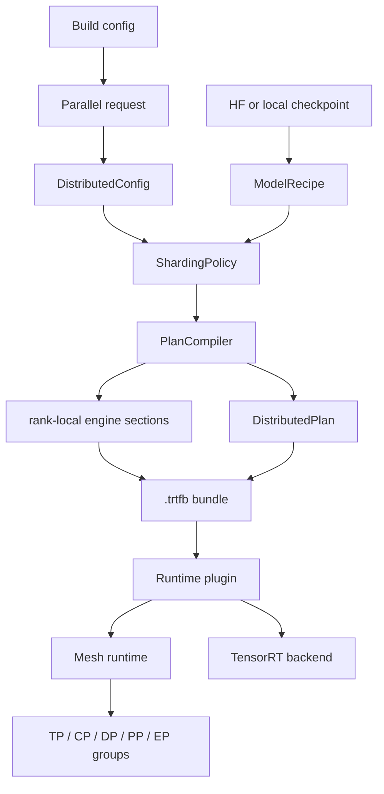

This page explains the multi-device architecture at the concept and ownership
level. For file paths, code snippets, and current implementation details, see
[Multi-Device Implementation Map](multi-device-implementation-map.md).

## Goal

TensorRT-Model-Connect should support distributed execution without making
every model family grow its own set of tensor-parallel, context-parallel,
pipeline-parallel, data-parallel, and expert-parallel branches.

The architecture keeps one stable contract between build time and run time:

```text
.trtfb bundle + distributed_plan.json
```

The bundle contains the artifacts to run. The distributed plan says how those
artifacts are placed across ranks.

## Current Executable Scope

The current executable multi-device path is decoder tensor parallelism. It can
build and run Qwen decoder bundles with TP=2 on two launched ranks.

The broader architecture is already shaped around the same layers that future
CP, DP, PP, EP, and partial-sharding support should extend:

| Layer | Architectural role |
| --- | --- |
| User config | Describes the requested distributed build behavior. |
| `DistributedConfig` | Describes the process mesh, such as TP size and future CP / DP / PP / EP axes. |
| `ModelRecipe` | Names model structure and shardable regions. |
| `ShardingPolicy` | Converts placement into local tensor shapes, weight slices, and collectives. |
| `PlanCompiler` | Emits rank-local or component-local engine artifacts. |
| `DistributedPlan` | Records the execution contract in the bundle. |
| Mesh runtime | Validates the launched ranks, creates groups, and gives runtime plugins local sections and communicators. |

## Ownership Flow

For the current TP path, the user does not hand-write
`DistributedConfig` or `distributed_plan.json`.

The ownership chain is:

```text
user build config
  --set parallel.mode=tensor_parallel
  --set parallel.tp_size=2
        |
        v
builder request metadata
        |
        v
process mesh
        |
        v
model recipe + sharding policy
        |
        v
rank-local TensorRT engine sections
        |
        v
distributed_plan.json in the bundle
        |
        v
runtime loads the local rank section and creates the distributed group
```

In concrete terms, a TP=2 request becomes a mesh with `world_size=2`,
`tp=2`, and all other axes set to `1`. The builder serializes that mesh into
`distributed_plan.json`. Runtime reads the generated plan instead of asking the
user to separately provide rank mapping or sharding flags.

## Architecture Layers



The key boundary is the bundle. The runtime should execute the plan in the
bundle; it should not rediscover model structure from the original checkpoint
or decide sharding policy at load time.

## Core Concepts

### DistributedConfig

`DistributedConfig` is the process mesh. It answers how many ranks exist and
how those ranks are arranged across axes:

| Axis | Meaning |
| --- | --- |
| `tp` | Tensor parallelism. |
| `cp` | Context parallelism. |
| `dp` | Data parallelism. |
| `pp` | Pipeline parallelism. |
| `ep` | Expert parallelism. |

Today, TP execution is implemented. The schema names the other axes so future
plans can use the same shape.

### ModelRecipe

`ModelRecipe` names the model structure in terms the distributed planner can
select. For a decoder, that means regions such as decoder self-attention,
decoder MLP, and LM head. For diffusion models, it may mean denoiser blocks,
attention regions, feed-forward regions, text encoders, and VAE components.

The recipe answers: "What pieces does this model have?"

It does not answer: "Which parallelism mode should this model use?"

### ShardingPolicy

`ShardingPolicy` turns placement into build decisions. It answers questions
such as:

- Which weights are local to this rank?
- Which tensor dimensions are local?
- Which operations are replicated?
- Which operations need an all-reduce, gather, send/receive, or other
  collective?

For current decoder TP, sharding happens at build time. The plan records the
decision, and the rank-local engine sections contain the materialized local
weights and TensorRT graph.

### PlanCompiler

`PlanCompiler` owns artifact emission. It loops over the ranks or stages in the
plan, builds the local TensorRT engine sections, and writes the distributed
plan into the bundle.

Single-device builds still produce the normal single engine section. Distributed
builds add rank-local sections plus `distributed_plan.json`.

### DistributedPlan

`DistributedPlan` is the build/runtime contract. It records:

- mesh shape and rank mapping,
- model and component placement,
- selected recipe regions,
- collective requirements,
- rank-local bundle section names,
- constraints validated during build.

This plan is not a benchmark log or a search cache. It is the concrete
execution contract that runtime consumes.

### Mesh Runtime

Mesh runtime is shared runtime infrastructure. It owns launched rank detection,
local device binding, process-group creation, communicator lifetime, and
validation that the launch matches the bundle plan.

Runtime plugins still own task behavior. For example, the decoder plugin owns
text generation behavior, but it asks mesh runtime for the local engine section
and communicator.

## Where Sharding Lives

Sharding has two places in the architecture:

| Place | Meaning |
| --- | --- |
| `distributed_plan.json` | Records what is sharded, replicated, or assigned to a rank/stage. |
| Rank-local engine sections | Contain the actual local TensorRT graph and local weights produced at build time. |

The sharded weights are not cached in a separate user-visible sharding cache.
They are materialized inside the rank-local engine sections in the bundle. The
bundle itself is cached wherever the user, build command, or E2E harness writes
the engine output.

## Avoiding Mode Branch Sprawl

The architecture avoids scattering logic such as "if TP", "if CP", or "if PP"
through every model family.

The intended ownership is:

| Decision | Owner |
| --- | --- |
| What model regions exist? | `ModelRecipe`. |
| Which regions are sharded or replicated? | `DistributedPlan`. |
| How a rank-local tensor or weight is produced? | `ShardingPolicy`. |
| Which local engine sections are emitted? | `PlanCompiler`. |
| Which communicator groups exist at runtime? | Mesh runtime. |

Model-family builders should stay model-aware. Distributed placement should be
represented by the plan and policy layers.

## User Impact

Single-device users should not see a behavior change. A single-device bundle
omits `distributed_plan.json` and runtime loads the normal engine section.

Multi-device users opt in at build time and launch with multiple ranks. For the
current TP path, the build request names the TP mode and size, and runtime
requires the launched world size to match the plan.

The runtime command does not need extra sharding flags. The bundle already
contains the plan.

## SD And MD Isolation

Single-device and multi-device behavior are isolated by the bundle contract:

| Bundle type | Runtime behavior |
| --- | --- |
| Single-device bundle | No distributed plan; load the normal engine section in one process. |
| Distributed bundle | Read `distributed_plan.json`; validate launch; load the rank-local section. |

This keeps old single-device bundles valid and keeps distributed launch
requirements out of the single-device path.

## Extension Strategy

To add a new distributed mode or model family, extend the layer that owns the
decision:

| Need | Architectural layer |
| --- | --- |
| Describe new shardable model regions | `ModelRecipe`. |
| Express new placement or mesh shape | `DistributedPlan` and `DistributedConfig`. |
| Produce rank-local tensors, local shapes, and collectives | `ShardingPolicy`. |
| Emit local artifacts | `PlanCompiler`. |
| Create runtime groups and schedule communication | Mesh runtime and the relevant runtime plugin. |
| Prove correctness | Builder tests, runtime-plan tests, and launched E2E tests. |

## Current Limits

The current runtime execution supports decoder TP. CP, DP, PP, EP, and mixed
multi-axis plans are represented by the architecture and schema shape, but
their runtime execution semantics still need to be implemented.

## Validation Philosophy

Builder validation proves that plans and bundles are formed correctly. Runtime
unit tests prove that the plan can be parsed and consumed. Multi-device E2E is
the proof that launched ranks produce comparable output under the real
distributed launcher.

For current validation results and exact commands, see
[Multi-Device Plan Status](../context/multi-device-plan-status.md).
