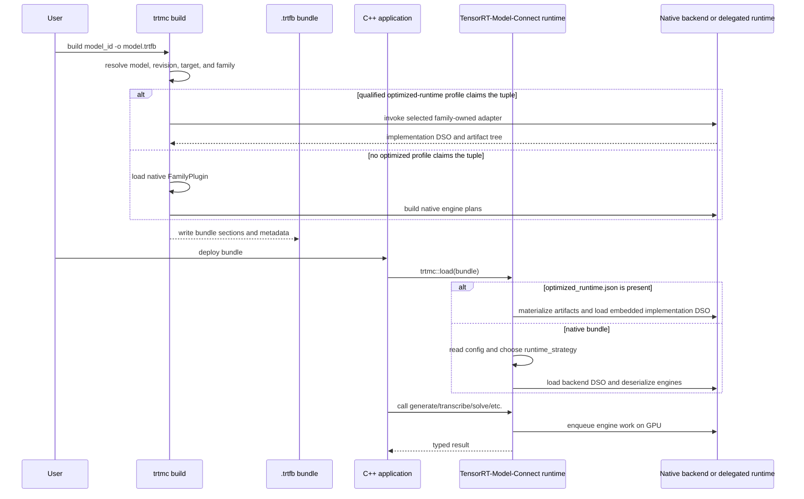
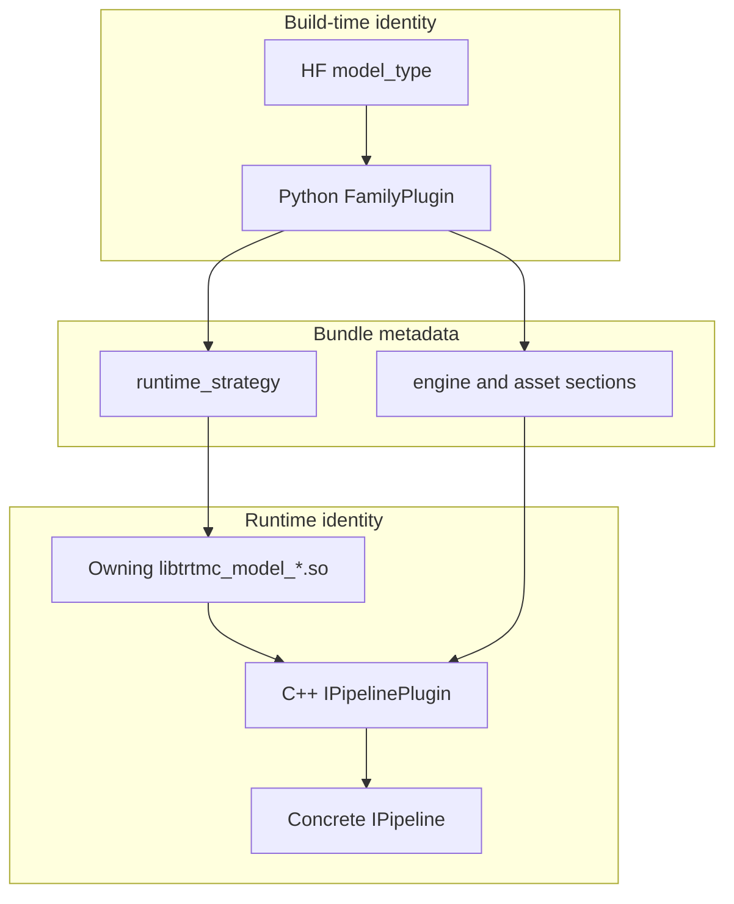
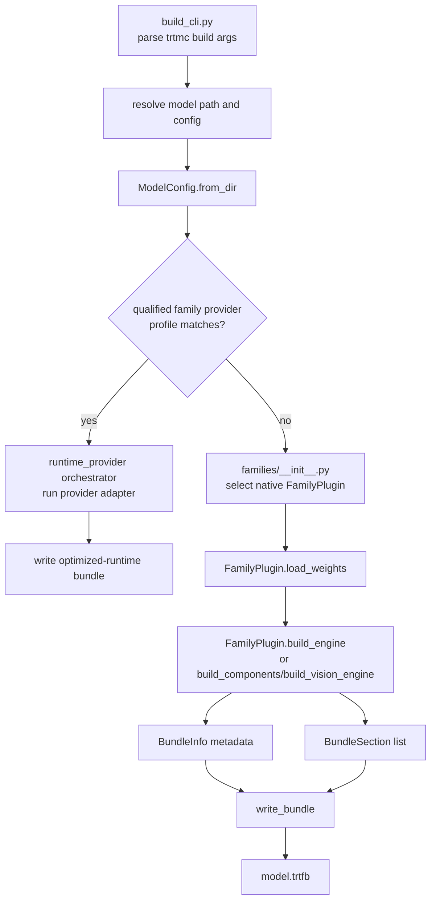
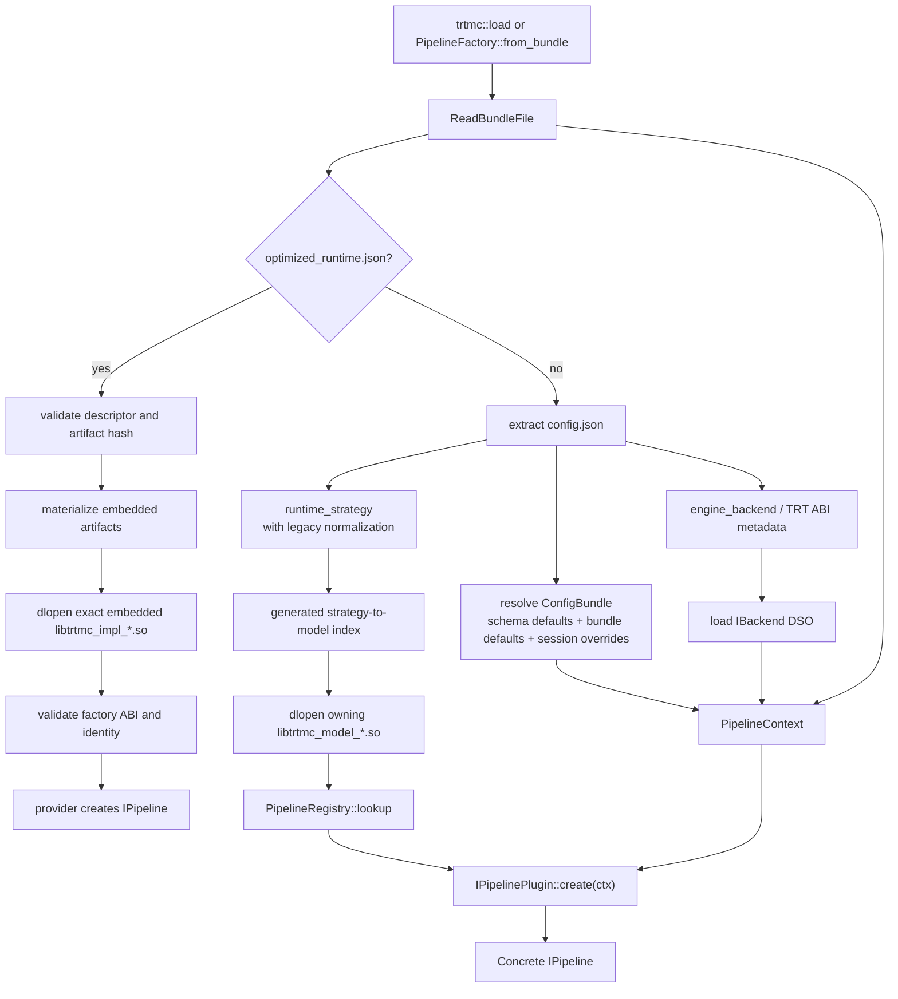
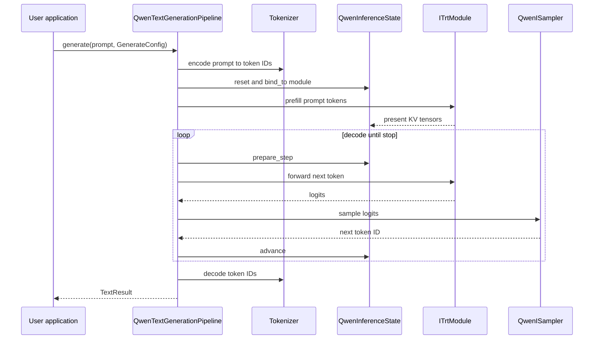

import useBaseUrl from '@docusaurus/useBaseUrl';

TensorRT-Model-Connect has two large responsibilities:

1. Convert a trained model checkpoint into deployable TensorRT artifacts.
2. Load those artifacts from native C++ and expose task-oriented inference APIs.

The boundary between those responsibilities is the `.trtfb` bundle.

## If You Only Remember Six Things

1. Python owns model-format diversity: configs, weights, tokenizers, processors, and graph construction.
2. The `.trtfb` bundle is the contract between build time and run time.
3. `trtmc build` first offers an exact model/revision/target tuple to a
   family-owned optimized-runtime adapter. It uses the native family builder
   when no qualified adapter profile claims that tuple.
4. Native bundles dispatch by `runtime_strategy`, not by HuggingFace model
   name. A model-owned runtime DSO registers each native strategy.
5. Optimized-runtime bundles instead carry `optimized_runtime.json` plus an
   embedded implementation DSO and artifact tree. They bypass native strategy,
   model-plugin, and backend-DSO dispatch.
6. TensorRT ABI-sensitive native execution is isolated behind backend DSOs so
   the public runtime can stay focused on bundle loading and task APIs.

```mermaid
flowchart LR
  subgraph Source["Source model"]
    HF["HuggingFace or local checkpoint"]
    HFConfig["config.json"]
    HFWeights["weights"]
    HFTokenizer["tokenizer or processor assets"]
  end

  subgraph Builder["Python build phase"]
    MC["ModelConfig"]
    Route{"Qualified optimized<br/>profile matches?"}
    Adapter["family-owned provider adapter"]
    Family["native FamilyPlugin"]
    Graph["TensorRT graph"]
    Plans["engine plan bytes"]
    Writer["bundle_writer"]
    ProviderWriter["optimized bundle packager"]
  end

  subgraph Artifact["Deployable artifact"]
    Bundle[".trtfb bundle"]
  end

  subgraph Runtime["C++ run phase"]
    Factory["PipelineFactory"]
    Kind{"optimized_runtime.json?"}
    ProviderHost["OptimizedRuntimeHost"]
    ProviderDSO["embedded libtrtmc_impl_*.so"]
    Loader["PipelinePluginLoader"]
    DSO["owning model DSO"]
    Registry["PipelineRegistry"]
    Plugin["IPipelinePlugin"]
    Backend["IBackend DSO"]
    Pipeline["Concrete IPipeline"]
  end

  HF --> MC
  HFConfig --> MC
  MC --> Route
  HFWeights --> Adapter
  HFWeights --> Family
  HFTokenizer --> Writer
  Route -->|yes| Adapter
  Route -->|no| Family
  Adapter --> ProviderWriter
  ProviderWriter --> Bundle
  Family --> Graph
  Graph --> Plans
  Plans --> Writer
  Writer --> Bundle
  Bundle --> Factory
  Factory --> Kind
  Kind -->|yes| ProviderHost
  ProviderHost --> ProviderDSO
  ProviderDSO --> Pipeline
  Kind -->|no| Loader
  Loader --> DSO
  DSO --> Registry
  Registry --> Plugin
  Kind -->|no| Backend
  Plugin --> Pipeline
  Backend --> Pipeline
```

## Why the project is split

The split is not just a language preference. It separates two very different jobs.

| Job | Best environment | Reason |
| --- | --- | --- |
| Understand a new HuggingFace checkpoint | Python | Model repos, tokenizers, diffusers, Transformers, calibration flows, and checkpoint format utilities are Python-first. |
| Build optimized artifacts | Python native builder or family-owned provider adapter | Build logic needs flexible graph construction, weight transforms, calibration, and exact model/revision/target qualification. |
| Run user requests | C++ | Deployment systems need stable native APIs, explicit memory ownership, predictable latency, and minimal Python in the request path. |
| Isolate TensorRT ABI | Backend DSO | TensorRT runtime versions can differ; the core runtime should not leak one `libnvinfer` ABI into every build. |

The result is a two-phase deployment model:

## Build and runtime identities

The same model has a source identity, a builder family, and one of two runtime
identity shapes as it moves through the stack:

| Identity | Example | Source of truth | Used by |
| --- | --- | --- | --- |
| HuggingFace model type | `qwen3`, `whisper`, `flux` | `config.json` from the model repo | Python `ModelConfig` and family matching. |
| Builder family | `qwen`, `whisper`, `flux`, `pixart` | `python/tensorrt_model_connect/families/<family>/MODEL.toml` and its package | Weight loading and engine construction. |
| Native runtime strategy | `qwen_decoder_kv_cache`, `whisper_speech_to_text`, `diffusion_flux` | Native bundle config and `src/runtime/models/<owner>/MODEL.toml` | Native model DSO selection, plugin lookup, and pipeline construction. |
| Optimized implementation/profile | `qwen.tensorrt-edge-llm` plus a qualified Qwen/A100 profile | Family-owned `IMPLEMENTATION.toml` and profile TOMLs, serialized as `optimized_runtime.json` | Embedded implementation DSO selection and delegated pipeline construction. |

Native runtime strategies are model-owned in the current architecture. Two families
can implement the same task shape without sharing a strategy or DSO: Qwen and
LLaMA use `qwen_decoder_kv_cache` and `llama_decoder_kv_cache`, while their E2E
manifests share the `text_generation_causal` task strategy. Shared orchestration
uses capabilities and task contracts; model implementation remains local.
Optimized-runtime identity is a separate contract: the exact implementation,
profile, model revision, and target are bound into the bundle instead of being
represented by a native `runtime_strategy`.

## Build phase

The Python builder is responsible for the messy part of model diversity.

It starts in `python/tensorrt_model_connect/build_cli.py`, then calls into
`engine_builder.py`. After resolving the checkpoint to one family, it first
probes only that family's optimized-runtime implementations. A profile can
claim the request only when the model ID, pinned revision, active target, and
public build options match its qualification. The selected adapter produces an
embedded implementation DSO and artifact tree for the generic optimized bundle
packager. If no profile claims the request, the builder continues through the
native `FamilyPlugin`, TensorRT graph build, and `bundle_writer.py` path.

The important builder abstractions are:

| Abstraction | Source | Responsibility |
| --- | --- | --- |
| `ModelConfig` | `python/tensorrt_model_connect/config.py` | Normalizes HuggingFace config fields into one typed view. |
| `FamilyPlugin` | `python/tensorrt_model_connect/families/base.py` | Per-family matching, weight loading, engine building, optional quantization hooks, and optional modality-specific build methods. |
| Family-owned graph builders | `python/tensorrt_model_connect/families/<family>/graph_ops.py`, `graph_blocks.py`, and dedicated builders when present | Convert that family's model structure and weights into TensorRT networks or compiled components. There are no repository-root `graph_ops.py` or `graph_blocks.py` modules. |
| Quantization units | `python/tensorrt_model_connect/quantization/` | Plan quantization, calibration, scale loading, and family-specific exclusions. |
| `BundleInfo` and `BundleSection` | `python/tensorrt_model_connect/bundle_writer.py` | Serialize build metadata and binary sections into `.trtfb`. |
| Optimized-runtime orchestrator and packager | `python/tensorrt_model_connect/runtime_provider/` | Discover only the selected family's implementations, require one exact qualified profile, run its isolated adapter, and package opaque artifacts plus the implementation DSO. |

Primary source locations:

- `python/tensorrt_model_connect/build_cli.py`
- `python/tensorrt_model_connect/engine_builder.py`
- `python/tensorrt_model_connect/families/`
- `python/tensorrt_model_connect/bundle_writer.py`

## Runtime phase

The C++ runtime starts with `trtmc::load()` or
`PipelineFactory::from_bundle()`. It reads the bundle header and chooses one of
two mutually exclusive paths. Presence of `optimized_runtime.json` claims the
optimized path: the host validates the descriptor, materializes and
integrity-checks the embedded artifact tree, loads its exact
`libtrtmc_impl_*.so`, validates the private factory ABI and identities, and asks
that DSO to create an `IPipeline`. Any failure is terminal; it does not fall
back to native dispatch.

Without that section, the factory follows the native path: it extracts
`config.json`, normalizes old strategy names if needed, loads the owning model
DSO and a compatible backend DSO, resolves layered runtime config, and lets the
registered plugin construct the concrete pipeline.

The important runtime abstractions are:

| Abstraction | Source | Responsibility |
| --- | --- | --- |
| `IPipeline` | `include/trtmc/pipeline.h` | User-facing task interface. Methods unsupported by a concrete pipeline throw with the pipeline type. |
| `LoadOptions` | `include/trtmc/pipeline.h` | Runtime load knobs: HF Python helper path, runtime cache path, CUDA graphs, KV cache budget, config file, `--set` overrides, backend search paths. |
| `PipelineFactory` | `include/trtmc/runtime/pipeline_factory.h`, `src/runtime/registry/pipeline_factory.cpp` | Single creation path from bundle file to pipeline instance. |
| Optimized-runtime host/factory contract | `src/runtime/providers/optimized_runtime_host.cpp`, `src/runtime/providers/optimized_runtime_factory.h` | Recognize optimized bundles before native materialization, verify their self-contained payload and factory identity, and create the delegated pipeline. |
| Model plugin index/loader | `include/trtmc/runtime/pipeline_plugin_loader.h`, `src/runtime/registry/pipeline_plugin_loader.cpp` | Maps a strategy to its manifest owner, loads that model DSO, and verifies the DSO registers only its declared strategies. |
| `PipelineRegistry` | `include/trtmc/runtime/pipeline_registry.h` | Maps loaded `runtime_strategy` strings to registered `IPipelinePlugin` implementations. |
| `IPipelinePlugin` | `include/trtmc/runtime/pipeline_plugin.h` | Strategy-specific constructor that reads bundle sections and returns a concrete `IPipeline`. |
| `IBackend` | `include/trtmc/runtime/trt_backend.h` | Backend DSO interface for deserializing engines and creating `ITrtModule` execution wrappers. |
| `ITrtModule` | `include/trtmc/runtime/trt_module.h` | Engine execution interface used by pipelines without including TensorRT headers. |
| Model-owned inference state | `src/runtime/models/<family>/inference_state.h` when that family needs it | Family-local KV, recurrent, or hybrid request state. The old shared state implementation has been retired. |
| Model-owned sampler | `src/runtime/models/<family>/sampler.h` when that family needs it | Family-local token selection for greedy, top-k, top-p, min-p, and optional GPU paths. |

Primary source locations:

- `include/trtmc/pipeline.h`
- `src/runtime/registry/pipeline_factory.cpp`
- `src/runtime/registry/pipeline_plugin_loader.cpp`
- `src/runtime/registry/pipeline_registry.cpp`
- `src/runtime/providers/optimized_runtime_host.cpp`
- `include/trtmc/runtime/pipeline_plugin.h`
- `src/runtime/models/`

## Request-time flow

After a pipeline is constructed, each user request is task-specific. Text generation is a useful example because it includes tokenization, GPU execution, state, and sampling.

<figure className="trtmc-diagram trtmc-diagram--wide">
  

    
  

  <figcaption>The runtime pipeline owns preprocessing, engine execution, request state, sampling, and result construction.</figcaption>
</figure>

Other modalities reuse the same architectural pattern:

| Task | Pipeline behavior |
| --- | --- |
| Vision-language | Preprocess image, run vision encoder or image projector, inject image embeddings into a text decoder, then sample text. |
| Speech-to-text | Convert audio to features, run encoder/decoder or RNNT path, decode token IDs to text. |
| Text-to-audio | Convert prompt to semantic/audio tokens, run codec or acoustic stages, write PCM samples. |
| Diffusion image/video | Encode text prompt, iterate denoising steps, decode latent representation through VAE. |
| Time-series | Prepare context tensors, run compiled forecast model, return numerical output. |
| Segmentation/detection | Preprocess pixels, run vision engine, decode masks or bounding boxes. |

## Design constraints

| Constraint | Consequence |
| --- | --- |
| Python builds, C++ runs | Checkpoint resolution and artifact construction stay in Python; request-time inference is exposed through native `IPipeline`, whether the implementation is the native model-plugin path or an embedded delegated runtime. |
| Bundle is the boundary | The runtime does not rediscover the original model repository to decide pipeline shape. |
| Native family and strategy are separate but model-owned | A Python package builds the native family, while a concrete strategy selects its native runtime DSO. Shared task behavior is expressed through capabilities and E2E `task_strategy`, not a generic runtime plugin. |
| Optimized selection is exact and artifact-bound | A family-owned provider profile must match model, revision, target, and options at build time. At load time `optimized_runtime.json` selects the embedded implementation DSO without consulting the native strategy index. |
| Strategy is resolved at load | A request uses a concrete pipeline instance; no per-request strategy redispatch is needed. |
| Runtime plugins are manifest discovered | Adding a strategy changes the owning `src/runtime/models/<owner>/MODEL.toml` and local source; CMake generates the DSO registrar and strategy index without a factory edit. |
| Backend DSOs isolate TensorRT ABI | The public runtime can load the backend matching the bundle's TensorRT metadata. |
| Task methods are explicit | A user calls `generate`, `transcribe`, `generate_image`, `segment`, `solve`, or `detect` instead of manipulating engine tensors directly. |

## Where to go deeper

- [Bundle Format](bundle-format.md) explains the artifact boundary.
- [Runtime Plugins](runtime-plugins.md) explains strategy dispatch and pipeline construction.
- [Build System](build-system.md) explains CMake targets, generated registration, and backend DSO boundaries.
- [Building Blocks](/unit-design/building-blocks) maps architecture concepts to concrete source abstractions.
