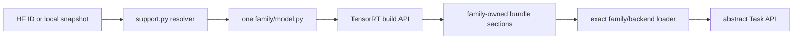

TensorRT-Model-Connect turns a supported checkpoint into a native bundle and
loads that bundle through an abstract task interface. The model family is the
unit of source ownership, validation, and rollback.

## Shared mechanics

The shared build and runtime core owns only model-agnostic contracts:

- checkpoint metadata loading and exact family resolution;
- `BuildRequest`, `BundleWriter`, and the optional graph-transform callback;
- bounded bundle container I/O;
- public Task, Engine, loader, tensor, and BYOK interfaces;
- exact DSO loading and the TensorRT backend implementation.

Shared code does not own model topology, weights, section semantics,
preprocessing, postprocessing, sampling, runtime orchestration, or validation
oracles.

## Family vertical slices

Every supported family lives under `families/<family>/` and owns its
dependency declaration, support metadata, Python builder, native DSO, test
manifests, thresholds, fixtures, and oracles. A normal new-family contribution
adds only this directory; it does not modify a registry or central source list.

At build time the resolver imports all dependency-free `support.py` modules but
only the selected `model.py`. At runtime the loader reads the bundle header and
loads only `libtrtmc_model_<family>.so` plus the named backend. There is no
second strategy dispatch.

## Applications stay above the public boundary

The native CLI in `apps/cli/`, benchmark application in `apps/benchmark/`,
examples, and TVM-FFI BYOK use public build, load, Task, and Engine contracts.
Core and families never depend on those applications.

See [AI-Native Horizontal Scaling Architecture](ai-native-horizontal-scaling.md)
for the complete rules and [Source Layout](../reference/source-layout.md) for
the physical tree.
