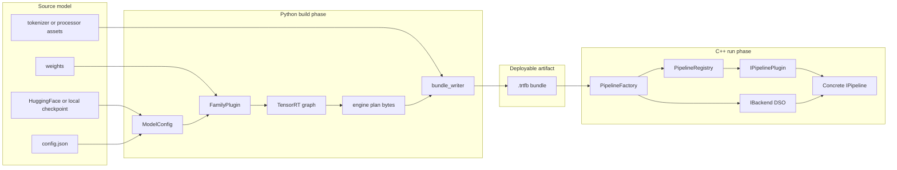
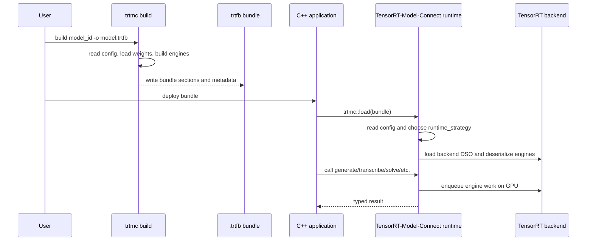
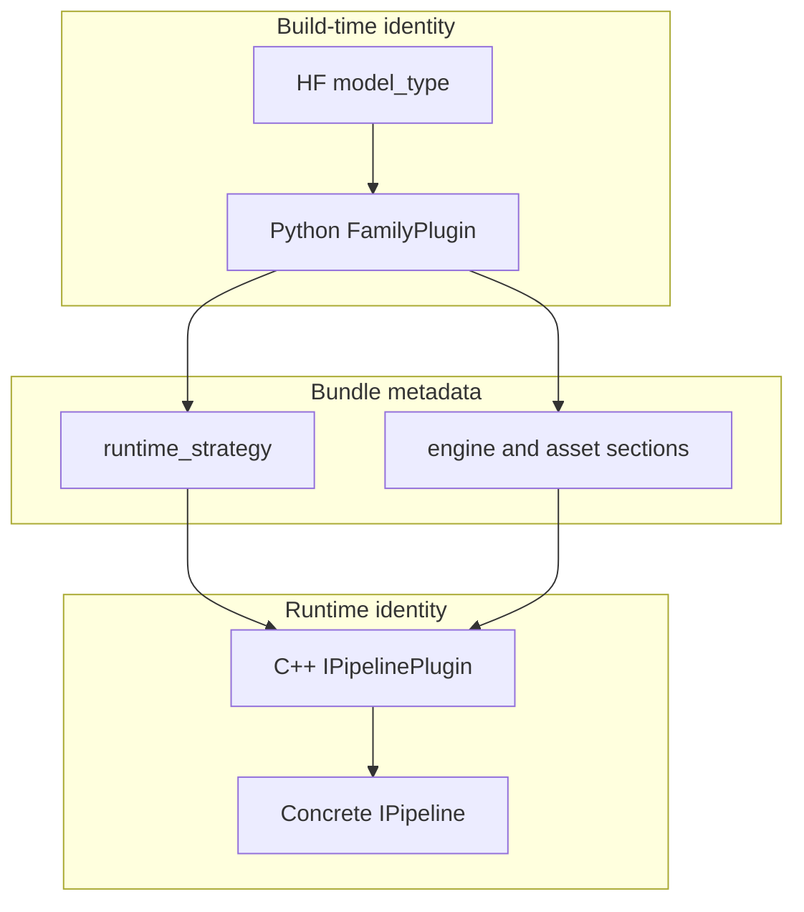
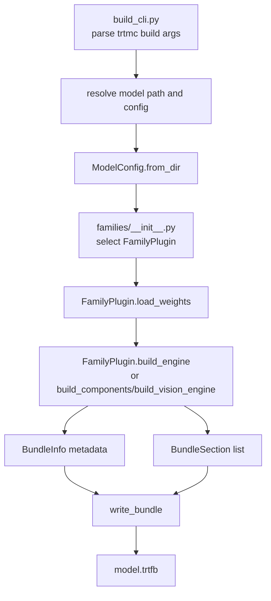
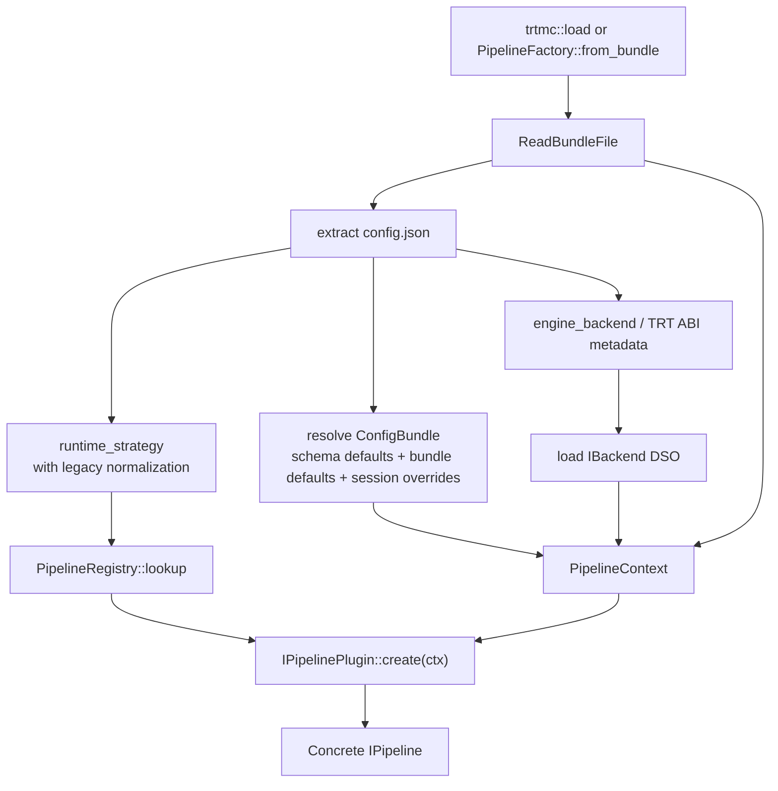
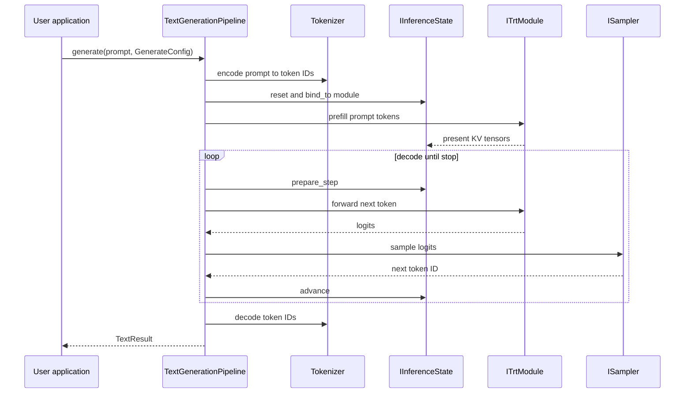

import useBaseUrl from '@docusaurus/useBaseUrl';

TensorRT-Model-Connect has two large responsibilities:

1. Convert a trained model checkpoint into deployable TensorRT artifacts.
2. Load those artifacts from native C++ and expose task-oriented inference APIs.

The boundary between those responsibilities is the `.trtfb` bundle.

## If You Only Remember Five Things

1. Python owns model-format diversity: configs, weights, tokenizers, processors, and graph construction.
2. The `.trtfb` bundle is the contract between build time and run time.
3. C++ does not dispatch by HuggingFace model name. It dispatches by `runtime_strategy`.
4. Runtime plugins own task behavior such as text generation, speech transcription, diffusion, segmentation, or time-series solve.
5. TensorRT ABI-sensitive execution is isolated behind backend DSOs so the public runtime can stay focused on bundle loading and task APIs.

<figure className="trtmc-diagram trtmc-diagram--wide">
  

    
  

  <figcaption>Architecture starts at the artifact boundary: Python produces a bundle, and C++ consumes it through registries and plugins.</figcaption>
</figure>

## Why the project is split

The split is not just a language preference. It separates two very different jobs.

| Job | Best environment | Reason |
| --- | --- | --- |
| Understand a new HuggingFace checkpoint | Python | Model repos, tokenizers, diffusers, Transformers, calibration flows, and checkpoint format utilities are Python-first. |
| Build optimized engine plans | Python builder with TensorRT APIs | Build logic needs flexible graph construction, weight transforms, calibration, and model-family adapters. |
| Run user requests | C++ | Deployment systems need stable native APIs, explicit memory ownership, predictable latency, and minimal Python in the request path. |
| Isolate TensorRT ABI | Backend DSO | TensorRT runtime versions can differ; the core runtime should not leak one `libnvinfer` ABI into every build. |

The result is a two-phase deployment model:

## The three identities of a model

The same model has three identities as it moves through the stack:

| Identity | Example | Source of truth | Used by |
| --- | --- | --- | --- |
| HuggingFace model type | `qwen3`, `whisper`, `flux` | `config.json` from the model repo | Python `ModelConfig` and family matching. |
| Builder family | `qwen`, `whisper`, `flux`, `pixart` | `python/tensorrt_model_connect/families/*.py` | Weight loading and engine construction. |
| Runtime strategy | `decoder_kv_cache`, `speech_to_text`, `diffusion_flux` | Bundle metadata and C++ plugin manifest | C++ dispatch and pipeline construction. |

This matters because adding a new model does not always mean adding a new runtime. A new decoder-only family can often reuse `decoder_kv_cache`; a new task shape may need a new runtime strategy.

## Build phase

The Python builder is responsible for the messy part of model diversity.

It starts in `python/tensorrt_model_connect/build_cli.py`, then calls into `engine_builder.py`. The builder resolves a model directory, parses `ModelConfig`, selects a `FamilyPlugin`, asks that plugin to load weights and build engines, then writes a bundle through `bundle_writer.py`.

The important builder abstractions are:

| Abstraction | Source | Responsibility |
| --- | --- | --- |
| `ModelConfig` | `python/tensorrt_model_connect/config.py` | Normalizes HuggingFace config fields into one typed view. |
| `FamilyPlugin` | `python/tensorrt_model_connect/families/base.py` | Per-family matching, weight loading, engine building, optional quantization hooks, and optional modality-specific build methods. |
| Graph builders | `graph_ops.py`, `graph_blocks.py`, `standard_decoder_builder.py`, dedicated builder files | Convert model structure and weights into TensorRT networks or compiled components. |
| Quantization units | `python/tensorrt_model_connect/quantization/` | Plan quantization, calibration, scale loading, and family-specific exclusions. |
| `BundleInfo` and `BundleSection` | `python/tensorrt_model_connect/bundle_writer.py` | Serialize build metadata and binary sections into `.trtfb`. |

Primary source locations:

- `python/tensorrt_model_connect/build_cli.py`
- `python/tensorrt_model_connect/engine_builder.py`
- `python/tensorrt_model_connect/families/`
- `python/tensorrt_model_connect/bundle_writer.py`

## Runtime phase

The C++ runtime starts with `trtmc::load()` or `PipelineFactory::from_bundle()`. It reads the bundle, finds `config.json`, normalizes old strategy names if needed, loads a backend DSO, resolves layered runtime config, looks up a runtime plugin, and lets that plugin construct the concrete pipeline.

The important runtime abstractions are:

| Abstraction | Source | Responsibility |
| --- | --- | --- |
| `IPipeline` | `include/trtmc/pipeline.h` | User-facing task interface. Methods unsupported by a concrete pipeline throw with the pipeline type. |
| `LoadOptions` | `include/trtmc/pipeline.h` | Runtime load knobs: HF Python helper path, runtime cache path, CUDA graphs, KV cache budget, config file, `--set` overrides, backend search paths. |
| `PipelineFactory` | `include/trtmc/runtime/pipeline_factory.h`, `src/runtime/registry/pipeline_factory.cpp` | Single creation path from bundle file to pipeline instance. |
| `PipelineRegistry` | `include/trtmc/runtime/pipeline_registry.h` | Maps `runtime_strategy` strings to registered `IPipelinePlugin` implementations. |
| `IPipelinePlugin` | `include/trtmc/runtime/pipeline_plugin.h` | Strategy-specific constructor that reads bundle sections and returns a concrete `IPipeline`. |
| `IBackend` | `include/trtmc/runtime/trt_backend.h` | Backend DSO interface for deserializing engines and creating `ITrtModule` execution wrappers. |
| `ITrtModule` | `include/trtmc/runtime/trt_module.h` | Engine execution interface used by pipelines without including TensorRT headers. |
| `IInferenceState` | `include/trtmc/runtime/inference_state.h` | Unified request state abstraction for KV cache, recurrent state, and hybrid state. |
| `ISampler` | `include/trtmc/runtime/sampler.h` | Token selection abstraction for greedy, top-k, top-p, min-p, and GPU-side sampling paths. |

Primary source locations:

- `include/trtmc/pipeline.h`
- `src/runtime/registry/pipeline_factory.cpp`
- `src/runtime/registry/pipeline_registry.cpp`
- `include/trtmc/runtime/pipeline_plugin.h`
- `src/runtime/models/`
- `src/runtime/plugins/`

## Request-time flow

After a pipeline is constructed, each user request is task-specific. Text generation is a useful example because it includes tokenization, GPU execution, state, and sampling.

<figure className="trtmc-diagram trtmc-diagram--wide">
  

    
  

  <figcaption>The runtime pipeline owns preprocessing, engine execution, request state, sampling, and result construction.</figcaption>
</figure>

Other modalities reuse the same architectural pattern:

| Task | Pipeline behavior |
| --- | --- |
| Vision-language | Preprocess image, run vision encoder or image projector, inject image embeddings into a text decoder, then sample text. |
| Speech-to-text | Convert audio to features, run encoder/decoder or RNNT path, decode token IDs to text. |
| Text-to-audio | Convert prompt to semantic/audio tokens, run codec or acoustic stages, write PCM samples. |
| Diffusion image/video | Encode text prompt, iterate denoising steps, decode latent representation through VAE. |
| Time-series | Prepare context tensors, run compiled forecast model, return numerical output. |
| Segmentation/detection | Preprocess pixels, run vision engine, decode masks or bounding boxes. |

## Design constraints

| Constraint | Consequence |
| --- | --- |
| Python builds, C++ runs | Checkpoint parsing and graph construction stay in Python; request-time inference stays native. |
| Bundle is the boundary | The runtime does not rediscover the original model repository to decide pipeline shape. |
| Family and strategy are separate | Build-time model support can grow without central runtime `switch` statements. |
| Strategy is resolved at load | A request uses a concrete pipeline instance; no per-request strategy redispatch is needed. |
| Runtime plugins are manifest registered | Adding a strategy changes a plugin file and manifest, not the factory core. |
| Backend DSOs isolate TensorRT ABI | The public runtime can load the backend matching the bundle's TensorRT metadata. |
| Task methods are explicit | A user calls `generate`, `transcribe`, `generate_image`, `segment`, `solve`, or `detect` instead of manipulating engine tensors directly. |

## Where to go deeper

- [Bundle Format](bundle-format.md) explains the artifact boundary.
- [Runtime Plugins](runtime-plugins.md) explains strategy dispatch and pipeline construction.
- [Build System](build-system.md) explains CMake targets, generated registration, and backend DSO boundaries.
- [Building Blocks](/unit-design/building-blocks) maps architecture concepts to concrete source abstractions.
