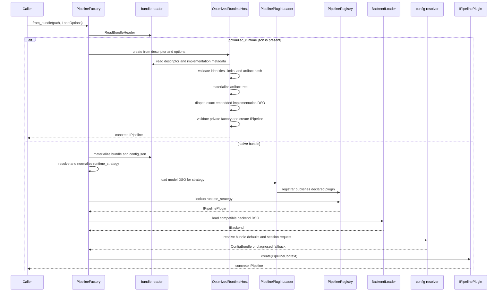
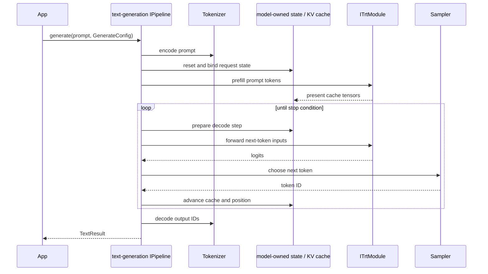

The C++ runtime begins at `trtmc::load()` or
`PipelineFactory::from_bundle()`. It reads the bundle header before choosing one
of two mutually exclusive construction paths.

## Authoritative pipeline-load sequence

The order matters. On the native path, strategy ownership and plugin lookup are
established before backend loading. On the optimized path, descriptor presence
claims the path before native materialization; an invalid descriptor, artifact,
DSO, or factory is terminal.

## Native dispatch

For a native bundle:

1. `config.json` supplies `runtime_strategy` and strategy-specific metadata.
2. Generated manifest data maps that strategy to one runtime owner and library.
3. `PipelinePluginLoader` loads the owning
   `libtrtmc_model_<owner>.so`.
4. The exported registrar publishes the declared `IPipelinePlugin` into
   `PipelineRegistry`.
5. `BackendLoader` resolves a compatible backend DSO and TensorRT ABI.
6. The factory resolves run-time configuration and creates `PipelineContext`.
7. The model plugin validates sections, creates modules and helpers, and
   returns a concrete `IPipeline`.

Legacy native strategy aliases may be normalized through generated
compatibility metadata. An unknown strategy, unavailable model DSO, undeclared
registration, incompatible backend, or invalid required section fails
explicitly.

Native runtime manifests live at
`src/runtime/models/<owner>/MODEL.toml`. CMake uses them to generate the
strategy-to-library index and model registrar entry points; contributors do not
append a family switch inside `PipelineFactory`.

## Optimized dispatch

For an optimized bundle, `OptimizedRuntimeHost`:

1. reads and validates `optimized_runtime.json`;
2. reads bounded private implementation metadata;
3. verifies and materializes the embedded artifact tree;
4. opens the exact embedded `libtrtmc_impl_*.so`;
5. validates the versioned private factory, implementation identity, and
   toolchain/runtime contract; and
6. asks that factory to create the public `IPipeline`.

The generic host treats model-owned implementation metadata as opaque. It does
not substitute an installed same-name DSO, use the native strategy index, or
select a native backend DSO.

Embedding the implementation library does not make the bundle hermetic. The
host still supplies compatible driver, CUDA, TensorRT, loader, and system
libraries.

## Plugin construction

`IPipelinePlugin::create()` receives a `PipelineContext` containing:

- the materialized bundle and parsed base config;
- original config text and bundle path;
- the selected `IBackend`;
- Python helper and runtime-cache paths;
- CUDA-graph and KV-cache load options;
- a resolved `ConfigBundle` when resolution succeeded.

The plugin reads its required sections, creates one or more `ITrtModule`
instances through `IBackend`, constructs model-owned state and preprocessing
helpers, then returns a concrete pipeline.

## Request sequence: text generation

Text generation illustrates the common request boundary without implying that
every modality uses a decoder.

Other pipelines implement only the public task methods they support:

| Task shape | Typical runtime work |
| --- | --- |
| Vision-language | Image preprocessing, vision execution, embedding injection, text generation |
| Speech recognition | Audio preprocessing, encoder/decoder or RNNT state, token decoding |
| Diffusion/image/video | Prompt encoding, denoising schedule, component engines, media decode |
| Encoder/embedding/reranking | Tokenization, encoder execution, pooling or scoring |
| Segmentation/detection | Image preprocessing, model execution, geometric postprocessing |
| Time series/operator | Numeric tensor preparation, engine execution, structured output |

The method's presence in `IPipeline` is not model-support evidence. Default
implementations throw when a concrete pipeline does not support an operation.

## Configuration behavior

For native construction, the factory currently supplies:

- schema defaults;
- an optional `defaults` object from materialized `config.json` as bundle
  defaults; and
- `LoadOptions.config_path` plus `LoadOptions.set_tokens` as the session
  request.

Although `ConfigBundle` defines build-time and platform-profile layer types,
this factory path does not inject separate contributions for them.

Direct `PipelineFactory` calls diagnose a configuration-resolution exception
and continue with a null run-time config so the model plugin can apply its local
fallback. The CLI performs explicit config validation before dispatch and exits
nonzero on invalid input. Library applications that require fail-fast config
semantics must enforce that policy around the current factory behavior.

## Concurrency and pipeline pools

One `IPipeline` owns mutable execution context, CUDA stream, cache/state, and
adapter bindings. The public interface does not promise concurrent calls on one
instance.

For native bundles, `PipelineFactory::from_bundle_pool()` creates independent
lanes and returns a `PipelinePool`. A move-only lease gives one request
exclusive access to one lane. Optimized bundles are rejected by this native
pool API because the delegated implementation owns batching and scheduling.

## Shape and engine constraints

Run-time inputs must fit the optimization profiles baked into the selected
artifact. Do not assume that two models in the same modality share engine
sections, batch limits, prefill/decode layout, KV capacity, or dynamic-shape
support. Use bundle inspection plus the owning build/profile contract.

## Runtime source map

| Concern | Source |
| --- | --- |
| Public task API | `include/trtmc/pipeline.h` |
| Pipeline factory | `src/runtime/registry/pipeline_factory.cpp` |
| Native DSO loader | `src/runtime/registry/pipeline_plugin_loader.cpp` |
| Native registry | `src/runtime/registry/pipeline_registry.cpp` |
| Optimized host | `src/runtime/providers/optimized_runtime_host.cpp` |
| Plugin context | `include/trtmc/runtime/pipeline_plugin.h` |
| Backend abstraction | `include/trtmc/runtime/trt_backend.h`, `include/trtmc/runtime/trt_module.h` |
| Model pipelines | `src/runtime/models/<owner>/` |
