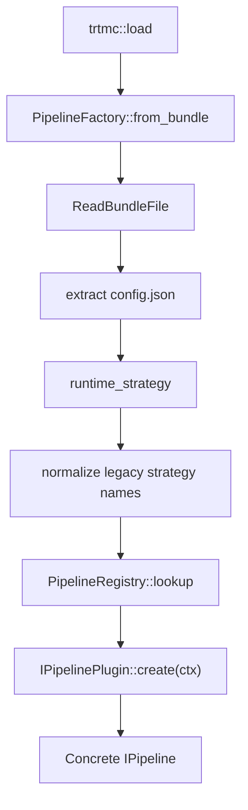
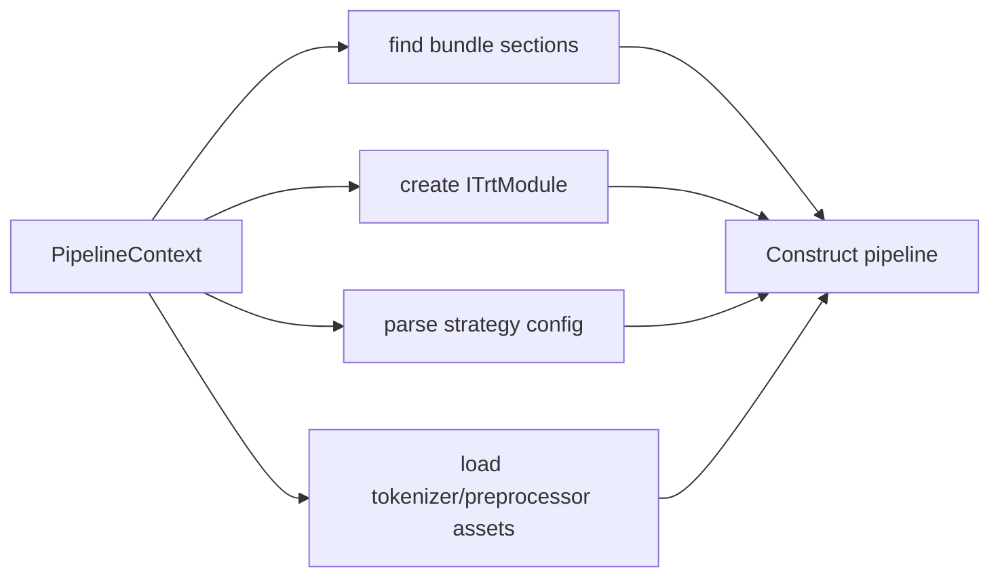
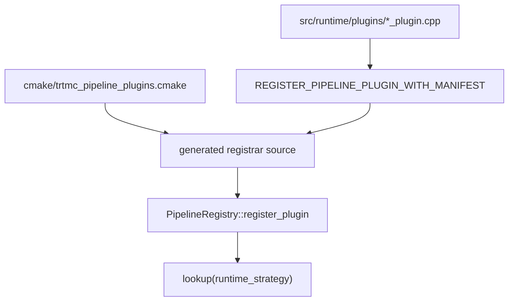
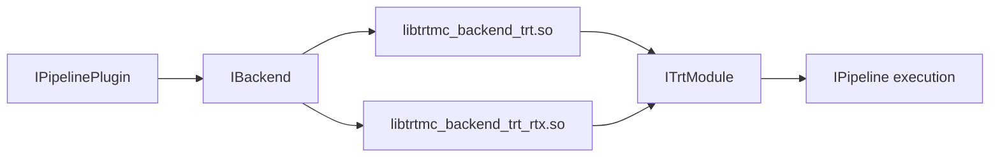

Runtime plugins convert bundle metadata and engine sections into concrete `IPipeline` instances.

They exist because `PipelineFactory` should not know every model family and every task. The factory handles universal loading work; plugins handle strategy-specific construction.

## Dispatch path



The plugin interface is in `include/trtmc/runtime/pipeline_plugin.h`.

## What `PipelineContext` gives a plugin

`IPipelinePlugin::create()` receives a `PipelineContext`. That context is the plugin's complete construction toolbox:

| Field | What it provides |
| --- | --- |
| `bundle` | Parsed `BundleFile` with all named sections. |
| `config` | Universal `BaseConfig` fields such as hidden size, layers, heads, tokenizer flags, and `runtime_strategy`. |
| `config_json` | Raw strategy-specific JSON for fields not in `BaseConfig`. |
| `hf_python` | Optional helper Python path for pipelines that still need a Python-side helper. |
| `bundle_path` | Original bundle path for diagnostics and adjacent artifact writes. |
| `backend` | Loaded `IBackend` instance used to create `ITrtModule` wrappers from engine plans. |
| `runtime_cache_path` | Runtime cache file path for backends such as TensorRT-RTX. |
| `cuda_graphs` | Load-time request to enable CUDA graph capture when supported. |
| `kv_cache_size_bytes` | Session override for dynamic KV cache budget. |
| `runtime_config` | Resolved layered `ConfigBundle` for schema-controlled runtime knobs. |



The plugin should parse only the fields and sections it owns. If a new strategy needs a new state machine or task API behavior, add a plugin and pipeline rather than expanding unrelated plugins.

## Registered strategy keys

The current runtime registers these strategy keys:

```text
decoder_kv_cache, decoder_moe, diffusion_flux, diffusion_ltx,
diffusion_pixart, diffusion_qwen_image, diffusion_wan, diffusion_zimage,
elf_flow, embedding, encoder_only, hybrid_mamba_attention,
image_classification, marian_translation, neural_operator, object_detection,
omni_multimodal, prompted_segmentation, reranking, rwkv_recurrent,
segmentation, bart_seq2seq_encoder_decoder, m2m_100_seq2seq_encoder_decoder,
speech_to_speech, speech_to_text,
speech_to_text_rnnt, mamba_ssm_recurrent, text_to_audio_bark, text_to_audio_magpie,
t5_text_to_text, vision_language
```

## Strategy groups

| Strategy group | Example keys | Main runtime shape |
| --- | --- | --- |
| Decoder text | `decoder_kv_cache`, `decoder_moe` | Tokenize prompt, prefill, decode one token at a time, sample logits, maintain KV cache. |
| Recurrent text | `mamba_ssm_recurrent`, `rwkv_recurrent`, `hybrid_mamba_attention` | Similar public API to text generation, but state is recurrent or hybrid rather than pure KV cache. |
| Encoder and retrieval | `encoder_only`, `embedding`, `reranking`, `neural_operator` | Produce embeddings, scores, hidden states, or numerical solver outputs. |
| Seq2seq and translation | `bart_seq2seq_encoder_decoder`, `m2m_100_seq2seq_encoder_decoder`, `t5_text_to_text`, `marian_translation` | Run encoder-decoder generation rather than decoder-only generation. |
| Vision and perception | `vision_language`, `segmentation`, `prompted_segmentation`, `object_detection` | Preprocess pixels, run vision components, postprocess text/masks/boxes. |
| Audio | `speech_to_text`, `speech_to_text_rnnt`, `speech_to_speech`, `text_to_audio_bark`, `text_to_audio_magpie` | Convert between waveforms, acoustic features, tokens, and text/audio output. |
| Diffusion | `diffusion_flux`, `diffusion_pixart`, `diffusion_wan`, `diffusion_zimage`, `diffusion_qwen_image`, `diffusion_ltx` | Encode prompt, iterate denoiser steps, decode latent images or video frames. |

## Manifest registration

`cmake/trtmc_pipeline_plugins.cmake` is the runtime plugin manifest. Each entry has:

```text
plugin_source.cpp|registration_function
```

Each plugin source calls `REGISTER_PIPELINE_PLUGIN_WITH_MANIFEST(...)` with the strategies it owns. CMake generates registrar calls so plugins are linked and registered without manually editing `pipeline_factory.cpp`.



This design keeps ownership local. Adding a model runtime should usually touch:

1. One model runtime folder under `src/runtime/models/`.
2. One pipeline file in that model folder if a new task state machine is needed.
3. The CMake plugin manifest.
4. Focused unit tests and an E2E manifest.

## Backend loading

Plugins create TensorRT modules through the backend abstraction. Backend DSOs are loaded by `src/runtime/backend/backend_loader.cpp`. This keeps the core runtime TensorRT-free at link time and avoids leaking one TensorRT ABI into all builds.



`IBackend` creates `ITrtModule` objects. Pipelines call `forward`, `forward_device`, `forward_device_async`, tensor introspection, and external binding methods without including TensorRT headers.

## Plugin responsibilities

Keep this split clear:

| Unit | Should own | Should avoid |
| --- | --- | --- |
| `PipelineFactory` | Common bundle read, config resolution, backend load, registry lookup. | Family-specific section parsing or task logic. |
| `IPipelinePlugin` | Strategy-specific construction from `PipelineContext`. | Per-token request loop logic once the pipeline is constructed. |
| `IPipeline` implementation | Request-time state machine and task methods. | Global registry behavior or unrelated strategy parsing. |
| Backend DSO | Engine deserialization and TensorRT execution context details. | Tokenization, sampling policy, modality preprocessing. |
