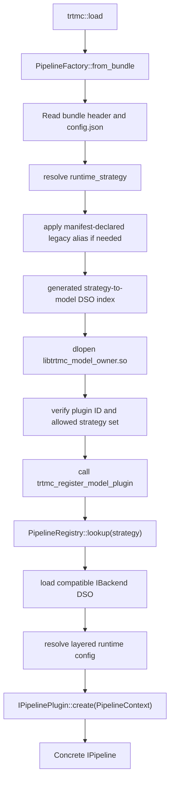
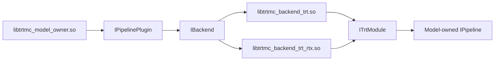

Runtime plugins convert bundle metadata and model-owned engine sections into
concrete `IPipeline` instances. Every runtime strategy is owned by one
`src/runtime/models/<owner>/MODEL.toml` and loaded from that owner's DSO.

The model DSO boundary is deliberate. Qwen and LLaMA both implement causal
generation, but the runtime loads `libtrtmc_model_qwen.so` for
`qwen_decoder_kv_cache` and `libtrtmc_model_llama.so` for
`llama_decoder_kv_cache`. Shared tooling groups both under the
`text_generation_causal` task contract; it does not merge their runtime code.

## Dispatch path



The relevant public/internal interfaces are:

- `include/trtmc/runtime/pipeline_plugin_loader.h`
- `include/trtmc/runtime/pipeline_registry.h`
- `include/trtmc/runtime/pipeline_plugin.h`
- `src/runtime/registry/pipeline_plugin_loader.cpp`
- `src/runtime/registry/pipeline_factory.cpp`

Explicit `LoadOptions.model_plugin_search_paths` and repeated CLI
`--model-plugin-dir` values are searched first. The loader then considers
`TRTMC_MODEL_PLUGIN_DIR`, installed locations, the configured build-tree
`models/` directory, and the current directory. With
`TRTMC_MODEL_PLUGIN_STRICT=1`, only explicit paths and
`TRTMC_MODEL_PLUGIN_DIR` are allowed; CI uses that mode to prevent a stale
installed DSO from satisfying a model-isolation proof.

## Model-owned runtime manifests

CMake discovers `src/runtime/models/*/MODEL.toml`; contributors do not append
plugins to a central list. A minimal manifest is:

```toml
id = "example"
runtime_library = "libtrtmc_model_example.so"
runtime_plugins = ["plugin.cpp|register_example_plugin"]
runtime_strategies = ["example_decoder_kv_cache"]
```

Optional manifest fields include:

| Field | Meaning |
| --- | --- |
| `runtime_config_schemas` | Model-owned C++ config schema source and registrar. |
| `runtime_tests` | Model-owned C++ test target, source, link targets, extra sources, and requirement flags. |
| `runtime_link_libraries` | Explicit model DSO dependencies currently recognized by CMake. |
| `legacy_runtime_strategy_aliases` | Compatibility mapping from a retired key to one strategy owned by this model. |
| `validation_profiles` | Model-owned opt-in to validation profiles such as decoder debug. |
| `gnu_warning_suppressed_sources` | Narrow source-level warning suppression owned by the model. |

`cmake/trtmc_pipeline_plugins.cmake` parses these manifests, verifies referenced
sources, rejects duplicate strategy ownership, generates
`model_plugin_index.cpp`, and generates one `register_model_plugin.cpp` for each
DSO. `CMakeLists.txt` then creates `trtmc_model_<owner>` targets and writes
their shared libraries under `build/models/<owner>/`.

Each local `plugin.cpp` defines the registrar declared by its manifest:

```cpp
REGISTER_PIPELINE_PLUGIN_WITH_MANIFEST(
    register_example_plugin,
    ExamplePlugin,
    "example_decoder_kv_cache");
```

The macro creates a typed registration function. The generated per-model
entrypoint exports `trtmc_model_plugin_id` and
`trtmc_register_model_plugin`; the loader checks both before accepting the
DSO.

## Strategy inventory

The authoritative list is the union of `runtime_strategies` arrays in
`src/runtime/models/*/MODEL.toml`. At this revision there are 79 unique keys
owned by 78 runtime model manifests. Avoid copying the whole list into a second
hand-maintained table. Representative groups are:

| Task shape | Model-owned strategy examples |
| --- | --- |
| Decoder/MoE text | `qwen_decoder_kv_cache`, `llama_decoder_kv_cache`, `mixtral_decoder_moe`, `gpt_oss_decoder_moe` |
| Recurrent/hybrid text | `mamba_ssm_recurrent`, `rwkv_recurrent`, `nemotron_h_hybrid_mamba_attention`, `qwen3_5_hybrid_mamba_attention` |
| Encoder/retrieval | `bert_encoder_only`, `mpnet_encoder_only`, `eagle_vlm_embedding`, `eagle_vlm_reranking` |
| Seq2seq/translation | `bart_seq2seq_encoder_decoder`, `m2m_100_seq2seq_encoder_decoder`, `t5_text_to_text`, `marian_translation` |
| Vision/perception | `qwen_vl_vision_language`, `timm_vit_image_classification`, `segformer_segmentation`, `sam_prompted_segmentation` |
| Audio | `whisper_speech_to_text`, `canary_speech_to_text`, `text_to_audio_bark`, `personaplex_speech_to_speech` |
| Diffusion | `diffusion_flux`, `diffusion_ltx`, `diffusion_pixart`, `diffusion_qwen_image`, `diffusion_sana_wm`, `diffusion_wan2_2_ti2v` |
| Numeric operators | `chronos_bolt_trt`, `patchtsmixer_trt`, `patchtst_trt`, `timesfm_trt` |

## What `PipelineContext` gives a plugin

`IPipelinePlugin::create()` receives a non-owning `PipelineContext` whose
referents remain alive during construction:

| Field | What it provides |
| --- | --- |
| `bundle` | Parsed `BundleFile` with the materialized sections required by the bundle's loading policy. |
| `config` | Universal `BaseConfig`: dimensions, token IDs, IO map, precision, tokenizer behavior, and normalized strategy. |
| `config_json` | Raw strategy-specific JSON for fields not represented by `BaseConfig`. |
| `hf_python` | Optional helper Python path for the few runtimes that need a helper process. |
| `bundle_path` | Original bundle path for diagnostics and adjacent effective-config output. |
| `backend` | Loaded `IBackend` used to construct `ITrtModule` wrappers. |
| `runtime_cache_path`, `cuda_graphs` | Backend load options, primarily for TensorRT-RTX. |
| `kv_cache_size_bytes` | Session override for a dynamic KV-cache budget. |
| `runtime_config` | Resolved `ConfigBundle`, or `nullptr` if resolution failed and the factory continued; the owning plugin then chooses its local fallback behavior. |

The plugin parses only its own fields and sections, creates its tokenizer,
modules, state, and helpers, and returns a fully constructed pipeline.
Request-time loops stay in the model-owned pipeline rather than in
`PipelineFactory`.

## Backend boundary

Model plugins create engine modules through `IBackend`. The standard
`libtrtmc_backend_trt.so` and optional
`libtrtmc_backend_trt_rtx.so` isolate TensorRT ABI-sensitive loading and
execution behind `ITrtModule`.



| Unit | Owns | Must not own |
| --- | --- | --- |
| `PipelineFactory` | Bundle loading, strategy resolution, model/backend DSO loading, config resolution, and construction context. | Model section layouts or request loops. |
| Model plugin DSO | Its declared strategies, construction logic, model helpers, and pipeline implementation. | Sibling-family behavior or undeclared strategies. |
| `IPipeline` implementation | Request state, preprocessing, engine calls, sampling/scheduling, and typed results. | Global plugin discovery. |
| Backend DSO | TensorRT runtime selection, engine deserialization, execution contexts, and tensor binding. | Tokenization or model/task policy. |
