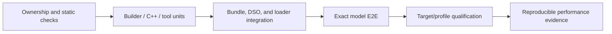

TensorRT-Model-Connect separates evidence by contract. A passing unit test, a
successful model run, exact reference parity, and a performance result are not
interchangeable claims.

## Evidence ladder

Each layer adds confidence; a later layer does not make earlier, focused
coverage unnecessary.

## Test ownership

| Layer | Primary location | What it proves |
| --- | --- | --- |
| Ownership/static | `tools/model_ci.py`, `tools/test_impact.py`, static tests | Descriptors, ownership roots, impact selection, and forbidden coupling |
| Python builder | `tests/builder/` | Config parsing, family matching, checkpoint mapping, graph/build orchestration, bundle emission |
| C++ runtime | `tests/cpp/` and model-declared runtime tests | Public API behavior, bundle parsing, DSO loading, config, state, plugins, backends |
| Tooling | `tests/tools/` | CI selection, validators, reports, comparison utilities, packaging logic |
| E2E harness | `tests/e2e_harness/` | Manifest loading, orchestration, runners, reference backends, comparators |
| Model E2E | `tests/e2e/models/<family>/` | Exact checkpoint, task, bundle, runtime, and output contract |
| Optimized Source contract | Family implementation/profile, capsule, adapter, and runtime-contract tests | Exact selection, packaging, identity, semantic-source digest, and fail-closed behavior |
| External target qualification | Separately retained controlled-environment evidence | Exact implementation/profile compatibility and model behavior on the declared target |
| Performance | Separately retained controlled-environment evidence | Latency/throughput under declared hardware, software, inputs, and methodology |

Counts change whenever models and manifests land. Use the descriptor indexes
and generated inventory rather than copying counts into design claims.

## Native evidence contract

A native model claim spans three ownership roots:

1. the Python family descriptor and builder package;
2. the C++ model descriptor, DSO, and strategy registration; and
3. the E2E descriptor and exact model manifest.

Useful evidence covers:

- family discovery and weight/config interpretation;
- emitted `runtime_strategy` and required bundle sections;
- loading only the owning model DSO and a compatible backend DSO;
- plugin construction and the public task method;
- comparison with the manifest's declared oracle and thresholds.

A descriptor-consistency check does not prove the model can execute on a GPU.
Likewise, plausible output is not parity unless the declared comparator passes.

## Optimized evidence contract

An optimized implementation is not a second native strategy. Its evidence
links:

1. a family-local `IMPLEMENTATION.toml`;
2. an exact qualified profile binding model revision, target, and options;
3. an isolated adapter and embedded implementation DSO;
4. host/bundle tests that fail closed on identity, digest, ABI, or artifact
   mismatch; and
5. the profile's `qualification_state` and `qualified_semantic_sha256`, plus
   separately retained target evidence when qualification is claimed.

The public Source tree does not publish the former qualification descriptor,
hardware runner, or retained target artifacts. Selection logic, a profile
digest, and host-only contract tests do not replace target-hardware evidence.

## Choosing the narrowest useful test

| Change | Minimum focused evidence |
| --- | --- |
| Python family/config/checkpoint logic | Builder unit tests |
| Native plugin, state, sampler, or pipeline behavior | Model-owned C++ test plus relevant integration |
| Native strategy or DSO ownership | Manifest validation, loader/registry test, exact model E2E |
| Optimized adapter/profile | Adapter/profile tests, bundle/host fail-closed tests, exact qualification |
| Public CLI or C++ task contract | Parser/API tests and at least one exercising pipeline |
| Config namespace | Matching Python/C++ schema tests, override/error tests, consuming unit |
| Quantization | Planning/calibration tests plus numerical model evidence |
| Report or CI selection | Tool tests with retained fixture/result schema |
| Performance claim | Exact revision, hardware, inputs, warmups, repetitions, and result artifacts |

## Evidence interpretation

- Compilation proves that selected source and toolchains can build; it does not
  prove inference.
- A green E2E case proves its exact manifest contract, not every model or
  configuration.
- Tolerances must encode the intended user contract and must not be loosened
  merely to make CI pass.
- Timing fields are useful only when the selected pipeline populates them with
  a defined meaning. A zero value is not universal proof of zero latency.
- Reports need the tested revision and artifact provenance; a detached summary
  without them is not exact-head evidence.
- Unsupported configurations need negative tests, not only a lack of positive
  examples.

## Traceability boundary

Machine-readable descriptors and testcase trace IDs can index evidence, but
they do not by themselves establish complete bidirectional requirements/design
traceability. A formal claim additionally needs maintained identifiers,
unique links in both directions, checked paths, retained results, and a
CI-enforced verifier.

## Running validation

The command inventory and environment requirements change independently of
this design explanation. Use the maintained
[Testing Reference](../reference/testing.md) for current local commands,
workflow boundaries, GPU requirements, and known validation gaps.

The canonical evidence sources are:

- `tests/builder/`
- `tests/cpp/`
- `tests/tools/`
- `tests/e2e_harness/`
- `tests/e2e/models/`
- `tools/model_ci.py`
- `tools/test_impact.py`
