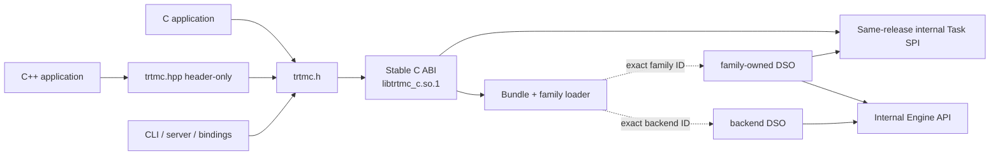
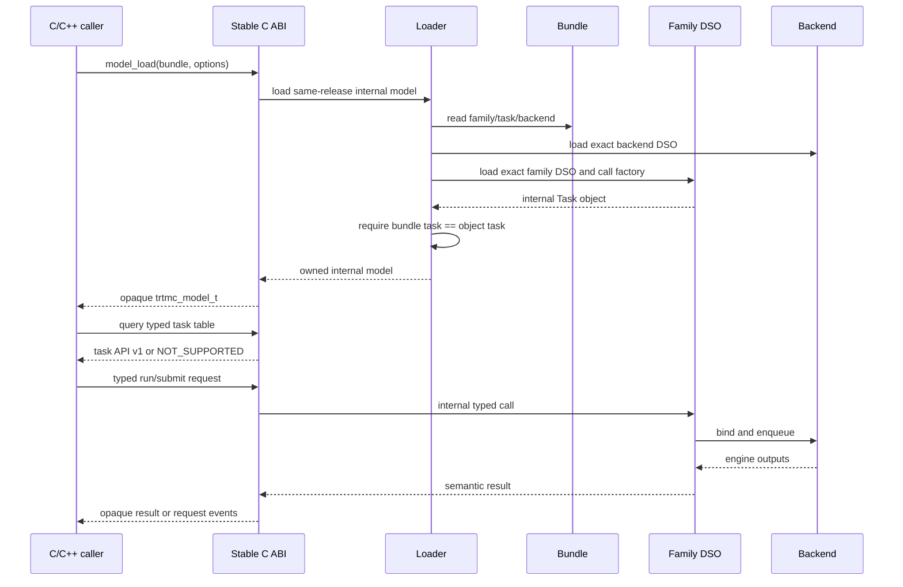

# Stable Task C ABI and Header-Only C++ API

Status: **Proposed**. This document defines the intended public SDK contract;
it does not describe an ABI that exists on `main` today.

Normative scope: core ABI v1.0 and synchronous `trtmc.task.text.generate`
v1.0 only. The complete task universe and migration sections are a
non-normative semantic backlog. A future task or capability becomes ABI only
through a focused companion ADR shipped with its first real family and
consumer. This is deliberate: predicting thirty binary layouts now would
contradict KISS and the evidence in the research below.

## Decision summary

TensorRT-Model-Connect will have exactly one release-stable binary boundary:
a pure C ABI. C++ users will compile a header-only, typed RAII wrapper that
calls only that C ABI. No C++ object, standard-library type, exception, RTTI,
or virtual table crosses the public binary boundary.

Model families continue to own their runtime pipelines. A family implements
only the small typed semantic operations that it actually executes. HTTP
schemas, URL fetching, batching policy, routing, cache policy, conversation
storage, and multi-stage topology remain above or below the Task API; they do
not become family interfaces. A family may own message-to-token chat-template
rendering behind a future typed text request, but `chat` is never a second
engine task.

The first implementation must prove one installed-package, single-device text
request end to end before another task or family is migrated. The completed
cutover contains no compatibility shim, fallback, or second public C++ ABI.

## Goals

1. Keep a C ABI stable across compilers and language runtimes within an ABI
   major version.
2. Give C++ callers a small typed API with RAII and exceptions without
   exporting C++ ABI.
3. Let a normal model contribution stay inside one `families/<family>/`
   directory after its task contract exists.
4. Catalog text, multimodal, media, perception, speech, numeric, time-series,
   and control tasks without prematurely freezing them into a universal
   options dictionary.
5. Define ownership, errors, cancellation, streaming, batch ordering, version
   negotiation, and future extension before declaring the ABI stable.
6. Preserve family-owned defaults: an absent option means “use the bundle and
   family default,” while an explicitly present false or zero remains explicit.
7. Keep the native ABI independent from HTTP, Python, Hugging Face, OpenAI,
   vLLM, SGLang, and SGLang-Omni transport details.

## Non-goals

- Reproduce every Hugging Face task tag as a C symbol.
- Expose `dict`, `Any`, JSON request bags, provider-specific `extra_body`, or
  model-specific keyword arguments as the primary ABI.
- Expose TensorRT objects, schedulers, stages, KV blocks, pipeline topology,
  model internals, or framework tensors through a task contract.
- Fetch URLs, open arbitrary media paths, apply HTTP authentication, or store
  conversations in the native ABI.
- Add content hashes, bundle digests, source hashes, or cache fingerprints.
- Add a custom allocator, callback-based output allocator, or device-tensor
  exchange before a real zero-copy consumer requires one.
- Make same-release internal family/backend C++ interfaces binary-compatible
  across releases. They are built and shipped with the runtime as one product.
- Retain the currently installed direct C++ Task API after final cutover.

## What exists today

At repository revision `40523401ae65735056f85ae73028c04025aa1c50`, the
public runtime interface is C++, not C:

```text
user C++ object code
  -> libtrtmc_runtime.so
  -> std::unique_ptr<ITask>
  -> dynamic_cast<ITextGeneration / ...>
  -> family C++ virtual method
```

`task.h` exposes virtual classes, STL containers, exceptions, and RTTI across
DSOs. CMake installs those headers, but the binary Python wheel does not. The
`extern "C" trtmc_create_family` symbol only fixes the loader symbol name; its
argument and return types are C++ and therefore do not form a C ABI.

The current tree contains 99 family runtimes and 25 primary manifest task IDs.
Every family implements at least one current C++ Task interface. Build-side
`model.py` remains a plain `build(request, writer)` function and must never
inherit from a builder base class; runtime-side C++ pipelines implement typed
interfaces deliberately.

## Research findings

### Hugging Face is a task universe, not an ABI

The Hugging Face Hub taxonomy snapshot contains 57 coarse task tags. Of those,
31 have a current generated inference schema; `chat-completion` has a schema
but is not a pipeline tag; and Transformers registers 24 local pipelines. The
official sources also show naming drift such as Hub `keypoint-detection`
versus Transformers `keypoint-matching`. This makes the taxonomy valuable for
coverage planning, but unsuitable as a normative ABI definition.

- [Hub task taxonomy source](https://github.com/huggingface/huggingface.js/blob/14c3b53d7273c4f846ab7583d12b416f849e126f/packages/tasks/src/pipelines.ts)
- [Hub task-model semantics](https://github.com/huggingface/hub-docs/blob/main/docs/hub/models-tasks.md)
- [Transformers pipeline registry](https://github.com/huggingface/transformers/blob/8eaf75f84e0ef68ccdaac14b739ace53a962bbee/src/transformers/pipelines/__init__.py#L141-L435)
- [Hugging Face inference task specs](https://github.com/huggingface/huggingface.js/tree/14c3b53d7273c4f846ab7583d12b416f849e126f/packages/tasks/src/tasks)
- [InferenceClient API](https://huggingface.co/docs/huggingface_hub/package_reference/inference_client)
- [Transformers ordered chat content](https://huggingface.co/docs/transformers/chat_content_patterns)
- [Transformers tool-call message shape](https://huggingface.co/docs/transformers/main/chat_extras)

Transformers accepts Python paths, URLs, PIL images, NumPy arrays, Torch
tensors, lists, generators, and open-ended keyword arguments. Diffusers
pipeline call signatures vary by model and expose schedulers, latents,
embeddings, callbacks, and framework generators. Those are useful convenience
APIs but are not stable native data layouts.

- [Transformers Pipeline call semantics](https://github.com/huggingface/transformers/blob/8eaf75f84e0ef68ccdaac14b739ace53a962bbee/src/transformers/pipelines/base.py#L1217-L1299)
- [Diffusers pipeline overview](https://github.com/huggingface/diffusers/blob/c5469b7ceb606edd7ba6570dcd17d38590a18db6/docs/source/en/api/pipelines/overview.md)
- [Stable Diffusion text-to-image call](https://github.com/huggingface/diffusers/blob/c5469b7ceb606edd7ba6570dcd17d38590a18db6/src/diffusers/pipelines/stable_diffusion/pipeline_stable_diffusion.py#L779-L807)
- [Stable Diffusion image-to-image call](https://github.com/huggingface/diffusers/blob/c5469b7ceb606edd7ba6570dcd17d38590a18db6/src/diffusers/pipelines/stable_diffusion/pipeline_stable_diffusion_img2img.py#L860-L883)
- [Stable Diffusion inpaint call](https://github.com/huggingface/diffusers/blob/c5469b7ceb606edd7ba6570dcd17d38590a18db6/src/diffusers/pipelines/stable_diffusion/pipeline_stable_diffusion_inpaint.py#L881-L910)

### vLLM separates engine tasks from frontend operations

vLLM distinguishes generation tasks, pooling tasks, and rendering. Chat,
Completions, and Responses render into generation. Score, rerank, sentence
similarity, and reward are operations built from embedding, classification, or
token-level pooling rather than distinct model runners.

- [vLLM task taxonomy](https://github.com/vllm-project/vllm/blob/main/vllm/tasks.py)
- [vLLM offline LLM API](https://github.com/vllm-project/vllm/blob/main/vllm/entrypoints/llm.py)
- [vLLM online API matrix](https://docs.vllm.ai/en/latest/serving/online_serving/)
- [vLLM pooling tasks](https://docs.vllm.ai/en/latest/models/pooling_models/)

Its async engine shape is one request ID producing a stream of outputs with
explicit abort. Its higher-level batch APIs still accept several scalar-or-
sequence parameters. We deliberately choose an array of complete requests for
the future native ABI so slicing one item cannot lose a request-scoped field.
This supports an opaque request handle and a pull-based event stream.

### SGLang shows what must stay out of the ABI

SGLang’s native generation object combines prompt text/tokens/embeddings,
image/audio/video data, sampling, logprobs, LoRA, priority, cache salt,
sessions, routing, tracing, and disaggregated-serving fields. It is an effective
Python service object, but it is too broad and fast-moving for a stable ABI.

- [SGLang native sampling API](https://github.com/sgl-project/sglang/blob/main/docs/docs/basic_usage/sampling_params.mdx)
- [SGLang engine entrypoint](https://github.com/sgl-project/sglang/blob/main/python/sglang/srt/entrypoints/engine.py)
- [SGLang gateway API matrix](https://github.com/sgl-project/sglang/blob/main/docs/advanced_features/sgl_model_gateway.md)
- [SGLang LoRA lifecycle](https://github.com/sgl-project/sglang/blob/main/docs/docs/advanced_features/lora.mdx)

Priority is a potential common execution control. Adapter loading belongs in
an optional adapter lifecycle API. Cache and routing belong to the serving
layer. Structured output is a typed text-generation constraint, not a new
task. None of these should be repeated in every family interface. A deadline
is not added until a concrete caller defines clock and cancellation semantics.

### SGLang-Omni validates ordered content and explicit sessions

SGLang-Omni accepts mixed text, image, audio, and video and can emit text and
audio through a multi-stage runtime. Its current public request/chunk types
also expose stage-specific controls and stage IDs. That coupling is a useful
warning, not a pattern to copy: TRTMC keeps topology out of its stable
contract. Realtime speech still demonstrates explicit append, commit, cancel,
truncate, text-delta, audio-delta, and terminal events.

- [SGLang-Omni repository and supported APIs](https://github.com/sgl-project/sglang-omni)
- [SGLang-Omni architecture](https://github.com/sgl-project/sglang-omni/blob/main/docs/developer_reference/main.md)
- [SGLang-Omni protocol types](https://github.com/sgl-project/sglang-omni/blob/main/sglang_omni/serve/protocol.py)
- [SGLang-Omni client request types](https://github.com/sgl-project/sglang-omni/blob/main/sglang_omni/client/types.py)
- [SGLang-Omni TTS integration](https://github.com/sgl-project/sglang-omni/blob/main/docs/developer_reference/tts_model_integration.md)

The useful stable concepts are ordered typed content parts and a session event
state machine. Stage IDs, stage sampling, inboxes, relays, and model topology
remain family/runtime implementation details.

### Stable C ABI precedents

ONNX Runtime exposes opaque C handles and obtains a versioned function table
through `OrtGetApiBase()->GetApi(ORT_API_VERSION)`. Its C++ API is explicitly a
header-only RAII wrapper over that C API. Triton uses opaque request, response,
error, and allocator handles with a documented major/minor compatibility rule
and explicit asynchronous ownership transfer.

- [ONNX Runtime C API and header-only C++ wrapper](https://github.com/microsoft/onnxruntime/blob/main/include/onnxruntime/core/session/onnxruntime_c_api.h)
- [ONNX Runtime C++ wrapper](https://github.com/microsoft/onnxruntime/blob/main/include/onnxruntime/core/session/onnxruntime_cxx_api.h)
- [Triton in-process C API](https://docs.nvidia.com/deeplearning/triton-inference-server/user-guide/docs/client_guide/in_process.html)
- [Triton C header and version policy](https://github.com/triton-inference-server/core/blob/main/include/triton/core/tritonserver.h)

DLPack and Arrow demonstrate versioned managed tensor/array exchange with an
explicit release callback. They are candidates for a future zero-copy
extension, not mandatory v1 dependencies.

- [DLPack managed tensor ABI](https://github.com/dmlc/dlpack/blob/main/include/dlpack/dlpack.h)
- [Arrow C data interface](https://arrow.apache.org/docs/format/CDataInterface.html)

## API layers and dependency direction

In the diagrams below, `A --> B` means A has a source or link dependency on B.
`A -.-> B` means A discovers or calls B at runtime. The arrow always points to
the dependency.



The installed C++ wrapper never includes the internal Task SPI. Family code
never includes the public C++ convenience wrapper. Apps and examples sit above
the public C or C++ API; core and families never depend on them.



## Three kinds of “task”

The term task must not conflate three different layers.

| Layer | Examples | Family implements it? | Stable C ABI? |
| --- | --- | --- | --- |
| Semantic primitive | generate, embed, classify, transcribe, segment | Yes | Yes, when promoted |
| Derived operation | chat, summarize, score, rerank, reward | Usually composed above primitives | Header-only/service helper |
| Transport/service | HTTP Responses, URL loading, conversation store, router, cache flush | No | No |

Promotion rule: a semantic primitive receives a stable task API only when its
request/result semantics are explicit and at least one real family and one real
consumer require it. A taxonomy-only label remains backlog, not ABI.

## External task universe mapped to canonical contracts

The following table covers the current 57 Hugging Face taxonomy tags without
turning all 57 into ABI entrypoints.

| Source task tags | Canonical contract or layer |
| --- | --- |
| `text-generation`, `summarization`, `table-to-text`, `tabular-to-text` | `trtmc.task.text.generate`; the latter three are presets/templates |
| `translation` | `trtmc.task.text.translate` when source/target language is selected at runtime; otherwise a fixed-language generate bundle |
| `image-to-text`, `image-text-to-text`, `video-text-to-text`, `audio-text-to-text` | `trtmc.task.text.generate` with ordered media content |
| `any-to-any` | `trtmc.task.omni.generate` only after a real mixed-output family is qualified |
| `feature-extraction`, `image-feature-extraction` | `trtmc.task.embed` or `trtmc.task.token_embed` according to output granularity |
| `sentence-similarity`, `text-retrieval` | Header-only score helper over embed/token-embed |
| `text-ranking`, `visual-document-retrieval` | Header-only rerank helper over classify/embed/token-embed unless a native rank primitive is proven |
| `text-classification`, `zero-shot-classification`, `multiple-choice` | `trtmc.task.classify`; candidate labels are optional typed input |
| `image-classification`, `zero-shot-image-classification`, `video-classification`, `audio-classification` | `trtmc.task.classify` with typed media input |
| `token-classification` | `trtmc.task.token_classify` |
| `fill-mask` | `trtmc.task.fill_mask` |
| `question-answering`, `document-question-answering`, `table-question-answering`, `visual-question-answering` | `trtmc.task.question_answer` with typed context kind and typed evidence locations |
| `automatic-speech-recognition` | `trtmc.task.audio.transcribe` |
| `text-to-speech`, `text-to-audio` | `trtmc.task.audio.generate` |
| `audio-to-audio` | `trtmc.task.audio.transform` |
| `voice-activity-detection` | `trtmc.task.audio.detect_activity` only when a real family requires it |
| `text-to-image`, `unconditional-image-generation`, `image-text-to-image` | `trtmc.task.image.generate` |
| `image-to-image` | `trtmc.task.image.edit` |
| `text-to-video`, `image-to-video`, `image-text-to-video` | `trtmc.task.video.generate` |
| `video-to-video` | `trtmc.task.video.edit` |
| `text-to-3d`, `image-to-3d` | `trtmc.task.three_d.generate` only after a concrete asset contract exists |
| `object-detection`, `zero-shot-object-detection` | `trtmc.task.vision.detect` |
| `image-segmentation`, `mask-generation` | `trtmc.task.vision.segment` |
| `depth-estimation` | `trtmc.task.vision.geometry` |
| `keypoint-detection` | `trtmc.task.vision.keypoints` |
| `tabular-classification`, `tabular-regression` | `trtmc.task.tabular.predict` |
| `time-series-forecasting` | `trtmc.task.time_series.forecast` |
| `robotics` | `trtmc.task.robot.control` only from an explicit observation/action contract |
| `reinforcement-learning` | Training/domain label; no inference ABI is inferred |
| `graph-ml`, `other` | No ABI inferred from the label |

## Proposed typed task catalog (non-normative backlog)

This is the potential task-level surface. Names other than
`trtmc.task.text.generate` are descriptive proposals, not reserved stable IDs.
“Migration-required” means current functionality needs a companion task ADR.
“On demand” means no task ABI is published until a real family and consumer
need it.

| Task ID | Request semantics | Result semantics | Plan |
| --- | --- | --- | --- |
| `trtmc.task.text.generate` | v1.0: prompt and max tokens; later companions may add tokens/messages/sampling/tools | v1.0: text, token IDs, timings | Normative v1.0 |
| `trtmc.task.text.translate` | source text plus optional source and target language | translated text and usage | On demand when language choice is runtime-visible |
| `trtmc.task.omni.generate` | ordered text/image/audio/video parts and requested output modalities | ordered text/audio/image/video/tool parts | On demand; Qwen3-Omni text first |
| `trtmc.task.embed` | one or more typed content inputs; optional normalization/pooling | one vector per input | Migration-required |
| `trtmc.task.token_embed` | text/tokens/content | token-level vectors and valid lengths | On demand |
| `trtmc.task.classify` | discriminated single, paired, zero-shot, or multiple-choice content | typed score vector and labels per input | Migration-required |
| `trtmc.task.token_classify` | text or tokens | labeled token/span records | On demand |
| `trtmc.task.fill_mask` | text/tokens with mask and top-k | token candidates, scores, completed sequences | On demand |
| `trtmc.task.question_answer` | question plus text/table/document/image context | answers, scores, spans/cells/page boxes | On demand |
| `trtmc.task.audio.transcribe` | PCM/encoded audio; language; timestamps/diarization mode | text and timed/speaker segments | Migration-required |
| `trtmc.task.audio.generate` | text plus optional voice/reference audio | audio plus sample rate/channels | Migration-required |
| `trtmc.task.audio.transform` | input audio and typed transform options | one or more audio tracks | On demand |
| `trtmc.task.audio.detect_activity` | audio and threshold/window settings | speech intervals and scores | On demand |
| `trtmc.task.speech.session` | append/commit/cancel/reset/tool/batch state machines | text/audio/tool/speech-boundary events | Migration-required |
| `trtmc.task.image.generate` | prompt, negative prompt, size/count, steps, guidance, seed, optional conditioning | image list | Migration-required |
| `trtmc.task.image.edit` | source image, optional mask, prompt, strength, generation options | image list | Migration-required |
| `trtmc.task.video.generate` | prompt and optional initial image/video; frames/fps/size/generation options | video or ordered frames | Migration-required |
| `trtmc.task.video.edit` | source video, prompt/mask/control, generation options | video or ordered frames | On demand |
| `trtmc.task.three_d.generate` | prompt and/or images plus requested representation | mesh, point cloud, Gaussian set, textures | On demand |
| `trtmc.task.vision.detect` | image plus threshold and optional labels | boxes, labels, scores, optional masks | On demand |
| `trtmc.task.vision.segment` | image plus optional point/box/text prompts | masks, labels, scores | Migration-required |
| `trtmc.task.vision.keypoints` | one or two images and matching options | keypoints, descriptors, matches, scores | On demand |
| `trtmc.task.vision.geometry` | one or more images plus camera metadata | depth/disparity/points/intrinsics/confidence | Migration-required |
| `trtmc.task.vision.features` | image/video and requested output layer | typed feature tensors | Migration-required |
| `trtmc.task.vision.pose_refine` | crops, initial poses, camera/mesh metadata | refined poses and scores | Migration-required |
| `trtmc.task.vision.video_segment` | frames plus prompts and tracking state | per-frame masks/object IDs/scores | Migration-required |
| `trtmc.task.time_series.forecast` | history, frequency, horizon, covariates, quantiles | point/quantile/sample forecasts | Migration-required |
| `trtmc.task.tabular.predict` | typed columns/rows and schema | class probabilities or regression values | On demand |
| `trtmc.task.robot.control` | typed observation/state/images and optional history | action or action chunk | Migration-required |
| `trtmc.task.world_model.generate` | observation, action, prompt, horizon | predicted frames/state/latents | Migration-required |
| `trtmc.task.neural_operator` | named typed tensors | named typed tensors | Migration-required; intentionally low-level |

Task-specific semantics are not collapsed merely because fields share a name.
Text sampling temperature, diffusion guidance, audio sample rate, video timebase,
geometry coordinates, forecast quantiles, and robot action horizons remain in
their own request types.

## Normative core and text v1.0 C ABI design

### Public artifacts

The stable SDK ships these artifacts together:

```text
include/trtmc/trtmc.h       pure C ABI and typed task tables
include/trtmc/trtmc.hpp     header-only C++17 wrapper
lib/libtrtmc_c.so.1         only stable shared-library boundary
lib/cmake/trtmc/...         imported C and header-only C++ targets
```

The same headers and library must be present in the binary wheel under
`tensorrt_model_connect/include/` and `tensorrt_model_connect/bin/`. A CMake
install and an installed wheel are both validated by compiling, linking, and
running an external consumer from outside the source checkout.

Internal headers such as the current C++ `task.h`, family factory context, and
engine interfaces remain available to the in-tree build but are not installed
as public SDK headers after cutover.

Core ABI v1 is certified for 64-bit Linux on x86-64 and AArch64 using the
platform C calling convention and ELF shared libraries. Windows or another
platform receives its own ABI fixtures and release declaration before it is
called supported; the Linux v1 promise does not imply cross-OS binary
compatibility.

### One bootstrap symbol

`libtrtmc_c.so.1` exports one bootstrap symbol. All other C entrypoints are
obtained from a versioned table. This gives a new client a clean failure when
loaded with an older runtime instead of failing during dynamic symbol
resolution.

```c
#include <stddef.h>
#include <stdint.h>

#if defined(__GNUC__)
#  define TRTMC_EXPORT __attribute__((visibility("default")))
#  define TRTMC_CALL
#else
#  define TRTMC_EXPORT
#  define TRTMC_CALL
#endif

#ifdef __cplusplus
#  define TRTMC_STATIC_ASSERT(condition, message) static_assert(condition, message)
#else
#  define TRTMC_STATIC_ASSERT(condition, message) _Static_assert(condition, message)
#endif

#ifdef __cplusplus
extern "C" {
#endif

#define TRTMC_MAKE_VERSION(major, minor) \
    ((((uint32_t)(major)) << 16U) | ((uint32_t)(minor)))
#define TRTMC_ABI_VERSION_1_0 TRTMC_MAKE_VERSION(1, 0)

typedef struct trtmc_api_header {
    uint32_t struct_size;
    uint32_t abi_version;
} trtmc_api_header;

TRTMC_EXPORT const trtmc_api_header* TRTMC_CALL
trtmc_get_api(uint32_t requested_version);

#ifdef __cplusplus
}
#endif
```

In the real header the `extern "C"` block encloses the bootstrap and every
public function-pointer/table declaration. The excerpts below are split only
for readability.

Negotiation rules:

- The high 16 bits are the ABI major and the low 16 bits are the minor.
- A runtime returns `NULL` when it cannot implement the requested version.
- Within major 1, a runtime supporting minor N must retain a static table for
  every earlier supported minor. New function pointers are appended only, so
  those tables share the same frozen prefix.
- The returned table is immutable and valid for the process lifetime.
- Major 2 defines a new table type returned through the common
  `trtmc_api_header*` bootstrap and uses a new SONAME. It never reinterprets
  a v1 object as v2.

### ABI-safe scalar rules

- Public sizes, counts, offsets, timestamps, byte lengths, and `struct_size`
  use fixed-width integers. A structure larger than `UINT32_MAX` is invalid.
- ABI enums are `typedef uint32_t` plus named constants; C enum storage size is
  not relied upon.
- ABI booleans are `uint32_t` with values zero or one.
- Supported platforms must provide IEEE-754 32-bit `float` and 64-bit `double`;
  compile-time checks cover size plus `FLT_RADIX`, `FLT_MANT_DIG`, and
  `DBL_MANT_DIG` in both C and C++ headers.
- Strings are explicit UTF-8 pointer/length views and need not be NUL-terminated.
- No bitfields, packed structs, flexible array members, C++ types, exceptions,
  or ownership hidden in comments alone cross the ABI.
- Every input pointer/count pair permits a null pointer only when count is zero.
- Every fallible function initializes all output pointers to `NULL` before work.
- Release functions accept `NULL`.

### Common opaque handles

```c
typedef struct trtmc_error trtmc_error_t;
typedef struct trtmc_model trtmc_model_t;
typedef struct trtmc_result trtmc_result_t;

typedef struct trtmc_string_view_v1 {
    const char* data;
    uint64_t size;
} trtmc_string_view_v1;
```

Opaque handles prevent their implementation layout from becoming ABI. Model,
result, and error handles are never freed with `free()` or `delete`; only the
matching table function releases them. Future request, event, session, and
adapter handles follow the same rule only when their companion ADR publishes
them.

### Error convention

Every fallible function returns an owned `trtmc_error_t*`:

```text
NULL       success
non-NULL   failure; caller owns and must release the error
```

The core table exposes:

```c
typedef uint32_t trtmc_error_code_t;
#define TRTMC_ERROR_INVALID_ARGUMENT  1U
#define TRTMC_ERROR_NOT_SUPPORTED     2U
#define TRTMC_ERROR_WRONG_TASK        3U
#define TRTMC_ERROR_OUT_OF_MEMORY     4U
#define TRTMC_ERROR_RUNTIME           5U
#define TRTMC_ERROR_ABI_MISMATCH      6U

trtmc_error_code_t (TRTMC_CALL *error_code)(const trtmc_error_t*);
void (TRTMC_CALL *error_message)(
    const trtmc_error_t*, trtmc_string_view_v1* out_message);
void (TRTMC_CALL *error_release)(trtmc_error_t*);
```

There is no thread-local `last_error`. Explicit error ownership works for
sync, async, and cross-language callers and never associates a worker-thread
failure with the wrong caller. No C++ exception crosses the C boundary.
The runtime keeps one immutable emergency out-of-memory error object that needs
no allocation; `error_release` recognizes it and is a no-op. All other error
messages remain valid until their error handle is released.

### Versioned structures and optional fields

Every evolvable request, view, options, and table starts with this prefix:

```c
typedef struct trtmc_struct_header_v1 {
    uint32_t struct_size;
    uint32_t abi_version;
} trtmc_struct_header_v1;
```

Task request structures additionally carry a `present` bit mask. Zero is a
valid explicit value only when its corresponding published presence bit is
set. Core v1.0 and text v1.0 define every bit they accept below; no unnamed
reserved bit has semantics.

Normative negotiation algorithm:

1. The client requests one exact major/minor table version.
2. The runtime returns a static table whose first-member header has an
   `abi_version` exactly equal to that request and a `struct_size` at least the
   published size, or returns `NULL`. A newer runtime may keep separate static
   tables for earlier minors.
3. An input structure is zero-initialized by the caller. The caller sets
   `struct_size`, the exact version of the owning core/task table, and any
   published presence bits.
4. The runtime rejects a mismatched structure version or a size smaller than
   the last required v1.0 field. It reads at most the smaller of the caller size
   and the negotiated version’s published size.
5. An output-view structure is also zero-initialized by the caller with size
   and negotiated version. The runtime preserves those two fields and writes
   no byte at or beyond the caller size.
6. An unknown required flag returns `NOT_SUPPORTED`; it is never silently
   ignored. Unset fields use family-owned bundle defaults.
7. A field may be appended only in a compatible minor. Changing an existing
   field’s type or meaning requires a new task major.

Core load/model/task-info structures carry the negotiated core ABI version.
A task request or result view carries that task table’s negotiated version.
The unversioned frozen `string_view` carries no competing version field.

Layout rules:

- Evolvable structures are referenced by pointer, never embedded by value in
  another evolvable structure.
- The tiny `string_view` layout is frozen for core major 1 and may be embedded
  by value.
- A future array of versioned structures must carry data, count, and explicit
  element stride. An array without a stride may contain only a layout frozen
  for the entire task major.
- A payload never carries two competing version fields; the payload structure’s
  own header is the single source of truth.

### Core API table

The complete v1 core table is intentionally small:

```c
#define TRTMC_LOAD_PRESENT_RUNTIME_ROOT (UINT64_C(1) << 0)

typedef struct trtmc_load_options_v1 {
    uint32_t struct_size;
    uint32_t abi_version;
    uint64_t present;
    trtmc_string_view_v1 runtime_root;
} trtmc_load_options_v1;

typedef struct trtmc_model_info_v1 {
    uint32_t struct_size;
    uint32_t abi_version;
    trtmc_string_view_v1 family;
    trtmc_string_view_v1 primary_task;
    trtmc_string_view_v1 backend;
} trtmc_model_info_v1;

typedef struct trtmc_task_info_v1 {
    uint32_t struct_size;
    uint32_t abi_version;
    trtmc_string_view_v1 task_id;
    uint32_t task_api_version;
} trtmc_task_info_v1;

#define TRTMC_LOAD_OPTIONS_V1_INIT \
    { sizeof(trtmc_load_options_v1), TRTMC_ABI_VERSION_1_0, 0, { NULL, 0 } }
#define TRTMC_MODEL_INFO_V1_INIT \
    { sizeof(trtmc_model_info_v1), TRTMC_ABI_VERSION_1_0, { NULL, 0 }, \
      { NULL, 0 }, { NULL, 0 } }
#define TRTMC_TASK_INFO_V1_INIT \
    { sizeof(trtmc_task_info_v1), TRTMC_ABI_VERSION_1_0, { NULL, 0 }, 0 }

typedef struct trtmc_api_v1 {
    trtmc_api_header header;

    void (TRTMC_CALL *runtime_version)(trtmc_string_view_v1* out_version);

    trtmc_error_code_t (TRTMC_CALL *error_code)(const trtmc_error_t*);
    void (TRTMC_CALL *error_message)(
        const trtmc_error_t*, trtmc_string_view_v1* out_message);
    void (TRTMC_CALL *error_release)(trtmc_error_t*);

    trtmc_error_t* (TRTMC_CALL *model_load)(
        const char* bundle_path,
        uint64_t bundle_path_size,
        const trtmc_load_options_v1* options,
        trtmc_model_t** out_model);
    void (TRTMC_CALL *model_release)(trtmc_model_t* model);
    trtmc_error_t* (TRTMC_CALL *model_info)(
        const trtmc_model_t* model,
        trtmc_model_info_v1* out_info);
    trtmc_error_t* (TRTMC_CALL *model_task_count)(
        const trtmc_model_t* model,
        uint64_t* out_count);
    trtmc_error_t* (TRTMC_CALL *model_task_info)(
        const trtmc_model_t* model,
        uint64_t index,
        trtmc_task_info_v1* out_info);
    trtmc_error_t* (TRTMC_CALL *model_get_task_api)(
        trtmc_model_t* model,
        const char* task_id,
        uint64_t task_id_size,
        uint32_t requested_task_version,
        const void** out_task_api);

    void (TRTMC_CALL *result_release)(trtmc_result_t* result);
} trtmc_api_v1;

TRTMC_STATIC_ASSERT(offsetof(trtmc_api_v1, header) == 0,
                    "trtmc_api_v1 header must be its first member");
```

A C caller obtains the table as follows:

```c
#include <stdio.h>

const trtmc_api_header* header = trtmc_get_api(TRTMC_ABI_VERSION_1_0);
if (header == NULL ||
    header->abi_version != TRTMC_ABI_VERSION_1_0 ||
    header->struct_size < sizeof(trtmc_api_v1)) {
    /* Refuse to execute against an incompatible runtime. */
}
const trtmc_api_v1* api = (const trtmc_api_v1*)header;
```

The runtime’s static object has type `trtmc_api_v1` and returns
`&table.header`. Converting that first-member pointer back to the enclosing
standard-layout table is defined in C and C++; the `offsetof` assertion is an
ABI fixture, not documentation-only intent. C++ uses the equivalent
`static_assert`.

`model_load` does not search URLs, environment variables, `PATH`, or arbitrary
install prefixes. With no explicit runtime root, it uses only the runtime
co-located with the loaded `libtrtmc_c.so`. CLI-specific current-directory
lookup may happen before this call and must pass the resolved directory
explicitly.

No ABI or bundle hash is checked. Unsupported or incompatible components fail
when loading their required symbol or contract; there is no alternate-family
fallback.

Strings returned by `model_info` and `model_task_info` are borrowed from the
model handle and remain valid until `model_release`, unless a later call on the
same handle is explicitly documented to invalidate them.
The `runtime_version` string is immutable for the process lifetime. An error
message is immutable until its error handle is released. Embedded NUL bytes in
bundle paths and task IDs are invalid even though all inputs are length-delimited.

### Task discovery and independent task versions

Published task IDs are stable namespaced UTF-8 strings rather than a closed
numeric enum. Each published task API has its own major/minor version and an
immutable, process-lifetime function table. Proposed backlog names are not
published until their companion ADR is accepted.

Every core or task table embeds `trtmc_api_header header` as its first member
and locks `offsetof(table_type, header) == 0`; it never merely repeats two
same-looking fields and type-puns between unrelated structures.

```text
core ABI             1.0
text.generate        1.2
audio.transcribe     1.0
vision.segment       2.0
```

Adding a task does not enlarge the core table. `model_get_task_api` returns a
typed table only when both the installed runtime and loaded model implement the
requested task version. The caller casts the returned pointer to the matching
type declared by the same header version.

Each result, and each future event, records its task ID and task API version
internally. A typed view rejects a handle produced by another task or version
with `WRONG_TASK`; a C cast can never reinterpret unrelated output.

This is the only task extension mechanism. There is no central family registry
or universal `run(task, json)` function.

Every future stateless table follows this conceptual typed shape; its companion
ADR must replace `<task>` with concrete compilable declarations:

```text
trtmc_error_t* run(
    trtmc_model_t*, const trtmc_<task>_request_v1*,
    trtmc_result_t** out_result);
trtmc_error_t* result_view(
    const trtmc_result_t*, trtmc_<task>_result_view_v1* out_view);
```

Streaming-capable tables append:

```text
trtmc_error_t* submit(
    trtmc_model_t*, const trtmc_<task>_request_v1*,
    trtmc_request_t** out_request);
trtmc_error_t* event_view(
    const trtmc_event_t*, trtmc_<task>_event_view_v1* out_view);
```

The non-normative potential registry and its intended calling shape are below.
Task IDs in the first column omit the common `trtmc.task.` prefix for
readability. Every row other than text v1.0 requires a companion ADR.

| Task ID | C table type | Operations |
| --- | --- | --- |
| `text.generate` | `trtmc_text_generate_api_v1` | v1.0 run/view; streaming may be appended by a later minor |
| `text.translate` | `trtmc_text_translate_api_v1` | run, view |
| `omni.generate` | `trtmc_omni_generate_api_v1` | run, view, submit, event view |
| `embed` | `trtmc_embed_api_v1` | run, view |
| `token_embed` | `trtmc_token_embed_api_v1` | run, view |
| `classify` | `trtmc_classify_api_v1` | run, view |
| `token_classify` | `trtmc_token_classify_api_v1` | run, view |
| `fill_mask` | `trtmc_fill_mask_api_v1` | run, view |
| `question_answer` | `trtmc_question_answer_api_v1` | run, view |
| `audio.transcribe` | `trtmc_audio_transcribe_api_v1` | run, view, optional submit/event view |
| `audio.generate` | `trtmc_audio_generate_api_v1` | run, view, optional submit/event view |
| `audio.transform` | `trtmc_audio_transform_api_v1` | run, view |
| `audio.detect_activity` | `trtmc_audio_activity_api_v1` | run, view |
| `speech.session` | `trtmc_speech_session_api_v1` | create, append, commit, cancel, truncate, tool result, event view |
| `image.generate` | `trtmc_image_generate_api_v1` | run, view, optional submit/event view |
| `image.edit` | `trtmc_image_edit_api_v1` | run, view, optional submit/event view |
| `video.generate` | `trtmc_video_generate_api_v1` | run, view, optional submit/event view |
| `video.edit` | `trtmc_video_edit_api_v1` | run, view, optional submit/event view |
| `three_d.generate` | `trtmc_three_d_generate_api_v1` | run, view, optional submit/event view |
| `vision.detect` | `trtmc_vision_detect_api_v1` | run, view |
| `vision.segment` | `trtmc_vision_segment_api_v1` | run, view |
| `vision.keypoints` | `trtmc_vision_keypoints_api_v1` | run, view |
| `vision.geometry` | `trtmc_vision_geometry_api_v1` | run, view |
| `vision.features` | `trtmc_vision_features_api_v1` | run, view |
| `vision.video_segment` | `trtmc_video_segment_api_v1` | create session, append frame/prompt, event view |
| `vision.pose_refine` | `trtmc_pose_refine_api_v1` | run, view, reset session when tracking |
| `time_series.forecast` | `trtmc_time_series_forecast_api_v1` | run, view |
| `tabular.predict` | `trtmc_tabular_predict_api_v1` | run, view |
| `robot.control` | `trtmc_robot_control_api_v1` | create/reset session, observe, action event view |
| `world_model.generate` | `trtmc_world_generate_api_v1` | run, view, optional submit/event view |
| `neural_operator` | `trtmc_neural_operator_api_v1` | run, view |

“Optional” means the function is added in a negotiated task minor when a real
streaming implementation exists; it is not a nullable promise in v1.0. An
older table prefix does not contain that function pointer.

### Input and result ownership

Core/text v1.0 deliberately uses runtime-owned results instead of allocator
callbacks:

- Synchronous input views are borrowed only until the call returns.
- A `trtmc_result_t` owns every nested string, token array, mask, media buffer,
  and tensor described by its typed result view.
- Typed result views borrow from the result handle and become invalid when
  `result_release` is called.
- Result handles are immutable after publication.

Future async/session ADRs must require append/submit calls to copy inputs before
returning, retain required model/adapter state, and make event ownership
explicit. A separately negotiated DLPack or managed-buffer extension may add
device memory only with a real consumer and stream-synchronization ownership
tests.

### Future media, content, and execution requirements (non-normative)

No media, multimodal content, priority, adapter, async, or session structure is
published by this ADR. Their first companion ADR must satisfy these constraints:

- Encoded media and raw arrays are explicitly discriminated; no path extension
  or byte prefix is guessed.
- Image contracts define dtype, range, normalization, color space, alpha,
  layout, width, height, and contiguity.
- Audio contracts define encoded versus PCM, dtype, interleaving, sample rate,
  channels, and half-open sample ranges.
- Video contracts define encoded versus frames, frame order, rational timebase,
  optional audio, and ownership.
- Tensor contracts define dtype, rank, shape, strides, memory kind, device, and
  synchronization. Core/text v1.0 publishes host data only; no CUDA enum is
  pre-reserved.
- Ordered multimodal content uses a kind plus a pointer to one versioned
  payload. The payload’s own header is the only version. Arrays of versioned
  parts carry element stride.
- Chat endpoints remain derived operations, but a future text-task minor may
  deliberately accept ordered semantic messages so the family can apply its
  own chat template. That does not import an OpenAI response envelope,
  conversation store, or transport behavior into the task.
- Tool definitions and arguments may use JSON where JSON is the semantic data;
  the entire request is never JSON.
- Priority, adapter selection, or a monotonic deadline is added only with its
  first real consumer. Wall-clock deadlines are forbidden.
- Adapter loading is a separately negotiated control-plane capability that
  yields an opaque adapter handle; request hot paths never load a path.
- Cache salt, tracing, routing, worker IDs, and pipeline-stage parameters remain
  outside task ABI.

### Future async, streaming, and cancellation rule (non-normative)

Core/text v1.0 publishes synchronous `run` and `result_view` only. The first
real incremental consumer must publish request/event handles in a core minor
and append typed `submit`/`event_view` entries in the owning task minor.

```text
run(model, typed_request, &result)
  -> one owned result or one owned error

submit(model, typed_request, &request)
  -> request_next(request, timeout, &event)*
  -> exactly one terminal event
  -> request_release(request)
```

That companion ADR must use this state machine:

```text
created -> queued -> running -> completed
                         |----> cancelled
                         `----> failed
```

Rules:

- `request_cancel` is idempotent and may be called from any thread.
- Cancellation still produces exactly one terminal event.
- `request_next` has one consumer; concurrent `next` calls are invalid.
- `timeout_ns == 0` polls. `UINT64_MAX` waits without a caller deadline.
- A wait timeout returns a `TIMEOUT` error without changing request state.
- Model execution failures are `FAILED` terminal events, not errors returned by
  `request_next`; `event_terminal_view` exposes their stable code and message.
- Every data event states whether it is a delta or a complete snapshot.
- Releasing a non-terminal request requests cancellation and discards unread
  events without blocking for model completion.
- The synchronous C++ helper is implemented by the task table’s `run`, not by
  a hidden HTTP call or subprocess.
- The first streaming version uses pull-based events. It invokes no user
  callback from a runtime worker thread, avoiding cross-language reentrancy and
  callback lifetime ambiguity.

### Batch semantics

Batch is an execution shape, not a different result type and not a scalar-or-
array option on every field.

- Text v1.0 runs one complete semantic request.
- A header-only batch helper may submit or run N independent requests and
  preserve input order, but it does not claim native-batch performance.
- Current native batch capabilities are real functionality: Canary batch
  transcription and per-prompt/per-seed image batching in Flux, Qwen Image,
  and Z-Image must receive typed `run_batch` companion contracts before
  cutover.
- Every batch item has an independent result or error; one failure does not
  erase successful siblings.
- Generating N outputs from one prompt may carry `output_count`; it is distinct
  from unrelated prompts with per-item seeds and cannot replace native batch.

This avoids the scalar/list normalization and field-propagation failure modes
visible in large Python request objects.

### Thread-safety contract

- The API and task tables are immutable and process-wide thread-safe.
- Model information and capability queries are thread-safe.
- Core/text v1.0 does not promise concurrent execution on one model handle;
  callers serialize `run` or load independent handles.
- Results are immutable and may be read concurrently until release.
- A future request or session has one event consumer. Cancellation may come
  from any thread and is idempotent.
- Session append/commit methods have one producer unless a future negotiated
  task version explicitly permits multiple producers.
- Release must not race with another operation on the same caller-owned handle;
  the header-only wrapper enforces ownership but cannot repair a C data race.

### Text generation task table

`trtmc.task.text.generate` is the first complete vertical slice.

```c
#define TRTMC_TEXT_GENERATE_ABI_V1_0 TRTMC_MAKE_VERSION(1, 0)

#define TRTMC_TEXT_PRESENT_MAX_NEW_TOKENS (UINT64_C(1) << 0)

typedef struct trtmc_text_generate_request_v1 {
    uint32_t struct_size;
    uint32_t abi_version;
    uint64_t present;
    trtmc_string_view_v1 prompt;
    uint32_t max_new_tokens;
    uint32_t reserved;
} trtmc_text_generate_request_v1;

typedef struct trtmc_text_generate_result_view_v1 {
    uint32_t struct_size;
    uint32_t abi_version;
    trtmc_string_view_v1 text;
    const int32_t* output_token_ids;
    uint64_t output_token_count;
    double setup_ms;
    double prefill_ms;
    double decode_ms;
} trtmc_text_generate_result_view_v1;

#define TRTMC_TEXT_GENERATE_REQUEST_V1_INIT \
    { sizeof(trtmc_text_generate_request_v1), \
      TRTMC_TEXT_GENERATE_ABI_V1_0, 0, { NULL, 0 }, 0, 0 }
#define TRTMC_TEXT_GENERATE_RESULT_VIEW_V1_INIT \
    { sizeof(trtmc_text_generate_result_view_v1), \
      TRTMC_TEXT_GENERATE_ABI_V1_0, { NULL, 0 }, NULL, 0, 0.0, 0.0, 0.0 }

typedef struct trtmc_text_generate_api_v1 {
    trtmc_api_header header;
    trtmc_error_t* (TRTMC_CALL *run)(
        trtmc_model_t*,
        const trtmc_text_generate_request_v1*,
        trtmc_result_t** out_result);
    trtmc_error_t* (TRTMC_CALL *result_view)(
        const trtmc_result_t*,
        trtmc_text_generate_result_view_v1* out_view);
} trtmc_text_generate_api_v1;

TRTMC_STATIC_ASSERT(offsetof(trtmc_text_generate_api_v1, header) == 0,
                    "text task API header must be its first member");
```

The complete C happy path is:

```c
const trtmc_api_header* header = trtmc_get_api(TRTMC_ABI_VERSION_1_0);
if (header == NULL ||
    header->abi_version != TRTMC_ABI_VERSION_1_0 ||
    header->struct_size < sizeof(trtmc_api_v1)) return 1;
const trtmc_api_v1* api = (const trtmc_api_v1*)header;
trtmc_model_t* model = NULL;
trtmc_error_t* error = api->model_load(
    "model.bundle", sizeof("model.bundle") - 1, NULL, &model);
if (error != NULL) {
    api->error_release(error);
    return 1;
}

const void* untyped_text_api = NULL;
error = api->model_get_task_api(
    model,
    "trtmc.task.text.generate",
    sizeof("trtmc.task.text.generate") - 1,
    TRTMC_TEXT_GENERATE_ABI_V1_0,
    &untyped_text_api);
if (error != NULL) {
    api->error_release(error);
    api->model_release(model);
    return 1;
}
const trtmc_text_generate_api_v1* text_api =
    (const trtmc_text_generate_api_v1*)untyped_text_api;
if (text_api->header.abi_version != TRTMC_TEXT_GENERATE_ABI_V1_0 ||
    text_api->header.struct_size < sizeof(*text_api)) {
    api->model_release(model);
    return 1;
}

trtmc_text_generate_request_v1 request = {0};
request.struct_size = sizeof(request);
request.abi_version = TRTMC_TEXT_GENERATE_ABI_V1_0;
request.prompt.data = "Hello";
request.prompt.size = sizeof("Hello") - 1;
request.present = TRTMC_TEXT_PRESENT_MAX_NEW_TOKENS;
request.max_new_tokens = 32;

trtmc_result_t* result = NULL;
error = text_api->run(model, &request, &result);
if (error != NULL) {
    api->error_release(error);
    api->model_release(model);
    return 1;
}

trtmc_text_generate_result_view_v1 view = {0};
view.struct_size = sizeof(view);
view.abi_version = TRTMC_TEXT_GENERATE_ABI_V1_0;
int exit_code = 0;
error = text_api->result_view(result, &view);
if (error == NULL) {
    fwrite(view.text.data, 1, (size_t)view.text.size, stdout);
} else {
    api->error_release(error);
    exit_code = 1;
}

api->result_release(result);
api->model_release(model);
return exit_code;
```

Every non-NULL error is released, every owned result is released before its
borrowed views are used again, and the model is released last. Failure never
requires the caller to clean a partially initialized output handle.

Text v1.0 accepts exactly one UTF-8 prompt and produces exactly one candidate.
`best_of`, `n`, token input, messages, media, sampling controls, logprobs,
structured constraints, tools, adapters, batching, and streaming are not part
of v1.0. A later task minor may append one proven group at a time. Unsupported
fields never silently fall back to weaker generation.

The result preserves every current cross-family `TextResult` field consumed by
the CLI or benchmarks: text, token IDs, setup time, prefill time, and decode
time. Family-specific fields currently present in `TextGenerationConfig` must
be inventoried before cutover. Common proven controls may become flattened
text-task minor fields; language selection may become `text.translate`; and
diffusion-text, thinking, block-confidence, boxed-answer, latent, or other
family-specific behavior must receive a typed capability or remain family-
owned rather than entering a universal config.

For text v1.0, the minimum request size ends after `reserved`, `reserved` must
be zero, and a present `max_new_tokens` must be positive. An absent
`max_new_tokens` uses the loaded family’s default. The minimum result-view size
ends after `decode_ms`; the runtime writes all result fields atomically or
returns an error without a partially usable result.
Text is UTF-8, token IDs are the generated continuation in emission order, and
timings are finite non-negative milliseconds. A zero timing means the family
did not measure that phase; v1.0 does not invent a separate timing API.

`trtmc_text_translate_api_v1`, when promoted, is a synchronous table whose
request contains source text, optional source language, required or
bundle-default target language, and bounded generation options. Its result
contains translated text and text usage. It is separate only because language
selection has stable task-specific semantics; fixed-language seq2seq bundles
may continue to implement `text.generate`.

### Proposed omni generation contract (non-normative)

`trtmc.task.omni.generate` is published only when a qualified model emits more
than one modality. It uses ordered content parts for both input and output and
the same request lifecycle as text generation.

```text
request:
  ordered messages/content parts
  requested output modality bit set
  text and task-specific audio generation options
  execution options

result/events:
  TEXT_DELTA
  AUDIO_CHUNK
  IMAGE
  VIDEO_FRAME or VIDEO
  TOOL_CALL
  COMPLETED / CANCELLED / FAILED
```

Internal thinker, talker, codec, vocoder, stage, scheduler, and transfer
topology never appear in this ABI. Qwen3-Omni migrates through
`text.generate` first; audio output is a later, independently qualified step.

### Proposed pooling and decision contracts (non-normative)

When promoted, these task tables are expected to be synchronous first and to
use `run`/`result_view` ownership like text generation. The table names and
fields below are requirements for companion ADRs, not published ABI.

| Task table | Request fields | Result view fields |
| --- | --- | --- |
| `trtmc_embed_api_v1` | complete content items, pooling mode, normalize | vector count, dimension, contiguous FP32 vectors |
| `trtmc_token_embed_api_v1` | text/token/content inputs | per-item valid length, dimension, token vectors |
| `trtmc_classify_api_v1` | discriminated single content, paired content, zero-shot labels, or question/context/choices group; multi-label and top-k | score kind, index-aligned labels/scores, selected indices |
| `trtmc_token_classify_api_v1` | text or token IDs, aggregation mode | token/span start/end, label, score |
| `trtmc_fill_mask_api_v1` | text or IDs, mask position/token, top-k, optional targets | candidate token, score, completed text/IDs |
| `trtmc_question_answer_api_v1` | question and typed text/table/document/image context | answer text, score, text span, cells, page/box evidence |

The family primitives are embed, token-embed, classify, and token-classify.
Header-only or service helpers implement:

```text
sentence similarity = embed + similarity
bi-encoder score     = embed(query) + embed(items) + similarity
late-interaction     = token_embed + MaxSim
cross-encoder score  = classify(query, item)
rerank               = score + stable sort/top-k
sequence reward      = classify
process reward       = token_classify
```

A family does not implement duplicate `score`, `rerank`, or `reward`
interfaces unless evidence proves a semantic primitive that cannot be composed
from those operations.

Before these tables can be published, their companion ADRs must fix the
following semantics rather than leaving them to each family:

- text and QA spans use half-open UTF-8 byte offsets and may additionally
  report token-index ranges;
- classification states whether scores are raw logits, independent sigmoid
  probabilities, or a normalized softmax distribution, and label `i` always
  corresponds to score `i`;
- multiple choice keeps one question/context and one ordered choice group;
  candidate labels are not used as a substitute for answer choices;
- paired classification preserves the boundary between the two sequences;
- table/document QA uses a discriminant for text span, table cell, or page box
  evidence and defines coordinate units.

### Proposed audio and speech contracts (non-normative)

| Task table | Request fields | Result/events |
| --- | --- | --- |
| `trtmc_audio_transcribe_api_v1` | audio, optional language/prompt, translate flag, timestamp and diarization modes | text, timed segments, speaker IDs; optional text deltas |
| `trtmc_audio_generate_api_v1` | text, optional voice/reference audio+transcript, output sample format/rate, task-owned generation fields | audio result or ordered audio chunks |
| `trtmc_audio_transform_api_v1` | audio plus typed transform mode/options | one or more labeled audio tracks |
| `trtmc_audio_activity_api_v1` | audio, window/hop/threshold | speech intervals and scores |

Realtime speech is stateful. Its companion ADR must inventory and preserve all
current VoiceChat/PersonaPlex capabilities before defining a C layout:

- create ordinary, batch, and tool-enabled sessions;
- return the effective session configuration;
- append audio/text/image, finish input, commit without closing, explicitly
  create a response, clear pending input, cancel one response, reset/reuse the
  session, and truncate played output;
- configure input/output sample rates, system prompt, emitted modalities,
  barge-in, seed, tail frames, tools, and on-hold messages;
- emit epoch, sequence number, media half-open sample range, frame index, text,
  audio, function-call lifecycle, user speech boundaries, reset, input-finished,
  response terminal, and session terminal;
- support tool results keyed by call ID and epoch;
- distinguish cancelling the current response from cancelling the entire
  session;
- define one producer/one consumer concurrency and nonblocking release.

No incomplete speech-session struct is published by this ADR. Every response,
content item, and tool call will carry an ID or monotonic epoch so late chunks
and truncation cannot be applied to the wrong response.

### Proposed image, video, and 3D contracts (non-normative)

| Task table | Request fields | Result view |
| --- | --- | --- |
| `trtmc_image_generate_api_v1` | prompt/negative prompt, optional conditioning images, width/height/count, steps, guidance, seed | ordered images with per-image seed |
| `trtmc_image_edit_api_v1` | source image, optional mask, prompt/negative prompt, strength, generation fields | ordered images |
| `trtmc_video_generate_api_v1` | prompt, optional initial image/video, width/height, frame count, FPS, steps, guidance, seed | encoded video or ordered frames with timebase |
| `trtmc_video_edit_api_v1` | source video, optional mask/control, prompt, generation fields | encoded video or ordered frames |
| `trtmc_three_d_generate_api_v1` | prompt and/or images, requested representation | explicitly typed mesh, point cloud, Gaussian set, and texture buffers |

Generation progress may use a request handle, but internal timesteps, sigmas,
latents, schedulers, Torch generators, prompt embeddings, and tensor callbacks
are not public task fields. A new model-specific control stays family-owned
until at least two consumers prove a stable semantic meaning.

The image-edit companion ADR must explicitly define mask dtype, range,
resolution, channel/alpha handling, and whether zero or one denotes the edited
region. The video contracts must define frame/audio synchronization and
half-open time ranges. No family may choose these meanings independently.

### Proposed perception contracts (non-normative)

| Task table | Request fields | Result view |
| --- | --- | --- |
| `trtmc_vision_detect_api_v1` | image, threshold, optional candidate labels | boxes, class IDs/labels, scores, optional masks |
| `trtmc_vision_segment_api_v1` | image plus optional points/boxes/text prompt and segmentation mode | masks, labels, scores, coordinate metadata |
| `trtmc_vision_keypoints_api_v1` | one/two images, threshold/matching mode | keypoints, descriptors, matches, scores |
| `trtmc_vision_geometry_api_v1` | one/more images, optional intrinsics, requested geometry outputs | depth, disparity, points, normals, intrinsics, confidence |
| `trtmc_vision_features_api_v1` | image/video, named feature selection | typed feature tensors and valid shapes |
| `trtmc_video_segment_api_v1` | session creation plus ordered frames and prompts | per-frame masks/tracks and terminal summary |
| `trtmc_pose_refine_api_v1` | crop batch, hypotheses, intrinsics/mesh metadata | refined transforms, scores, tracking state |

Coordinate systems, pixel origin, box convention, mask layout, depth units,
camera frames, and transform handedness are mandatory fields or normative text;
they cannot be inferred from a model name.

The segmentation companion must discriminate binary mask, probability map,
class-ID map, and encoded/RLE output. Detection boxes must state whether they
use original-image pixel edges or normalized coordinates and whether maximum
edges are exclusive. Geometry must state metric/relative units, invalid-value
encoding, camera frame, intrinsics convention, and confidence alignment.

### Proposed numeric, forecasting, and control contracts (non-normative)

| Task table | Request fields | Result view |
| --- | --- | --- |
| `trtmc_time_series_forecast_api_v1` | history, timestamps/frequency, horizon, optional covariates and quantiles | point forecasts, quantiles/samples, output timestamps |
| `trtmc_tabular_predict_api_v1` | typed columns/rows and prediction mode | class probabilities or regression values |
| `trtmc_robot_control_api_v1` | session observation: state, ordered camera images, timestamps, optional action history | action or action chunk, horizon and timing |
| `trtmc_world_generate_api_v1` | observation, prompt/action conditioning, requested horizon | frames and optional predicted state |
| `trtmc_neural_operator_api_v1` | named typed input tensors | named typed output tensors |

Robot control uses a per-session handle so reset, queued action chunks, and
history cannot leak between callers. A generic tensor operation is allowed
only for a genuinely tensor-semantic model such as a neural operator; it is not
an escape hatch for avoiding a real task contract.

The forecast companion must define target dimension, history ordering,
observed/missing mask polarity, frequency or timestamp units, future-covariate
alignment, horizon, output shape, and quantile-to-output indexing. Robot and
world-model companions must similarly define observation/action frames,
normalization ownership, timebase, reset, and action-chunk ordering.

## Header-only C++17 API

`trtmc.hpp` contains no separately compiled implementation and exports no C++
symbol. It includes `trtmc.h`, negotiates the C table, and wraps C handles with
move-only RAII types.

```cpp
#include <trtmc/trtmc.hpp>

int main() {
    auto model = trtmc::Model::load("qwen.bundle");
    auto text = model.task<trtmc::TextGeneration>();

    trtmc::TextRequest request{"What is the capital of France?"};
    request.max_new_tokens(16);

    trtmc::TextResult result = text.run(request);
    std::cout << result.text() << '\n';
}
```

The wrapper performs this lowering only:

```text
Model::load
  -> trtmc_get_api(TRTMC_ABI_VERSION_1_0)
  -> api->model_load

model.task<TextGeneration>()
  -> api->model_get_task_api("trtmc.task.text.generate", v1)

text.run(request)
  -> construct zero-initialized C request views
  -> text_api->run
  -> text_api->result_view
  -> own trtmc_result_t with RAII
```

Normative v1.0 wrapper surface:

```cpp
namespace trtmc {

class Error : public std::runtime_error {
public:
    std::uint32_t code() const noexcept;
};

class TextRequest {
public:
    explicit TextRequest(std::string_view prompt);
    TextRequest& max_new_tokens(std::uint32_t value);
};

class TextResult {
public:
    std::string_view text() const noexcept;
    ArrayView<const std::int32_t> token_ids() const noexcept;
    double setup_ms() const noexcept;
    double prefill_ms() const noexcept;
    double decode_ms() const noexcept;
};

class TextGeneration {
public:
    TextResult run(const TextRequest&) const;
};

class LoadOptions {
public:
    LoadOptions& runtime_root(std::string_view value);
};

class Model {
public:
    static Model load(
        std::string_view bundle,
        const LoadOptions& options = {});
    template<class Task> bool supports() const noexcept;
    template<class Task> Task task() const;
};

} // namespace trtmc
```

This entire implementation is inline and calls only the negotiated C tables.
`TextGeneration` shares a header-only `std::shared_ptr<detail::ModelState>`
with `Model`; moving or destroying the original `Model` cannot leave a task
proxy with a dangling C handle. `TextResult` independently owns only its
`trtmc_result_t` and the process-lifetime core table pointer. The control block
itself lives only in user object code and never crosses the ABI.

Potential wrapper types, published only with their companion C task ADR, are:

```text
Request
Event
Session

TextStream
TextTranslation / TranslationRequest / TranslationResult
OmniGeneration / OmniRequest / OmniResult / OmniStream
Embedding / EmbedRequest / EmbeddingResult
TokenEmbedding / TokenEmbedRequest / TokenEmbeddingResult
Classification / ClassificationRequest / ClassificationResult
TokenClassification / TokenClassificationRequest / TokenClassificationResult
FillMask / FillMaskRequest / FillMaskResult
QuestionAnswering / QuestionRequest / AnswerResult
Transcription / TranscriptionRequest / TranscriptionResult
AudioGeneration / AudioGenerationRequest / AudioResult
AudioTransform / AudioTransformRequest / AudioTransformResult
SpeechSession / SpeechSessionConfig / SpeechEvent
ImageGeneration / ImageGenerationRequest / ImageResult
ImageEditing / ImageEditRequest / ImageResult
VideoGeneration / VideoGenerationRequest / VideoResult
VideoEditing / VideoEditRequest / VideoResult
ThreeDGeneration / ThreeDRequest / ThreeDResult
VisionDetection / DetectionRequest / DetectionResult
VisionSegmentation / SegmentationRequest / SegmentationResult
VisionKeypoints / KeypointRequest / KeypointResult
VisionGeometry / GeometryRequest / GeometryResult
VisionFeatures / FeatureRequest / FeatureResult
VideoSegmentation / VideoSegmentationSession / VideoSegmentationEvent
PoseRefinement / PoseRequest / PoseResult
TimeSeriesForecast / ForecastRequest / ForecastResult
TabularPrediction / TabularRequest / TabularResult
RobotControl / RobotSession / RobotAction
WorldGeneration / WorldRequest / WorldResult
NeuralOperator / TensorRequest / TensorResult
```

Listing a potential type does not publish it prematurely.

Wrapper behavior:

- `Model` and results are move-only at the public type level. Shared internal
  wrapper state exists only to keep borrowed task proxies alive.
- C errors become `trtmc::Error` exceptions carrying the stable numeric code
  and copied message.
- Result accessors return `std::string_view` and a small C++17 `ArrayView<T>`
  tied to the owning result object.
- `supports<Task>()` performs task-table negotiation without throwing for an
  unsupported task. `task<Task>()` throws `NOT_SUPPORTED` when unavailable.
- A future `stream()` returns an input-range-like owner over `request_next`;
  destroying it cancels and releases a live request. A TIMEOUT poll maps to an
  empty poll result, not an exception.
- A future `submit_batch()` starts as a header-only loop over independent
  requests, while native batch receives a separately tested task minor.
- The wrapper never catches an unsupported option and retries a weaker call.
- The wrapper never exposes family classes, TensorRT handles, DSO paths, or
  internal task objects.

### Header-only derived operations

These potential APIs are useful but do not justify new family interfaces. They
are not part of the normative v1.0 wrapper:

```cpp
model.generate(prompt)             // convenience for TextGeneration
model.chat(messages)               // after an ordered-message text minor
score(embed_task, a, b)            // cosine or configured similarity
score(classify_task, query, item)  // cross-encoder score
rerank(task, query, documents)     // score + stable sort/top-k
summarize(model, text)             // family-owned template + generate
```

OpenAI-compatible Chat Completions or Responses adapters may reuse the same
message/content types, but response storage, background jobs, tool execution,
SSE framing, and HTTP errors stay in the server application.

## Versioning and compatibility policy

### Compatibility axes

Four versions are deliberately independent:

| Axis | Protects | Upgrade rule |
| --- | --- | --- |
| Core ABI major/minor | handles and core lifecycle | append within major; new layout/semantics require major |
| Task API major/minor | one typed task request/result | additive fields/functions within major; semantic break requires task major |
| Package semantic version | product release | states which core/task versions ship together |
| Bundle format version | persisted bytes | independent from caller ABI; no implicit converter/fallback |

The bundle does not store a source hash or C ABI digest. The loaded model
reports the task APIs it actually supports after its same-release family DSO is
constructed.

### Compatibility matrix

| Client/runtime combination | Required behavior |
| --- | --- |
| Old v1 client, newer v1 runtime | Runtime returns the retained exact earlier-minor table |
| New v1 client, older v1 runtime | `trtmc_get_api` or task negotiation returns unsupported before a call |
| Client requests unknown task | `model_get_task_api` returns `NOT_SUPPORTED` |
| Client uses unknown required flag | Call returns `NOT_SUPPORTED`; never ignore |
| Runtime adds optional result field | New task minor and appended struct field |
| Runtime changes existing field meaning | New task major |
| Core handle/lifecycle break | New core ABI major and SONAME |
| Bundle format break | New bundle format; old bundle fails explicitly unless a separately approved reader exists |

Before the first stable release, compatibility is not promised. The stable
promise starts only after the C ABI, installed-package consumers, and family
cutover are complete. After that point:

- patch releases do not change ABI;
- minor releases are additive within existing majors;
- major releases may remove the previous major rather than carrying an
  unbounded compatibility layer;
- if two majors are distributed simultaneously, they use distinct SONAMEs and
  tables rather than runtime guessing;
- deprecation is documentation for source users, never an automatic fallback.

### Task evolution examples

- Adding `top_logprobs` to text generation: publish a text minor that appends
  the request field and presence bit plus a result candidate array with token
  ID, text, logprob, per-position offsets, count, and element stride. Adding
  only the request field is invalid.
- Adding a new stream event that an old v1.0 caller cannot safely interpret:
  publish text task v1.1 and emit it only to callers that negotiated v1.1.
- An image task may not publish v1 until color/layout/range are explicit;
  changing any of those meanings later requires image task v2.
- Adding a new robotics task: publish a new task table; do not touch core ABI or
  unrelated families.

## Current repository mapping

The current 99-family inventory exposes these 25 manifest task IDs. Counts are
from the family-owned manifests at the design snapshot.

| Current task | Families | Target contract |
| --- | ---: | --- |
| `text_generation` | 40 | `text.generate`; audit M2M100/Marian for runtime language selection and promote `text.translate` if required |
| `vision_language_generation` | 6 | `text.generate` with ordered media input |
| `encoding` | 12 | `embed` with explicit pooling/output shape |
| `classification` | 10 | `classify` with image input |
| `image_generation` | 9 | split correctly into `image.generate` or `video.generate` by semantic output |
| `time_series_forecast` | 4 | `time_series.forecast` |
| `audio_generation` | 2 | `audio.generate` |
| `embedding` | 2 | `embed` |
| `transcription` | 2 | `audio.transcribe` |
| `image_generation_batch` | 1 | `image.generate` native `run_batch` over complete per-prompt/per-seed requests; `output_count` is separate |
| `image_edit` | 1 | `image.edit` |
| `image_features` | 1 | `vision.features` or `embed`, selected from actual result semantics |
| `monocular_geometry` | 1 | `vision.geometry` |
| `pose_hypothesis_refinement` | 1 | `vision.pose_refine` |
| `prompted_segmentation` | 1 | `vision.segment` |
| `reranking` | 1 | `classify` primitive plus header-only rerank unless native semantics prove otherwise |
| `robot_control` | 1 | `robot.control` session |
| `segmentation` | 1 | `vision.segment` |
| `speech_session` | 1 | `speech.session` |
| `speech_to_speech` | 1 | `speech.session` or `audio.transform` according to statefulness |
| `stereo_disparity` | 1 | `vision.geometry` with stereo input contract |
| `text_prompted_segmentation` | 1 | `vision.segment` with text prompt |
| `transcription_streaming` | 1 | streaming `audio.transcribe` |
| `video_segmentation` | 1 | `vision.video_segment` session |
| `world_model_generation` | 1 | `world_model.generate` |

No automatic string rename is allowed for ambiguous rows. For example, current
video generators returning frames through `ImageResult` must migrate to an
explicit video contract rather than retaining a misleading name for
compatibility.

### Primary task IDs are not the complete functionality inventory

The 25-row manifest table is only the primary bundle identity. Cutover must
also inventory every implemented interface, every public config/result field,
and every app consumer. Known secondary capabilities include:

- Canary native batch transcription;
- Flux, Qwen Image, and Z-Image native image batching with different prompts
  and per-item seeds;
- Magpie streaming audio generation;
- Qwen-VL adapter load/unload/list;
- Nemotron VoiceChat transcription, speech-to-speech, ordinary/batch/tool
  sessions, realtime control, and tool responses;
- Nemotron streaming transcription and stream reset/configuration;
- ElfFlow neural-operator execution in addition to its primary text task;
- BERT-style encoder families exposing reranking in addition to encoding or
  embedding;
- multimodal families that implement text as an auxiliary capability;
- stateful reset, tracking, batch, streaming, and session methods that do not
  appear in a manifest’s primary task string.

The migration tooling must derive, at test time, a complete matrix from source
interfaces, family-owned manifests/tests, and actual `dynamic_cast` consumers.
It is a generated audit result, not a checked-in central registry. Phase 9 is
blocked until every row maps to one of:

```text
promoted C task table
promoted optional capability table
header-only composition with parity evidence
explicitly deleted unsupported behavior approved by the owner
```

The same audit covers every existing public field, including text sampling and
language/diffusion controls, timing and transcription segments, transcription
batch/stream configuration, speech session configuration/events/control,
media shapes, segmentation/geometry coordinates, pose state, image features,
forecast masks/shapes, robot reset/action queues, KV-cache sizing, RTX runtime
cache, and CUDA-graph load options. A green primary-task manifest alone is not
sufficient evidence of no regression.

## Migration plan

### Migration invariants

1. Prove one minimal end-to-end path before broadening the implementation.
2. A task contract is added only with its first real family and consumer.
3. After a task contract exists, another family using it changes only its own
   directory unless an independently demonstrated core bug must be fixed.
4. No central family list, family switch, per-family C adapter, or family-to-
   family dependency is introduced.
5. Existing family preprocessing, tokenization, sampling, state, and output
   semantics remain family-owned.
6. During development both caller surfaces may exercise the same internal
   pipeline, but there is no fallback from the new C call to the old public
   API. Final cutover deletes the old installed C++ surface.
7. Single-device conformance is sufficient for ABI migration. Multi-device and
   NVLink qualification are separate hardware evidence and are not required by
   this plan.

### Phase 0: accept the contract

- Review this ADR and freeze only core v1 conventions plus the first text task.
- Record all current family/task mappings and ambiguous semantics.
- Mark the current direct C++ API as same-release internal SPI in source docs;
  do not claim binary stability.
- Define the exact first stable-release boundary. Until then the new ABI is
  experimental and may be replaced without a compatibility layer.

Exit: owner accepts the ABI, ownership, versioning, and task-promotion rules.

### Phase 1: one minimal installed-package vertical slice

One atomic PR implements:

- `trtmc.h`, the core v1 table, explicit error/result ownership, and
  `text.generate` v1;
- `trtmc.hpp` with `Model`, `TextGeneration`, `TextRequest`, and `TextResult`;
- `libtrtmc_c.so.1`, CMake export, wheel headers/library, and symbol visibility;
- one small single-device family, preferably DistilGPT-2, through the new ABI;
- one external strict-C11 consumer and one external C++17 consumer built from
  both CMake install and wheel contents;
- one real bundle load and text output, not just a fake DSO.

The adapter initially calls the existing internal `ITextGeneration`. No family
registry or per-family C bridge is added.

Exit: `load -> typed text run -> release result -> release model` works outside
the source tree from an installed artifact.

### Phase 2: production text and streaming

Before broad family migration, publish focused text-task minor companions for
the current proven controls: top-k/top-p/min-p/temperature/seed/repetition,
language/forced-BOS selection, explicit chat/thinking flags, and any truly
cross-family stop semantics. Diffusion-text latent controls, block confidence,
boxed-answer stopping, and other specialized fields remain typed family/task
capabilities unless multiple real consumers prove a common meaning.

Then migrate text families one at a time. The recommended first sequence is:

1. Qwen, including chat-template default and sampling semantics.
2. Llama.
3. GPT-2 and the remaining dense decoder families.
4. Recurrent/hybrid text families.
5. Qwen3-Omni **text output only**.

Each family PR:

- changes only `families/<family>/` after the text task exists;
- runs the existing manifest through both the C ABI and header-only C++ API;
- compares typed output, finish reason, token IDs where available, and explicit
  timing/segment fields and option behavior with the current family path;
- tests unset versus explicit false/zero defaults;
- adds streaming only when the family truly produces incremental output;
- emits human-readable input/output evidence in CI.

No Multi-Device test is required for this migration.

Exit: all 40 text families are C-ABI qualified without a shared family edit.

### Phase 3: pooling and decision families

Add the `embed`, `classify`, and later `token_embed`/`token_classify` tables with
one real reference family each. Then migrate encoder families individually.

- BERT-like families map encoding, embedding, and classification modes to the
  smallest true primitive.
- Existing reranking becomes a header-only composition where its execution can
  be expressed as classify/embed plus ordering.
- Eagle VLM and other multimodal embeddings use typed content input rather than
  a separate family registry.

Exit: embedding dimensions, normalization, token granularity, labels, and
scores are explicit and installed-package tested.

### Phase 4: VLM and ordered multimodal input

Add image/audio/video content payloads to a negotiated text task minor only
after the first real VLM consumer test exists. Migrate the six current VLM
families one at a time.

- Preserve the order of text and media parts.
- Keep chat-template and processor behavior inside each family.
- Accept decoded host memory or explicitly encoded bytes; URL/path handling is
  tested in CLI/server adapters, not family ABI tests.
- A VLM that emits only text remains `text.generate`; it is not promoted to
  `omni.generate` merely because its input is multimodal.

Exit: all current VLM input/output is expressed without a parallel VLM-only
user calling convention.

### Phase 5: image, video, and world generation

Introduce each typed table with one real visual family, then migrate peers one
family per PR.

- Image generation: PixArt or a small existing image path first, then Flux,
  Qwen Image, Z-Image, and peers.
- Image editing: Qwen Image with source image/mask semantics.
- Video generation: LTX/Wan/Cosmos/MiniMax families migrate from overloaded
  image results to explicit frame/timebase output.
- World generation: Sana WM retains its explicit world-model contract.

Every E2E report shows prompt/conditioning input and rendered output media.
Visual or semantic parity remains the acceptance gate; binary shape alone is
not enough.

### Phase 6: audio, transcription, and sessions

Introduce `audio.generate`, `audio.transcribe`, and `speech.session` from one
real family each, then migrate:

- Bark and Magpie TTS;
- Whisper and Canary;
- Nemotron streaming transcription;
- PersonaPlex;
- Nemotron VoiceChat.

Streaming tests cover chunk ordering, one terminal event per response plus one
session terminal, response-versus-session cancellation, concurrent append/poll,
commit/create/clear, reset, truncation, and backpressure at the API boundary.
Audio reports contain playable input and output.

### Phase 7: perception and domain tasks

Add a task table only with its first actual family, then migrate one family per
PR:

- segmentation and video segmentation;
- geometry, stereo, feature extraction, and pose refinement;
- time-series forecasting;
- robot control;
- neural operators and future tabular/3D tasks only when concrete.

Each first-family PR may touch core to introduce the new typed contract. Every
later family for that task remains family-owned.

### Phase 8: applications consume only the public wrapper

After family coverage is complete:

- migrate CLI, examples, benchmarks, Python bindings, and serving adapters to
  the C ABI or header-only C++ wrapper;
- migrate BYOK build/load/run examples and receipts without moving kernel or
  model policy into the ABI;
- preserve their one-way dependency on the SDK;
- verify benchmark and example functionality through installed artifacts;
- record command-level parity receipts for every previously documented CLI,
  example, benchmark, and BYOK workflow;
- keep OpenAI/HF/vLLM/SGLang compatibility in transport adapters;
- never make core or a family depend on an application.

### Phase 9: atomic public cutover

One final cleanup PR:

- stops installing the direct C++ `task.h` and `family_loader.h` surface;
- removes old public C++ API docs, examples, exported targets, and tests;
- moves the internal Task SPI to a clearly internal include path;
- deletes temporary dual-surface qualification code;
- retains no compatibility header, forwarding class, fallback, migration
  loader, deprecated alias, or second dispatch path.

Exit: all supported functionality is reachable through the stable C ABI and
header-only C++ API; all public apps use it; the old public binary boundary is
gone.

## Per-family migration checklist

A family is complete only when all applicable items pass:

- [ ] Existing family manifests map to an explicit canonical task.
- [ ] The bundle loads through `trtmc_model_t` with no family-specific core code.
- [ ] `model_get_task_api` reports only implemented capabilities.
- [ ] The C request reaches the existing family-owned pipeline.
- [ ] C and header-only C++ results match family semantic expectations.
- [ ] Unset defaults and explicit false/zero values are distinct.
- [ ] Wrong task, unsupported option, malformed media, and invalid dimensions
      fail closed.
- [ ] Sync result ownership and every release path are leak-free.
- [ ] Streaming/session tasks emit one terminal event and support idempotent
      cancellation.
- [ ] Installed CMake and wheel consumers compile/link/run outside the source
      checkout.
- [ ] Human-readable CI shows clear input and output.
- [ ] The diff has no sibling-family or application dependency.
- [ ] No hash, compatibility fallback, or central family registration was added.

## CI and release gates

Core ABI changes require:

- strict C11 compilation of `trtmc.h`;
- C++17 compilation of `trtmc.hpp` with exceptions and RTTI confined to the
  caller wrapper;
- `sizeof`, alignment, and every public `offsetof` fixture on supported
  x86-64 and AArch64 Linux ABIs;
- an export allowlist proving the stable library exports only the bootstrap
  symbol;
- old-client/new-runtime compatibility fixtures within ABI major 1;
- new-client/old-runtime rejection before task execution;
- installed CMake and wheel consumer builds;
- sanitizer/leak tests for every published failure path; async/session
  companions add cancellation-path tests when those handles are published;
- no exception crossing C, no dangling borrowed view, and no double release;
- exact task-version and unknown-required-flag negative tests.

Family migrations require existing family correctness/parity gates plus C/C++
consumer conformance. ABI migration does not lower thresholds, waive semantic
failures, or require Multi-Device qualification.

## Considered alternatives

### Keep direct public C++ virtual interfaces

Rejected. It exposes compiler ABI, STL, RTTI, exceptions, and vtable layout and
requires out-of-tree callers and DSOs to rebuild after ordinary interface
changes.

### Publish a universal `run(task, json)` API

Rejected. It makes errors late, ownership ambiguous, schema discovery external,
and every family silently responsible for fields it may ignore.

### Mirror every Hugging Face task tag

Rejected. Tags are coarse discovery labels, aliases drift, and many have no
stable typed schema. Similar semantic operations would be duplicated.

### Export every C function directly

Rejected for the stable release. A new client linked to an older library can
fail before it can ask the runtime’s version. One bootstrap plus versioned core
and task tables gives explicit negotiation and lets new tasks scale without a
monolithic symbol surface.

### Add a Triton-style callback allocator in v1

Deferred. It is valuable for zero-copy device output, but it adds callback
threading, reentrancy, memory-type, device-ID, and synchronization contracts.
Runtime-owned immutable results satisfy the first real consumers more safely.

### Make the family plugin ABI stable in the first migration

Deferred. Family and backend DSOs are built and shipped with the same runtime
release today. The only promised external binary boundary is C. A stable
provider/plugin C ABI is a separate decision if independently distributed
family binaries become a real requirement.

## Consequences

Positive:

- User binaries depend on one compiler-neutral ABI.
- C++ ergonomics can evolve by recompiling headers without changing the binary
  contract.
- New families normally touch one directory.
- New task types extend independently without enlarging core or other families.
- Transport frameworks can map to the same semantic primitives without entering
  family code.

Costs:

- The current direct public C++ API must be migrated and deleted.
- Each promoted task needs a normative request/result contract and conformance
  suite.
- Future runtime-owned media/tensor results may copy data; zero-copy is
  deliberately deferred until justified by a companion ADR.
- A complete migration requires installed-package evidence across every current
  semantic task, not merely successful compilation.

## Acceptance criteria for this ADR

The design is ready for implementation when reviewers agree that:

1. the pure C ABI is the only stable public binary boundary;
2. the installed C++ API is header-only and calls only C;
3. task tables, structure sizing, and version rules are sufficient for additive
   evolution and explicit incompatible upgrades;
4. the canonical task catalog covers all current repository functionality and
   the external taxonomy without freezing transport details;
5. core/text v1.0 ownership is unambiguous and every future async/session
   companion is required to define its own ownership and terminal state;
6. the first vertical slice is minimal and real;
7. the family-by-family plan ends with deletion rather than compatibility code.
