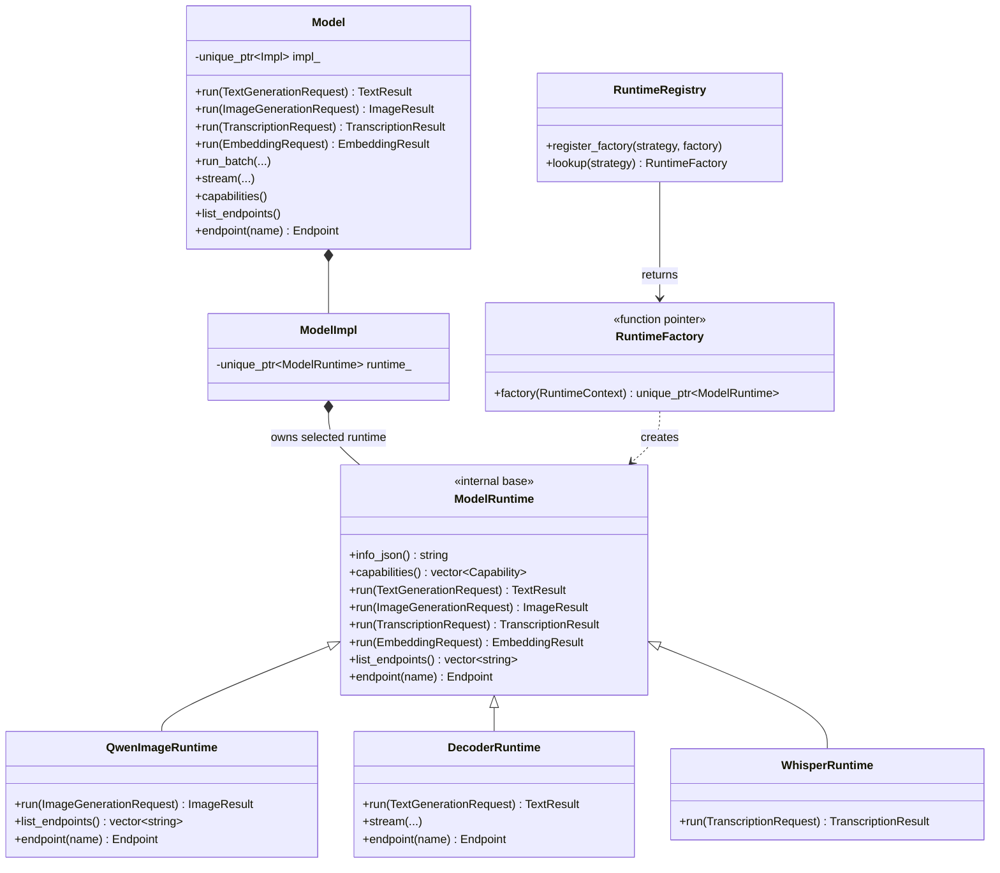
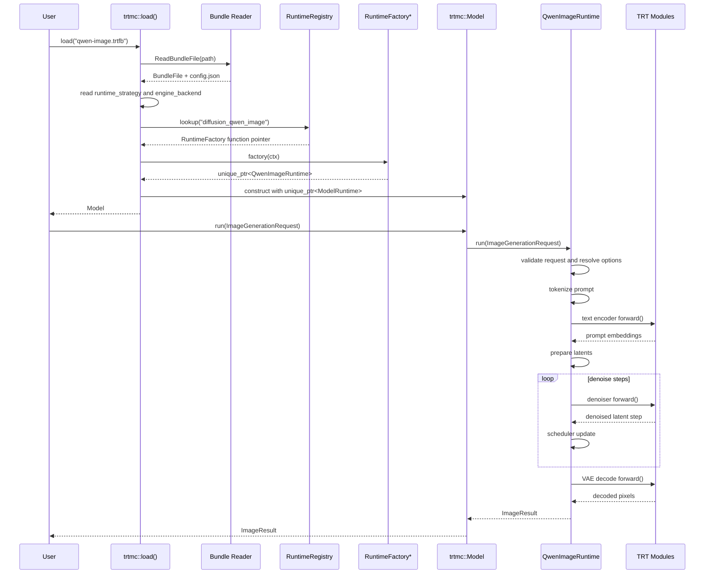

# Model API To Runtime Mapping

This is the settled KISS design for wiring one public `trtmc::Model` API to
isolated per-model runtime implementations.

## Goals

```text
One public Model API.
One selected runtime per loaded bundle.
One model-owned implementation folder per model family.
No per-model if/else in Model.
No public Pipeline type.
No plugin class unless we later need plugin metadata or lifecycle hooks.
```

## Core Shape

Users call one API:

```cpp
trtmc::Model model = trtmc::load("qwen-image.trtfb");

trtmc::ImageGenerationRequest req{"a red chair in a studio"};
req.options.width = 1024;
req.options.height = 1024;
req.options.steps = 28;

trtmc::ImageResult image = model.run(req);
```

Internally:

```text
load(bundle)
  -> read runtime_strategy
  -> registry.lookup(runtime_strategy)
  -> get RuntimeFactory function pointer
  -> runtime = factory(ctx)
  -> Model owns runtime
  -> model.run(request) forwards to runtime->run(request)
```

There is no switch statement in `Model` or `load()`.

## Class Diagram



`ModelRuntime` is internal. It can have default unsupported methods because
users never see or inherit it:

```cpp
class ModelRuntime {
  public:
    virtual ~ModelRuntime() = default;

    virtual std::string info_json() const = 0;
    virtual std::vector<Capability> capabilities() const = 0;

    virtual TextResult run(const TextGenerationRequest&) const {
        throw Error("bundle does not support text generation");
    }

    virtual ImageResult run(const ImageGenerationRequest&) const {
        throw Error("bundle does not support image generation");
    }

    virtual TranscriptionResult run(const TranscriptionRequest&) const {
        throw Error("bundle does not support transcription");
    }

    virtual EmbeddingResult run(const EmbeddingRequest&) const {
        throw Error("bundle does not support embedding");
    }

    virtual std::vector<std::string> list_endpoints() const { return {}; }

    virtual Endpoint endpoint(const std::string&) const {
        throw Error("bundle does not expose endpoints");
    }
};
```

`Model` is just a stable public handle:

```cpp
ImageResult Model::run(const ImageGenerationRequest& request) const {
    return impl_->runtime_->run(request);
}
```

## Runtime Registration

The registry stores function pointers, not plugin objects and not function
names.

```cpp
using RuntimeFactory =
    std::unique_ptr<ModelRuntime> (*)(const RuntimeContext& ctx);

class RuntimeRegistry {
  public:
    void register_factory(std::string strategy, RuntimeFactory factory) {
        factories_.emplace(std::move(strategy), factory);
    }

    RuntimeFactory lookup(const std::string& strategy) const {
        auto it = factories_.find(strategy);
        return it == factories_.end() ? nullptr : it->second;
    }

  private:
    std::unordered_map<std::string, RuntimeFactory> factories_;
};
```

Core load code calls the returned function pointer:

```cpp
RuntimeFactory factory = RuntimeRegistry::instance().lookup(strategy);
if (factory == nullptr)
    throw Error("no runtime registered for strategy: " + strategy);

std::unique_ptr<ModelRuntime> runtime = factory(ctx);
return Model(std::move(runtime));
```

The model-owned registration file provides the factory and registers the
strategy:

```cpp
namespace {

std::unique_ptr<ModelRuntime> create_qwen_image_runtime(const RuntimeContext& ctx) {
    QwenImageRuntime::Construction c;
    auto parts = load_diffusion_parts(ctx.backend, ctx.bundle, ctx.config_json,
                                      ctx.module_options);
    c.text_engine = std::move(parts.text_encoders[0].module);
    c.denoiser_engine = std::move(parts.denoiser.module);
    c.vae_decoder_engine = std::move(parts.vae.module);
    c.tokenizer = std::move(parts.tokenizer);
    c.config = QwenImageConfig::parse(ctx.config_json);
    return std::make_unique<QwenImageRuntime>(std::move(c));
}

} // namespace

void register_qwen_image_runtime(RuntimeRegistry& registry) {
    registry.register_factory("diffusion_qwen_image", &create_qwen_image_runtime);
}
```

The factory function can stay private to the model translation unit. The
generated registrar only needs to call `register_qwen_image_runtime(registry)`.

## E2E Sequence



## Current Codebase Mapping

| Proposed concept | Current equivalent | Status |
| --- | --- | --- |
| `Model` public handle | `std::unique_ptr<IPipeline>` returned by `trtmc::load()` | Need add |
| `ModelRuntime` internal base | public `IPipeline` | Need add/migrate |
| `RuntimeRegistry` | `PipelineRegistry` | Already exists conceptually |
| `RuntimeFactory` function pointer | `IPipelinePlugin*` plus `create(ctx)` | Need simplify or adapt |
| runtime strategy lookup | `lookup_plugin_or_throw(strategy)` | Already exists |
| Qwen runtime factory | `QwenImagePlugin::create(ctx)` | Existing logic, different shape |
| Qwen runtime | `QwenImagePipeline` | Existing logic, different base |
| image run call | `pipeline->generate_image(prompt, cfg)` | Existing logic, new wrapper |
| TRT execution | `TrtModule::forward()` | Already exists |

Smallest migration path:

```text
Model
  -> ModelRuntime adapter
  -> existing IPipeline
  -> existing QwenImagePipeline::generate_image()
```

That gives users the new `Model` API first. Individual model runtimes can move
from `IPipeline` to `ModelRuntime` afterward without changing the public API.

## Adding A Model

For a model that fits an existing public task:

```text
src/runtime/models/my_model/
  runtime.h
  runtime.cpp
  register.cpp
```

Implement one runtime:

```cpp
class MyModelRuntime final : public ModelRuntime {
  public:
    explicit MyModelRuntime(MyModelConstruction c);

    std::string info_json() const override;
    std::vector<Capability> capabilities() const override;
    ImageResult run(const ImageGenerationRequest& request) const override;

  private:
    std::unique_ptr<TrtModule> denoiser_;
    std::unique_ptr<TrtModule> vae_;
    MyModelConfig config_;
};
```

Implement and register one factory:

```cpp
namespace {

std::unique_ptr<ModelRuntime> create_my_model_runtime(const RuntimeContext& ctx) {
    MyModelConstruction c;
    c.denoiser = load_engine(ctx, "denoiser_plan");
    c.vae = load_engine(ctx, "vae_decoder_plan");
    c.config = MyModelConfig::parse(ctx.config_json);
    return std::make_unique<MyModelRuntime>(std::move(c));
}

} // namespace

void register_my_model_runtime(RuntimeRegistry& registry) {
    registry.register_factory("my_model_strategy", &create_my_model_runtime);
}
```

The bundle selects it with:

```json
{
  "runtime_strategy": "my_model_strategy"
}
```

No `Model::run(...)` change is needed for a new model in an existing task
family.

Core changes only when we add a new stable public task category. For example,
first-class object detection would add `DetectionRequest`, `DetectionResult`,
`Model::run(DetectionRequest)`, and `ModelRuntime::run(DetectionRequest)`.
