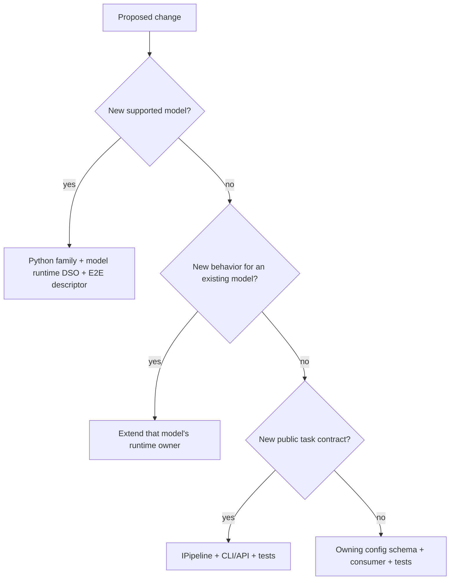

Choose the smallest extension point that matches the change.

| Goal | Extension point |
| --- | --- |
| Add a supported model, even when its task resembles an existing model | Add a Python family package, a unique model-owned runtime strategy/DSO, and an E2E descriptor. |
| Add behavior or another strategy to an existing model | Extend `src/runtime/models/<owner>/` and its `MODEL.toml`. |
| Run a new task contract or state model | Extend the public contract only if existing `IPipeline` methods cannot express it, then add the owning model implementation. |
| Add a new user-facing knob | Add a config schema and consume it in the owning unit. |
| Add a new CLI task | Add a command only when the public task cannot fit an existing command. |
| Add a new verifier | Add or extend an E2E harness plugin, comparator, or reference backend. |

Before adding a shared abstraction, verify that at least two real owners need
it. Similar implementation does not mean shared runtime identity: every
runtime strategy maps to exactly one model manifest and one model DSO. Use E2E
`task_strategy` to group different model implementations of the same
user-visible task.
