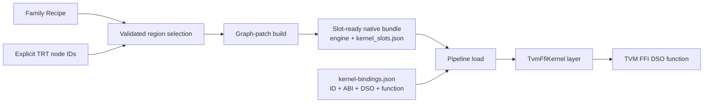

The TVM FFI kernel bridge lets a native TensorRT engine call a trusted external
GPU kernel without requiring the kernel author to write TensorRT plugin C++.
Model Connect describes the call inside the TensorRT graph with its shared
`TvmFfiKernel` plugin and invokes a function exported by a TVM FFI DSO.

This page is the feature reference. Follow
[Bring Your Own Kernel with TVM FFI](../tutorials/beginner/bring-your-own-kernel.md)
for complete Qwen, FlashInfer, and CuTe DSL examples.

## Integration modes

Model Connect exposes two related integration modes. Graph Slots have two
selection paths:

| Mode or selection path | Who defines the boundary | When the DSO is selected | Kernel artifact |
| --- | --- | --- | --- |
| Family-owned Direct Slot | The model family publishes a family-defined ABI and any model-specific glue tensors. | During `trtmc build --kernel` | The strict YAML identifies and hashes the DSO; the DSO is packaged into the bundle. |
| Graph Slot with a Recipe | The model family records an exact raw TensorRT layer interval under a conventionally versioned ID. | When a new pipeline loads | The bundle carries the serialized plugin and `kernel_slots.json` ABI descriptor but not the DSO. `kernel-bindings.json` names an external DSO. |
| Manually selected Graph Slot | The user selects explicit raw TensorRT node IDs. | When a new pipeline loads | The runtime behavior is identical to the Recipe path. |

Direct Slots are useful when a family must create a richer boundary for a
kernel. For example, a family can provide page-table inputs that are not
present at one raw TensorRT layer boundary. Switching a Direct Slot DSO
requires another bundle build.

Graph Slots are the general escape hatch. A kernel author can select a
supported raw TensorRT region without changing Model Connect or the model
family. A Recipe is only a family-owned shortcut for a known manual selection;
it adds no semantic graph, lowering map, replacement schema, or runtime path.

## Graph Slot lifecycle



The stages are:

1. `graph inspect` captures the raw TensorRT network immediately before engine
   serialization. It records deterministic node and tensor IDs for that exact
   captured build, build metadata, family Recipes, and a graph fingerprint
   without compiling a bundle.
2. A Recipe or `graph select` chooses one region. Both paths call the same
   structural validator and write a selection receipt.
3. `build --recipe` or `build --graph-patch` rebuilds the same graph, verifies
   its fingerprint and boundary, replaces the region with `TvmFfiKernel`, and
   serializes the fixed engine. The bundle receives a strict
   `kernel_slots.json` section; the external DSO is not included.
4. Pipeline loading validates `kernel-bindings.json`, loads the named DSO
   through TVM FFI, resolves its exported function, and makes that function
   available while TensorRT deserializes the plugin.
5. Each plugin invocation wraps its TensorRT buffers as linear CUDA
   `DLTensor` values, installs TensorRT's current CUDA stream as the TVM FFI
   environment stream, calls the function, and restores the previous stream.

The engine and graph ABI do not change when a compatible DSO is selected.
Another pipeline can therefore load the same slot-ready bundle with a
different ABI-compatible implementation. An existing pipeline keeps the
function captured during its own load; it cannot be rebound in place.

## Selection modes

### Family Recipe

A model family can wrap a known raw TensorRT layer interval with
`graph_recipe_region()`. It supplies:

- a conventionally versioned Recipe ID;
- an explicit instance ID;
- the exact layer interval;
- workspace size;
- fixed extra arguments;
- an optional dynamic-output shape rule.

The family owns those declarations alongside its graph construction. Other
families and ordinary builds do not share or consume that Recipe. Users can
list the recorded instances with `trtmc graph recipes` and build one exact
instance with `trtmc build --recipe`.

### Manual raw-graph selection

The advanced path exposes raw TensorRT nodes:

```text
trtmc graph inspect  ->  trtmc graph list  ->  trtmc graph select
```

`graph list --match` filters displayed IDs, operation strings, and layer names;
it does not select or rewrite the graph. `graph select --nodes` accepts only
the explicit IDs supplied by the user.

Operation strings and layer names are inspection aids. Parser-created or
otherwise raw TensorRT layers may expose only their base `LayerType`, so Model
Connect does not treat those strings as a semantic attention or operator
contract. The ordered boundary tensors in the selection receipt are the
kernel contract.

## Graph Slot ABI

The selection receipt fixes this call order:

1. boundary input `DLTensor` pointers in `input_tensor_ids` order;
2. one CUDA `uint8` workspace `DLTensor` when `workspace_bytes` is nonzero;
3. boundary output `DLTensor` pointers in `output_tensor_ids` order;
4. fixed `none`, `int`, `float`, or null `ptr` arguments in `extra_args` order.

The ABI SHA-256 is derived from:

- each ordered input and output dtype and shape;
- linear tensor format;
- workspace size;
- fixed extra arguments;
- the dynamic-output shape rule, when present.

It is a hash of the call contract, not the DSO. It does not authenticate the
library or introspect the exported function's signature. Different
implementations may use the same ABI hash, and the kernel author remains
responsible for implementing the exact ordered contract.

A Graph Slot runtime manifest has exactly these fields:

```json
{
  "schema_version": 1,
  "bindings": [
    {
      "id": "qwen.decode_logits_copy@1",
      "abi_sha256": "<selection ABI SHA-256>",
      "library": "./kernel.so",
      "function": "run"
    }
  ]
}
```

The library path is relative to the manifest. Graph Slot manifests
intentionally contain no DSO or library hash, so an ABI-compatible kernel can
be changed at the next pipeline load without rebuilding the bundle.

## Direct Slot contract

Direct Slot availability is family-owned. `trtmc kernel slots MODEL` is the
source of truth for the selected model; at this revision Qwen publishes the
`qwen.decode_attention@1` slot.

The strict YAML has this shape:

```yaml
schema_version: 1
slot: qwen.decode_attention@1
instances:
  ids:
    - decoder.layers.0.decode_attention
kernel:
  library: ./kernel.so
  sha256: <lowercase DSO SHA-256>
  function: run
```

`instances` accepts either a non-empty `ids` list or `all: true` together with
a positive `expect_count`. The build fails if the family does not publish the
slot, an instance is missing, the number of matches differs, the YAML contains
unknown fields, or the DSO content does not match the declared SHA-256.

The Direct Slot call order is:

1. family-defined input `DLTensor` pointers;
2. an optional workspace `DLTensor`;
3. family-defined output `DLTensor` pointers;
4. model arguments supplied by the family glue.

The DSO SHA-256 provides content identity for the build and packaged artifact.
It is not a code signature or provenance check. The resulting bundle embeds
the DSO, so selecting another implementation requires another build.

## Artifacts

| Artifact | Purpose |
| --- | --- |
| `*.graph.json` | Raw TensorRT snapshot, graph fingerprint, build metadata, and any family Recipes. |
| `*.selection.json` | Selected node IDs, ordered boundary tensors, binding ID, engine role, workspace, extra arguments, shape rule, and ABI hash. |
| Slot-ready `*.trtfb` | Fixed TensorRT engine containing `TvmFfiKernel` plus one `kernel_slots.json` ABI descriptor. |
| `kernel-bindings.json` | Load-time mapping from the bundle's slot ID and ABI to a relative DSO and exported function. |
| TVM FFI DSO | Trusted native implementation exported by CUDA C++, CuTe DSL, FlashInfer, or another TVM FFI-compatible tool. |

The Direct Slot path instead uses one strict YAML file to select family-owned
instances and identify the DSO, function, and DSO SHA-256. Its DSO is packaged
with the bundle and is not load-time swappable.

## CLI and C++ surfaces

| Surface | Purpose |
| --- | --- |
| `trtmc kernel slots MODEL` | List family-owned Direct Slot contracts and instances. |
| `trtmc build MODEL --kernel kernel.yaml` | Build a Direct Slot DSO into a native bundle. |
| `trtmc graph inspect` | Capture one raw TensorRT engine role without compiling a bundle. |
| `trtmc graph list` | Display raw nodes, operations, names, and tensor edges. |
| `trtmc graph recipes` | List exact Recipe IDs and instances recorded by the family. |
| `trtmc graph select` | Validate explicit node IDs and write a Graph Slot selection receipt. |
| `trtmc build MODEL --recipe ID INSTANCE` | Capture, resolve, validate, and graph-patch one Recipe instance. |
| `trtmc build MODEL --graph-patch region.json` | Build a manually selected Graph Slot into a slot-ready bundle. |
| `trtmc TASK BUNDLE --kernel-bindings FILE` | Bind the external DSO for a task command that constructs a pipeline, such as `run` or `embed`. |
| `trtmc::load(bundle, options, bindings_path)` | Bind a Graph Slot through the additive C++ load overload. |
| `PipelineFactory::from_bundle_pool(..., bindings_path)` | Bind a Graph Slot while constructing a C++ pipeline pool. |

See the [CLI Reference](../api/cli-reference.md) for complete argument syntax
and [Bundle Format](../architecture/bundle-format.md) for the serialized
runtime contract.

## Fail-closed validation

Graph Slot selection rejects:

- empty, disconnected, or non-convex regions;
- a region with more than one boundary output;
- a region that replaces a network output;
- existing plugin, control-flow, or collective layers;
- shape tensors or host tensors;
- a dynamic output without an exact boundary input carrying the same dtype and
  shape.

Rebuilding rejects a stale graph fingerprint, different engine role, changed
boundary, changed ABI, or incompatible replacement output. Pipeline loading
rejects missing or extra bindings, unknown manifest fields, duplicate IDs,
ABI mismatches, absolute or unresolved library paths, missing functions, and
a slot-ready bundle without a binding manifest. The complete manifest is
validated before any DSO is loaded.

## Current Graph Slot limits

- Graph Slots require a native TensorRT bundle and a build with TVM FFI
  support. TensorRT-RTX and optimized-runtime bundles are not supported.
- Quantized and tensor-parallel Graph Slot builds are rejected.
- Version 1 replaces one connected, convex region with exactly one output in
  one engine role and writes exactly one slot per bundle.
- Boundary tensors must use linear format, rank 8 or lower, and BF16, FP16,
  FP32, or INT32.
- The selection is valid only for the captured graph fingerprint and build
  metadata. Recapture after changing graph-producing code or build options.
- Binding occurs only during pipeline loading. There is no in-place hot swap
  for a running pipeline.
- Version 1 requires the selected engine to deserialize during the pipeline
  load call. Deferred engine deserialization fails closed.
- The CLI and additive C++ load overload accept Graph Slot bindings. The
  current C-linkage API does not.

:::warning Trusted native code
A DSO executes native code in the Model Connect process. Model Connect rejects
a binding manifest whose declared ABI hash does not match the bundle, but it
cannot verify that the DSO actually implements that contract. This is not a
sandbox, signature check, or code provenance check. Load only libraries you
trust.
:::

Loading successfully proves only that the manifest's declared ABI matched the
slot and that the named function was found. Compare output against the native
bundle and benchmark the complete workload before accepting a replacement
kernel.
