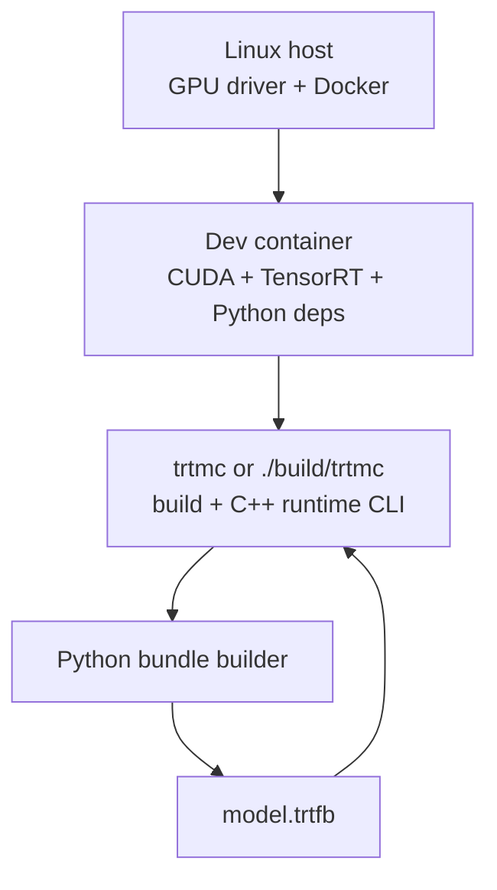

This page is the first-run contract. Complete it before building a model bundle.

## The Stack In One Picture



| Layer | Why it exists | What usually fails here |
| --- | --- | --- |
| NVIDIA driver | Lets containers use the GPU. | `nvidia-smi` fails or no GPU appears in Docker. |
| Docker + NVIDIA Container Toolkit | Gives a repeatable CUDA/TensorRT environment. | Container launches without GPU access. |
| Python builder environment | Resolves Hugging Face models and builds bundles. | Missing `transformers`, TensorRT Python package, model auth, or network/cache access. |
| C++ runtime environment | Loads bundle metadata and either native model/backend DSOs or an optimized bundle's embedded implementation DSO. | Missing shared libraries, native TensorRT ABI/backend mismatch, or optimized descriptor/artifact/factory identity mismatch. |
| Hugging Face cache | Stores downloaded model files. | First run is slow, offline build fails, gated model needs login/token. |

## 1. Start The Dev Container

From the repository root on the host:

```bash
./scripts/docker_build_gb300.sh
./scripts/docker_run_gb300.sh
```

Then enter the container shell created by the script. In agent workspaces, the running container may be named `trtf-dev-gb300-agent-N` instead of `trtf-dev-gb300`. Source-build commands in the website assume you are inside the matching container.

:::warning Host versus container
If `./build/trtmc --help` fails on the host with `libtorch.so: cannot open shared object file`, you are outside the runtime environment used by these tutorials. Enter the dev container or export the same library paths used there.
:::

## 2. Install The Builder And Build The Runtime

Inside the container:

```bash
pip install -e . -C py-only=true
cmake -S . -B build -DCMAKE_BUILD_TYPE=Release
cmake --build build -j
```

If the dev image already has all Python dependencies installed and you are intentionally avoiding dependency resolution, this shorter install is acceptable:

```bash
pip install --no-deps -e . -C py-only=true
```

Do not use `--no-deps` in a fresh Python environment. The builder depends on
packages such as `safetensors`, `numpy`, `ml_dtypes`, `onnx`, `onnxscript`,
`transformers`, and `tensorrt`. Use `--no-deps` only when the dev image already
provides those packages.

## 3. Prove The Tools Work

Run these commands before building a model:

```bash
python -c "import transformers, tensorrt; print('python inference deps ok')"
./build/trtmc version
./build/trtmc --help
```

Expected signals:

```text
python inference deps ok
trtmc 0.1.0
TRT support: yes
Usage:
  trtmc build ...
  trtmc run ...
```

If `./build/trtmc version` fails, debug the C++ runtime environment. If `./build/trtmc build ...` fails, debug Python dependencies, model resolution, or TensorRT build errors.

## 4. Know What The First Model Build Does

The quick-start model is:

```text
Qwen/Qwen3-0.6B
```

On the first build, `./build/trtmc build` may download model files from Hugging Face into the cache visible inside the container. Expect network access, cache writes, GPU memory use during TensorRT build, and a build time that is much longer than normal program startup.

For gated or private models, log in or provide the required Hugging Face token before running `./build/trtmc build`.

## 5. First-Failure Triage

| Symptom | Likely boundary | Next check |
| --- | --- | --- |
| Docker cannot see the GPU | Host/container setup | `nvidia-smi` on host and inside container. |
| `ModuleNotFoundError` during build | Python builder env | Use `pip install -e . -C py-only=true` without `--no-deps`, or install the missing package in the container. |
| Hugging Face 401/403/not found | Model resolution | Check model ID, network, auth token, and gated model access. |
| CMake cannot find CUDA headers or `cudart` | Native build env | Confirm CUDA development files are installed in the container. |
| `libtorch.so` missing for `./build/trtmc` | Runtime library path | Run inside container or export the container's library paths. |
| TensorRT ABI mismatch | Bundle/runtime compatibility | Rebuild the bundle in the same TensorRT environment or load the matching backend DSO. |
| `No plugin registered for runtime_strategy` | Model-plugin discovery | Confirm the strategy has a manifest owner and its model DSO is available in the configured search paths. |

Once this page passes, continue to [Quick Start](quick-start.md).
