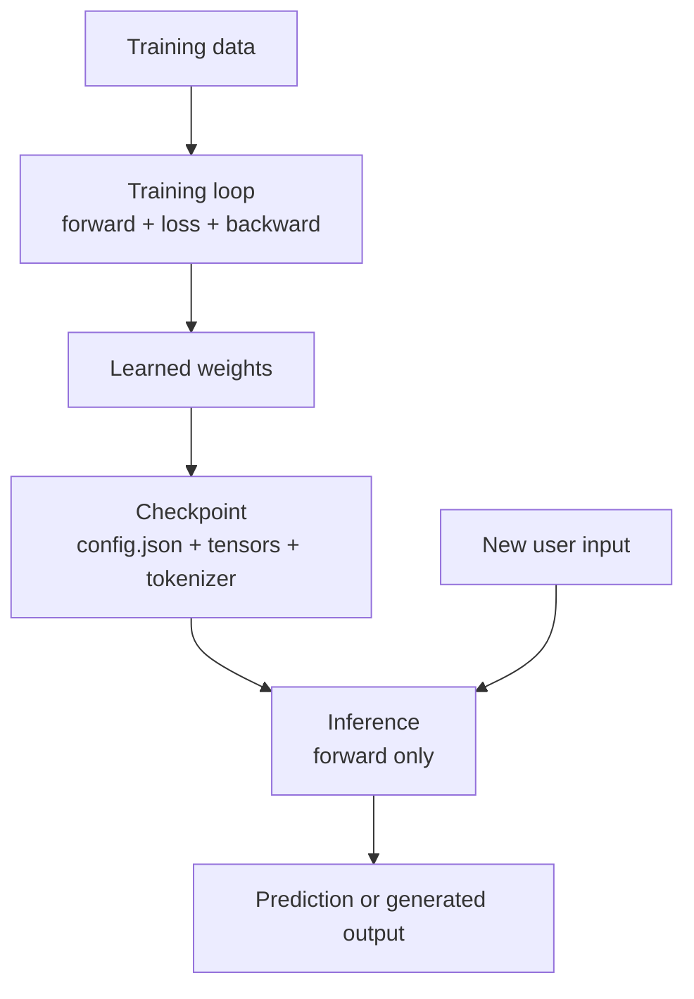
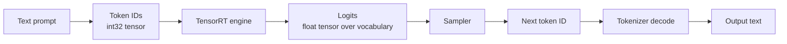
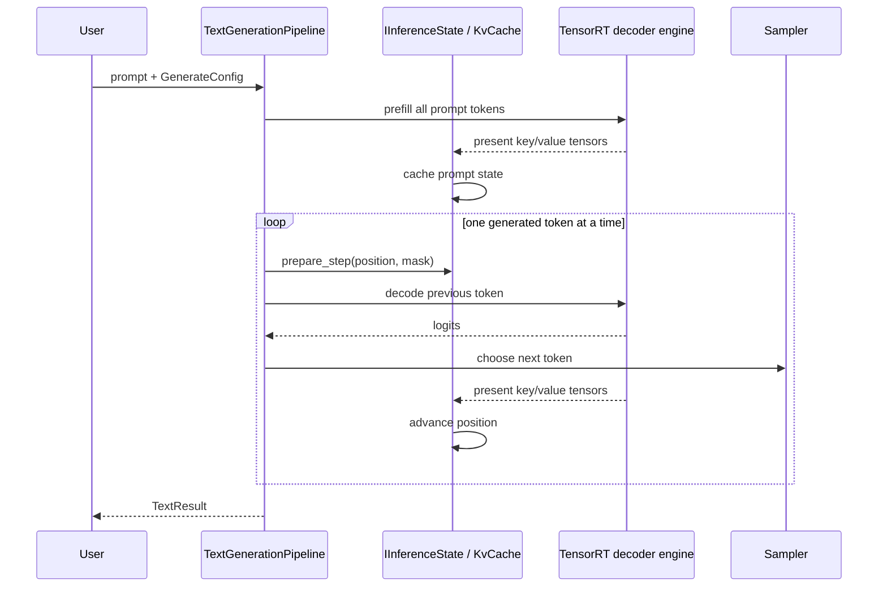
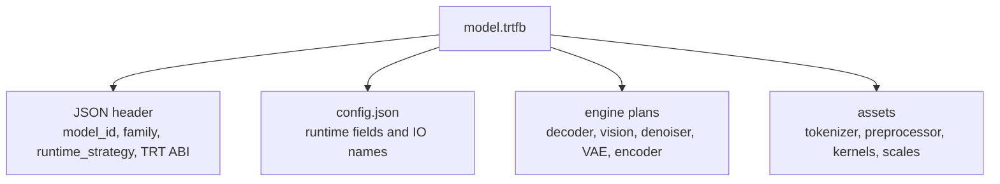
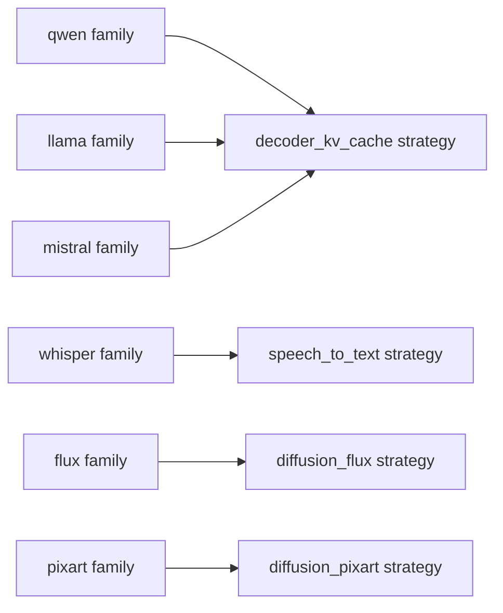

import useBaseUrl from '@docusaurus/useBaseUrl';


This page explains the vocabulary behind TensorRT-Model-Connect. It assumes no prior deep learning inference background.

## Training versus inference

Training is the process that creates model weights. Inference is the process that uses those weights to answer a new request.

A forward pass means running input numbers through the model to produce output numbers. During training, the system also computes a loss value that measures error and then runs a backward pass to update weights. During inference, weights are fixed, so only the forward computation is needed.

<figure className="trtmc-diagram trtmc-diagram--wide">
  <div className="trtmc-diagram__media">
    
  </div>
  <figcaption>The `.trtfb` bundle is the handoff between Python model conversion and native C++ inference.</figcaption>
</figure>



TensorRT-Model-Connect does not train models. It starts with a trained model checkpoint and focuses on making inference deployable.

## What is a model checkpoint?

A checkpoint is the saved state of a trained model. HuggingFace-style checkpoints normally contain:

| File or concept | Meaning |
| --- | --- |
| `config.json` | Architecture settings such as hidden size, layer count, attention heads, vocabulary size, and model type. |
| Weight files | Large tensors that store the learned parameters. These are usually `.safetensors`, `.bin`, or sharded files. |
| Tokenizer files | Rules for converting text to token IDs and token IDs back to text. |
| Preprocessor files | Image, audio, or feature extraction settings for non-text models. |
| Model library code | Python classes that know how to wire the architecture together. |

The checkpoint is not the same thing as a TensorRT engine. A checkpoint is a portable model description plus weights. A TensorRT engine is a compiled execution plan for a particular runtime environment.

## What is a tensor?

A tensor is a typed, rectangular block of numbers. You can think of it as a generalization of arrays:

| Shape example | Common meaning |
| --- | --- |
| `[sequence]` | Token IDs for one text prompt. |
| `[batch, sequence]` | Token IDs for several prompts. |
| `[batch, sequence, hidden]` | Embeddings or hidden states. |
| `[channels, height, width]` | Image pixels or feature maps. |
| `[frames, features]` | Audio features such as mel spectrogram frames. |

Shape words have specific meanings:

| Shape word | Meaning |
| --- | --- |
| `batch` | How many independent examples are processed together. |
| `sequence` | How many tokens or time steps are in one example. |
| `hidden` | The model's internal feature width. |
| `channels` | Per-pixel feature planes such as red/green/blue. |
| `features` | Numeric measurements per time step, such as mel audio bins. |

In this codebase:

- `trtmc::Tensor` is a CPU-side non-owning view.
- `trtmc::DeviceTensor` owns GPU memory.
- `TensorMap` maps names such as `token_id`, `attention_mask`, or `logits` to tensors.
- TensorRT engines consume named input tensors and produce named output tensors.

<figure className="trtmc-diagram trtmc-diagram--wide">
  <div className="trtmc-diagram__media">
    
  </div>
  <figcaption>Text generation is a prefill pass followed by repeated decode steps that reuse the KV cache.</figcaption>
</figure>



## What are tokens and logits?

Large language models do not operate directly on strings. A tokenizer breaks text into token IDs. The model predicts a score for every possible next token. Those scores are called logits.

For a prompt such as:

```text
The capital of France is
```

the model produces one logit value per vocabulary entry. A sampler converts those logits into one selected next token. Greedy sampling chooses the highest-score token. Top-k and top-p sampling choose from a restricted probability distribution, which can produce more varied text.

## Prefill, decode, and KV cache

Autoregressive text generation has two phases:

1. Prefill reads the full prompt and creates internal attention state.
2. Decode generates one token at a time, reusing that state.

The reusable attention state is the KV cache. Without a KV cache, every generated token would have to recompute attention over the whole prompt and all previously generated tokens.



In the source tree, this abstraction is `IInferenceState`. Attention models use `KvCache`; recurrent or state-space models use `RecurrentState`; hybrid models can compose both.

## What TensorRT changes

PyTorch or Transformers runs a model through general-purpose framework operators. TensorRT compiles a fixed graph into an engine plan optimized for GPU inference. That gives the runtime a smaller, faster execution artifact, but the artifact is also more specific:

| PyTorch checkpoint | TensorRT engine plan |
| --- | --- |
| Portable across many machines if the Python stack supports it. | Built for a TensorRT/CUDA/GPU compatibility target. |
| Flexible and easy to debug. | Optimized and less dynamic. |
| Usually loads original Python model code. | Runs serialized engine bytes through TensorRT runtime APIs. |
| Good for experimentation. | Good for deployment once shapes and behavior are known. |

TensorRT-Model-Connect keeps the checkpoint-facing complexity in Python and the request-time execution in C++.

## Why bundles exist

The `.trtfb` bundle is the handoff between build and runtime.



A bundle lets a C++ process load a model without rediscovering the original HuggingFace structure. The runtime still may need helper assets for tokenization or verification, but engine execution is driven by the bundle.

## Model family versus runtime strategy

Two names matter:

| Name | Example | Meaning |
| --- | --- | --- |
| Family plugin | `qwen`, `llama`, `whisper`, `flux`, `pixart` | Python build-time adapter that understands a model family's config and weights. |
| Runtime strategy | `decoder_kv_cache`, `speech_to_text`, `diffusion_flux`, `diffusion_pixart` | C++ dispatch key that selects the runtime plugin and pipeline shape. |

Many families can share one runtime strategy. Qwen, LLaMA, Mistral, GPT-2, OPT, Bloom, and other decoder-only families can route through `decoder_kv_cache` because their request-time behavior is the same: tokenize prompt, run decoder, sample tokens, update cache.



That separation is the key extensibility idea in this repository.

## What to learn next

After this page:

- Use [Quick Start](quick-start.md) to build and run one bundle.
- Use [Beginner Text Generation](../tutorials/beginner/text-generation.md) to follow every step of decoder inference.
- Use [Architecture Overview](../architecture/overview.md) to map these concepts to the actual source files.
