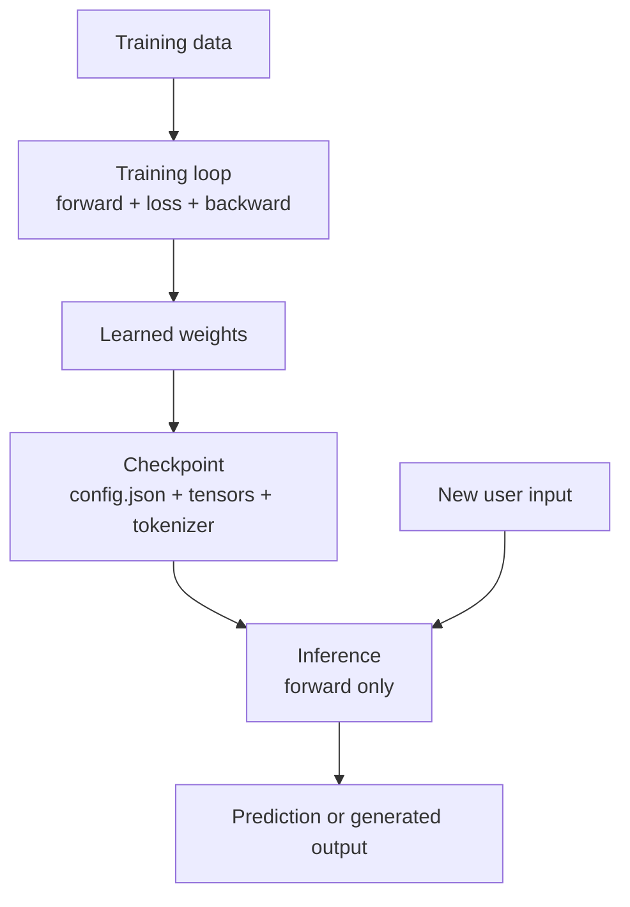
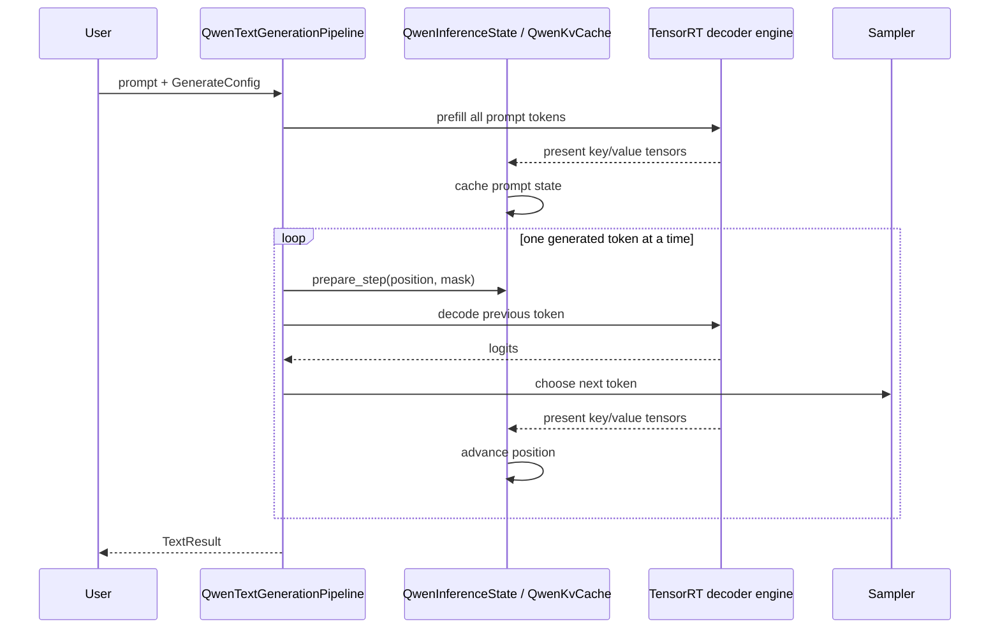
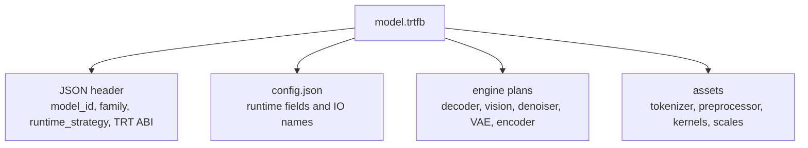
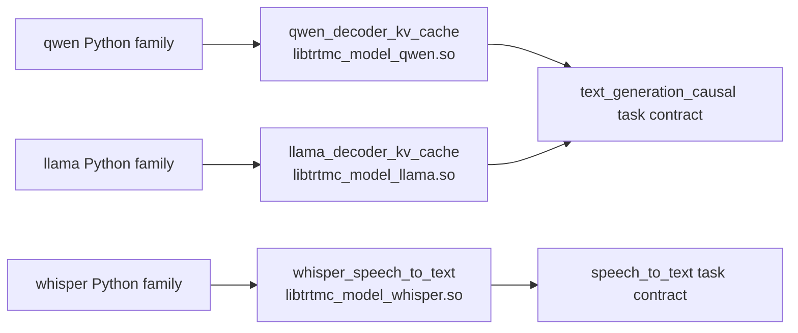

import useBaseUrl from '@docusaurus/useBaseUrl';


This page explains the vocabulary behind TensorRT-Model-Connect. It assumes no prior deep learning inference background.

## Training versus inference

Training is the process that creates model weights. Inference is the process that uses those weights to answer a new request.

A forward pass means running input numbers through the model to produce output numbers. During training, the system also computes a loss value that measures error and then runs a backward pass to update weights. During inference, weights are fixed, so only the forward computation is needed.



TensorRT-Model-Connect does not train models. It starts with a trained model checkpoint and focuses on making inference deployable.

## What is a model checkpoint?

A checkpoint is the saved state of a trained model. Hugging Face-style checkpoints normally contain:

| File or concept | Meaning |
| --- | --- |
| `config.json` | Architecture settings such as hidden size, layer count, attention heads, vocabulary size, and model type. |
| Weight files | Large tensors that store the learned parameters. These are usually `.safetensors`, `.bin`, or sharded files. |
| Tokenizer files | Rules for converting text to token IDs and token IDs back to text. |
| Preprocessor files | Image, audio, or feature extraction settings for non-text models. |
| Model library code | Python classes that know how to wire the architecture together. |

The checkpoint is not the same thing as a TensorRT engine. A checkpoint is a portable model description plus weights. A TensorRT engine is a compiled execution plan for a particular runtime environment.

## What is a tensor?

A tensor is a typed, rectangular block of numbers. You can think of it as a generalization of arrays:

| Shape example | Common meaning |
| --- | --- |
| `[sequence]` | Token IDs for one text prompt. |
| `[batch, sequence]` | Token IDs for several prompts. |
| `[batch, sequence, hidden]` | Embeddings or hidden states. |
| `[channels, height, width]` | Image pixels or feature maps. |
| `[frames, features]` | Audio features such as mel spectrogram frames. |

Shape words have specific meanings:

| Shape word | Meaning |
| --- | --- |
| `batch` | How many independent examples are processed together. |
| `sequence` | How many tokens or time steps are in one example. |
| `hidden` | The model's internal feature width. |
| `channels` | Per-pixel feature planes such as red/green/blue. |
| `features` | Numeric measurements per time step, such as mel audio bins. |

In this codebase:

- `trtmc::Tensor` is a CPU-side non-owning view.
- `trtmc::DeviceTensor` owns GPU memory.
- `TensorMap` maps names such as `token_id`, `attention_mask`, or `logits` to tensors.
- TensorRT engines consume named input tensors and produce named output tensors.

<figure className="trtmc-diagram trtmc-diagram--wide">
  <div className="trtmc-diagram__media">
    
  </div>
  <figcaption>Text generation is a prefill pass followed by repeated decode steps that reuse the KV cache.</figcaption>
</figure>


## What are tokens and logits?

Large language models do not operate directly on strings. A tokenizer breaks text into token IDs. The model predicts a score for every possible next token. Those scores are called logits.

For a prompt such as:

```text
The capital of France is
```

the model produces one logit value per vocabulary entry. A sampler converts those logits into one selected next token. Greedy sampling chooses the highest-score token. Top-k and top-p sampling choose from a restricted probability distribution, which can produce more varied text.

## Prefill, decode, and KV cache

Autoregressive text generation has two phases:

1. Prefill reads the full prompt and creates internal attention state.
2. Decode generates one token at a time, reusing that state.

The reusable attention state is the KV cache. Without a KV cache, every generated token would have to recompute attention over the whole prompt and all previously generated tokens.



These interfaces and implementations are model-owned in the current source
tree. For example, Qwen uses `QwenInferenceState` and `QwenKvCache` under
`src/runtime/models/qwen/`; LLaMA, Mistral, recurrent, and hybrid owners keep
their corresponding state classes under their own runtime directories.

## What TensorRT changes

PyTorch or Transformers runs a model through general-purpose framework operators. TensorRT compiles a fixed graph into an engine plan optimized for GPU inference. That gives the runtime a smaller, faster execution artifact, but the artifact is also more specific:

| PyTorch checkpoint | TensorRT engine plan |
| --- | --- |
| Portable across many machines if the Python stack supports it. | Built for a TensorRT/CUDA/GPU compatibility target. |
| Flexible and easy to debug. | Optimized and less dynamic. |
| Usually loads original Python model code. | Runs serialized engine bytes through TensorRT runtime APIs. |
| Good for experimentation. | Good for deployment once shapes and behavior are known. |

TensorRT-Model-Connect keeps the checkpoint-facing complexity in Python and the request-time execution in C++.

### Hugging Face and TensorRT-Model-Connect play different roles

The project uses Hugging Face execution as a reference and
TensorRT-Model-Connect as the system under test. They start from the same model
intent, but they do not use the same artifact or dispatch path:

| Concern | Hugging Face reference | TensorRT-Model-Connect |
| --- | --- | --- |
| Model execution | A framework model runs eagerly or through framework compilation. | Python builds native TensorRT plans or invokes an exact qualified provider; C++ runs the bundle through `IPipeline`. |
| Family selection | Auto classes and checkpoint config select Python model code. | Family `MODEL.toml` descriptors and plugin matching select the owning builder. |
| Weights | Framework modules load checkpoint tensors. | A native family mapper feeds a TensorRT graph, or a qualified family adapter owns conversion. |
| Artifact | Checkpoint, config, and tokenizer files. | A self-describing `.trtfb` bundle. |
| Runtime dispatch | A Python model class. | A native strategy selects one model DSO/plugin, or `optimized_runtime.json` selects the embedded implementation DSO. |
| Validation role | External reference oracle. | Deployment system being validated. |

A bundle that builds or produces plausible output is not automatically
parity-qualified. The relevant E2E manifest chooses a task-specific comparator,
and reproducible evidence records the exact model revision, inputs, precision,
bundle, code revision, and comparison artifact.

## Why bundles exist

The `.trtfb` bundle is the handoff between build and runtime.



A bundle lets a C++ process load a model without rediscovering the original
Hugging Face structure. A native bundle carries `config.json`, TensorRT plans,
assets, and a `runtime_strategy`; an optimized-runtime bundle carries
`optimized_runtime.json`, opaque implementation metadata, and a
content-addressed artifact tree containing its exact implementation DSO. The
runtime still may need helper assets for tokenization or verification, but
execution is driven by the bundle.

## Family, runtime strategy, and task strategy

Three names matter:

| Name | Example | Meaning |
| --- | --- | --- |
| Family plugin | `qwen`, `llama`, `whisper`, `flux` | Python build-time adapter that understands one model family's config, weights, graphs, and bundle sections. |
| Native runtime strategy | `qwen_decoder_kv_cache`, `llama_decoder_kv_cache`, `whisper_speech_to_text`, `diffusion_flux` | Model-owned native C++ dispatch key. It selects exactly one runtime model DSO and then one registered `IPipelinePlugin`. |
| Optimized implementation/profile | `qwen.tensorrt-edge-llm` plus an exact qualified profile | Delegated-runtime identity embedded in the bundle. It selects an integrity-checked implementation DSO without native strategy/registry/backend dispatch. |
| Task strategy | `text_generation_causal`, `speech_to_text`, `diffusion_media_generation` | Shared E2E contract category used to choose runners, comparators, and CLI task shape. It is not runtime dispatch metadata. |

On the native path, Qwen and LLaMA both implement causal text generation, but
they deliberately do not share one runtime strategy or DSO. Their E2E manifests share
`task_strategy="text_generation_causal"` while their bundles carry
`qwen_decoder_kv_cache` and `llama_decoder_kv_cache`, respectively.



Both paths preserve the same ownership rule: implementation details stay with
the family, while shared tools reason about capability labels and task
strategies. Optimized profiles are exact model/revision/target qualifications,
not generic task strategies.

## What to learn next

After this page:

- Use [Quick Start](quick-start.md) to build and run one bundle.
- Use [Beginner Text Generation](../tutorials/beginner/text-generation.md) to follow every step of decoder inference.
- Use [Architecture Overview](../architecture/overview.md) to map these concepts to the actual source files.
