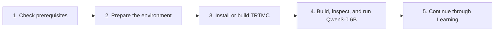

This section has one goal: get you from a new environment to one successful
NLP/text-generation request through TensorRT-Model-Connect.

Follow the pages in order. Do not start with an advanced model recipe or an
internal architecture page.



## The path

| Step | Page | You are done when |
| --- | --- | --- |
| 1 | [Prerequisites and Environment](environment-and-repro.md) | You have selected a supported wheel or source-build path, the GPU is visible, and you understand the first model's resource boundary. |
| 2 | [Installation](installation.md) | Either `trtmc version` or `./build/trtmc version` succeeds in the environment where you will build and run the model. |
| 3 | [Quick Start](quick-start.md) | You have built and inspected `Qwen3-0.6B.trtfb`, then received generated text from the native C++ runtime. |
| 4 | [Learning Path](../learning-path.md) | You can choose the next tutorial without repeating the setup or first build. |

Keep the [Glossary](glossary.md) open when a term is unfamiliar. You do not
need to memorize it before starting.

## What the first run proves

The Quick Start uses one public Hugging Face checkpoint and the repository's
model-owned Qwen path:

```text
Qwen/Qwen3-0.6B
  -> Python family resolution and TensorRT build
  -> Qwen3-0.6B.trtfb
  -> native C++ runtime
  -> deterministic generated text
```

A successful run proves that this environment can resolve the checkpoint,
build a bundle, load the matching runtime implementation, and execute a text
request. It does not prove that every model or hardware profile in the
inventory is supported on this machine.

## Before you continue

The first build downloads model files unless they are already cached and
compiles TensorRT engines. It is much slower and more resource-intensive than
normal application startup.

The default dense Qwen3 path uses the checkpoint's full 40,960-token context.
Its physical BF16 KV allocation alone is 4.375 GiB; model weights, TensorRT
plans, build workspace, and runtime allocations require additional memory and
disk. Use the supported development environment and do not treat 4.375 GiB as
a total GPU-memory requirement.

If your machine does not match one of the installation paths, stop at
[Prerequisites and Environment](environment-and-repro.md). A profile described
as qualified for another machine is not a general compatibility promise.
