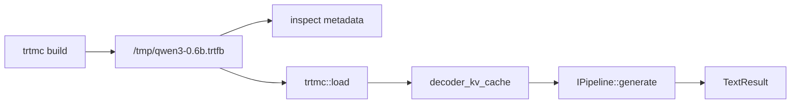

This quick start builds one text-generation bundle, inspects it, and runs it through the C++ runtime.

Complete [Installation](installation.md) first. If you installed a release
wheel, the command is `trtmc`. If you built from source in the dev container,
the command is `./build/trtmc`.

```bash
TRTMC=trtmc
# Source build alternative:
# TRTMC=./build/trtmc
```

## 1. Prove The Tools Are Available

```bash
$TRTMC version
```

Expected signals:

```text
trtmc 0.1.0
TRT support: yes
```

If source-built `./build/trtmc` fails with a missing shared library, you are
probably outside the dev container or missing its runtime library paths.
If `trtmc` from a wheel fails, check that you installed the
`manylinux_2_39_aarch64` wheel for your Python version and that the host has
compatible NVIDIA driver/CUDA runtime libraries.

## 2. Build A Bundle

```bash
$TRTMC build Qwen/Qwen3-0.6B \
  -o /tmp/qwen3-0.6b.trtfb \
  --precision fp16 \
  --max-cache-length 256
```

`trtmc build` resolves the HuggingFace model, selects the matching Python family plugin, builds TensorRT engine plan bytes, and writes a self-contained `.trtfb` bundle.

First builds can be slow because the builder may download model files and compile TensorRT engines. If the command fails before TensorRT starts, check model ID, HuggingFace auth, network/cache, and Python dependencies first.

## 3. Inspect The Bundle

Inspect the bundle:

```bash
$TRTMC inspect /tmp/qwen3-0.6b.trtfb
$TRTMC inspect /tmp/qwen3-0.6b.trtfb --list-engines
```

Expected fields include:

```text
Model ID:           Qwen/Qwen3-0.6B
Family:             qwen
Runtime strategy:   decoder_kv_cache
Precision:          fp16
```

Inspection should become the first debugging habit. The important fields are `family`, `precision`, `runtime_strategy`, engine sections, tokenizer assets, and TensorRT compatibility metadata.

## 4. Run Deterministic Inference

```bash
$TRTMC run /tmp/qwen3-0.6b.trtfb \
  --prompt "What is the capital of France? Answer in one word." \
  --max-new-tokens 10 \
  --greedy
```

`--greedy` makes the smoke test deterministic: each step chooses the highest-score token instead of sampling randomly. For Qwen3-0.6B, the runtime should log `Using native BPE tokenizer`; no `--hf-python` path is needed for this text-generation smoke test.

Add `--hf-python /opt/venv/bin/python` only when a runtime strategy still needs helper Python code, such as speech-to-speech prompt handling or a legacy fallback path.

## 5. Interpret The Result

If generation succeeds, you have proven this path:



If generation fails, classify the failure before changing code:

| Failure | Usually means |
| --- | --- |
| Build cannot download model | HuggingFace model ID, auth, network, or cache problem. |
| Build fails inside TensorRT | Unsupported graph, shape/profile issue, or TensorRT environment issue. |
| Inspection fails | Bundle was not written correctly, the path is wrong, or the runtime library environment is incomplete. |
| Runtime says no plugin registered | The binary was built without the plugin for the bundle's `runtime_strategy`. |
| Output differs between runs | Sampling is enabled. Use `--greedy` or a fixed `--seed` for smoke tests. |

## Wan2.2 720p Video In Two Commands

Install the `wan` build extra once (for a source checkout, use
`pip install -e '.[wan]' -C py-only=true`). It supplies PyTorch only for
reading the official T5/VAE checkpoint files during bundle creation; the
generated bundle runs through the native C++/TensorRT runtime.

```bash
$TRTMC build Wan-AI/Wan2.2-TI2V-5B -o /tmp/wan22-ti2v-5b.trtfb

$TRTMC generate-video /tmp/wan22-ti2v-5b.trtfb \
  --prompt "Two anthropomorphic cats boxing on a spotlighted stage" \
  --output /tmp/wan22-frames \
  --seed 42
```

No checkpoint path, plugin path, backend directory, or build-method selector
is required. The first command downloads the checkpoint through the standard
Hugging Face cache and selects the family-owned BF16 default.

The builder creates TensorRT-native plans for UMT5, DiT, and both VAE stages.
The `.trtfb` contains those plans, the tokenizer, and its config. The installed
WAN model DSO adds no direct cuDNN, cuBLASLt, NVRTC, or separately managed
companion-plugin dependency.

The customer profile is 1280x704, 121 frames, 50 steps, CFG 5, flow shift 5,
24 FPS, and a 512-token text encoder. Those values come from the bundle, so the
minimal command does not repeat them. The runtime accepts `--num-steps 50
--height 704 --width 1280` when an explicit command is useful for a comparison;
other values are rejected rather than silently running an unqualified shape.
CI additionally owns a fixed reduced L0 profile for fast smoke coverage.

### Qualified Thor FP8 performance profile

The accepted Thor performance build uses a packaged, immutable FP8 scale map,
so customers do not download or generate a separate quantization JSON. Pin the
qualified checkpoint revision and add `--fp8`:

```bash
$TRTMC build Wan-AI/Wan2.2-TI2V-5B \
  --model-revision 921dbaf3f1674a56f47e83fb80a34bac8a8f203e \
  --fp8 \
  -o /tmp/wan22-ti2v-5b-fp8.trtfb

TRTMC_WAN22_EASYCACHE=1 \
TRTMC_WAN22_EASYCACHE_THRESHOLD=1.0 \
TRTMC_WAN22_EASYCACHE_FIRST_EXACT_STEPS=7 \
TRTMC_WAN22_EASYCACHE_LAST_EXACT_STEPS=2 \
TRTMC_WAN22_EASYCACHE_MAX_CONSECUTIVE_REUSE=4 \
TRTMC_WAN22_EASYCACHE_LATE_CFG=1 \
TRTMC_PNG_WRITE_WORKERS=8 \
$TRTMC generate-video /tmp/wan22-ti2v-5b-fp8.trtfb \
  --prompt "Two anthropomorphic cats in comfy boxing gear and bright gloves fight intensely on a spotlighted stage" \
  --output /tmp/wan22-fp8-frames \
  --num-steps 50 \
  --guidance-scale 5 \
  --height 704 \
  --width 1280 \
  --seed 42
```

The JSON is a fixed offline PyTorch-collected map, not ModelOpt output or
runtime auto-calibration. It covers the full 50-step conditional and
unconditional trajectory for the prompt and seed above: activation scales are
`amax * 1.10 / 448`, and weight scales are `maxabs / 448`. The exact checkpoint
files and scale asset are SHA256-checked before the optimized build.

The packaged scale asset is selected only for the pinned checkpoint, the
official 1280x704/121-frame/50-step profile, and the GB300 calibration platform
or integrated SM 11.0 Thor target. Omitting `--fp8` keeps the existing BF16
build on other platforms. TensorRT plans remain target-specific and must be
rebuilt on each machine; the scale JSON itself is checkpoint/profile data and
does not make Wan2.2 Thor-only. The aggressive EasyCache settings above are
additionally runtime-gated to the official profile on integrated SM 11.0 Thor.
The accepted visual receipt is this prompt/seed on Thor with TensorRT
11.2.0.113 and CUDA 13.4.46; other prompts and software versions are not claimed
by that single run.

## What To Read Next

- [Build and Run](build-and-run.md) covers common tasks for text, vision-language, audio, diffusion, segmentation, and time-series bundles.
- [Model Support](model-support.md) explains the current supported model surface from the manifest set.
- [Inspect Bundles](../tutorials/beginner/inspect-bundles.md) teaches the artifact-debugging workflow.
- [CLI Reference](../api/cli-reference.md) lists the build and runtime command surfaces.
