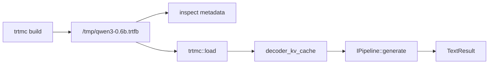

This quick start builds one text-generation bundle, inspects it, and runs it through the C++ runtime.

Complete [Installation](installation.md) first. If you installed a release
wheel, the command is `trtmc`. If you built from source in the dev container,
the command is `./build/trtmc`.

```bash
TRTMC=trtmc
# Source build alternative:
# TRTMC=./build/trtmc
```

## 1. Prove The Tools Are Available

```bash
$TRTMC version
```

Expected signals:

```text
trtmc 0.1.0
TRT support: yes
```

If source-built `./build/trtmc` fails with a missing shared library, you are
probably outside the dev container or missing its runtime library paths.
If `trtmc` from a wheel fails, check that you installed the
`manylinux_2_39_aarch64` wheel for your Python version and that the host has
compatible NVIDIA driver/CUDA runtime libraries.

## 2. Build A Bundle

```bash
$TRTMC build Qwen/Qwen3-0.6B \
  -o /tmp/qwen3-0.6b.trtfb \
  --precision fp16 \
  --max-cache-length 256
```

`trtmc build` resolves the HuggingFace model, selects the matching Python family plugin, builds TensorRT engine plan bytes, and writes a self-contained `.trtfb` bundle.

First builds can be slow because the builder may download model files and compile TensorRT engines. If the command fails before TensorRT starts, check model ID, HuggingFace auth, network/cache, and Python dependencies first.

## 3. Inspect The Bundle

Inspect the bundle:

```bash
$TRTMC inspect /tmp/qwen3-0.6b.trtfb
$TRTMC inspect /tmp/qwen3-0.6b.trtfb --list-engines
```

Expected fields include:

```text
Model ID:           Qwen/Qwen3-0.6B
Family:             qwen
Runtime strategy:   decoder_kv_cache
Precision:          fp16
```

Inspection should become the first debugging habit. The important fields are `family`, `precision`, `runtime_strategy`, engine sections, tokenizer assets, and TensorRT compatibility metadata.

## 4. Run Deterministic Inference

```bash
$TRTMC run /tmp/qwen3-0.6b.trtfb \
  --prompt "What is the capital of France? Answer in one word." \
  --max-new-tokens 10 \
  --greedy
```

`--greedy` makes the smoke test deterministic: each step chooses the highest-score token instead of sampling randomly. For Qwen3-0.6B, the runtime should log `Using native BPE tokenizer`; no `--hf-python` path is needed for this text-generation smoke test.

Add `--hf-python /opt/venv/bin/python` only when a runtime strategy still needs helper Python code, such as speech-to-speech prompt handling or a legacy fallback path.

## 5. Interpret The Result

If generation succeeds, you have proven this path:



If generation fails, classify the failure before changing code:

| Failure | Usually means |
| --- | --- |
| Build cannot download model | HuggingFace model ID, auth, network, or cache problem. |
| Build fails inside TensorRT | Unsupported graph, shape/profile issue, or TensorRT environment issue. |
| Inspection fails | Bundle was not written correctly, the path is wrong, or the runtime library environment is incomplete. |
| Runtime says no plugin registered | The binary was built without the plugin for the bundle's `runtime_strategy`. |
| Output differs between runs | Sampling is enabled. Use `--greedy` or a fixed `--seed` for smoke tests. |

## 6. What To Read Next

- [Build and Run](build-and-run.md) covers common tasks for text, vision-language, audio, diffusion, segmentation, and time-series bundles.
- [Model Support](model-support.md) explains the current supported model surface from the manifest set.
- [Inspect Bundles](../tutorials/beginner/inspect-bundles.md) teaches the artifact-debugging workflow.
- [CLI Reference](../api/cli-reference.md) lists the build and runtime command surfaces.
