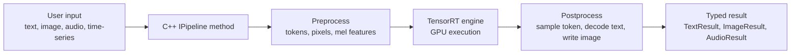
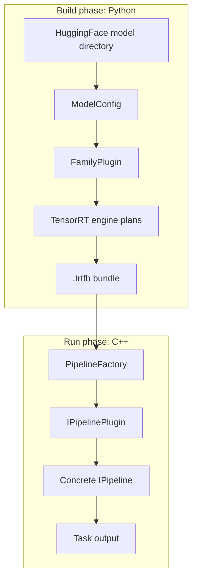

import useBaseUrl from '@docusaurus/useBaseUrl';

TensorRT-Model-Connect is a deployment stack for deep learning inference.

It has one job: take Python-first AI checkpoints, compile the performance-critical pieces into TensorRT artifacts, and run them through a native C++ task API.

If any phrase in that sentence is new, use this short translation:

| Phrase | Meaning |
| --- | --- |
| Deep learning inference | Running a trained model on a new request. |
| Python-first checkpoint | Model files released for Python libraries such as HuggingFace Transformers or Diffusers. |
| TensorRT artifact | A compiled GPU execution plan built for an NVIDIA inference environment. |
| Native C++ task API | A C++ interface with methods such as `generate`, `transcribe`, `generate_image`, `segment`, and `solve`. |

<figure className="trtmc-diagram trtmc-diagram--wide">
  

    
  

  <figcaption>Start with concepts, prove them with one working bundle, then move into architecture and extension work.</figcaption>
</figure>

If you are new to inference, start with this mental model:

- A trained model is a function with learned weights.
- Inference means running that function on new input.
- TensorRT turns the model's math graph into an optimized GPU engine.
- TensorRT-Model-Connect builds those engines from HuggingFace-style checkpoints and packages them into `.trtfb` bundles.
- The C++ runtime loads a bundle and exposes task methods such as `generate`, `transcribe`, `generate_image`, `segment`, and `solve`.

<figure className="trtmc-diagram trtmc-diagram--wide">
  

    
  

  <figcaption>The build side understands checkpoints and TensorRT export; the runtime side loads a bundle and exposes task APIs.</figcaption>
</figure>

The project is intentionally split into two phases:

- Python builds TensorRT engine bundles from HuggingFace checkpoints.
- C++ loads those `.trtfb` bundles and runs task-specific pipelines.
- The bundle is the contract between build and runtime. It carries engine plans, tokenizer assets, model metadata, and the `runtime_strategy` key used by the C++ registry.

This site is organized for users first:

  

    <strong>New to inference</strong>
    Learn tensors, tokens, logits, engines, prefill, decode, KV cache, and bundles before touching internals.
  

  

    <strong>Trying the project</strong>
    Build one bundle, inspect the artifact, and run deterministic text generation from the C++ runtime.
  

  

    <strong>Reading the architecture</strong>
    Follow the source-level path from Python family plugin to runtime strategy and concrete pipeline.
  

  

    <strong>Extending support</strong>
    Decide whether your change belongs in a family plugin, runtime plugin, config schema, pipeline, or test.
  

| Start here | Use this when |
| --- | --- |
| [Learning Path](learning-path.md) | You want the course-style sequence from zero background to extension work. |
| [Glossary](getting-started/glossary.md) | You want plain definitions for inference, deployment, and project terms. |
| [Environment and First Repro](getting-started/environment-and-repro.md) | You want to prove the source-build container, Python builder, and C++ runtime work before building a model. |
| [Inference Fundamentals](/getting-started/inference-fundamentals) | You are new to deep learning inference or TensorRT deployment. |
| [Quick Start](getting-started/quick-start.md) | You want the shortest path from install or checkout to a generated answer. |
| [Tutorials](tutorials/beginner/text-generation.md) | You want a guided path from beginner to advanced usage. |
| [API Manual](api/overview.md) | You need exact CLI, Python, or C++ entry points. |
| [Architecture](architecture/overview.md) | You need to understand how builder, bundle, backend, and pipeline pieces fit. |
| [Unit Design](unit-design/overview.md) | You are modifying internals and need source-level responsibilities. |
| [Extend](extend/overview.md) | You are adding a model family, runtime strategy, or config namespace. |

## What this project is doing

Most modern AI models are released as Python-first artifacts: a `config.json`, tokenizer files, model weights, and Python model code or library classes. That format is excellent for research and experimentation, but production inference often needs different properties:

- Native runtime integration from C or C++.
- Predictable GPU execution.
- A deployable artifact that does not require the full original Python model stack at request time.
- Clear compatibility with CUDA, TensorRT, GPU architecture, quantization format, and runtime settings.
- A single user-facing API across text, audio, image, video, vision-language, segmentation, detection, translation, and time-series models.

TensorRT-Model-Connect addresses that by separating "understand the model" from "serve the model":

| Concern | Where it lives | Why |
| --- | --- | --- |
| Read HuggingFace config and weights | Python builder | Python has the richest ecosystem for model formats and checkpoint conversion. |
| Construct TensorRT graphs | Python builder | Build-time logic can use TensorRT Python APIs and model-specific adapters. |
| Package engines, tokenizer assets, config, and metadata | `.trtfb` bundle | The bundle becomes the stable build/runtime handoff. |
| Load, validate, and dispatch the bundle | C++ runtime | Deployment code can stay native and task-oriented. |
| Execute engine plans and own request state | C++ pipeline and backend DSO | Request-time latency stays in native code and TensorRT ABI is isolated. |

The facts in these pages were refreshed from the current checkout:

- 78 Python family plugins under `python/tensorrt_model_connect/families/`.
- 203 E2E model manifests and 78 family indexes under `tests/e2e/models/`.
- 79 C++ runtime strategy keys registered by model manifests under `src/runtime/models/`.

## Reading order

New users should read in this order:

1. [Learning Path](learning-path.md) to see the whole course.
2. [Glossary](getting-started/glossary.md) to learn plain-language terms.
3. [Inference Fundamentals](/getting-started/inference-fundamentals) to connect the terms into a model.
4. [Environment and First Repro](getting-started/environment-and-repro.md) to prove your setup.
5. [Quick Start](getting-started/quick-start.md) to run one model.
6. [Inspect Bundles](tutorials/beginner/inspect-bundles.md) before debugging runtime behavior.
7. [Beginner Text Generation](tutorials/beginner/text-generation.md) to understand the full path from prompt to generated token.
8. [Architecture Overview](architecture/overview.md) to connect the tutorial to the actual source tree.
9. [Building Blocks](/unit-design/building-blocks) when you are ready to modify or extend the code.
