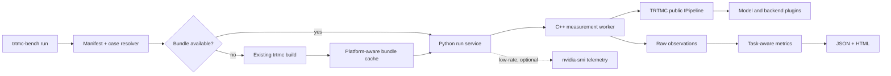

`trtmc-bench` measures the public TRTMC pipeline call for text, diffusion,
encoder, speech-transcription, and neural-operator models. The default path is
deliberately one command:

```bash
trtmc-bench run --model distilgpt2
```

List the model profiles currently supported by the installed benchmark catalog:

```bash
trtmc-bench list models
```

The list is capability-based: the task operation and default testcase must be
representable by the current benchmark worker. Distributed `mpirun` profiles
remain in the canonical E2E/task-eval catalog but are not advertised until the
benchmark has a rank-safe launcher and metric aggregation protocol.

## Install a packaged build

A TRTMC native wheel is the end-user distribution. It contains the Python
orchestrator, `trtmc-bench` command, native measurement worker, TRTMC runtime
libraries, model plugins, and the canonical model catalog snapshot:

```bash
python -m pip install /path/to/tensorrt_model_connect-*.whl
trtmc-bench run --model distilgpt2
```

No separate worker install or CMake build is required. The wheel must match the
supported Python, CUDA, TensorRT, and machine platform. Source installation is
the development workflow described below.

If no compatible bundle is available, the command invokes the existing
`trtmc build` implementation with settings from the model manifest and stores
the bundle in a managed cache. It writes `result.json`, `report.html`, resolved
inputs, build evidence, all timed observations, worker logs, and optional
low-frequency GPU telemetry into one new result directory. Bundle building,
model loading, and warmup are excluded from the reported latency. The timed
boundary is named `public_pipeline_call_wall` in the machine-readable result.

## Build from source

In a prepared development environment that already contains the repository's
Python and TensorRT dependencies, install only the editable Python source. The
following minimal build creates the measurement worker, TensorRT backend, and
GPT-2 model plugin used by the first example:

```bash
python -m pip install --no-deps -e . -C py-only=true
cmake -S . -B build -DCMAKE_BUILD_TYPE=Release
cmake --build build --target \
  trtmc_benchmark_worker trtmc_backend_trt trtmc_model_gpt2 -j
```

`--no-deps` prevents pip from replacing the TensorRT stack supplied by the
development environment. Do not use it in an empty environment: provision the
supported development container or install the required dependencies first.

The commands above use CMake's default generator, normally Unix Makefiles on
Linux. Ninja is optional. To use it, install `ninja` and add `-G Ninja` during
configuration. CMake stores the generator in the build directory, so use a
fresh directory when changing generators. For example, if `build` was already
configured for Ninja on a machine without Ninja:

```bash
cmake -S . -B build-make -DCMAKE_BUILD_TYPE=Release
cmake --build build-make --target \
  trtmc_benchmark_worker trtmc_backend_trt trtmc_model_gpt2 -j
```

The source wrapper discovers workers in `build`, `build-make`, and
`build-local`, so the first benchmark remains one command:

```bash
./scripts/trtmc-bench run --model distilgpt2
```

Replace `trtmc_model_gpt2` when benchmarking a different model family.
`cmake --build build -j` is the simpler alternative when all model plugins are
wanted. A packaged native wheel installs `trtmc-bench` on `PATH`; the
source-tree editable workflow uses the explicit `./scripts/trtmc-bench`
wrapper shown above. The wheel also carries a build-time snapshot of the
repository's canonical `MODEL.toml` and E2E manifest files, so model names and
default cases resolve without a source checkout. The snapshot is copied from
those files during packaging rather than maintained as a second catalog.

## Bundle resolution and automatic builds

Bundle resolution has one predictable order: an explicit `--bundle`, a match
below `--bundle-root`, a compatible managed-cache entry, and finally an
automatic build. The cache key includes the manifest, resolved build settings,
TensorRT version, machine architecture, and GPU target. Request-only changes
reuse a bundle; changes that affect engine shape, such as a larger diffusion
batch, produce a different cache entry.

The default build settings come from the existing model manifest. For example,
`distilgpt2` resolves to `distilbert/distilgpt2`, FP16, and a 256-token KV
cache. Build logs, structured build timing, and the resolved command are stored
next to the cached bundle and referenced from `result.json`. They are marked as
excluded from performance metrics.

Before building, the benchmark compares the TensorRT ABI declared by the
runtime backend beside the measurement worker with the Python builder ABI. It
uses a compatible installed Python binding when available and creates a
separate cache entry. If no compatible binding exists, it fails before the
expensive engine build instead of producing a bundle that cannot be loaded.

Use an existing bundle explicitly when required:

```bash
trtmc-bench run --model distilgpt2 --bundle /engines/distilgpt2.trtfb
```

Use `--no-build` for a strict CI run that must fail when no bundle exists, or
`--rebuild` to replace the compatible entry in the managed cache. `--dry-run`
resolves the planned cache path without downloading a model or building an
engine.

## Architecture



Python owns configuration, matrix expansion, orchestration, metrics, and
reporting. The native worker owns the timed loop and calls the same public C++
pipeline API as an application. A model using a supported `task_strategy`
requires no second catalog entry when its default testcase can be resolved by
that operation adapter. New request semantics, such as a specialized video
control contract, require an operation extension before the profile is listed.

## Run several models

Repeat `--model` to run a batch. Each missing bundle is built once and then
reused from the managed cache:

```bash
trtmc-bench run \
  --model distilgpt2 \
  --model flux-schnell-l0 \
  --model chronos-bolt-tiny-official
```

Use one YAML file when models need different cases or measurement counts:

```bash
trtmc-bench run examples/trtmc_bench.yaml -o results/current
```

An explicit `-o/--output` is a replaceable result slot. If that directory
already exists, the command writes the new run to a sibling staging directory
and replaces the complete old result after the new report is ready. An
exception while producing the staged run leaves the previous result intact.
The command never merges new artifacts with an older run. For safety, it only
replaces an empty directory or a directory containing a recognized
`trtmc-bench` `result.json`; unrelated directories and symlinks are rejected.
Omit `-o` to create a new timestamped result directory for every invocation.

The YAML reuses the repository's existing model names, manifests,
`task_strategy`, `runtime_strategy`, testcase inputs, and `.trtfb` bundle
names. It does not introduce a second model catalog.

### Combine separate model runs in one report

Separate CLI invocations can share one collection directory while retaining an
independent result directory per model:

```bash
trtmc-bench run --model distilgpt2 \
  -o result-20260721/distilgpt2
trtmc-bench run --model bart-base \
  -o result-20260721/bart-base
trtmc-bench run --model flux-schnell-l0 \
  -o result-20260721/flux-schnell-l0
```

Recursively discover their `trtmc.benchmark-run/v1` results and build one
collection report in place:

```bash
trtmc-bench report result-20260721
```

This writes `result-20260721/report.json` and
`result-20260721/report.html`. The per-model `result.json` files remain the
authoritative evidence and are not rewritten or copied. Add another model
subdirectory and run the same report command again to atomically rebuild the
summary; no append flag or report database is required.

Several result roots can be combined when an explicit report output is given:

```bash
trtmc-bench report results/gb300 results/h100 -o reports/combined
```

## Cases, sweeps, and batches

A named case is one complete request. Two cases are two runs; their fields are
never combined:

```yaml
cases:
  - name: fast
    set:
      request.num_inference_steps: 4
  - name: standard
    set:
      request.num_inference_steps: 20
```

Only `--sweep` requests a Cartesian product:

```bash
trtmc-bench run --model flux-schnell-l0 \
  --sweep request.batch_size=1,2 \
  --sweep request.num_inference_steps=4,20
```

Batch behavior follows the public pipeline capability. Diffusion uses
`generate_image_batch`, so `request.batch_size` measures one batch call and
reports generated samples/s. Built-in batch profiles preserve their individual
prompts and seeds rather than cloning one scalar request. Operations without a
public batch API reject batch sizes above one instead of silently simulating a
batch with sequential requests.

## Defaults and metrics

The first existing E2E testcase supplies the default workload. Operation
defaults are 5 warmups and 50 timed calls for text generation, 1 and 5 for
diffusion, and 50 and 500 for encoder/neural-operator workloads. Override them
without editing a plan file:

```bash
trtmc-bench run --model distilgpt2 \
  --warmup 10 --iterations 100 --set request.max_new_tokens=32
```

Every operation reports wall-latency min/mean/p50/p95/max and request/s.
Task-aware reducers additionally report:

| Operation | Additional metrics |
| --- | --- |
| Text generation | output token/s and runtime-reported prefill/decode stages |
| Image diffusion | image/s and seconds/image |
| Video diffusion | video/s, frame/s, and seconds/video |
| Encoder | embedding vector/s and element/s |
| Speech transcription | audio seconds/s, real-time factor, output token/s, and streaming first-partial latency |
| Neural operator | window/s and forecast element/s |

Text requests preserve the selected testcase's sampling parameters, text
generation mode, and chat-template contract. Greedy cases without an explicit
seed use the public pipeline default of `-1`; seeded sampling cases retain their
declared seed.

Some metrics cannot share a valid measurement boundary. For example, a long
profiler capture perturbs baseline latency, and model loading is not request
latency. Keep those as separate runs/artifacts rather than mixing them into the
baseline result.

## Relationship to task evaluation and NVIDIA tools

`tools/task_eval.py` answers whether model outputs satisfy a task-quality
contract using datasets, references, and comparators. `trtmc-bench` answers
how the runtime performs for a resolved workload. A built-in testcase makes a
benchmark runnable, but it is not proof of task quality; the result explicitly
records `task_quality_evaluated: false`.

Baseline runs optionally sample `nvidia-smi` outside the timed call. Use Nsight
Systems or existing profiling tools as a separate diagnostic pass when a
baseline exposes a bottleneck. Compute Sanitizer/memcheck is a correctness
diagnostic and should not be part of a normal performance run.

## Add another task type

Keep model knowledge in the existing model manifest and runtime plugin. Python
operation semantics are registered together in `benchmark/operations.py`:
existing `task_strategy` mapping, default measurement counts, testcase request
adapter, batch capability, and task-specific metric declarations. The other
required piece is one public `IPipeline` call handler in the C++ worker that
emits those declared observations. Unsupported task strategies fail during
resolution instead of producing generic latency with the wrong workload
semantics.

Artifact inputs follow the existing manifest-relative paths. For example,
speech transcription resolves `test_input_audio` once, hashes it into the case
identity, decodes WAV outside the timed region, and measures only offline or
streaming public pipeline calls. Image-conditioned generation resolves and
hashes `test_image` the same way. Packaged default audio, image, and FP8 scale
assets are copied from the canonical E2E model directory with the catalog
snapshot.
