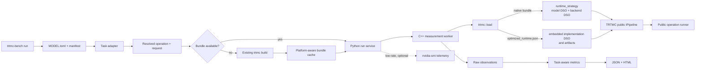

`trtmc-bench` measures public TRTMC pipeline calls across text, vision-language,
diffusion, audio, segmentation, classification, encoder, reranking,
speech-transcription, and neural-operator models. The default path is one
command:

```bash
trtmc-bench run --model distilgpt2
```

## Release performance matrix

`trtmc-bench` measures one resolved workload. The release performance matrix
adds a repository-owned comparison layer around it: `tools/perf_matrix.py`
runs TRTMC through `trtmc-bench`, runs the reference backend declared by each
suite row in a separate Python process, and checks that both sides used the
same workload and timing boundary.

The checked-in suite at `benchmarks/performance/release.yaml` currently covers
105 release-relevant, ready, single-process model-profile comparisons across
76 families and 77 `(family, operation)` contracts. Short `l0` smoke duplicates
are excluded by rule; any other omission must appear in `excluded_profiles`
with a reason. Validate coverage and all machine prerequisites without
measuring a model:

```bash
python3 tools/perf_matrix.py check \
  benchmarks/performance/release.yaml \
  --environment benchmarks/performance/environments/gb300.yaml
```

The checked-in GB300 environment requires these repository variables to point
at the installed worker, caches, bundles, and runtime libraries:

```text
TRTMC_PERF_WORKER
TRTMC_PERF_BUNDLE_CACHE
TRTMC_PERF_BUNDLE_ROOTS
TRTMC_PERF_RUNTIME_DIRS
```

Both `check` and `run` perform the same preflight: suite coverage, expanded
environment, free storage, required executables, candidate Release-build
revision, selected `trtmc-bench` testcases, and candidate/reference timing
contracts. Reference-specific upstream checkout paths and prebuilt Python
profiles described in `benchmarks/performance/README.md` are additional
operator prerequisites; dependency installation is outside the measured
campaign.

Reference precision is resolved from the suite row's explicit
`baseline.precision`, then the selected testcase's `reference_precision`, then
the model manifest's top-level `reference_precision`, and finally the resolved
TRTMC model precision. The chosen value is passed to the reference runner,
recorded as `resolved_settings.baseline_precision` in `results.json`, and
checked against the runner result. A mismatch is a contract mismatch and does
not receive a performance light.

Diffusers media references also reject non-finite numeric pixels before image
conversion can hide the invalid values. Such output is a reference execution
failure, not a completed performance comparison.

Run the complete matrix, one exact row, resume an interrupted run, or
regenerate an existing report with task-level preparation evidence:

```bash
python3 tools/perf_matrix.py run \
  benchmarks/performance/release.yaml \
  --environment benchmarks/performance/environments/gb300.yaml
python3 tools/perf_matrix.py run \
  benchmarks/performance/release.yaml \
  --environment benchmarks/performance/environments/gb300.yaml \
  --entry gpt2.generate
python3 tools/perf_matrix.py resume artifacts/perf/example-run
python3 tools/perf_matrix.py report artifacts/perf/example-run \
  --preparation-receipt artifacts/perf/bundle-preparation.json
```

Every new run writes `results.json` and `report.html` below the configured
results root. The JSON records resolved configuration, provenance, raw
samples, exact leaf commands, timing policies, and bundle preparation; the
HTML shows candidate/reference p50 values and the traffic light. The report's
self-contained controls can filter by text, traffic light, or bundle
preparation status without a server.

A separately run bundle-preparation step can be attached with the `report`
command shown above. The receipt must use schema
`trtmc.perf-bundle-preparation/v1`, scope `test_task`, the run's exact Git
commit, and the exact model and bundle paths consumed by that campaign.
Revision mismatches, duplicate records, invalid build times, and unused bundle
paths are rejected. A matching preparation receipt takes precedence over a
later cache hit, so a task-level rebuild remains visible as `Built`.

Green, yellow, and red are completed comparison results and therefore return
zero.
Configuration errors, command failures, incomplete measurements, and timing or
output-contract mismatches return nonzero and do not receive a performance
light.

Controlled Internal CI can run the same matrix and retain the unique run
directory as a private artifact. A green documentation build, sanitized
premerge status, or host-only matrix `check` is not target-hardware performance
evidence: a release claim requires the retained target-hardware run, reference
result, exact revision, and report.

List the model profiles currently supported by the installed benchmark catalog:

```bash
trtmc-bench list models
```

The command lists every profile declared by the canonical `MODEL.toml` files.
`STATUS=ready` means it can run in the current single-process worker.
`STATUS=distributed` keeps an MPI/TP profile visible but explains why it cannot
yet run. Invalid or unknown task contracts are reported explicitly instead of
silently disappearing from the list.

## Install a packaged build

A TRTMC native wheel is the end-user distribution. It contains the Python
orchestrator, `trtmc-bench` command, native measurement worker, TRTMC runtime
libraries, model plugins, and the canonical model catalog snapshot:

```bash
python -m pip install /path/to/tensorrt_model_connect-*.whl
trtmc-bench run --model distilgpt2
```

No separate worker install or CMake build is required. The wheel must match the
supported Python, CUDA, TensorRT, and machine platform. Source installation is
the development workflow described below.

If no compatible bundle is available, the command invokes the existing
`trtmc build` implementation with settings from the model manifest and stores
the bundle in a managed cache. It writes `result.json`, `report.html`, resolved
inputs, build evidence, all timed observations, worker logs, and optional
low-frequency GPU telemetry into one new result directory. Bundle building,
model loading, and warmup are excluded from the reported latency. The timed
boundary is named `public_pipeline_call_wall` in the machine-readable result.

A successful case keeps a small, user-facing evidence set:

```text
<result-dir>/
├── result.json
├── report.html
└── 001-<model>-<case>/
    ├── resolved-case.json
    ├── observations.jsonl
    ├── telemetry.json       # only when telemetry is enabled
    └── worker.log
```

`result.json` contains the reduced metrics used by reports.
`resolved-case.json` records the effective request and the source of every
field. `observations.jsonl` keeps one raw timed observation per line.
`worker.log` combines worker stdout and stderr. A failed worker additionally
retains its internal `worker-request.json` and, when produced,
`worker-result.json` protocol files for diagnosis; successful cases remove
those redundant intermediates.

## Build from source

In a prepared development environment that already contains the repository's
Python and TensorRT dependencies, install only the editable Python source. The
following minimal build creates the measurement worker, TensorRT backend, and
GPT-2 model plugin used by the first example:

```bash
python -m pip install --no-deps -e . -C py-only=true
cmake -S . -B build -DCMAKE_BUILD_TYPE=Release
cmake --build build --target \
  trtmc_benchmark_worker trtmc_backend_trt trtmc_model_gpt2 -j
```

`--no-deps` prevents pip from replacing the TensorRT stack supplied by the
development environment. Do not use it in an empty environment: provision the
supported development container or install the required dependencies first.

The commands above use CMake's default generator, normally Unix Makefiles on
Linux. Ninja is optional. To use it, install `ninja` and add `-G Ninja` during
configuration. CMake stores the generator in the build directory, so use a
fresh directory when changing generators. For example, if `build` was already
configured for Ninja on a machine without Ninja:

```bash
cmake -S . -B build-make -DCMAKE_BUILD_TYPE=Release
cmake --build build-make --target \
  trtmc_benchmark_worker trtmc_backend_trt trtmc_model_gpt2 -j
```

The source wrapper discovers workers in `build`, `build-make`, and
`build-local`, so the first benchmark remains one command:

```bash
./scripts/trtmc-bench run --model distilgpt2
```

Replace `trtmc_model_gpt2` when benchmarking a different model family.
`cmake --build build -j` is the simpler alternative when all model plugins are
wanted. A packaged native wheel installs `trtmc-bench` on `PATH`; the
source-tree editable workflow uses the explicit `./scripts/trtmc-bench`
wrapper shown above. The wheel also carries a build-time snapshot of the
repository's canonical `MODEL.toml` and E2E manifest files, so model names and
default cases resolve without a source checkout. The snapshot is copied from
those files during packaging rather than maintained as a second catalog.

## Bundle resolution and automatic builds

Bundle resolution has one predictable order: an explicit `--bundle`, a match
below `--bundle-root`, a compatible managed-cache entry, and finally an
automatic build. The cache key includes the manifest, resolved build settings,
TensorRT version, machine architecture, and GPU target. Request-only changes
reuse a bundle; changes that affect engine shape, such as a larger diffusion
batch, produce a different cache entry.

The default build settings come from the existing model manifest. For example,
`distilgpt2` resolves to `distilbert/distilgpt2`, FP16, and a 256-token KV
cache. Build logs, structured build timing, and the resolved command are stored
next to the cached bundle and referenced from `result.json`. They are marked as
excluded from performance metrics.

Before building, the benchmark compares the TensorRT ABI declared by the
runtime backend beside the measurement worker with the Python builder ABI. It
uses a compatible installed Python binding when available and creates a
separate cache entry. If no compatible binding exists, it fails before the
expensive engine build instead of producing a bundle that cannot be loaded.

Use an existing bundle explicitly when required:

```bash
trtmc-bench run --model distilgpt2 --bundle /engines/distilgpt2.trtfb
```

Use `--no-build` for a strict CI run that must fail when no bundle exists, or
`--rebuild` to replace the compatible entry in the managed cache. `--dry-run`
resolves the planned cache path without downloading a model or building an
engine.

Additional resolver and execution controls are:

| Option | Contract |
| --- | --- |
| `--bundle-cache PATH` | Override the managed bundle-cache root used for compatible automatic builds. |
| `--manifest-root PATH` | Resolve `MODEL.toml` and E2E benchmark profiles from an alternate catalog root. It applies to both `run` and `list models`. |
| `--case NAME` | Select a literal named case; repeat to select several. Named cases remain independent and never form a Cartesian product. |
| `--runtime-dir PATH` | Repeatable directory added to both backend and model-plugin runtime search paths. |
| `--worker PATH` | Use one explicit `trtmc_benchmark_worker` executable instead of packaged, source-build, or `PATH` discovery. |
| `--telemetry auto|off` | Enable best-effort low-frequency GPU telemetry or disable it. Sampling surrounds the worker process and is outside the timed public-pipeline calls. |

## Architecture



Python owns configuration, matrix expansion, orchestration, metrics, and
reporting. The native worker owns the timed loop and calls the same public C++
pipeline API as an application. It loads the bundle with `trtmc::load`, which
either follows native `runtime_strategy` dispatch through model and backend
DSOs or recognizes `optimized_runtime.json` and loads the exact embedded
implementation path. Both paths return `IPipeline`, so the task operation and
measurement boundary stay the same. Model family, task semantics, runtime
implementation, and public operation are separate extension points:

| Change | Benchmark work |
| --- | --- |
| New weight/profile in a known family and task | Add the normal manifest and `MODEL.toml.test_manifests` entry; no benchmark code |
| New native family using a known `task_strategy` | Add its normal runtime model plugin and manifest; no benchmark code |
| New optimized implementation/profile for a known model and operation | Add the family-owned `IMPLEMENTATION.toml`, exact profile, qualification evidence, and normal E2E/catalog ownership; no benchmark code |
| New task using an existing public `IPipeline` operation | Add one task adapter that translates its testcase contract |
| New public pipeline capability | Add an operation metric contract and one native runner, then map task adapters to it |

The benchmark never registers individual families or `runtime_strategy`
values. For example, a new Wan video family using
`diffusion_media_generation` and `generate_image` is discovered automatically,
and a new native or optimized decoder implementation behind `generate` remains
invisible to the benchmark layer. This is the same rule for source checkouts
and the catalog snapshot packaged in a wheel.

## Run several models

Repeat `--model` to run a batch. Each missing bundle is built once and then
reused from the managed cache:

```bash
trtmc-bench run \
  --model distilgpt2 \
  --model flux-schnell-l0 \
  --model chronos-bolt-tiny-official
```

Use one YAML file when models need different cases or measurement counts:

```bash
trtmc-bench run examples/trtmc_bench.yaml -o results/current
```

An explicit `-o/--output` is a replaceable result slot. If that directory
already exists, the command writes the new run to a sibling staging directory
and replaces the complete old result after the new report is ready. An
exception while producing the staged run leaves the previous result intact.
The command never merges new artifacts with an older run. For safety, it only
replaces an empty directory or a directory containing a recognized
`trtmc-bench` `result.json`; unrelated directories and symlinks are rejected.
Omit `-o` to create a new timestamped result directory for every invocation.

The YAML reuses the repository's existing model names, manifests,
`task_strategy`, `runtime_strategy`, testcase inputs, and `.trtfb` bundle
names. It does not introduce a second model catalog.

### Combine separate model runs in one report

Separate CLI invocations can share one collection directory while retaining an
independent result directory per model:

```bash
trtmc-bench run --model distilgpt2 \
  -o result-20260721/distilgpt2
trtmc-bench run --model bart-base \
  -o result-20260721/bart-base
trtmc-bench run --model flux-schnell-l0 \
  -o result-20260721/flux-schnell-l0
```

Recursively discover their `trtmc.benchmark-run/v1` results and build one
collection report in place:

```bash
trtmc-bench report result-20260721
```

This writes `result-20260721/report.json` and
`result-20260721/report.html`. The per-model `result.json` files remain the
authoritative evidence and are not rewritten or copied. Add another model
subdirectory and run the same report command again to atomically rebuild the
summary; no append flag or report database is required.

Several result roots can be combined when an explicit report output is given:

```bash
trtmc-bench report results/gb300 results/h100 -o reports/combined
```

## Cases, sweeps, and batches

A named case is one complete request. Two cases are two runs; their fields are
never combined:

```yaml
cases:
  - name: fast
    set:
      request.num_inference_steps: 4
  - name: standard
    set:
      request.num_inference_steps: 20
```

Only `--sweep` requests a Cartesian product:

```bash
trtmc-bench run --model flux-schnell-l0 \
  --sweep request.batch_size=1,2 \
  --sweep request.num_inference_steps=4,20
```

Batch behavior follows the public pipeline capability. Diffusion uses
`generate_image_batch`, so `request.batch_size` measures one batch call and
reports generated samples/s. Built-in batch profiles preserve their individual
prompts and seeds rather than cloning one scalar request. Operations without a
public batch API reject batch sizes above one instead of silently simulating a
batch with sequential requests.

## Defaults and metrics

The first existing E2E testcase supplies the default workload. Operation
defaults are 5 warmups and 50 timed calls for text generation, 1 and 5 for
diffusion, and 50 and 500 for encoder/neural-operator workloads. Override them
without editing a plan file:

```bash
trtmc-bench run --model distilgpt2 \
  --warmup 10 --iterations 100 --set request.max_new_tokens=32
```

Every operation reports wall-latency min/mean/p50/p95/max and request/s.
Task-aware reducers additionally report:

| Operation | Additional metrics |
| --- | --- |
| Text and vision-language generation | output token/s and runtime-reported prefill/decode stages |
| Image diffusion | image/s and seconds/image |
| Video diffusion | video/s, frame/s, and seconds/video |
| Audio generation | generated audio seconds/s, sample/s, and real-time factor |
| Speech-to-speech | consumed and generated audio seconds/s, plus input real-time factor |
| Segmentation | image/s, mask/s where applicable, and mask pixel/s |
| Classification and object detection | image/s |
| Reranking | document/s |
| Encoder/embedding | embedding vector/s and element/s |
| Speech transcription | audio seconds/s, real-time factor, output token/s, and streaming first-partial latency |
| Neural operator | window/s and forecast element/s |

Text requests preserve the selected testcase's sampling parameters, text
generation mode, and chat-template contract. Greedy cases without an explicit
seed use the public pipeline default of `-1`; seeded sampling cases retain their
declared seed.

Some metrics cannot share a valid measurement boundary. For example, a long
profiler capture perturbs baseline latency, and model loading is not request
latency. Keep those as separate runs/artifacts rather than mixing them into the
baseline result.

## Relationship to reference validation and NVIDIA tools

`trtmc-validate` answers whether model outputs satisfy a reference-consistency
contract using datasets, references, and comparators. `trtmc-bench` answers
how the runtime performs for a resolved workload. A built-in testcase makes a
benchmark runnable, but it is not proof of task quality; the result explicitly
records `task_quality_evaluated: false`.

Baseline runs optionally sample `nvidia-smi` outside the timed call. Use Nsight
Systems or existing profiling tools as a separate diagnostic pass when a
baseline exposes a bottleneck. Compute Sanitizer/memcheck is a correctness
diagnostic and should not be part of a normal performance run.

## Add a model, family, or task type

Keep model knowledge in the existing model manifest and runtime plugin. The
benchmark reads `MODEL.toml.test_manifests`; there is no benchmark-owned model
allowlist.

For a model or family on an existing task, add the normal model implementation,
manifest, and `MODEL.toml` entry, then verify that `trtmc-bench list models`
shows `ready`. No import or `if family == ...` branch belongs in benchmark code.

For a genuinely new task contract, add its testcase translator to
`benchmark/task_adapters.py`. Reuse an existing operation whenever the task can
be expressed by an existing public `IPipeline` call. Only a genuinely new
public capability adds a metric declaration in `benchmark/operations.py` and a
timed runner in `trtmc_benchmark_worker.cpp`. The registry validates task-to-
operation references at import time. Unsupported task strategies and malformed
default testcases remain visible with a reason in `list models` and fail closed
when selected.

Artifact inputs follow the existing manifest-relative paths. For example,
speech transcription resolves `test_input_audio` once, hashes it into the case
identity, decodes WAV outside the timed region, and measures only offline or
streaming public pipeline calls. Image-conditioned generation resolves and
hashes `test_image` the same way. Packaged default audio, image, and FP8 scale
assets are copied from the canonical E2E model directory with the catalog
snapshot.
