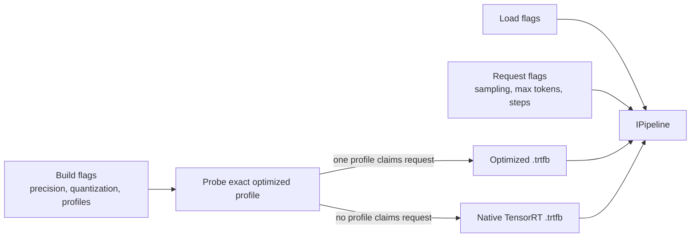
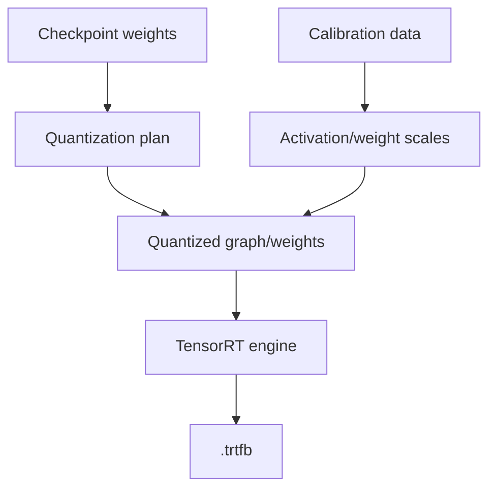
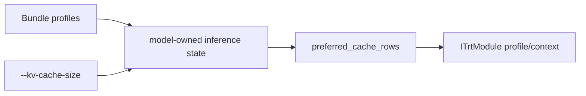
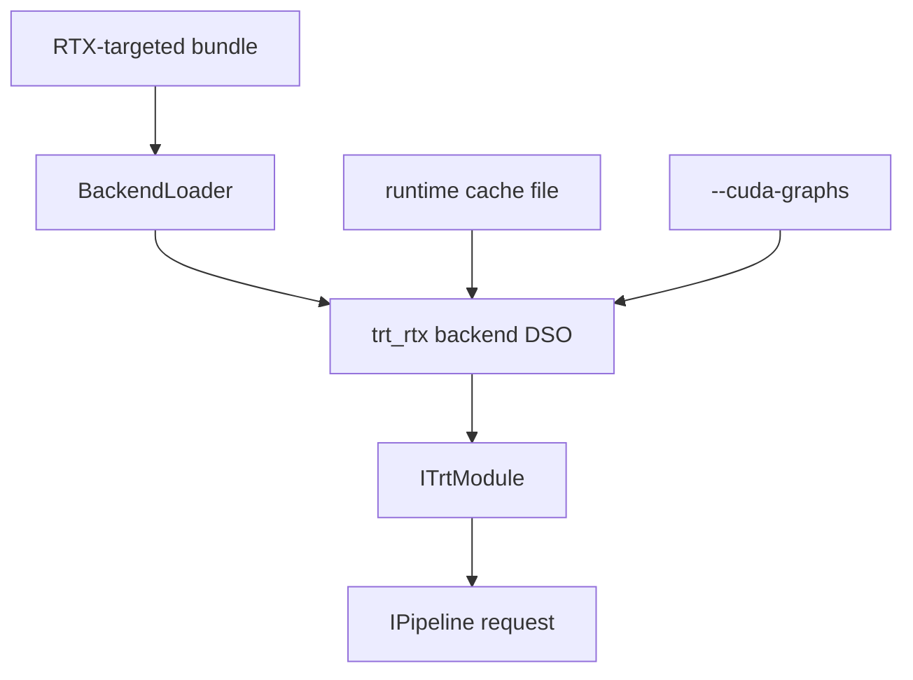

This tutorial covers build-time precision, post-training quantization, runtime cache sizing, and backend selection.

The advanced knobs change either:

- How the bundle is built.
- How the runtime loads the bundle.
- How a request uses runtime state.



The optimized-runtime probe runs before the native builder. It matches the
resolved model revision, active target, and effective public build options. A
single supported profile owns the build; no supported profile falls back to
the native path. A build failure after a profile claims the request is
terminal.

## Precision

```bash
./build/trtmc build Qwen/Qwen3-0.6B \
  -o /tmp/qwen3-fp16.trtfb \
  --precision fp16
```

Supported precision choices in the CLI are `fp32`, `fp16`, and `bf16`.

Precision changes the numeric type used by the engine. It affects memory, speed, and numerical behavior.

| Precision | Typical use |
| --- | --- |
| `fp32` | Debugging or highest numerical conservatism. |
| `fp16` | Common GPU inference default. |
| `bf16` | Useful when model/backend support favors BF16 behavior. |

Precision is also an optimized-profile input. Changing it can cause a profile
to start or stop matching, so two builds that differ only in the CLI flag can
still use different runtime implementations.

## Quantization

```bash
./build/trtmc build Qwen/Qwen3-0.6B \
  -o /tmp/qwen3-fp8.trtfb \
  --quantize fp8 \
  --quant-calibration-samples 512
```

The current quantization surface accepts `fp8`, `int8`, `int8_sq`, `int4`, `int4_awq`, `nvfp4`, and `w4a8`. Family plugins can exclude weight patterns, provide calibration data, and return a family-specific calibration adapter through the `FamilyPlugin` protocol.



Quantization is not just a compression flag. It is a contract between:

| Part | Responsibility |
| --- | --- |
| Family plugin | Exclude sensitive weights, supply calibration prompts or adapters, support family-specific scale collection. |
| Quantization registry | Interpret format names and format-specific policy. |
| Builder | Apply quantization and write required metadata/scales. |
| Runtime | Load and execute the resulting engine; it should not redo calibration. |

Quantization format, calibration settings, and scale inputs are forwarded to
the optimized-profile probe as public build options. If the exact combination
is not qualified by an optimized implementation, the same command proceeds
through the native builder instead.

## Reusing scales

```bash
./build/trtmc build black-forest-labs/FLUX.2-dev \
  -o /tmp/flux2-fp8.trtfb \
  --fp8-scales tests/e2e/models/flux/data/flux2-fp8-scales.json
```

Use `--save-fp8-scales` when you want to reuse calibrated scales across builds.

## Dynamic KV cache

```bash
./build/trtmc build Qwen/Qwen3-0.6B \
  -o /tmp/qwen3-dynamic.trtfb \
  --dynamic-kv-cache \
  --dynamic-kv-profile-rows 256,512,1024
```

At runtime, override the cache memory budget with:

```bash
./build/trtmc run /tmp/qwen3-dynamic.trtfb \
  --prompt "Summarize dynamic KV cache." \
  --kv-cache-size 512MB
```

Dynamic KV cache separates the bundle's compiled profiles from the session's cache budget. The runtime state can choose a preferred cache row count and the module can use the right execution profile when available.



## Native backend DSO search

```bash
./build/trtmc run /tmp/model.trtfb \
  --prompt "Hello" \
  --backend-dir /opt/trtmc/backends
```

For a native bundle, the runtime also searches the executable directory and
loader paths. Use `--backend-dir` when testing a native backend DSO that is not
next to `trtmc`.

Native backend selection is part of deployment correctness. The runtime checks
TensorRT version and ABI metadata so a bundle built with one ABI is not
silently executed with an incompatible backend. An optimized bundle embeds
its implementation DSO and artifacts; it does not dispatch through the native
model/backend DSO chain, so `--backend-dir` does not select its runtime.

## Native TensorRT-RTX

Build an RTX-targeted bundle:

```bash
./build/trtmc build Qwen/Qwen3-0.6B \
  -o /tmp/qwen3-rtx.trtfb \
  --rtx
```

Run with a runtime cache:

```bash
./build/trtmc run /tmp/qwen3-rtx.trtfb \
  --prompt "Hello" \
  --runtime-cache /tmp/trtmc-rtx.cache \
  --cuda-graphs
```

For a native TensorRT-RTX bundle, `--runtime-cache` stores JIT kernel cache data
for faster repeat runs and `--cuda-graphs` requests graph capture when the
backend supports it. Optimized implementations own their graph-capture policy;
do not assume that the native `--cuda-graphs` switch enables, disables, or
otherwise reproduces an optimized implementation's qualified path.



## Advanced knob checklist

First run regular `trtmc inspect <bundle.trtfb>` and record whether the section
list contains `optimized_runtime.json`. Regular inspection proves the bundle
kind but does not decode the optimized implementation/profile fields. Changing
precision or quantization can switch between optimized and native builds, so
performance comparisons are valid only after confirming that both artifacts
use the same execution path.

When reporting a result, always include:

| Area | Values to report |
| --- | --- |
| Build | Model ID, precision, quantization format, max cache length, dynamic profiles, build GPU, TensorRT version. |
| Artifact | Bundle path, native or optimized kind, family, runtime strategy or optimized implementation/profile evidence, and section layout. |
| Load | Native backend DSO/search path or optimized implementation path, runtime cache path, CUDA graph policy, and config overrides. |
| Request | Prompt/input shape, max tokens or steps, sampling settings, image/video dimensions, audio sample rate, forecast horizon. |
| Hardware | GPU model, driver, CUDA, TensorRT runtime, container or host environment. |
