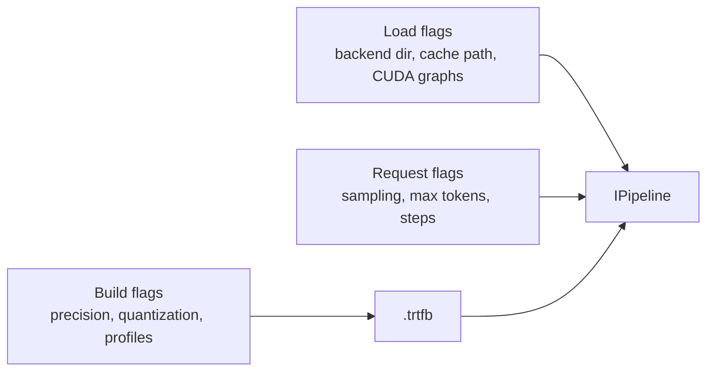
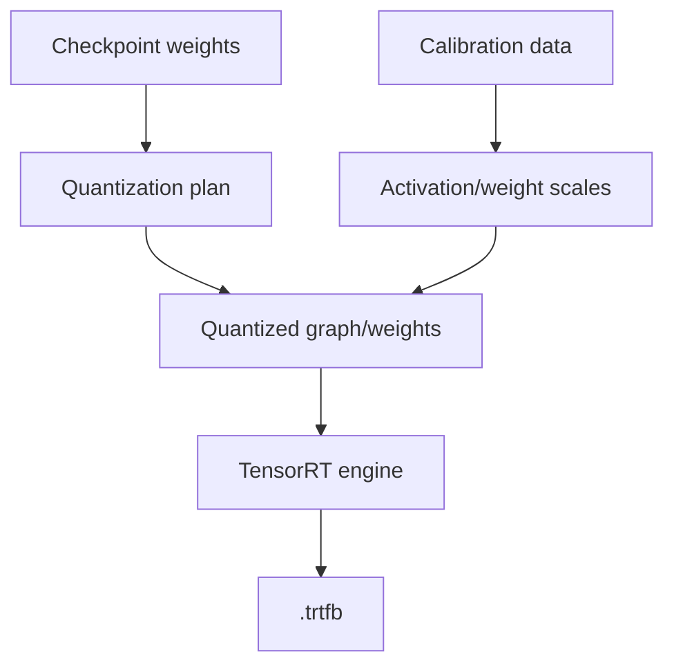
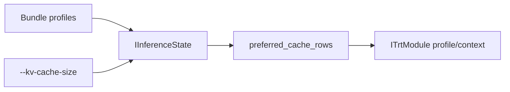
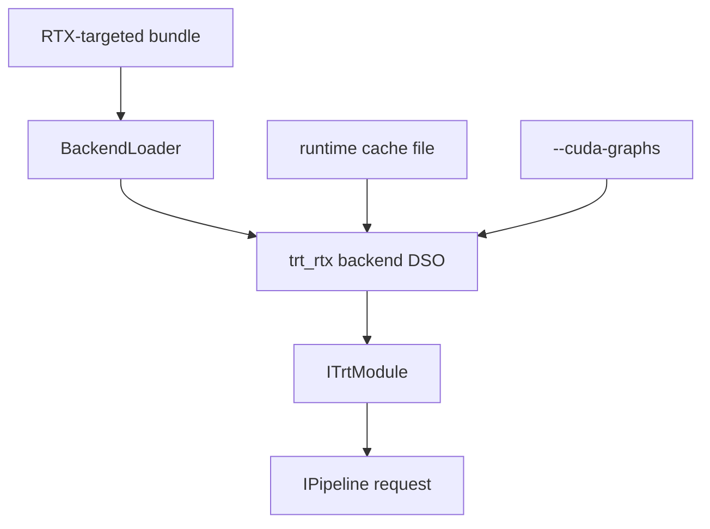

This tutorial covers build-time precision, post-training quantization, runtime cache sizing, and backend selection.

The advanced knobs change either:

- How the bundle is built.
- How the runtime loads the bundle.
- How a request uses runtime state.



## Precision

```bash
./build/trtmc build Qwen/Qwen3-0.6B \
  -o /tmp/qwen3-fp16.trtfb \
  --precision fp16
```

Supported precision choices in the CLI are `fp32`, `fp16`, and `bf16`.

Precision changes the numeric type used by the engine. It affects memory, speed, and numerical behavior.

| Precision | Typical use |
| --- | --- |
| `fp32` | Debugging or highest numerical conservatism. |
| `fp16` | Common GPU inference default. |
| `bf16` | Useful when model/backend support favors BF16 behavior. |

## Quantization

```bash
./build/trtmc build Qwen/Qwen3-0.6B \
  -o /tmp/qwen3-fp8.trtfb \
  --quantize fp8 \
  --quant-calibration-samples 512
```

The current quantization surface accepts `fp8`, `int8`, `int8_sq`, `int4`, `int4_awq`, `nvfp4`, and `w4a8`. Family plugins can exclude weight patterns, provide calibration data, and return a family-specific calibration adapter through the `FamilyPlugin` protocol.



Quantization is not just a compression flag. It is a contract between:

| Part | Responsibility |
| --- | --- |
| Family plugin | Exclude sensitive weights, supply calibration prompts or adapters, support family-specific scale collection. |
| Quantization registry | Interpret format names and format-specific policy. |
| Builder | Apply quantization and write required metadata/scales. |
| Runtime | Load and execute the resulting engine; it should not redo calibration. |

## Reusing scales

```bash
./build/trtmc build black-forest-labs/FLUX.2-dev \
  -o /tmp/flux2-fp8.trtfb \
  --fp8-scales tests/e2e/models/flux/data/flux2-fp8-scales.json
```

Use `--save-fp8-scales` when you want to reuse calibrated scales across builds.

## Dynamic KV cache

```bash
./build/trtmc build Qwen/Qwen3-0.6B \
  -o /tmp/qwen3-dynamic.trtfb \
  --dynamic-kv-cache \
  --dynamic-kv-profile-rows 256,512,1024
```

At runtime, override the cache memory budget with:

```bash
./build/trtmc run /tmp/qwen3-dynamic.trtfb \
  --prompt "Summarize dynamic KV cache." \
  --kv-cache-size 512MB
```

Dynamic KV cache separates the bundle's compiled profiles from the session's cache budget. The runtime state can choose a preferred cache row count and the module can use the right execution profile when available.



## Backend DSO search

```bash
./build/trtmc run /tmp/model.trtfb \
  --prompt "Hello" \
  --backend-dir /opt/trtmc/backends
```

The runtime also searches the executable directory and loader paths. Use `--backend-dir` when testing a backend DSO that is not next to `trtmc`.

Backend selection is part of deployment correctness. The runtime checks TensorRT version and ABI metadata so a bundle built with one ABI is not silently executed with an incompatible backend.

## TensorRT-RTX

Build an RTX-targeted bundle:

```bash
./build/trtmc build Qwen/Qwen3-0.6B \
  -o /tmp/qwen3-rtx.trtfb \
  --rtx
```

Run with a runtime cache:

```bash
./build/trtmc run /tmp/qwen3-rtx.trtfb \
  --prompt "Hello" \
  --runtime-cache /tmp/trtmc-rtx.cache \
  --cuda-graphs
```

`--runtime-cache` stores TRT-RTX JIT kernel cache data for faster repeat runs. `--cuda-graphs` enables graph capture for lower launch overhead when the backend supports it.



## Advanced knob checklist

When reporting a result, always include:

| Area | Values to report |
| --- | --- |
| Build | Model ID, precision, quantization format, max cache length, dynamic profiles, build GPU, TensorRT version. |
| Artifact | Bundle path, family, runtime strategy, engine backend, section layout. |
| Load | Backend DSO, backend search path, runtime cache path, CUDA graphs, config overrides. |
| Request | Prompt/input shape, max tokens or steps, sampling settings, image/video dimensions, audio sample rate, forecast horizon. |
| Hardware | GPU model, driver, CUDA, TensorRT runtime, container or host environment. |
