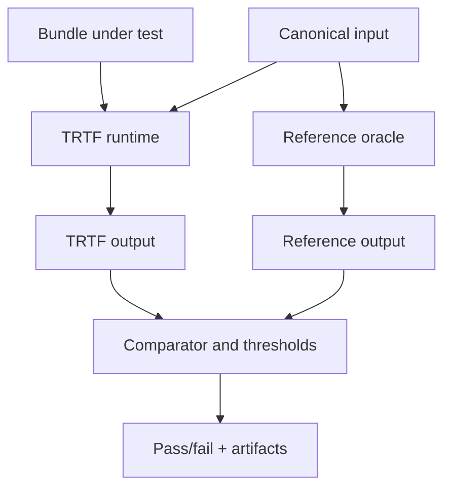
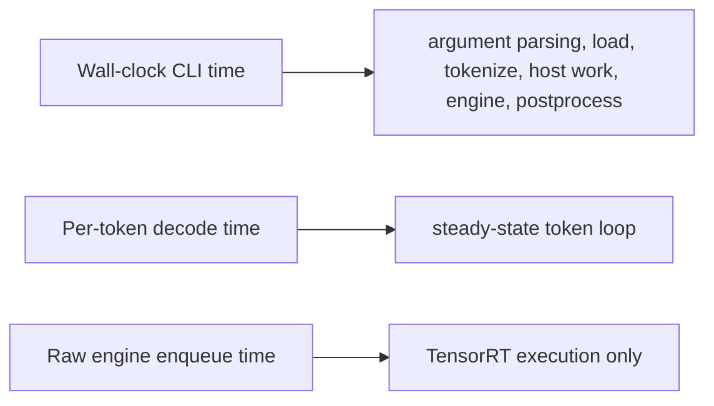

Validation should prove that the runtime under test matches an appropriate oracle. Benchmarking should state exactly what is measured.



## Focused E2E validation

```bash
ENGINE_DIR=/tmp/trtmc-engines
mkdir -p "${ENGINE_DIR}"
pytest 'tests/test_e2e.py::test_e2e[qwen3-0.6b-fp16]' -v \
  --engine-dir "${ENGINE_DIR}" \
  --trtmc-binary ./build/trtmc
```

The model manifest supplies the family, runtime strategy, bundle name, prompt or modality input, thresholds, reference backend, and test contract.

Read the manifest before debugging a failure. It tells you what the test is trying to prove.

| Manifest field category | Why it matters |
| --- | --- |
| Model and bundle fields | Identify the artifact and expected strategy. |
| Input fields | Define prompt, image, audio, numeric context, or generation settings. |
| Oracle fields | Define what implementation or verifier is trusted for comparison. |
| Threshold fields | Define acceptable numerical, textual, image, audio, or task-specific differences. |
| Artifact fields | Define where logs and outputs should be written. |

## C++ unit tests

```bash
ctest --test-dir build --output-on-failure --no-tests=error \
  -R 'test_pipeline_registry|test_pipeline_api'
```

Use this when changing pipeline interfaces, registries, plugin manifests, bundle parsing, or runtime core behavior.

C++ unit tests should make runtime failures local. For example, if a
model-owned text-generation pipeline fails an E2E, the unit tests should help
separate DSO/registry failure, bundle parsing, tokenizer behavior, cache
lifecycle, and sampler behavior.

## Builder tests

```bash
pytest tests/builder -q
```

Use builder tests when changing family plugins, graph ops, schedulers, quantization, config schemas, or bundle writing.

## Tool tests

```bash
pytest tests/tools -q
```

Use tool tests when changing diff tools, report generation, performance comparison, coverage maps, or scheduling utilities.

## Runtime microbenchmark

```bash
./build/trtmc run /tmp/qwen3.trtfb \
  --prompt "Benchmark prompt" \
  --max-new-tokens 64 \
  --benchmark 20 \
  --warmup 3
```

Report:

- GPU, driver, CUDA, TensorRT version, and backend DSO.
- Bundle path and build command.
- Prompt length and generated token count.
- Whether the number is wall-clock CLI latency, per-token decode time, or raw engine enqueue time.



These numbers answer different questions. Do not compare them as if they measure the same thing.

The native `run` command reports a standard timing line with
`prefill_ms`, `decode_ms`, and `total_ms`; no timing environment variable is
required. For repeatable CLI-level measurements, use the same benchmark
command with fixed prompt, warmup count, iteration count, and decoding flags:

```bash
./build/trtmc run /tmp/qwen3.trtfb \
  --prompt "Benchmark prompt" \
  --max-new-tokens 64 \
  --greedy \
  --benchmark 20 \
  --warmup 3
```

This timing includes the runtime's measured generation phases; it is not a raw
TensorRT enqueue-only benchmark. Use a model-specific profiler or benchmark
worker when engine-only timing is required, and identify that tool explicitly
in the report.

## Validation taxonomy

| Validation type | Best for | Limit |
| --- | --- | --- |
| Unit test | Local logic, edge cases, fast feedback. | Does not prove a full model works. |
| E2E smoke | User-visible model contract. | Usually one or a few inputs. |
| Numerical parity | Tensor output or score comparison. | Requires stable oracle and well-defined tolerance. |
| Semantic/text verifier | Generated text or transcript quality. | Can be nondeterministic unless generation settings are controlled. |
| Image/audio verifier | Modality-specific quality checks. | Requires careful artifact and threshold design. |
| Microbenchmark | Fixed-input latency. | Not a product workload or dataset evaluation. |
| Dataset evaluation | Accuracy or quality across data. | Slower and outside most quick CI paths. |

## Benchmark setup template

Use this template in reports:

```text
Model:
Bundle:
Family:
Runtime strategy:
Build command:
Run command:
GPU:
Driver/CUDA/TensorRT:
Backend DSO:
Input:
Output length or shape:
Warmup iterations:
Measured iterations:
Metric:
Result:
Notes:
```

The input is part of the benchmark. A one-token prompt, a 2K-token prompt, a single image, an 81-frame video, and a dataset run are different workloads.
