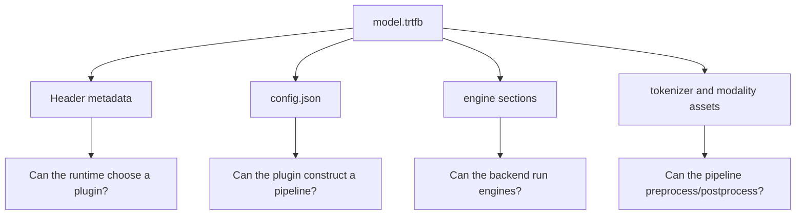
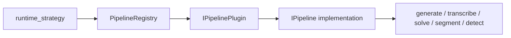

A `.trtfb` bundle is the portable handoff between the Python builder and C++ runtime. Inspecting it is the first debugging step.

<div className="trtmc-handout-meta">
  <div>
    <strong>Level</strong>
    <span>Beginner</span>
  </div>
  <div>
    <strong>Artifact</strong>
    <span>`model.trtfb`</span>
  </div>
  <div>
    <strong>Skill</strong>
    <span>Separate builder, artifact, and runtime failures.</span>
  </div>
  <div>
    <strong>Proof</strong>
    <span>Identify family, strategy, engines, assets, and ABI metadata.</span>
  </div>
</div>



## Why inspect first

Most runtime failures become easier once you know what is actually inside the artifact. Before debugging C++ code, answer four questions:

1. What model family built this bundle?
2. What `runtime_strategy` will the C++ runtime dispatch?
3. Which engine sections and assets are present?
4. Which TensorRT version or ABI metadata was recorded?

:::danger Required task
Do not skip inspection after building a bundle. Record the four answers above before running the C++ runtime.
:::

:::warning Common trap
A bundle can exist on disk and still be unusable for the runtime you are testing. The strategy key, engine sections, tokenizer assets, and TensorRT ABI metadata are part of the contract.
:::

## Use the inspector

```bash
./build/trtmc inspect /tmp/qwen3-0.6b.trtfb
./build/trtmc inspect /tmp/qwen3-0.6b.trtfb --list-engines
```

Use this for build-time metadata and engine section checks.

The inspector reads the bundle header through the same unified `trtmc` binary that runs the artifact. It is useful immediately after a build, before loading engines for inference.

Example shape:

```text
Model ID:            Qwen/Qwen3-0.6B
Model type:          qwen3
Family:              qwen
Runtime strategy:    decoder_kv_cache
TRT version:         <version recorded at build time>
TRT ABI:             <ABI key>
Precision:           fp16
Sections:
  config.json: 0.0 MB
  engine_plan: <size> MB
  tokenizer.json: <size> MB
```

The exact sizes and TensorRT metadata depend on your build environment. The important point is that the family, runtime strategy, precision, and required sections are visible before you run inference.

:::tip Progress check
You are ready for inference when inspection confirms the expected `family`, `runtime_strategy`, precision, and engine sections.
:::

:::danger Required task
Run inspection for the bundle and record the strategy and section names before starting runtime debugging.
:::

## Fields to check

| Field | Why it matters |
| --- | --- |
| `model_id` | Confirms the source model. |
| `family` | Confirms the Python family plugin. |
| `precision` | Confirms build precision. |
| `runtime_strategy` | Selects the C++ pipeline plugin. |
| `max_cache_length` | Controls default KV cache capacity for decoder bundles. |
| Engine sections | Confirm the bundle contains the plans expected by the strategy. |
| Tokenizer sections | Required for text, speech-token, and multimodal prompt flows. |

## Read the strategy like a runtime engineer

`runtime_strategy` is the bridge from artifact to C++ implementation:



Do not confuse it with `family`. `family` explains the Python builder that created the bundle. `runtime_strategy` explains the C++ runtime shape.

Examples:

| Family | Possible runtime strategy | Runtime meaning |
| --- | --- | --- |
| `qwen`, `llama`, `mistral` | `decoder_kv_cache` | Decoder-only text generation with attention cache. |
| `whisper` | `speech_to_text` | Audio features to transcript. |
| `qwen_vl`, `internvl` | `vision_language` | Image encoder plus text decoder. |
| `flux`, `wan_t2v`, `z_image` | Diffusion strategy keys | Text prompt to image/video via denoising pipeline. |
| `timesfm` | `timesfm_torchtrt` | Numeric time-series forecast. |

:::tip Progress check
You understand this section when you can explain why two different families can use the same runtime strategy, and why one family may need a new strategy when request-time behavior changes.
:::

## Common mismatch

If `runtime_strategy` is present but runtime creation fails with "No plugin registered", check:

- `cmake/trtmc_pipeline_plugins.cmake` includes the plugin source and registrar.
- The plugin uses `REGISTER_PIPELINE_PLUGIN_WITH_MANIFEST`.
- The built binary is from the same source tree as the bundle strategy you are testing.

## Debugging checklist

| Check | Command or source |
| --- | --- |
| Bundle header parses | `./build/trtmc inspect model.trtfb` |
| Runtime strategy exists | `rg "REGISTER_PIPELINE_PLUGIN_WITH_MANIFEST" src/runtime/plugins` |
| Plugin is in manifest | `rg "<plugin file>" cmake/trtmc_pipeline_plugins.cmake` |
| Engine sections exist | `./build/trtmc inspect model.trtfb --list-engines` |
| E2E manifest matches expected contract | `tests/e2e/models/<model>.json` |

Inspecting the bundle should become muscle memory. It tells you whether you are debugging the builder, the artifact, the runtime loader, or request execution.

## Learning Log Prompts

Before leaving the tutorial, write short answers to these prompts:

1. Which field tells the runtime what plugin to load?
2. Which fields or sections prove the tokenizer is packaged?
3. Which metadata would you inspect for TensorRT compatibility?
4. If inspection passes but runtime loading fails, where is the likely boundary?
