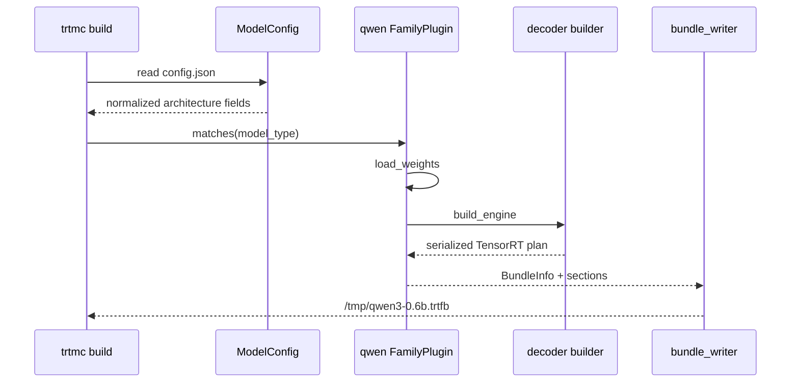
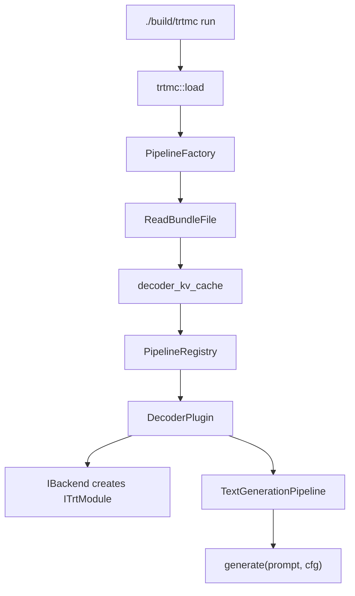

import useBaseUrl from '@docusaurus/useBaseUrl';


This handout teaches the full path for decoder text generation: build a bundle, inspect the artifact, run the C++ runtime, and explain the request loop. It assumes you can run shell commands, but it does not assume prior deep learning inference knowledge.

<div className="trtmc-handout-meta">
  <div>
    <strong>Level</strong>
    <span>Beginner</span>
  </div>
  <div>
    <strong>Model</strong>
    <span>`Qwen/Qwen3-0.6B`</span>
  </div>
  <div>
    <strong>Runtime shape</strong>
    <span>Decoder text generation with KV cache.</span>
  </div>
  <div>
    <strong>Proof</strong>
    <span>Bundle metadata plus deterministic generation.</span>
  </div>
</div>

<figure className="trtmc-diagram trtmc-diagram--wide">
  <div className="trtmc-diagram__media">
    
  </div>
  <figcaption>Use this loop to connect each tutorial command to the runtime work it triggers.</figcaption>
</figure>

## Outcomes

After this tutorial, you should be able to explain:

- Why a HuggingFace checkpoint must be converted before this C++ runtime can serve it.
- What is inside the `.trtfb` bundle.
- How `family` differs from `runtime_strategy`.
- What prefill, decode, KV cache, logits, and sampling mean during generation.
- Which source-level building blocks are involved in `IPipeline::generate`.

:::info Required reading
Before running commands, read [Glossary](/getting-started/glossary), [Environment and First Repro](/getting-started/environment-and-repro), [Inference Fundamentals](/getting-started/inference-fundamentals), and [Inspect Bundles](inspect-bundles.md). Keep the glossary and bundle-inspection page open while working through this tutorial.
:::

## Stage 1: Understand the Artifact You Are Building

The example uses:

```text
Qwen/Qwen3-0.6B
```

Decoder-only language models are the simplest place to learn this project because the runtime path is easy to see.

| Concept | In this tutorial |
| --- | --- |
| Model family | `qwen`, selected by the Python builder. |
| Runtime strategy | `decoder_kv_cache`, selected from bundle metadata at runtime. |
| Public API method | `IPipeline::generate`. |
| Main engine section | `engine_plan`. |
| Main runtime state | `KvCache` through the `IInferenceState` abstraction. |
| Token selection | `ISampler`, controlled by `GenerateConfig` or CLI flags. |

:::tip Progress check
In your learning log, answer: "What part of this example is model-specific, and what part is runtime-behavior-specific?"
:::

:::warning Common trap
Do not use "Qwen support" and "text generation support" as if they mean the same thing. Qwen is a build-time family. Text generation with KV cache is a runtime behavior.
:::

## Stage 2: Build the Bundle

Run this inside the dev container:

```bash
./build/trtmc build Qwen/Qwen3-0.6B \
  -o /tmp/qwen3-0.6b.trtfb \
  --precision fp16 \
  --max-cache-length 256
```

What happens:



| Flag | Effect |
| --- | --- |
| `--precision fp16` | Builds a half-precision engine. This is usually faster and smaller than FP32 on NVIDIA GPUs. |
| `--max-cache-length 256` | Sets the default maximum number of cached tokens for decoder state. Larger values allow longer prompts or generations but consume more GPU memory. |
| `-o /tmp/qwen3-0.6b.trtfb` | Writes the deployable bundle. |

:::danger Required task
Save the build command in your learning log and record whether the failure point, if any, was model resolution, Python dependency setup, TensorRT engine construction, or bundle writing.
:::

:::warning First build cost
The first run may download model files from HuggingFace and compile TensorRT engines. That is normal. Treat download/auth/cache failures differently from TensorRT graph-build failures.
:::

<details>
<summary>How to read build failures</summary>

- If the build fails before engine construction, check model resolution, dependencies, TensorRT availability, or unsupported family matching.
- If it fails during engine construction, inspect the TensorRT error and the family plugin.
- If it fails while writing the bundle, inspect bundle metadata and output path permissions.

</details>

## Stage 3: Inspect the Bundle

Inspect the bundle metadata:

```bash
./build/trtmc inspect /tmp/qwen3-0.6b.trtfb
```

Confirm that the output reports:

- `family=qwen`
- `precision=fp16`
- `runtime_strategy=decoder_kv_cache`

Then list engine sections:

```bash
./build/trtmc inspect /tmp/qwen3-0.6b.trtfb --list-engines
```

You are looking for the pieces that the C++ runtime will later consume:

| Field or section | Why it matters |
| --- | --- |
| `runtime_strategy=decoder_kv_cache` | Tells `PipelineRegistry` to use the decoder runtime plugin. |
| `engine_plan` | Serialized TensorRT decoder engine. |
| Tokenizer sections | Needed to convert prompt text to token IDs and output token IDs back to text. |
| `max_cache_length=256` | Default cache capacity for this bundle. |
| `trt_version` / `trt_abi` | Used by backend selection and compatibility checks. |

:::danger Required task
Record the exact `runtime_strategy` and engine section names. If you cannot find them, stop and debug the artifact before running inference.
:::

:::tip Progress check
You are ready to continue when you can explain why `runtime_strategy` is more important to C++ dispatch than the HuggingFace model name.
:::

## Stage 4: Run Deterministic Generation

```bash
./build/trtmc run /tmp/qwen3-0.6b.trtfb \
  --prompt "What is the capital of France? Answer in one word." \
  --max-new-tokens 10 \
  --greedy
```

Use `--greedy` for the most deterministic smoke test. Use `--temperature`, `--top-p`, `--top-k`, and `--seed` only after the deterministic path works.

For Qwen3-0.6B, the runtime should log `Using native BPE tokenizer`; no `--hf-python` path is needed for this text-generation smoke test. Add `--hf-python /opt/venv/bin/python` only for runtime strategies that still need helper Python code, such as speech-to-speech prompt handling or a legacy fallback path.

Runtime creation follows this path:



Inside `generate`, the pipeline:

1. Tokenizes the prompt.
2. Allocates or resets inference state.
3. Runs prefill for the prompt tokens.
4. Repeatedly runs decode for one token.
5. Samples the next token from logits.
6. Stops on EOS, the end-of-sequence token, or `max_new_tokens`.
7. Decodes token IDs into a `TextResult`.

:::danger Required task
Record the prompt, decoding flags, and output. Then write one sentence explaining why `--greedy` makes this a better smoke test than random sampling.
:::

## Stage 5: Explain Sampling

The model produces logits, not text. Sampling chooses a token from those logits.

| CLI option | Meaning |
| --- | --- |
| `--greedy` | Choose the highest-score token. Best for deterministic smoke tests. |
| `--temperature` | Higher values make probability differences flatter; lower values make output more deterministic. |
| `--top-k` | Restrict candidates to the highest-k tokens. |
| `--top-p` | Restrict candidates to the smallest set whose cumulative probability reaches p. |
| `--seed` | Controls random sampling when randomness is enabled. |

:::tip Progress check
You understand this stage when you can explain why two successful runs can produce different text if sampling is enabled.
:::

## Stage 6: Validate the Contract

```bash
/opt/venv/bin/python -m pytest tests/test_e2e.py::test_e2e[qwen3-0.6b-fp16] -v \
  --engine-dir /workspace/users/yifeif/tensorrt-model-connect/engines \
  --trtmc-binary ./build/trtmc \
  --rebuild-engines
```

E2E manifests are the best source for canonical prompts, tolerances, and runtime contracts. This command uses the manifest and `--engine-dir`; it is not simply reusing `/tmp/qwen3-0.6b.trtfb` from the earlier tutorial step.

:::note Further reading
Read [Advanced Tutorial - Validation and Benchmarking](/tutorials/advanced/validation-and-benchmarking) when you need parity checks, performance numbers, or artifact-level evidence.
:::

## Common Failures

| Symptom | Likely layer |
| --- | --- |
| `No plugin registered for runtime_strategy` | The binary was built without the needed runtime plugin or manifest entry. |
| TensorRT ABI mismatch | The bundle was built with a TensorRT version incompatible with the loaded backend DSO. |
| Missing tokenizer section | The bundle did not include the tokenizer assets expected by the decoder plugin. |
| CUDA out of memory | Reduce `--max-cache-length`, generated tokens, batch size, or precision/quantization footprint. |
| Output differs between runs | Sampling is enabled. Use greedy or fixed seed for deterministic smoke tests. |

## Learning Log Prompts

Before leaving the tutorial, write short answers to these prompts:

1. What did the Python builder add to the bundle?
2. What did the C++ runtime read from the bundle before creating a pipeline?
3. Which source-level abstraction selected the runtime plugin?
4. What state is reused between decode steps?
5. What would you inspect first if runtime creation failed?

## Optional Exercises

<details>
<summary>Exercise 1: Change cache capacity</summary>

Rebuild with a different `--max-cache-length`, inspect the bundle again, and explain what changed. Do not tune for performance yet; the exercise is about artifact metadata.

</details>

<details>
<summary>Exercise 2: Compare greedy and sampled output</summary>

Run once with `--greedy` and once with sampling enabled. Record the flags and explain whether the difference is a correctness issue or an expected decoding behavior.

</details>

<details>
<summary>Exercise 3: Trace the runtime source path</summary>

Use `rg` to find the plugin registration for `decoder_kv_cache`, then follow the path to the concrete pipeline implementation.

</details>
