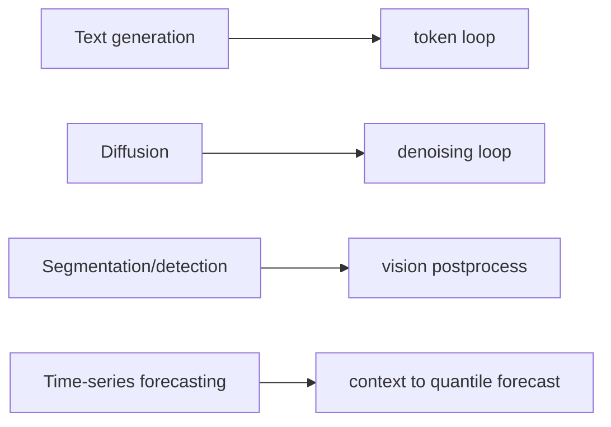
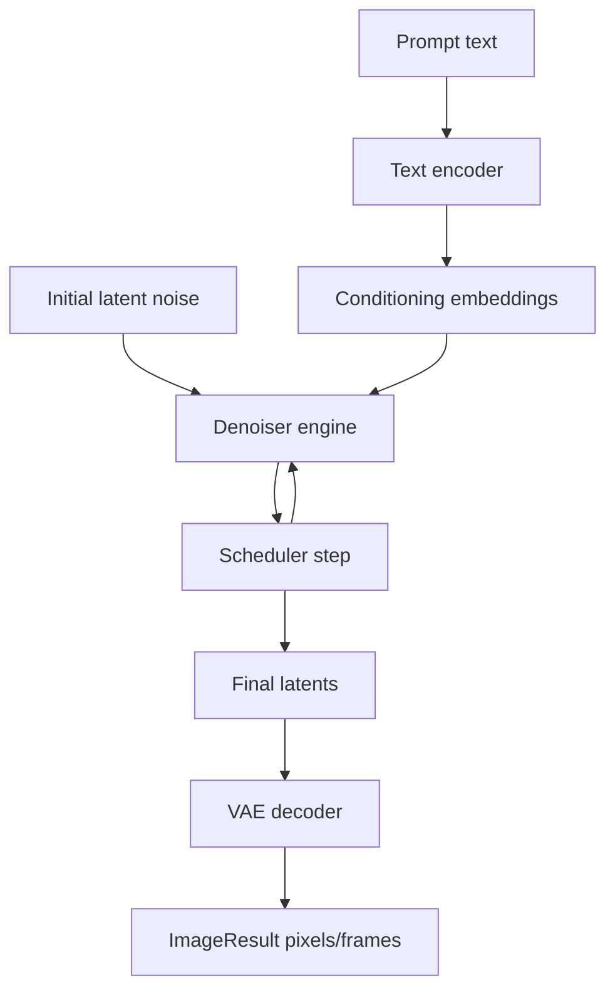

This tutorial covers pipelines that do not return generated text.

These pipelines still use `IPipeline`, but their task methods and internal loops differ.

The commands below assume that you completed
[Installation](../../getting-started/installation.md), built the source tree,
and are running from the repository root in a TensorRT/CUDA environment with a
supported NVIDIA GPU. Model builds download checkpoint data unless it is
already cached, so they also need network access or a populated local cache.



## FLUX image generation

```bash
./build/trtmc build black-forest-labs/FLUX.2-dev \
  -o /tmp/flux2.trtfb \
  --precision fp16 \
  --image-height 1024 \
  --image-width 1024 \
  --num-inference-steps 28

./build/trtmc generate-video /tmp/flux2.trtfb \
  --prompt "A photo of a cat sitting on a windowsill at sunset" \
  --output /tmp/flux2-frames \
  --num-steps 28
```

The command is named `generate-video` because the C++ API returns an `ImageResult` with `num_frames`; single-frame image generation is the same surface as video generation.



Diffusion inference is iterative like text generation, but the loop is over denoising steps rather than generated tokens.

| Text generation | Diffusion |
| --- | --- |
| Generates one token per decode step. | Updates a latent tensor each denoising step. |
| Uses KV cache to avoid recomputing prompt attention. | Uses a scheduler to control the noise trajectory. |
| Samples from logits. | Decodes final latents into pixels. |
| Stops at EOS or token budget. | Stops after configured denoising steps. |

## Wan video generation

```bash
./build/trtmc build Wan-AI/Wan2.1-T2V-1.3B-Diffusers \
  -o /tmp/wan21.trtfb \
  --precision fp16 \
  --video-height 480 \
  --video-width 832 \
  --video-num-frames 81

./build/trtmc generate-video /tmp/wan21.trtfb \
  --prompt "A cinematic shot of clouds moving over mountains" \
  --output /tmp/wan21-frames
```

Diffusion bundles often have multiple engine sections: text encoder, denoiser, and VAE decoder.

Video generation adds temporal dimensions. The output is still `ImageResult`, but `num_frames` is greater than one and the latent tensor includes time.

## Chronos-Bolt time-series forecasting

Chronos-Bolt uses the neural-operator task surface: a numeric history enters as
the branch input, and `solve()` returns the forecast vector. The repository's
official contract is
`tests/e2e/models/chronos_bolt/manifests/chronos-bolt-tiny-official.json`.
The following example uses that manifest's real model ID, precision, bundle
name, and input values.

### Build the official tiny model

```bash
./build/trtmc build amazon/chronos-bolt-tiny \
  -o /tmp/chronos-bolt-tiny-official.trtfb \
  --precision fp32
```

Keep `fp32` for this qualified path. The official manifest remains FP32 because
the FP16 attention path does not meet its framework-reference accuracy
contract.

The build requires the same TensorRT/CUDA GPU environment as the other engine
builds on this page. Chronos-Bolt also declares a build-time Python profile
named `chronos`. On first use, the CLI materializes the pinned dependencies
from
`python/tensorrt_model_connect/families/chronos_bolt/python_profile_requirements/chronos.lock.txt`,
including `chronos-forecasting==2.2.2`. That step needs package access or a
pre-populated profile/cache. A successful build exits with status 0 and creates
`/tmp/chronos-bolt-tiny-official.trtfb`.

### Forecast from the manifest input

```bash
./build/trtmc solve /tmp/chronos-bolt-tiny-official.trtfb \
  --branch-input "100.1,100.15,100.18,100.22,100.21,100.27,100.31,100.35,100.37,100.4,100.44,100.5"
```

`--branch-input` is a comma-separated, univariate history. Here it contains the
12 ordered observations from the official E2E manifest. Chronos-Bolt consumes
that history directly, so this model contract does not use `--trunk-input`.

The native `chronos_bolt_trt` runtime flattens the model's quantile forecast
into the public result vector. Success is an exit status of 0 and one line in
this form:

```text
Output [N]: <N floating-point values>
```

`N` is the bundle's output dimension. The values after the colon are the
forecast output, not another input to copy. Once the bundle exists, `solve`
runs through the native C++/TensorRT runtime; it does not invoke the
build/reference Python profile. The runtime machine still needs a compatible
NVIDIA GPU, TensorRT, CUDA, and the model runtime DSO.

## Segmentation and detection mental model

Segmentation and detection are covered by feature and E2E docs, but the runtime shape is similar to other vision pipelines:


Current segmentation owners use qualified strategies: SegFormer emits
`segformer_segmentation`, while SAM and SAM3 emit
`sam_prompted_segmentation` and `sam3_prompted_segmentation`. The public API
and CLI also expose `detect()`, but the current model descriptors do not claim
an object-detection runtime strategy. Do not present that API surface as a
supported model until a model-owned descriptor and E2E manifest provide the
evidence.

## What you should understand now

- Not every model returns text.
- `IPipeline` provides task-specific methods so users do not manipulate raw engine tensors.
- Iterative inference can mean token decode, diffusion denoising, streaming audio chunks, or another task-specific loop.
- Time-series models can use `solve()` to map a numeric history to a forecast vector without a text or image interface.
- E2E manifests are the safest way to find canonical inputs for non-text models.
