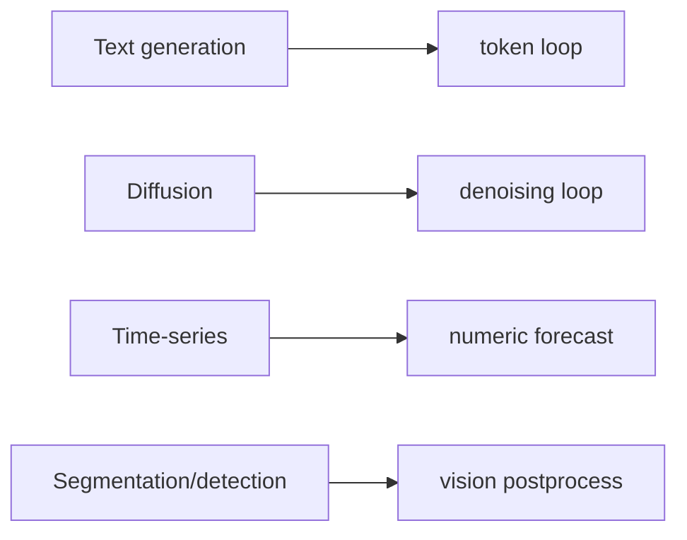
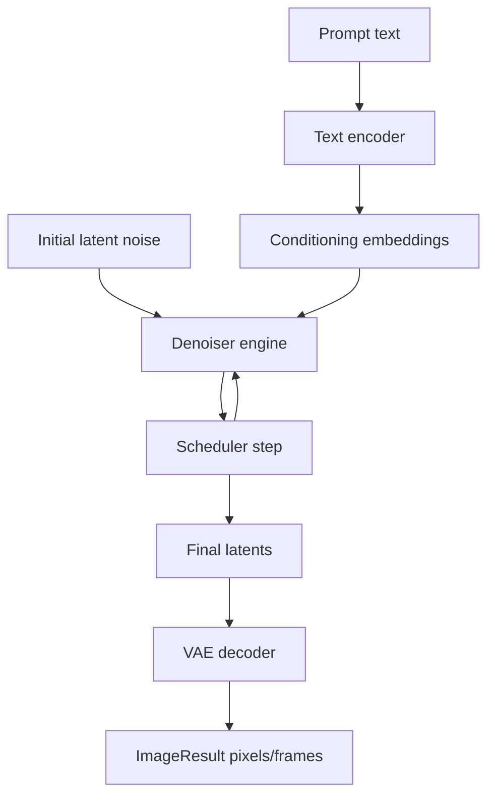
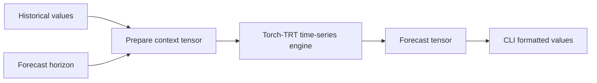

This tutorial covers pipelines that do not return generated text.

These pipelines still use `IPipeline`, but their task methods and internal loops differ.



## FLUX image generation

```bash
./build/trtmc build black-forest-labs/FLUX.2-dev \
  -o /tmp/flux2.trtfb \
  --precision fp16 \
  --image-height 1024 \
  --image-width 1024 \
  --num-inference-steps 28

./build/trtmc generate-video /tmp/flux2.trtfb \
  --prompt "A photo of a cat sitting on a windowsill at sunset" \
  --output /tmp/flux2-frames \
  --num-steps 28
```

The command is named `generate-video` because the C++ API returns an `ImageResult` with `num_frames`; single-frame image generation is the same surface as video generation.



Diffusion inference is iterative like text generation, but the loop is over denoising steps rather than generated tokens.

| Text generation | Diffusion |
| --- | --- |
| Generates one token per decode step. | Updates a latent tensor each denoising step. |
| Uses KV cache to avoid recomputing prompt attention. | Uses a scheduler to control the noise trajectory. |
| Samples from logits. | Decodes final latents into pixels. |
| Stops at EOS or token budget. | Stops after configured denoising steps. |

## Wan video generation

```bash
./build/trtmc build Wan-AI/Wan2.1-T2V-1.3B \
  -o /tmp/wan21.trtfb \
  --precision fp16 \
  --video-height 480 \
  --video-width 832 \
  --video-num-frames 81

./build/trtmc generate-video /tmp/wan21.trtfb \
  --prompt "A cinematic shot of clouds moving over mountains" \
  --output /tmp/wan21-frames
```

Diffusion bundles often have multiple engine sections: text encoder, denoiser, and VAE decoder.

Video generation adds temporal dimensions. The output is still `ImageResult`, but `num_frames` is greater than one and the latent tensor includes time.

## Time-series point forecast

```bash
./build/trtmc solve /tmp/timesfm.trtfb \
  --branch-input "0.05,0.15,0.30,0.50,0.65,0.80,0.95,1.10,1.18,1.24,1.28,1.31" \
  --trunk-input "2"
```

The TimesFM E2E manifest uses `runtime_strategy=timesfm_torchtrt`, `context_length=2048`, and a short univariate sample input. Treat this as a latency and correctness smoke input, not a dataset evaluation.



Time-series support is useful because it shows that TensorRT-Model-Connect is not only an LLM runner. The same bundle/runtime model works for numeric models when the task contract is represented clearly.

## PatchTST and PatchTSMixer

PatchTST and PatchTSMixer route through `patchtst_torchtrt` and `patchtsmixer_torchtrt`. Use their manifests in `tests/e2e/models/` for canonical inputs and thresholds.

## Segmentation and detection mental model

Segmentation and detection are covered by feature and E2E docs, but the runtime shape is similar to other vision pipelines:


Inspect these bundles for `segmentation`, `prompted_segmentation`, or `object_detection` runtime strategies.

## What you should understand now

- Not every model returns text.
- `IPipeline` provides task-specific methods so users do not manipulate raw engine tensors.
- Iterative inference can mean token decode, diffusion denoising, streaming audio chunks, or another task-specific loop.
- E2E manifests are the safest way to find canonical inputs for non-text models.
