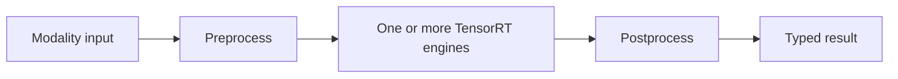
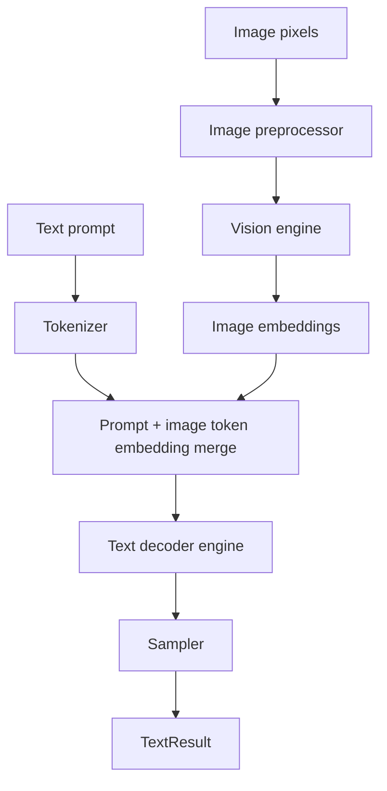
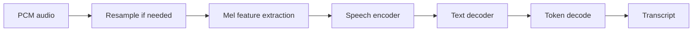
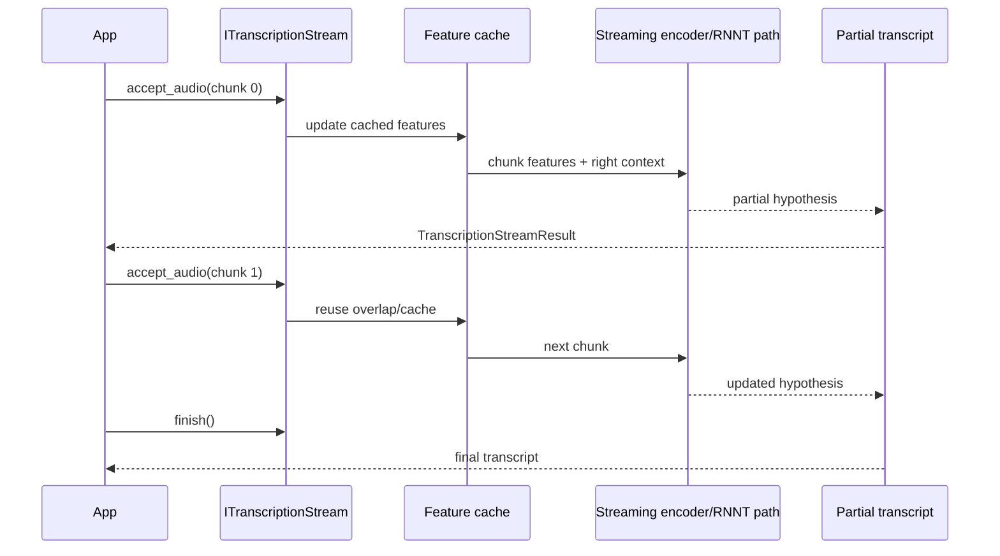
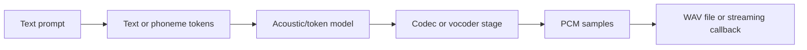

This tutorial exercises non-text modalities that still use the same bundle/runtime contract.

By this point you should recognize the common pattern:



The difference between text, vision, and speech is mostly the preprocessing, component layout, and postprocessing. The bundle and plugin registry model stays the same.

## Vision-language

```bash
./build/trtmc build Qwen/Qwen2.5-VL-3B-Instruct \
  -o /tmp/qwen25vl.trtfb \
  --precision fp16 \
  --max-cache-length 384

./build/trtmc run /tmp/qwen25vl.trtfb \
  --prompt "Describe this image in one sentence." \
  --image tests/assets/test_image.jpg \
  --max-new-tokens 48
```

The family plugin builds a vision encoder and a text decoder. The runtime plugin creates a `VLPipeline`, preprocesses the image, injects image embeddings into the prompt flow, and decodes text.



Key ideas:

| Concept | Meaning |
| --- | --- |
| Image preprocessing | Resize, crop/pad, normalize, and lay out pixels as the vision encoder expects. |
| Image embeddings | Numeric representation of the image produced by the vision component. |
| Prompt injection | The runtime inserts image embeddings into the text decoder flow at model-specific placeholder positions. |
| Output | Text generation still uses the decoder loop and sampler. |

## Speech-to-text

```bash
./build/trtmc build openai/whisper-large-v3-turbo \
  -o /tmp/whisper.trtfb \
  --precision fp16

./build/trtmc transcribe /tmp/whisper.trtfb \
  --audio tests/e2e/data/Recording.wav \
  --max-new-tokens 224
```

`speech_to_text` bundles use audio preprocessing, mel feature extraction, encoder/decoder execution, and text decoding.



The important beginner mistake is to treat audio as if it were text. Speech models usually do not consume raw waveform directly inside the decoder. They first convert audio into feature frames.

## Streaming ASR

```bash
./build/trtmc transcribe /tmp/nemotron-rnnt.trtfb \
  --audio tests/e2e/data/Recording.wav \
  --stream \
  --chunk-ms 160 \
  --att-context-size 70,13
```

Cache-aware streaming uses `TranscriptionStreamConfig` in `include/trtmc/pipeline.h`. Right contexts `{0, 1, 6, 13}` correspond to the supported FastConformer-RNNT schedules documented in code comments.



Streaming adds two concerns that offline transcription does not have:

| Concern | Why it matters |
| --- | --- |
| Chunk schedule | The model only sees part of the audio at a time. |
| Right context | Some future frames are needed for accuracy; larger right context increases latency. |
| Feature cache | Overlapping audio/features should not be recomputed every chunk. |
| Partial results | Applications may display interim hypotheses before finalization. |

## Text-to-audio

```bash
./build/trtmc generate-audio /tmp/magpie.trtfb \
  --prompt "A calm narration for a product demo." \
  --output /tmp/out.wav
```

Magpie supports chunked audio callbacks in the C++ API and `trtmc serve-audio` in the CLI.



Text-to-audio is a good example of why `IPipeline` has task-specific methods. The output is not token IDs or a string; it is `AudioResult` or chunks delivered through `generate_audio_streaming`.

## What to inspect in multimodal bundles

| Modality | Inspect for |
| --- | --- |
| Vision-language | Vision engine section, tokenizer assets, image preprocessing config, `vision_language` strategy. |
| Speech-to-text | Audio feature metadata, tokenizer assets, encoder/decoder sections, `speech_to_text` strategy. |
| Streaming ASR | RNNT/streaming config, supported context schedule, `speech_to_text_rnnt` strategy. |
| Text-to-audio | Acoustic and codec sections, tokenizer/phoneme assets, audio sample-rate metadata. |
