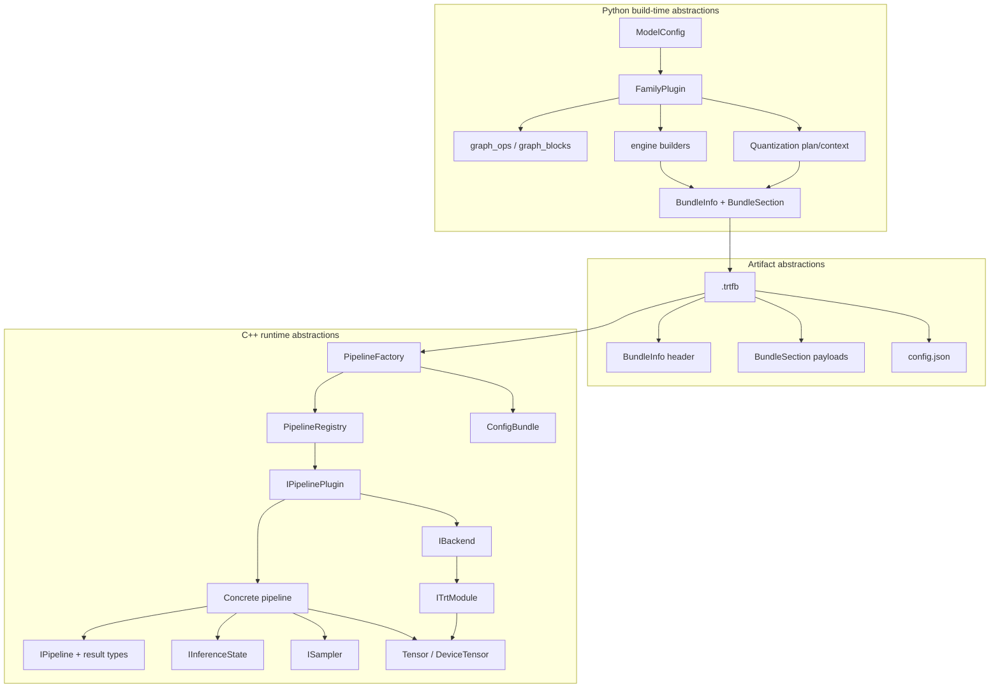
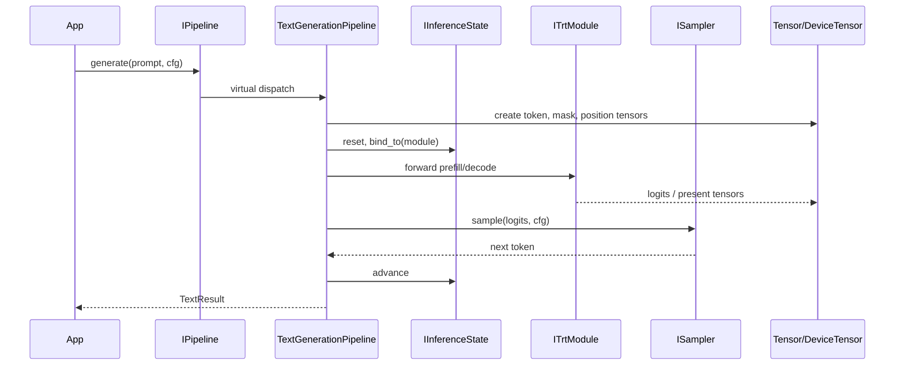
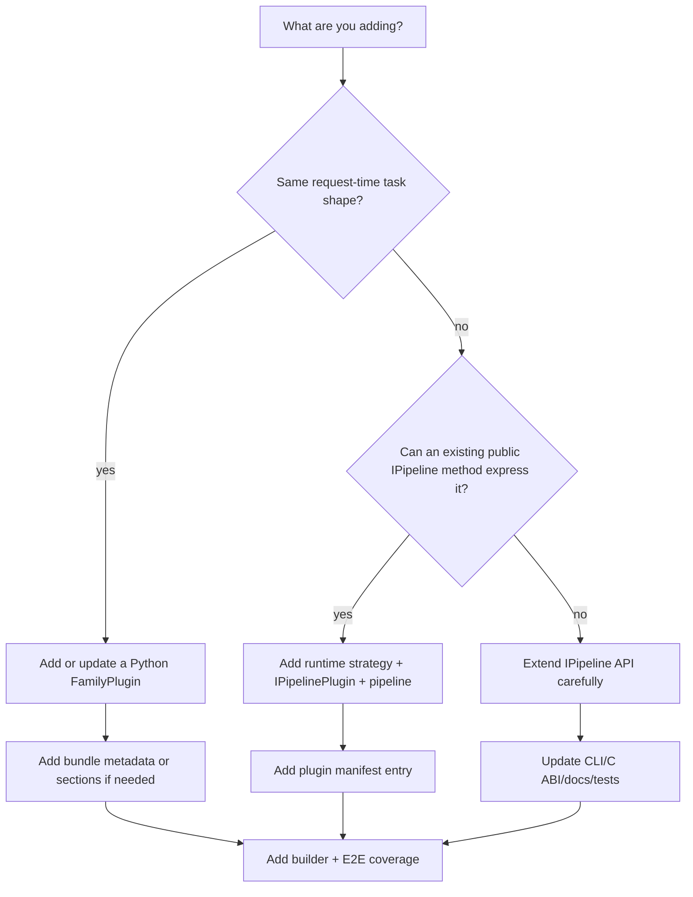

import useBaseUrl from '@docusaurus/useBaseUrl';

This page maps the abstract building blocks in TensorRT-Model-Connect to the code that implements them.

<figure className="trtmc-diagram trtmc-diagram--wide">
  

    
  

  <figcaption>Most source changes belong to one of three ownership zones: builder, bundle boundary, or runtime.</figcaption>
</figure>

## Beginner Map

Start with these seven blocks before reading the full source-level map:

| Layer | Block | Question it answers |
| --- | --- | --- |
| Source model | HuggingFace checkpoint | What model files did we start from? |
| Build adapter | `FamilyPlugin` | Which Python code understands this model family? |
| Engine artifact | TensorRT engine plan | What optimized GPU execution bytes did we build? |
| Bundle contract | `.trtfb` | What exactly crosses from Python build time to C++ run time? |
| Runtime dispatch | `runtime_strategy` | Which C++ runtime behavior should load this bundle? |
| Runtime construction | `IPipelinePlugin` | Which plugin creates the concrete pipeline? |
| User API | `IPipeline` | Which task method does the application call? |

The full map below expands those seven blocks into the concrete helper units used by builders, bundles, plugins, backends, tensors, and tests.

## Ownership Layers

| Layer | Owns | Typical edit |
| --- | --- | --- |
| Beginner/core path | `FamilyPlugin`, `.trtfb`, `runtime_strategy`, `IPipeline` | Add a similar model family or debug one bundle. |
| Extension path | New graph builder, runtime plugin, config schema, or test manifest | Add a new request-time behavior or modality. |
| Infrastructure path | Backend DSOs, registration generation, CMake targets | Change loading, ABI isolation, or build ownership. |

## End-to-end building-block map

## Build-time blocks

| Block | Source | What it abstracts | Why it exists |
| --- | --- | --- | --- |
| `ModelConfig` | `python/tensorrt_model_connect/config.py` | HuggingFace config differences. | Many model repos use different key names for the same concepts. This gives builders one typed view. |
| `FamilyPlugin` | `python/tensorrt_model_connect/families/base.py` | A model-family adapter. | Matching, weight loading, graph construction, modality-specific components, and quantization hooks vary by family. |
| `WeightDict` and checkpoint mapper | `python/tensorrt_model_connect/checkpoint_mapper.py` | Normalized weight names and tensors. | Builders need stable tensor names even when checkpoint layouts differ. |
| `graph_ops.py` | `python/tensorrt_model_connect/graph_ops.py` | Atomic TensorRT graph operations. | Family builders should not rewrite low-level TRT layer creation repeatedly. |
| `graph_blocks.py` | `python/tensorrt_model_connect/graph_blocks.py` | Reusable transformer/model blocks. | Shared blocks keep attention, MLP, normalization, and projection patterns consistent. |
| Dedicated builders | `standard_decoder_builder.py`, `encoder_builder.py`, `*_builder.py` | Engine construction flows. | Different model shapes need different graph topology and profile handling. |
| Quantization context | `python/tensorrt_model_connect/quantization/` | Calibration, scales, formats, exclusions. | Quantization needs model-aware policy without leaking into every builder. |
| Python `ConfigBundle` mirror | `python/tensorrt_model_connect/runtime_config/` | Schema-controlled build/runtime config merge. | Python writes bundle defaults using the same conceptual layers as C++. |
| `BundleInfo` / `BundleSection` | `python/tensorrt_model_connect/bundle_writer.py` | Bundle metadata and named payloads. | The runtime needs a structured artifact, not a directory of unrelated files. |

## Artifact blocks

| Block | Source | What it abstracts |
| --- | --- | --- |
| `.trtfb` magic/header/sections | `python/tensorrt_model_connect/bundle_writer.py`, `src/bundle/bundle_format.cpp` | A portable container format for build output. |
| `BundleInfo` | `include/trtmc/bundle.h`, internal `src/bundle/bundle_format.h` | Fast metadata inspection without constructing a pipeline. |
| `config.json` section | Written by builder, read in `PipelineFactory` and plugins | Runtime strategy, IO map, backend name, and strategy-specific fields. |
| Engine sections | Bundle sections such as `engine_plan`, `vision_engine_plan`, `denoiser_plan` | Serialized TensorRT execution plans. |
| Asset sections | Tokenizer, preprocessor, kernel, scale, and family metadata files | Data needed for preprocessing, postprocessing, or custom execution. |

## Runtime blocks

| Block | Source | What it abstracts | Who should use it |
| --- | --- | --- | --- |
| `IPipeline` | `include/trtmc/pipeline.h` | User-facing task interface and typed results. | Applications, CLI, C ABI, tests. |
| `LoadOptions` | `include/trtmc/pipeline.h` | Bundle load-time knobs. | Applications and CLI. |
| `PipelineFactory` | `src/runtime/registry/pipeline_factory.cpp` | Bundle-to-pipeline construction. | Public API and C ABI. |
| `PipelineRegistry` | `src/runtime/registry/pipeline_registry.cpp` | Strategy-to-plugin lookup. | Factory and registration tests. |
| `IPipelinePlugin` | `include/trtmc/runtime/pipeline_plugin.h` | Strategy-specific pipeline construction. | Runtime plugin implementations. |
| `PipelineContext` | `include/trtmc/runtime/pipeline_plugin.h` | The construction context passed to plugins. | Runtime plugin implementations. |
| `IBackend` | `include/trtmc/runtime/trt_backend.h` | Backend DSO interface. | Plugins creating modules. |
| `ITrtModule` | `include/trtmc/runtime/trt_module.h` | Engine execution and tensor introspection without TensorRT headers. | Pipelines and runtime core. |
| `Tensor` | `include/trtmc/runtime/tensor.h` | CPU-side tensor view. | Pipeline input/output binding. |
| `DeviceTensor` | `include/trtmc/runtime/device_tensor.h` | Owned GPU tensor storage. | Runtime core and pipelines. |
| `IInferenceState` | `src/runtime/models/<family>/inference_state.h` | Per-sequence decode state. | Text/recurrent/hybrid pipelines. |
| `ISampler` | `src/runtime/models/<family>/sampler.h` | Token selection from logits. | Text-generation pipelines. |
| `ConfigBundle` | `include/trtmc/config/config_bundle.h` | Resolved layered runtime config. | Factory and migrated plugins. |

## How the blocks interact during text generation

## Choosing the right extension point

Use this decision tree:

<figure className="trtmc-diagram trtmc-diagram--wide">
  

    
  

  <figcaption>The decision path keeps family conversion, runtime behavior, public API, and validation from drifting together.</figcaption>
</figure>

The preferred path is usually the smallest one: add build-time support if runtime behavior already exists; add runtime strategy only when request-time behavior genuinely differs.
