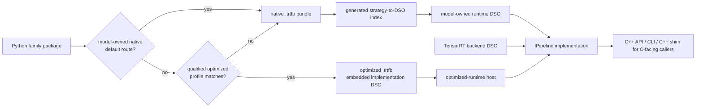
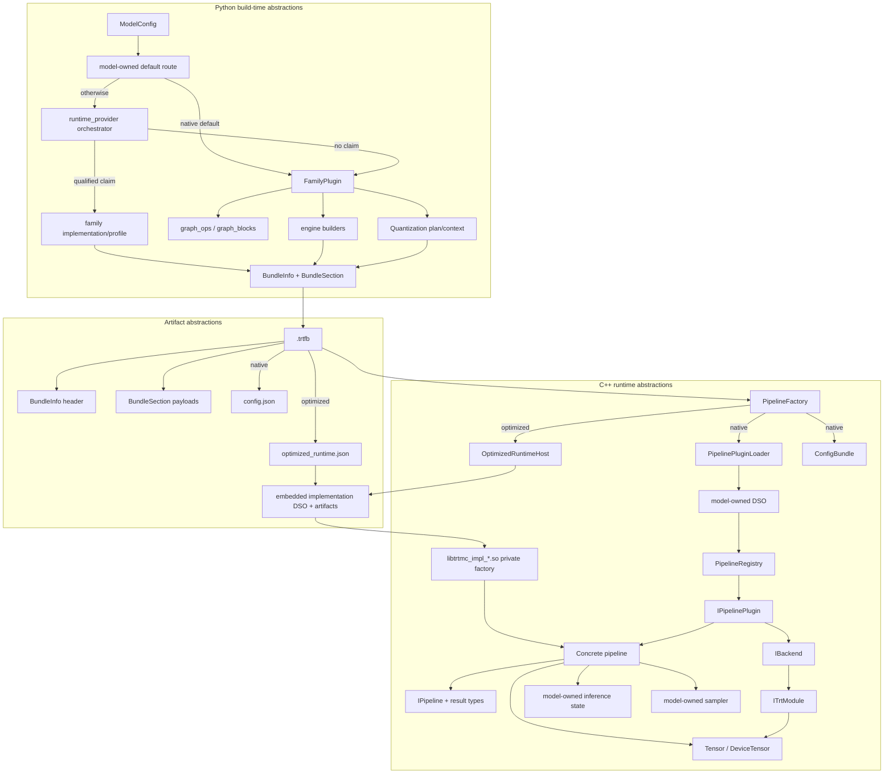
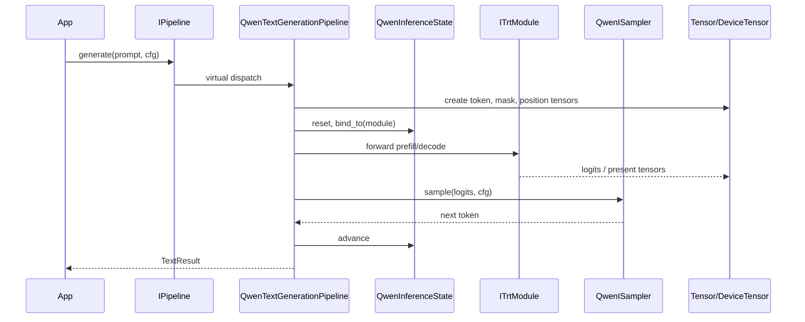
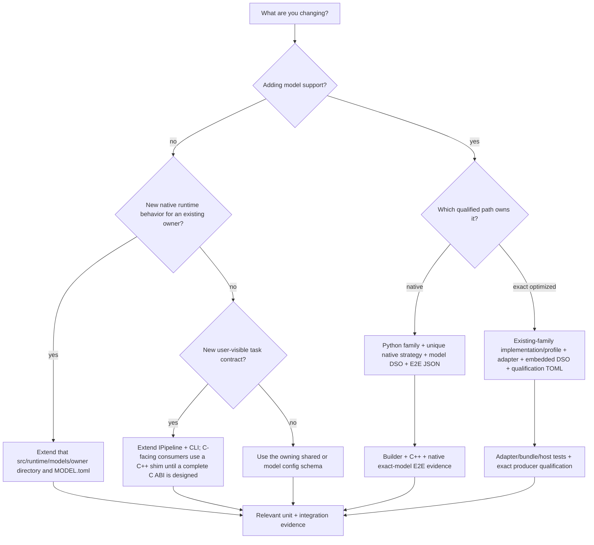

This page maps the abstract building blocks in TensorRT-Model-Connect to the code that implements them.

Most native model additions span the Python family, bundle metadata,
model-owned runtime DSO, and E2E descriptor. A qualified optimized
implementation adds a family-owned provider manifest/profile and embedded
implementation DSO instead of another native `runtime_strategy`. Shared
infrastructure supplies both loading contracts.

## Beginner Map

Start with these eight blocks before reading the full source-level map:

| Layer | Block | Question it answers |
| --- | --- | --- |
| Source model | Hugging Face checkpoint | What model files did we start from? |
| Build adapter | Native `FamilyPlugin` or exact-qualified optimized adapter | Which family-owned code claims this build request? |
| Build artifact | Native TensorRT plans or optimized provider artifacts | What execution payload did the selected path produce? |
| Bundle contract | `.trtfb` | What exactly crosses from Python build time to C++ run time? |
| Native runtime dispatch | `runtime_strategy` | Which model-owned DSO and plugin should load this native bundle? |
| Optimized runtime dispatch | `optimized_runtime.json` | Which embedded implementation DSO and qualified profile own this optimized bundle? |
| Runtime construction | Native `IPipelinePlugin` or optimized private factory | Which path creates the concrete pipeline? |
| User API | `IPipeline` | Which task method does the application call? |

The full map below expands those eight blocks into the concrete helper units used by builders, bundles, plugins, backends, tensors, and tests.

## Ownership Layers

| Layer | Owns | Typical edit |
| --- | --- | --- |
| Beginner/core path | Native `FamilyPlugin` or optimized adapter, `.trtfb`, path-specific dispatch, `IPipeline` | Trace or debug one supported model. |
| Native model extension | Python family package, C++ model DSO, config schema, and native E2E JSON manifest | Add native support or native model-owned behavior. |
| Exact-qualified optimized extension | Existing family adapter subtree, implementation/profile manifests, embedded implementation DSO, and qualification TOML | Add a delegated implementation for one qualified model/revision/target/options tuple without a synthetic native strategy. |
| Infrastructure path | Backend DSOs, registration generation, CMake targets | Change loading, ABI isolation, or build ownership. |

## End-to-end building-block map

## Build-time blocks

| Block | Source | What it abstracts | Why it exists |
| --- | --- | --- | --- |
| `ModelConfig` | `python/tensorrt_model_connect/config.py` | Hugging Face config differences. | Many model repos use different key names for the same concepts. This gives builders one typed view. |
| `FamilyPlugin` | `python/tensorrt_model_connect/families/base.py` | A model-family adapter. | Matching, weight loading, graph construction, modality-specific components, and quantization hooks vary by family. |
| `WeightDict` and checkpoint mapper | `python/tensorrt_model_connect/checkpoint_mapper.py` | Normalized weight names and tensors. | Builders need stable tensor names even when checkpoint layouts differ. |
| Family-owned graph helpers | `python/tensorrt_model_connect/families/<family>/graph_ops.py` and `graph_blocks.py` when present | TensorRT graph operations and reusable blocks for one family. | Helpers stay beside the model code that defines their assumptions; there are no repository-root graph helper modules. |
| Family-owned builders | Files such as `python/tensorrt_model_connect/families/qwen/standard_decoder_builder.py` | Engine construction flows. | Different model shapes need different graph topology and profile handling without a central model switch. |
| Quantization context | `python/tensorrt_model_connect/quantization/` | Calibration, scales, formats, exclusions. | Quantization needs model-aware policy without leaking into every builder. |
| Python `ConfigBundle` mirror | `python/tensorrt_model_connect/runtime_config/` | Schema-controlled config helpers. | A producer may explicitly write a top-level `defaults` object in `config.json`, but the ordinary builder does not automatically persist build-time `--config`/`--set` values as `BundleDefault`. `PipelineFactory` currently combines optional `config.json` defaults with runtime `SessionRequest`; binary header defaults and separate `BuildTime`/`PlatformProfile` contributions are not wired. |
| Optimized provider orchestrator | `python/tensorrt_model_connect/runtime_provider/` | Family-bounded implementation discovery, exact profile selection, isolated adapter execution, and generic bundle packaging. | Delegated runtimes stay family-owned without changing the public build API. |
| `BundleInfo` / `BundleSection` | `python/tensorrt_model_connect/bundle_writer.py` | Bundle metadata and named payloads. | The runtime needs a structured artifact, not a directory of unrelated files. |

## Artifact blocks

| Block | Source | What it abstracts |
| --- | --- | --- |
| `.trtfb` magic/header/sections | `python/tensorrt_model_connect/bundle_writer.py`, `src/bundle/bundle_format.cpp` | A portable container format for build output. |
| `BundleInfo` | `include/trtmc/bundle.h`, internal `src/bundle/bundle_format.h` | Fast metadata inspection without constructing a pipeline. |
| `config.json` section | Written by the native builder, read in `PipelineFactory` and plugins | Native runtime strategy, IO map, backend name, and strategy-specific fields; optional for optimized bundles. |
| `optimized_runtime.json` and embedded artifact tree | Written by `runtime_provider/bundle.py`, read by `optimized_runtime_host.cpp` | Exact delegated implementation/profile/factory identity and integrity-bound payload, including its implementation DSO. |
| Engine sections | Bundle sections such as `engine_plan`, `vision_engine_plan`, `denoiser_plan` | Serialized TensorRT execution plans. |
| Asset sections | Tokenizer, preprocessor, kernel, scale, and family metadata files | Data needed for preprocessing, postprocessing, or custom execution. |

Neither artifact path is a complete operating-system or GPU-runtime image.
Native bundles rely on installed model/backend DSOs; optimized bundles embed
their exact implementation DSO. Both still rely on the host's compatible
NVIDIA driver, CUDA runtime, TensorRT, dynamic loader, and system libraries.

## Runtime blocks

| Block | Source | What it abstracts | Who should use it |
| --- | --- | --- | --- |
| `IPipeline` | `include/trtmc/pipeline.h` | User-facing task interface and typed results. | Applications, CLI, C-linkage C++ shims, tests. |
| `LoadOptions` | `include/trtmc/pipeline.h` | Bundle load-time knobs. | Applications and CLI. |
| `PipelineFactory` | `src/runtime/registry/pipeline_factory.cpp` | Bundle-to-pipeline construction. | Public C++ API and C-linkage C++ subset. |
| Optimized-runtime host | `src/runtime/providers/optimized_runtime_host.cpp` | Embedded artifact verification and implementation-DSO factory loading. | Factory and optimized-runtime contract tests. |
| `PipelinePluginLoader` | `src/runtime/registry/pipeline_plugin_loader.cpp` | Native strategy-owner lookup, model DSO loading, and registration validation. | The factory and loader tests. |
| `PipelineRegistry` | `src/runtime/registry/pipeline_registry.cpp` | Strategy-to-plugin lookup. | Factory and registration tests. |
| `IPipelinePlugin` | `include/trtmc/runtime/pipeline_plugin.h` | Strategy-specific pipeline construction. | Runtime plugin implementations. |
| `PipelineContext` | `include/trtmc/runtime/pipeline_plugin.h` | The construction context passed to plugins. | Runtime plugin implementations. |
| `IBackend` | `include/trtmc/runtime/trt_backend.h` | Backend DSO interface. | Plugins creating modules. |
| `ITrtModule` | `include/trtmc/runtime/trt_module.h` | Engine execution and tensor introspection without TensorRT headers. | Pipelines and runtime core. |
| `Tensor` | `include/trtmc/runtime/tensor.h` | CPU-side tensor view. | Pipeline input/output binding. |
| `DeviceTensor` | `include/trtmc/runtime/device_tensor.h` | Owned GPU tensor storage. | Runtime core and pipelines. |
| Model inference state | `src/runtime/models/<owner>/inference_state.h` when present | Per-sequence decode state under an owner-specific interface such as `QwenInferenceState`. | That owner's text, recurrent, or hybrid pipeline. |
| Model sampler | `src/runtime/models/<owner>/sampler.h` when present | Token selection from logits under an owner-specific interface such as `QwenISampler`. | That owner's text-generation pipeline. |
| `ConfigBundle` | `include/trtmc/config/config_bundle.h` | Resolved layered runtime config. | Factory and migrated plugins. |

## How the blocks interact during text generation

## Choosing the right extension point

Do not point a new family at another model's runtime strategy. Similar models
may reuse source patterns, but each natively supported model owns a unique
strategy key, DSO, and registration manifest. Exact-qualified optimized
support instead owns an implementation/profile, embedded implementation DSO,
and qualification record; it does not need a synthetic native strategy. E2E
`task_strategy` is where models with the same user-visible task are grouped.
