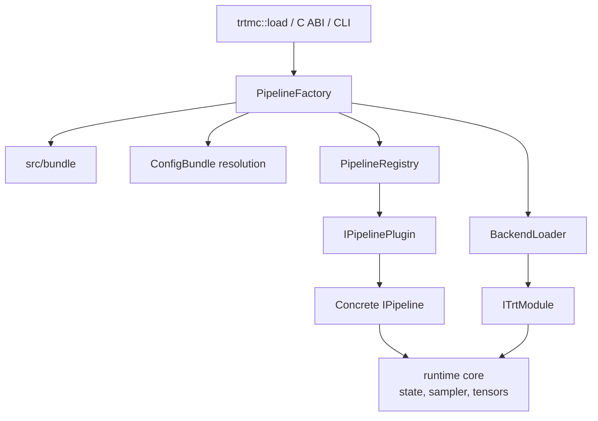
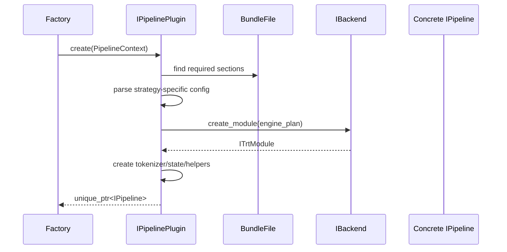
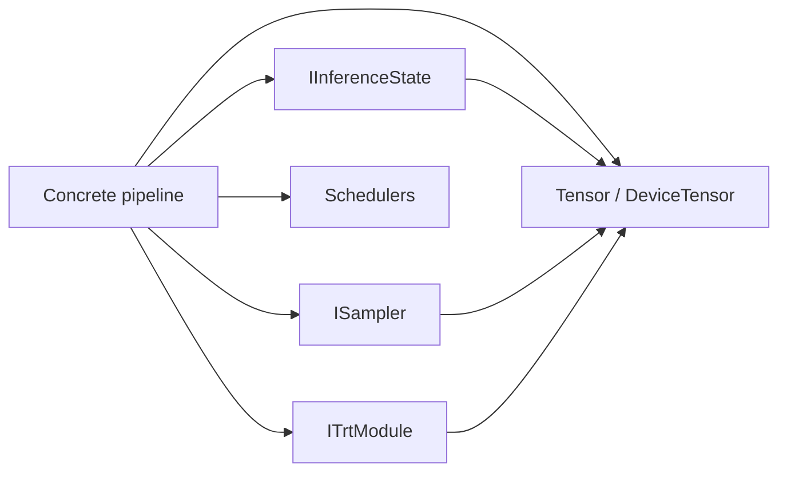

The C++ runtime turns a `.trtfb` bundle into a task object. It owns native API stability, bundle dispatch, backend loading, request state, and postprocessing.

## Pipeline factory

`src/runtime/registry/pipeline_factory.cpp` is the single creation path for runtime pipelines. It reads the bundle, resolves config, loads the backend, and delegates construction to a plugin.

Factory responsibilities:

- Read and validate the bundle container.
- Extract `config.json`.
- Normalize legacy strategy names such as old generic diffusion or text-to-audio keys.
- Resolve layered runtime config.
- Select and load a backend DSO.
- Look up the plugin by `runtime_strategy`.
- Create `PipelineContext` and call `IPipelinePlugin::create()`.

Factory non-responsibilities:

- It should not parse model-family-specific sections.
- It should not contain a central switch for every supported model.
- It should not own per-request loops.

## Pipeline registry

`src/runtime/registry/pipeline_registry.cpp` maps runtime strategy strings to `IPipelinePlugin` instances. It is intentionally small and should not learn model-family details.

Built-in plugins are registered through generated manifest calls. Ad hoc static registration macros remain for tests and local extensions.

## Plugins

`src/runtime/plugins/` files parse strategy-specific config and assemble pipelines. They own the boundary between generic bundle metadata and concrete runtime classes.

Examples:

- `decoder_plugin.cpp` handles `decoder_kv_cache` and `decoder_moe`.
- `encoder_plugin.cpp` handles encoder, embedding, reranking, and neural operator strategies.
- `rnnt_plugin.cpp` handles cache-aware streaming ASR.
- `pixart/plugin.cpp` handles native TRT PixArt bundles.

Plugin construction typically follows this sequence:

## Pipelines

`src/runtime/models/` files own task execution. Pipeline classes override only the `IPipeline` methods they support.

Examples:

| Pipeline | Primary method | Core runtime concerns |
| --- | --- | --- |
| `TextGenerationPipeline` | `generate` | Tokenization, prefill/decode loop, KV cache, sampler, stopping. |
| `VLPipeline` | `generate(prompt, image, ...)` | Image preprocessing, vision engine execution, image embedding injection, text decoding. |
| `WhisperPipeline` | `transcribe` | Audio preprocessing, encoder/decoder execution, token decoding. |
| `RnntPipeline` | `create_transcription_stream` / streaming transcription | Chunk schedule, feature cache, RNNT state, partial results. |
| `FluxPipeline`, `WanPipeline`, `ZImagePipeline` | `generate_image` | Prompt encoding, denoising loop, scheduler, VAE decode. |
| `TimesFmPipeline` | `solve` | Numeric tensor preparation and forecast output. |

The public `IPipeline` interface uses default throwing methods. That keeps the API broad without forcing every pipeline to implement every task.

## Core runtime

Core runtime units own reusable device-side execution concerns:

- `DeviceTensor`
- `KvCache`
- `DeviceKvCache`
- `RecurrentState`
- `Sampler`
- `FlowMatchEulerScheduler`
- CUDA streams and buffers
- TensorRT engine lifecycle wrappers

These units are where shared request-time mechanics should live. For example, a new cache policy should extend the inference-state layer rather than being hard-coded in one decoder plugin.

## Backend DSOs

`src/runtime/backend/` owns TensorRT ABI isolation. The main runtime loads backend DSOs dynamically instead of linking one TensorRT version directly into the public runtime.

`IBackend` creates `ITrtModule` objects from serialized engine plans. `ITrtModule` hides TensorRT execution-context details behind methods such as:

- `forward` and `forward_device`.
- `forward_device_async` and `sync`.
- `input_info` and `output_info`.
- `bind_external` for cache/state buffers.
- `optimization_profile_count` and profile shape introspection.

This is what lets the public runtime compile without TensorRT headers while still executing TensorRT engines through a loaded backend.
