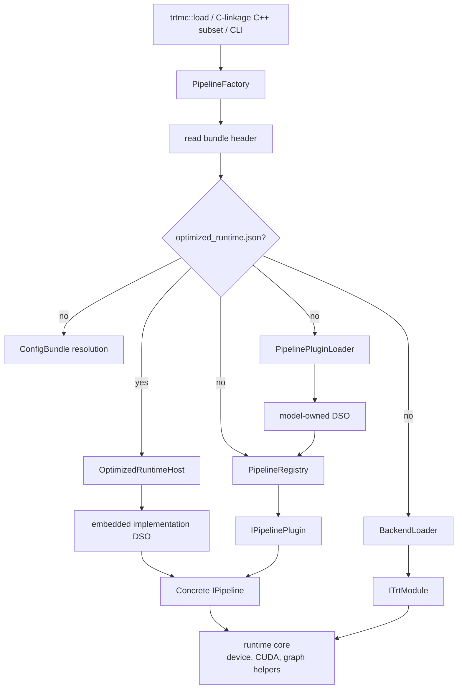
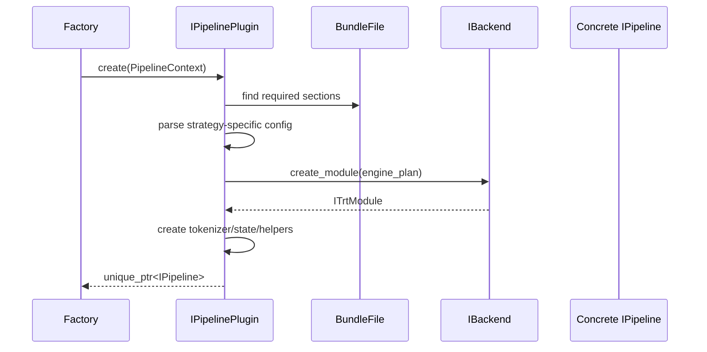

The C++ runtime turns a `.trtfb` bundle into a task object. It owns native API stability, bundle dispatch, backend loading, request state, and postprocessing.



## Pipeline factory

`src/runtime/registry/pipeline_factory.cpp` is the single public creation path
for runtime pipelines. It reads the bundle header and chooses either the
optimized-runtime host or the native strategy/plugin path.

Factory responsibilities:

- Read and validate the bundle container.
- If `optimized_runtime.json` exists, validate its bounded descriptor,
  integrity-check/materialize the embedded artifact tree, load its exact
  implementation DSO, validate the private factory ABI and identities, and
  return its `IPipeline`. A failure after this marker is terminal.
- Otherwise extract `config.json`, ask the generated model-plugin index for the
  strategy owner, and load that owner's DSO. Manifest-declared legacy aliases
  are normalized during this lookup.
- On the native path, resolve layered runtime config, select/load a backend
  DSO, look up the plugin by `runtime_strategy`, create `PipelineContext`, and
  call `IPipelinePlugin::create()`.

Factory non-responsibilities:

- It should not parse model-family-specific sections.
- It should not contain a central switch for every supported model.
- It should not own per-request loops.

## Optimized-runtime host

`src/runtime/providers/optimized_runtime_host.cpp` recognizes an optimized
bundle before native config materialization. `optimized_runtime.json` names
the implementation, model, profile, downstream runtime, private factory ABI,
metadata section, artifact prefix, exact `libtrtmc_impl_*.so`, and artifact
tree hash. The generic host:

1. validates descriptor keys, identities, sizes, and safe relative paths;
2. materializes the exact embedded tree into a content-addressed cache and
   verifies every payload hash;
3. loads only the embedded implementation DSO rather than searching installed
   model or backend paths;
4. checks its factory ABI, C++ toolchain ABI, implementation identity, and
   downstream runtime identity; and
5. passes opaque implementation metadata, the artifact path, and
   `LoadOptions` to the provider factory.

The implementation DSO returns the same public `IPipeline` abstraction, but
it owns downstream-runtime construction, batching, scheduling, and request
translation. This path does not resolve a native `runtime_strategy`, load a
`libtrtmc_model_*.so`, consult `PipelineRegistry`, or create `IBackend`.
`config.json` may be absent.

## Pipeline registry

On the native path,
`src/runtime/registry/pipeline_plugin_loader.cpp` maps a runtime strategy to one
manifest owner and DSO using the generated index. The DSO's generated registrar
invokes the symbols declared by that owner's `MODEL.toml`, then
`pipeline_registry.cpp` maps the strategy to an `IPipelinePlugin` instance.
Both units stay free of model-specific switches.

Built-in plugins are registered through generated manifest calls. Ad hoc static registration macros remain for tests and local extensions.

## Plugins

Each `src/runtime/models/<owner>/` directory parses its strategy-specific
config and assembles pipelines. Its `MODEL.toml` declares its DSO, registrar
symbols, unique strategy keys, focused tests, and optional config schemas.

Examples:

- `qwen/plugin.cpp` registers `qwen_decoder_kv_cache`.
- `bert/plugin.cpp` registers `bert_encoder_only`.
- `eagle_vlm/plugin.cpp` registers model-owned embedding and reranking
  strategies.
- `nemotron_speech_streaming/plugin.cpp` registers cache-aware streaming ASR.
- `pixart/plugin.cpp` registers `diffusion_pixart`.

Plugin construction typically follows this sequence:



## Pipelines

`src/runtime/models/` files own task execution. Pipeline classes override only the `IPipeline` methods they support.

Examples:

| Pipeline | Primary method | Core runtime concerns |
| --- | --- | --- |
| `QwenTextGenerationPipeline` | `generate` | Qwen tokenization, prefill/decode loop, KV cache, sampler, stopping. |
| `QwenVlPipeline`, `InternVlPipeline` | `generate(prompt, image, ...)` | Owner-specific image preprocessing, vision engine execution, image embedding injection, and text decoding. |
| `WhisperPipeline` | `transcribe` | Audio preprocessing, encoder/decoder execution, token decoding. |
| `RnntPipeline` | `create_transcription_stream` / streaming transcription | Chunk schedule, feature cache, RNNT state, partial results. |
| `FluxPipeline`, `WanPipeline`, `ZImagePipeline` | `generate_image` | Prompt encoding, denoising loop, scheduler, VAE decode. |
| `TimesFmPipeline` | `solve` | Numeric tensor preparation and forecast output. |

The public `IPipeline` interface uses default throwing methods. That keeps the API broad without forcing every pipeline to implement every task.

## Concurrency and pipeline pooling

A single `IPipeline` owns mutable execution-context, CUDA stream, cache/state,
and adapter-binding data. The public contract does not make concurrent calls on
one instance safe. Serialize access to one pipeline, or use
`PipelineFactory::from_bundle_pool()` for concurrent requests on a native
bundle.

`PipelinePool` owns independent lanes. `acquire()` blocks until one lane is
available; `try_acquire()` returns no lease when exhausted. A move-only lease
grants exclusive access to exactly one lane and releases it on destruction, so
each in-flight request has isolated mutable state. Native plugins may override
`IPipelinePlugin::create_pool()` to share immutable engine weights; the default
creates one complete pipeline per lane.

```cpp
#include <trtmc/runtime/pipeline_factory.h>
#include <trtmc/runtime/pipeline_pool.h>

auto pool = trtmc::PipelineFactory::from_bundle_pool(
    "/tmp/native-model.trtfb", 4);

auto lease = pool->acquire();
auto result = lease->generate("One request owns this lane");
```

`from_bundle_pool()` rejects `pool_size == 0`. It also rejects an
optimized-runtime bundle before loading its implementation DSO because the
delegated runtime owns batching and scheduling. Load that bundle with
`from_bundle()` and follow the selected provider's request/concurrency
contract; do not wrap it in the native `PipelinePool`.

## Core runtime

Core runtime units own reusable device-side execution concerns:

- `DeviceTensor`
- distributed-runtime setup
- pipeline pooling
- CUDA and TensorRT graph helpers
- step-state utilities
- shared CUDA streams, buffers, and TensorRT lifecycle helpers

Model-specific caches, inference-state classes, samplers, schedulers, and
pipelines live under `src/runtime/models/<owner>/`. They are not shared core
interfaces merely because several models implement similar loops. Move code to
`src/runtime/core/` or `src/runtime/domains/` only after multiple real owners
need an assumption-free abstraction; the current shared domains contain only a
small diffusion-math helper plus kernel build support.

## Backend DSOs

`src/runtime/backend/` owns TensorRT ABI isolation. The main runtime loads backend DSOs dynamically instead of linking one TensorRT version directly into the public runtime.

`IBackend` creates `ITrtModule` objects from serialized engine plans. `ITrtModule` hides TensorRT execution-context details behind methods such as:

- `forward` and `forward_device`.
- `forward_device_async` and `sync`.
- `input_info` and `output_info`.
- `bind_external` for cache/state buffers.
- `optimization_profile_count` and profile shape introspection.

This is what lets the public runtime compile without TensorRT headers while still executing TensorRT engines through a loaded backend.
