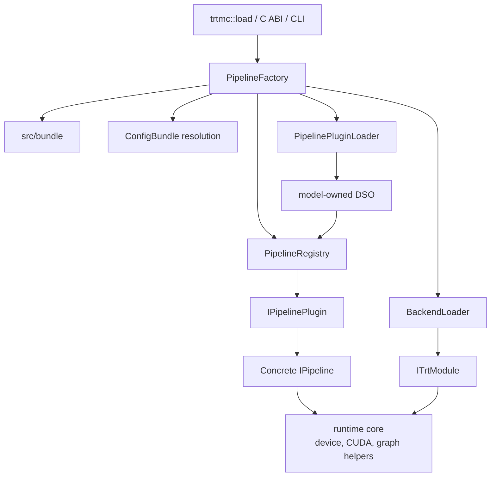
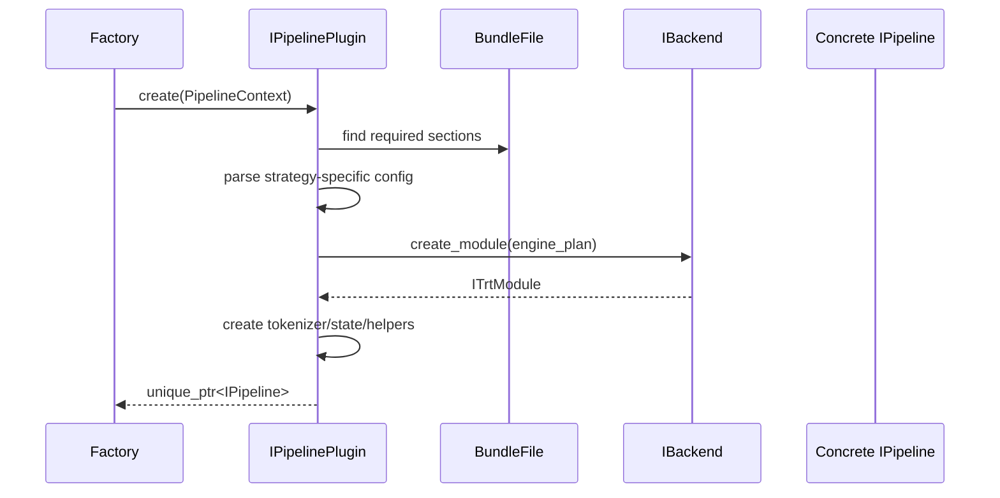

The C++ runtime turns a `.trtfb` bundle into a task object. It owns native API stability, bundle dispatch, backend loading, request state, and postprocessing.

## Pipeline factory

`src/runtime/registry/pipeline_factory.cpp` is the single creation path for runtime pipelines. It reads the bundle, resolves config, loads the backend, and delegates construction to a plugin.

Factory responsibilities:

- Read and validate the bundle container.
- Extract `config.json`.
- Ask the generated model-plugin index for the strategy owner and load that
  owner's DSO. Manifest-declared legacy aliases are normalized during this
  lookup.
- Resolve layered runtime config.
- Select and load a backend DSO.
- Look up the plugin by `runtime_strategy`.
- Create `PipelineContext` and call `IPipelinePlugin::create()`.

Factory non-responsibilities:

- It should not parse model-family-specific sections.
- It should not contain a central switch for every supported model.
- It should not own per-request loops.

## Pipeline registry

`src/runtime/registry/pipeline_plugin_loader.cpp` maps a runtime strategy to one
manifest owner and DSO using the generated index. The DSO's generated registrar
invokes the symbols declared by that owner's `MODEL.toml`, then
`pipeline_registry.cpp` maps the strategy to an `IPipelinePlugin` instance.
Both units stay free of model-specific switches.

Built-in plugins are registered through generated manifest calls. Ad hoc static registration macros remain for tests and local extensions.

## Plugins

Each `src/runtime/models/<owner>/` directory parses its strategy-specific
config and assembles pipelines. Its `MODEL.toml` declares its DSO, registrar
symbols, unique strategy keys, focused tests, and optional config schemas.

Examples:

- `qwen/plugin.cpp` registers `qwen_decoder_kv_cache`.
- `bert/plugin.cpp` registers `bert_encoder_only`.
- `eagle_vlm/plugin.cpp` registers model-owned embedding and reranking
  strategies.
- `nemotron_speech_streaming/plugin.cpp` registers cache-aware streaming ASR.
- `pixart/plugin.cpp` registers `diffusion_pixart`.

Plugin construction typically follows this sequence:

## Pipelines

`src/runtime/models/` files own task execution. Pipeline classes override only the `IPipeline` methods they support.

Examples:

| Pipeline | Primary method | Core runtime concerns |
| --- | --- | --- |
| `QwenTextGenerationPipeline` | `generate` | Qwen tokenization, prefill/decode loop, KV cache, sampler, stopping. |
| `QwenVlPipeline`, `InternVlPipeline` | `generate(prompt, image, ...)` | Owner-specific image preprocessing, vision engine execution, image embedding injection, and text decoding. |
| `WhisperPipeline` | `transcribe` | Audio preprocessing, encoder/decoder execution, token decoding. |
| `RnntPipeline` | `create_transcription_stream` / streaming transcription | Chunk schedule, feature cache, RNNT state, partial results. |
| `FluxPipeline`, `WanPipeline`, `ZImagePipeline` | `generate_image` | Prompt encoding, denoising loop, scheduler, VAE decode. |
| `TimesFmPipeline` | `solve` | Numeric tensor preparation and forecast output. |

The public `IPipeline` interface uses default throwing methods. That keeps the API broad without forcing every pipeline to implement every task.

## Core runtime

Core runtime units own reusable device-side execution concerns:

- `DeviceTensor`
- distributed-runtime setup
- pipeline pooling
- CUDA and TensorRT graph helpers
- step-state utilities
- shared CUDA streams, buffers, and TensorRT lifecycle helpers

Model-specific caches, inference-state classes, samplers, schedulers, and
pipelines live under `src/runtime/models/<owner>/`. They are not shared core
interfaces merely because several models implement similar loops. Move code to
`src/runtime/core/` or `src/runtime/domains/` only after multiple real owners
need an assumption-free abstraction; the current shared domains contain only a
small diffusion-math helper plus kernel build support.

## Backend DSOs

`src/runtime/backend/` owns TensorRT ABI isolation. The main runtime loads backend DSOs dynamically instead of linking one TensorRT version directly into the public runtime.

`IBackend` creates `ITrtModule` objects from serialized engine plans. `ITrtModule` hides TensorRT execution-context details behind methods such as:

- `forward` and `forward_device`.
- `forward_device_async` and `sync`.
- `input_info` and `output_info`.
- `bind_external` for cache/state buffers.
- `optimization_profile_count` and profile shape introspection.

This is what lets the public runtime compile without TensorRT headers while still executing TensorRT engines through a loaded backend.
