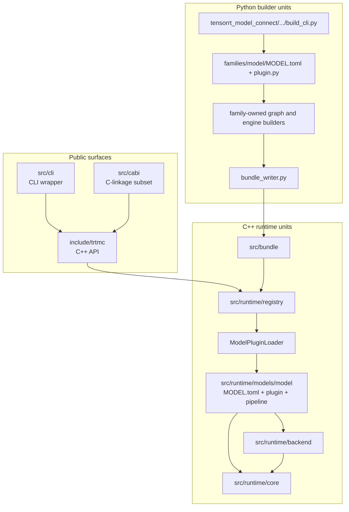

Unit design explains the source-level ownership model. Architecture tells you how the system works; unit design tells you where a change belongs.

The repository is organized around one rule: keep each model's build-time
adapter, runtime strategy, runtime plugin, pipeline code, and E2E descriptor
under model-owned roots. Shared code owns contracts, loading, bundle parsing,
backends, and genuinely reusable mechanics.

## Major unit groups

| Unit group | Main path | Owns |
| --- | --- | --- |
| Public API | `include/trtmc/` | User-facing C++ types, factories, tokenizer API, bundle inspection. |
| C-linkage subset | `src/cabi/api/` | C-linkage entrypoints, argument validation, and error mapping; pipeline ownership is not yet a complete pure-C contract. |
| Bundle reader | `src/bundle/` | `.trtfb` parsing and section lookup. |
| Registry | `src/runtime/registry/` | Strategy dispatch and plugin lookup. |
| Model runtimes | `src/runtime/models/` | Strategy-specific construction and task-specific inference behavior. |
| Runtime plugin loader | `src/runtime/registry/pipeline_plugin_loader.cpp` and generated index | Resolve one strategy owner, load its DSO, and verify registrations. |
| Runtime core | `src/runtime/core/` | Device tensors, CUDA helpers, distributed runtime, pipeline pooling, and TensorRT graph helpers. |
| Domains | `src/runtime/domains/` | Small cross-model domain helpers; currently only shared diffusion math. |
| Python builder | `python/tensorrt_model_connect/` | Model resolution, family-manifest discovery, graph building, and bundle writing. |
| Tests | `tests/` | Builder, C++, tools, and E2E coverage. |

## Ownership boundaries

| Boundary | Why it exists |
| --- | --- |
| `FamilyPlugin` versus `IPipelinePlugin` | A Python family knows how to build a model. Its C++ model DSO knows how to run the emitted model-owned strategy. E2E `task_strategy` is the separate user-task grouping. |
| `IPipelinePlugin` versus `IPipeline` | The plugin constructs objects once at load time. The pipeline owns request-time behavior. |
| `IBackend` versus pipeline code | Backend DSOs own TensorRT ABI details. Pipelines operate through `ITrtModule` and tensor abstractions. |
| `ConfigBundle` versus ad hoc flags | Runtime knobs need schema, layer priority, validation, and provenance. |
| E2E manifests versus unit tests | E2E manifests prove user contracts for supported models. Unit tests prove local behavior and edge cases. |

## Common change routing

| Change | Start here | Usually also update |
| --- | --- | --- |
| Add a model that is architecturally similar to an existing decoder | `python/tensorrt_model_connect/families/<family>/`, `src/runtime/models/<owner>/`, and `tests/e2e/models/<family>/` | A unique runtime strategy/DSO, builder and C++ tests, E2E manifest, model support docs. |
| Add request-time behavior for an existing model owner | `src/runtime/models/<owner>/` | Owner `MODEL.toml`, C++ tests, E2E evidence, CLI/API docs when the public task changes. |
| Add a new runtime knob | `src/runtime/config/`, `include/trtmc/config/`, Python mirror under `runtime_config/` | Generated schema manifest, config tests, docs. |
| Add quantization behavior | `python/tensorrt_model_connect/quantization/` and family hooks | Calibration tests, E2E tolerance updates. |
| Add a backend or ABI policy | `src/runtime/backend/` | Build system docs, backend tests, compatibility docs. |
| Add a CLI command | `src/cli/` | API docs, smoke tests, E2E harness if user-contract relevant. |

## Change rule

Prefer local ownership:

- Add a Python family package, a model-owned runtime strategy/DSO, and an E2E
  descriptor for every new supported model.
- Add another plugin or pipeline inside the same runtime owner when that model
  needs an additional runtime strategy.
- Extend the public `IPipeline` contract only when no existing method represents
  the new user-visible task.
- Add schema files for config surfaces instead of growing one-off CLI flags.

Do not solve extension work by adding central `if model_id contains ...` logic. The codebase is designed so model-specific knowledge lives in model-owned units and strategy-specific knowledge lives in strategy-owned units.

## How to read the unit docs

- [Building Blocks](/unit-design/building-blocks) is the map of abstractions and their source files.
- [Python Builder Units](python-builder.md) explains how model support becomes engine plans.
- [C++ Runtime Units](cpp-runtime.md) explains how bundles become task pipelines.
- [Testing Units](testing.md) explains which tests prove which contract.
