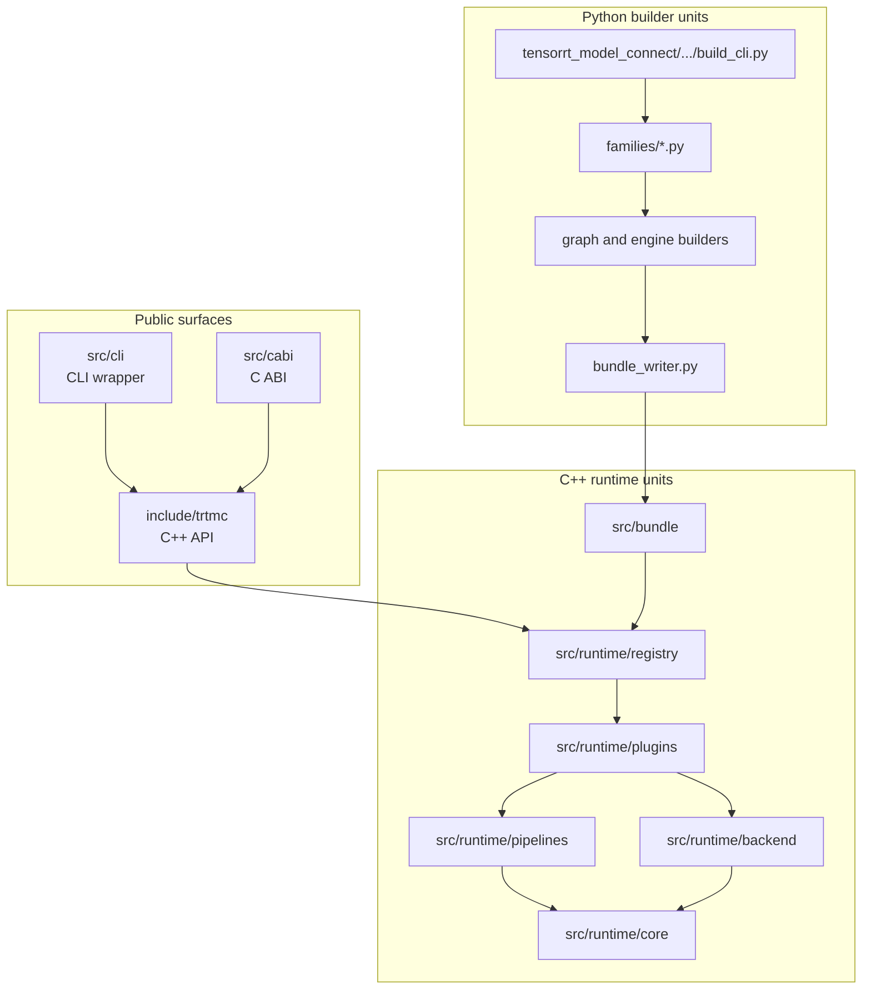

Unit design explains the source-level ownership model. Architecture tells you how the system works; unit design tells you where a change belongs.

The repository is organized around one rule: keep build-time model diversity in Python, keep runtime dispatch strategy-based in C++, and keep request-time behavior inside concrete pipelines.

## Major unit groups

| Unit group | Main path | Owns |
| --- | --- | --- |
| Public API | `include/trtmc/` | User-facing C++ types, factories, tokenizer API, bundle inspection. |
| C ABI | `src/cabi/api/` | C entrypoints, argument validation, error mapping. |
| Bundle reader | `src/bundle/` | `.trtfb` parsing and section lookup. |
| Registry | `src/runtime/registry/` | Strategy dispatch and plugin lookup. |
| Model runtimes | `src/runtime/models/` | Strategy-specific construction and task-specific inference behavior. |
| Runtime plugin helpers | `src/runtime/plugins/` | Shared helpers for model runtime plugins. |
| Runtime core | `src/runtime/core/` | Device tensors, caches, samplers, CUDA helpers, schedulers. |
| Domains | `src/runtime/domains/` | Modality-specific plans and helpers. |
| Python builder | `python/tensorrt_model_connect/` | Model resolution, plugins, graph building, bundle writing. |
| Tests | `tests/` | Builder, C++, tools, and E2E coverage. |

## Ownership boundaries

| Boundary | Why it exists |
| --- | --- |
| `FamilyPlugin` versus `IPipelinePlugin` | A Python family knows how to build a model. A C++ plugin knows how to run a strategy. These are intentionally different axes. |
| `IPipelinePlugin` versus `IPipeline` | The plugin constructs objects once at load time. The pipeline owns request-time behavior. |
| `IBackend` versus pipeline code | Backend DSOs own TensorRT ABI details. Pipelines operate through `ITrtModule` and tensor abstractions. |
| `ConfigBundle` versus ad hoc flags | Runtime knobs need schema, layer priority, validation, and provenance. |
| E2E manifests versus unit tests | E2E manifests prove user contracts for supported models. Unit tests prove local behavior and edge cases. |

## Common change routing

| Change | Start here | Usually also update |
| --- | --- | --- |
| Add a model that is architecturally similar to an existing decoder | `python/tensorrt_model_connect/families/<family>.py` | Builder tests, E2E manifest, model support docs. |
| Add a new request-time behavior | `src/runtime/models/` | Plugin manifest, C++ tests, CLI/API docs. |
| Add a new runtime knob | `src/runtime/config/`, `include/trtmc/config/`, Python mirror under `runtime_config/` | Generated schema manifest, config tests, docs. |
| Add quantization behavior | `python/tensorrt_model_connect/quantization/` and family hooks | Calibration tests, E2E tolerance updates. |
| Add a backend or ABI policy | `src/runtime/backend/` | Build system docs, backend tests, compatibility docs. |
| Add a CLI command | `src/cli/` | API docs, smoke tests, E2E harness if user-contract relevant. |

## Change rule

Prefer local ownership:

- Add a Python family file for a new model when an existing runtime strategy fits.
- Add a runtime plugin file when a new strategy is required.
- Add a pipeline file when a new task contract or state machine is required.
- Add schema files for config surfaces instead of growing one-off CLI flags.

Do not solve extension work by adding central `if model_id contains ...` logic. The codebase is designed so model-specific knowledge lives in model-owned units and strategy-specific knowledge lives in strategy-owned units.

## How to read the unit docs

- [Building Blocks](/unit-design/building-blocks) is the map of abstractions and their source files.
- [Python Builder Units](python-builder.md) explains how model support becomes engine plans.
- [C++ Runtime Units](cpp-runtime.md) explains how bundles become task pipelines.
- [Testing Units](testing.md) explains which tests prove which contract.
