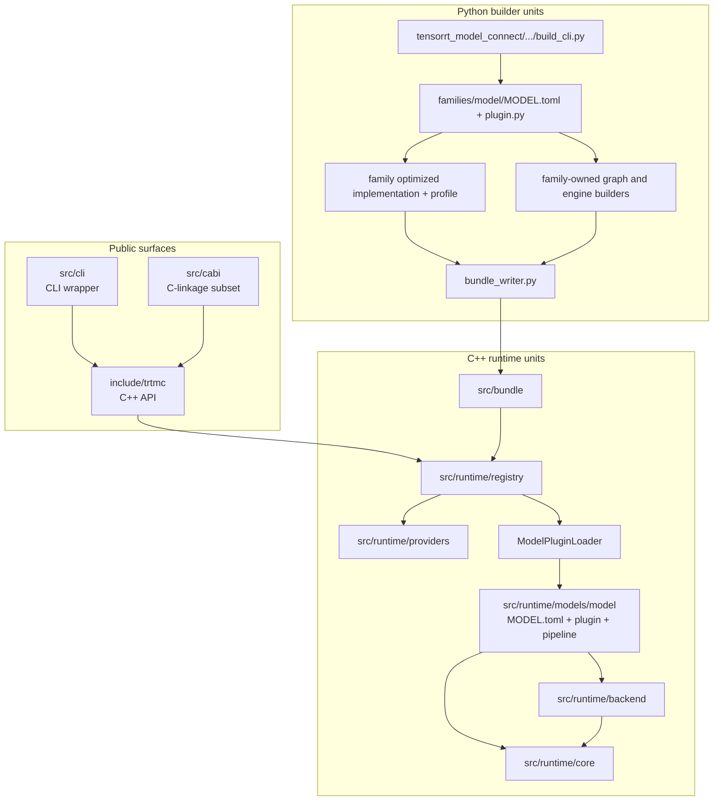

Unit design explains the source-level ownership model. Architecture tells you how the system works; unit design tells you where a change belongs.

The repository is organized around one rule: keep model-specific build and
runtime behavior under model-owned roots. Native support uses a family plugin,
runtime strategy/model DSO, and native E2E JSON manifest. A delegated optimized
implementation uses a family-owned provider manifest/profile, embedded
implementation DSO, and producer qualification TOML. Shared code owns
contracts, loading, bundle parsing, native backends, and genuinely reusable
mechanics.

## Major unit groups

| Unit group | Main path | Owns |
| --- | --- | --- |
| Public API | `include/trtmc/` | User-facing C++ types, factories, tokenizer API, bundle inspection. |
| C-linkage C++ subset | `src/cabi/api/` | C-linkage entrypoints, argument validation, and error mapping implemented against C++ types. This is not a C-compatible public header or a stable, complete C ABI; C-facing consumers need a C++ shim until an opaque-handle API with matching ownership operations is designed. |
| Bundle reader | `src/bundle/` | `.trtfb` parsing and section lookup. |
| Registry | `src/runtime/registry/` | Strategy dispatch and plugin lookup. |
| Optimized-runtime host | `src/runtime/providers/` | Descriptor/artifact validation and private implementation-factory loading. |
| Model runtimes | `src/runtime/models/` | Strategy-specific construction and task-specific inference behavior. |
| Runtime plugin loader | `src/runtime/registry/pipeline_plugin_loader.cpp` and generated index | Resolve one strategy owner, load its DSO, and verify registrations. |
| Runtime core | `src/runtime/core/` | Device tensors, CUDA helpers, distributed runtime, pipeline pooling, and TensorRT graph helpers. |
| Domains | `src/runtime/domains/` | Small cross-model domain helpers; currently only shared diffusion math. |
| Python builder | `python/tensorrt_model_connect/` | Model/family resolution, family-scoped optimized provider selection, native graph building, and bundle writing. |
| Tests | `tests/` | Builder, C++, tools, and E2E coverage. |

## Ownership boundaries

| Boundary | Why it exists |
| --- | --- |
| Build adapter versus runtime constructor | A native `FamilyPlugin` or exact-qualified optimized adapter knows how to build its claimed request. A native bundle uses its C++ model DSO and `IPipelinePlugin`; an optimized bundle uses its embedded implementation DSO and private factory. E2E `task_strategy` is the separate user-task grouping. |
| `IPipelinePlugin` versus `IPipeline` | The plugin constructs objects once at load time. The pipeline owns request-time behavior. |
| `IBackend` versus pipeline code | Backend DSOs own TensorRT ABI details. Pipelines operate through `ITrtModule` and tensor abstractions. |
| `ConfigBundle` versus ad hoc flags | Runtime knobs need schema, layer priority, validation, and provenance. |
| Qualification/E2E descriptors versus unit tests | Native E2E JSON manifests prove native model contracts. Optimized qualification TOMLs prove exact implementation/profile contracts. Unit tests prove local behavior and edge cases. |

## Common change routing

| Change | Start here | Usually also update |
| --- | --- | --- |
| Add native support for a model that is architecturally similar to an existing decoder | `python/tensorrt_model_connect/families/<family>/`, `src/runtime/models/<owner>/`, and `tests/e2e/models/<family>/` | A unique native runtime strategy/DSO, builder and C++ tests, native E2E JSON manifest, model support docs. |
| Add a delegated optimized implementation for an existing family | That Python family's adapter subtree plus its qualification tests | Exact implementation/profile manifest, embedded runtime DSO, producer proof, and bundle/host contract tests. |
| Add request-time behavior for an existing model owner | `src/runtime/models/<owner>/` | Owner `MODEL.toml`, C++ tests, E2E evidence, CLI/API docs when the public task changes. |
| Add a new runtime knob | `src/runtime/config/`, `include/trtmc/config/`, Python mirror under `runtime_config/` | Generated schema manifest, config tests, docs. |
| Add quantization behavior | `python/tensorrt_model_connect/quantization/` and family hooks | Calibration tests, E2E tolerance updates. |
| Add a backend or ABI policy | `src/runtime/backend/` | Build system docs, backend tests, compatibility docs. |
| Add a CLI command | `src/cli/` | API docs, smoke tests, E2E harness if user-contract relevant. |

## Change rule

Prefer local ownership:

- For native support, add a Python family package, a model-owned runtime
  strategy/DSO, and a native E2E JSON manifest.
- For exact-qualified optimized support in an existing family, add the
  family-owned implementation/profile, isolated adapter, embedded
  implementation DSO, and producer qualification. Do not invent a native
  strategy or model DSO for that optimized path.
- Add another plugin or pipeline inside the same native runtime owner when that
  owner needs an additional runtime strategy.
- Extend the public `IPipeline` contract only when no existing method represents
  the new user-visible task.
- Add schema files for config surfaces instead of growing one-off CLI flags.

Do not solve extension work by adding central `if model_id contains ...` logic. The codebase is designed so model-specific knowledge lives in model-owned units and strategy-specific knowledge lives in strategy-owned units.

## How to read the unit docs

- [Building Blocks](/unit-design/building-blocks) is the map of abstractions and their source files.
- [Python Builder Units](python-builder.md) explains how model support becomes
  either a native engine-plan bundle or an exact qualified optimized-runtime
  bundle.
- [C++ Runtime Units](cpp-runtime.md) explains how bundles become task pipelines.
- [Testing Units](testing.md) explains which tests prove which contract.
