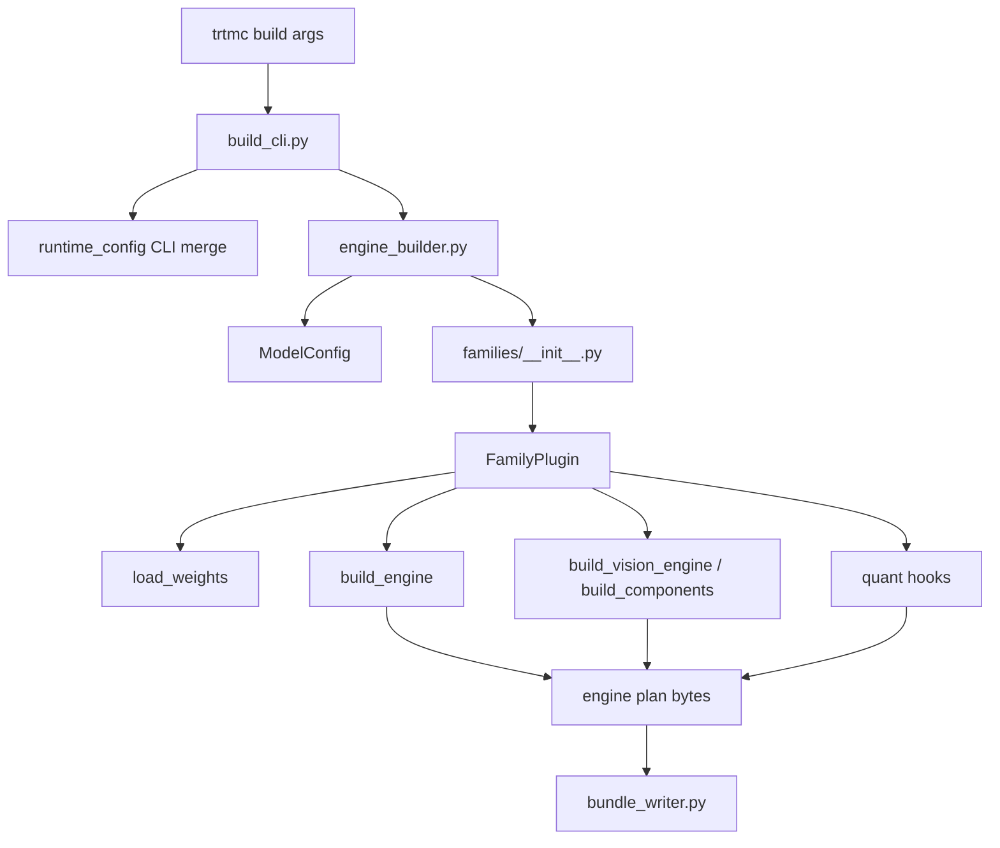
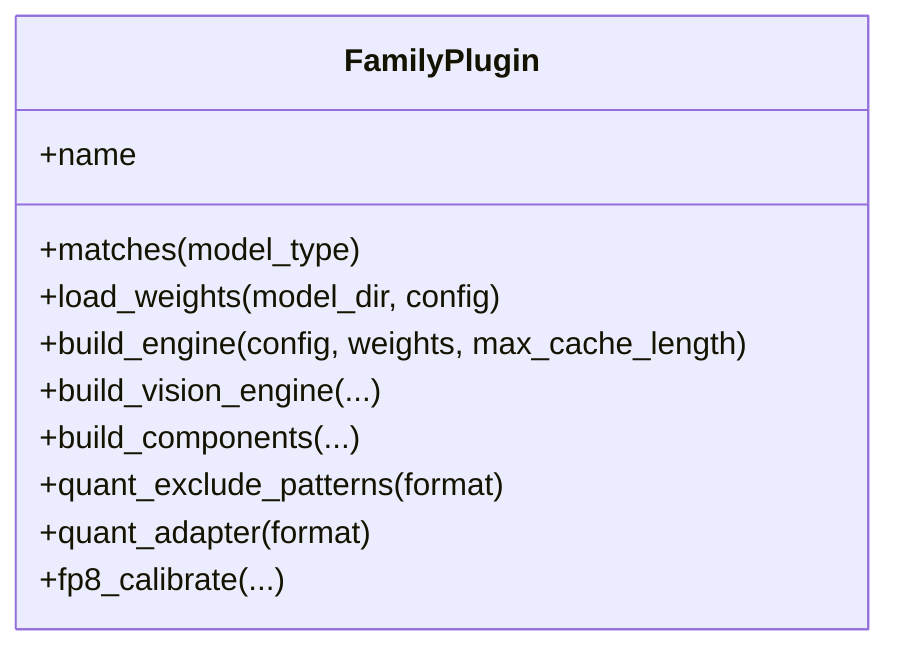
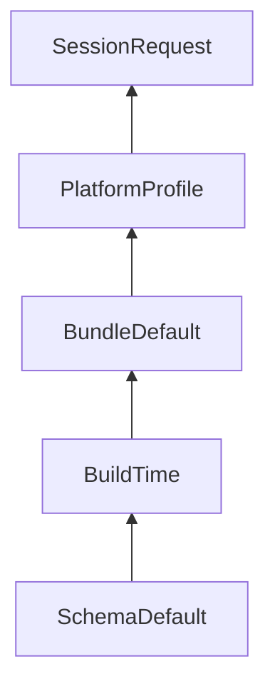

The Python builder turns a Python-first checkpoint into a native runtime bundle. It owns model understanding, graph construction, quantization preparation, and bundle serialization.

## CLI

`python/tensorrt_model_connect/build_cli.py` owns command parsing for `trtmc build`. It handles early `--rtx` backend selection, auto method selection, Python profile re-exec, config resolution, quantization flags, and inspection.

The CLI should stay thin. It should translate user intent into builder options and leave model-specific behavior to family plugins or engine builders.

## Engine builder

`python/tensorrt_model_connect/engine_builder.py` orchestrates model resolution, plugin selection, weight loading, engine building, and bundle writing.

Think of `engine_builder.py` as the build coordinator:

1. Resolve the model path or ID.
2. Read `config.json` through `ModelConfig`.
3. Select a `FamilyPlugin`.
4. Build the requested engine components.
5. Collect tokenizer and asset files.
6. Write `BundleInfo` and `BundleSection` entries.

## Family plugins

`python/tensorrt_model_connect/families/` owns raw TRT family support. Each
family package has a `MODEL.toml` descriptor and a module, normally
`plugin.py`. Discovery in `families/__init__.py` reads the descriptors first
and imports only the selected package. Adding a loose
`families/<family>.py` file does not participate in the current descriptor
contract.

The `FamilyPlugin` protocol is the contract. Required methods are:

| Method | Purpose |
| --- | --- |
| `matches(model_type)` | Decide whether this plugin handles a HuggingFace model type. |
| `load_weights(model_dir, config, precision=...)` | Read and normalize checkpoint tensors. |
| `build_engine(config, weights, max_cache_length, ...)` | Build the main TensorRT engine plan. |

Optional methods add modality and optimization behavior:

| Optional method | Used for |
| --- | --- |
| `build_vision_engine` and `get_vl_config` | Vision-language models. |
| `build_components` and `get_diffusion_config` | Diffusion models with text encoder, denoiser, and VAE components. |
| `quant_exclude_patterns`, `calibration_data`, `quant_adapter` | Family-specific quantization control. |
| `fp8_calibrate` | FP8 calibration flows. |

## Graph construction

| Unit | Purpose |
| --- | --- |
| `families/<family>/graph_ops.py` | Family-owned TensorRT graph operations when that family defines them. |
| `families/<family>/graph_blocks.py` | Family-owned reusable blocks when that family defines them. |
| `families/<family>/standard_decoder_builder.py` | A family-owned decoder engine builder where present. |
| Dedicated builders | Vision, encoder, diffusion, codec, and model-specific engines. |

There are no repository-root `graph_ops.py` or `graph_blocks.py` modules.
Reuse within a family is encouraged, while helpers whose assumptions are
model-specific remain under the owning family package.

## Native TRT build path

`trtmc build` uses native TRT family plugins under
`python/tensorrt_model_connect/families/`. The builder emits TensorRT plans and
the exact model-owned `runtime_strategy` consumed by the C++ loader. That key
must match one strategy declared by a single
`src/runtime/models/<owner>/MODEL.toml`.

## Runtime config

`python/tensorrt_model_connect/runtime_config/` mirrors C++ config schema logic for build-time and bundle-time config resolution.

The merge order is:

Higher layers override lower layers only where the schema allows them. The
builder writes bundle defaults; successful runtime resolution writes
`<bundle>.effective_config.json` next to the bundle.

## Builder unit test strategy

Builder changes should usually have tests in `tests/builder/`:

| Change | Test shape |
| --- | --- |
| Family matching or config parsing | Synthetic `ModelConfig` and family plugin tests. |
| Weight mapping | Tiny checkpoint or fixture-based mapper tests. |
| Graph builder behavior | Focused graph construction or mock TensorRT tests. |
| Quantization | Plan, calibration, scale-provider, and exclusion tests. |
| Bundle output | Inspect `BundleInfo`, sections, and `config.json` fields. |
