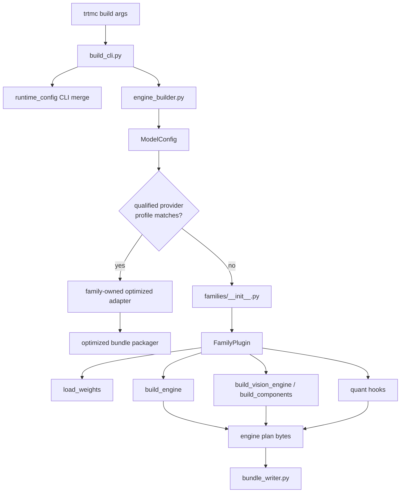
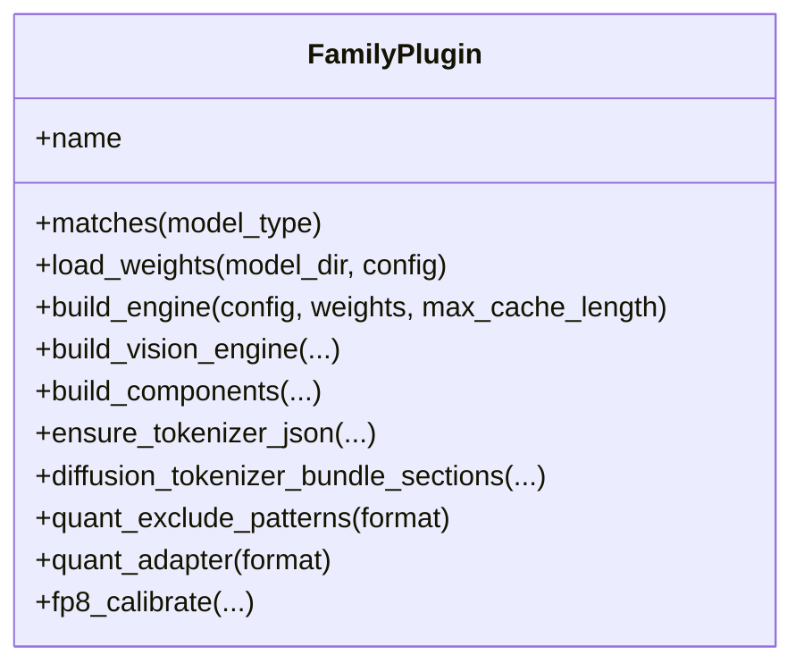
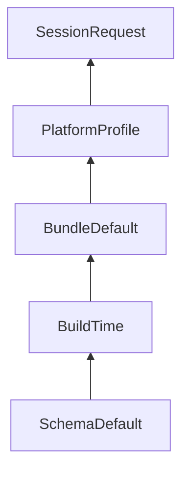

The Python builder turns a Python-first checkpoint into either a native TRT
bundle or an exact-qualified optimized-runtime bundle. Native family plugins
own model understanding, graph construction, and quantization preparation;
family-owned optimized adapters own the provider-specific artifact path. The
shared coordinator selects one path and serializes its bundle.

## CLI

`python/tensorrt_model_connect/build_cli.py` owns command parsing for `trtmc build`. It handles early `--rtx` backend selection, auto method selection, Python profile re-exec, config resolution, quantization flags, and inspection.

The CLI should stay thin. It should translate user intent into builder options and leave model-specific behavior to family plugins or engine builders.

## Engine builder

`python/tensorrt_model_connect/engine_builder.py` orchestrates model resolution,
optimized-provider selection, native plugin selection, weight loading, engine
building, and bundle writing.

Think of `engine_builder.py` as the build coordinator:

1. Resolve the model path or ID.
2. Read `config.json` through `ModelConfig`.
3. Resolve the owning family without loading every family package.
4. Probe optimized implementations only inside that family. If exactly one
   qualified model/revision/target/options profile claims the request, run its
   adapter and write a generic optimized-runtime bundle.
5. Otherwise select the native `FamilyPlugin` and build the requested engine
   components.
6. Collect tokenizer and asset files for the selected path.
7. Write `BundleInfo` and `BundleSection` entries.

### Tokenizer repair transaction

For a native family that requires a tokenizer, the coordinator validates
`tokenizer.json` before deriving special-token metadata or writing the bundle.
A missing or incompatible file, including an undersized WordPiece export,
enters a transaction rooted in the resolved model directory. Standard
Hugging Face slow-to-fast conversion is attempted first. If it fails, the
coordinator calls the optional family `ensure_tokenizer_json` hook, passing
`previous_error` and `trust_remote_code` only when the hook accepts those
keywords.

The whole mutation lifecycle is owned by a process-reentrant and cross-process
advisory lock keyed to the resolved model directory. Before mutating canonical
tokenizer state, the coordinator safely opens or creates the persistent
regular-file sentinel `.trtmc-tokenizer-repair.lock`. It never unlinks that
sentinel, so cooperating waiters continue to lock the same inode across process
exits; the sentinel is excluded from bundle assets. Waiters revalidate under
the lock and reuse a compatible result committed by an earlier transaction.
The same-thread standard and family fallbacks re-enter the existing ownership
without taking a second OS lock. A forked child closes inherited repair
descriptors and discards inherited ownership; before modifying tokenizer
state, it must acquire fresh ownership instead of relying on the inherited
lexical context. A compatible directory with no sentinel can return through
the read-only fast path.

Before either attempt, an existing `tokenizer.json` is atomically moved to
`original-tokenizer.json` in a unique hidden `tokenizer-recovery-*` directory,
so the family hook sees no rejected file to short-circuit on. If that initial
recovery directory cannot be reserved or the initial move fails, the canonical
original stays untouched and repair stops. Commit requires a truthy hook result
and a non-empty regular, non-symlink file that passes the native tokenizer
validator. A successful commit creates or replaces the canonical file in place
and then removes the quarantined old file on a best-effort basis. A
post-commit cleanup failure does not misreport the repair as failed: the
compatible canonical replacement remains installed and a warning names the
recovery directory where cleanup residue may remain. Failed candidates are
removed and an existing original is restored. When an original existed, a
candidate-cleanup or restore failure leaves it at a durable recovery path
included in the terminal error. With no original, ordinary cleanup leaves the
canonical path absent; if cleanup itself fails, the unsuccessful candidate may
remain and the error reports that failure without claiming an original
recovery file. The resolved model directory must be writable, and callers that
need an immutable snapshot must supply a writable copy.

Diffusion families own tokenizer-directory priority in
`diffusion_tokenizer_bundle_sections()`. That hook receives the same
single-directory `ensure_tokenizer_json` callback. The coordinator collects
those repaired sections before it detects tokenizer special-token behavior,
then reconciles both generated and family-provided `config_json` metadata with
the repaired tokenizer.

## Family plugins

This section describes the native build path; exact-qualified optimized
implementations use the separate adapter contract below.

`python/tensorrt_model_connect/families/` owns raw TRT family support. Each
family package has a `MODEL.toml` descriptor and exports its package-level
`plugin` from `__init__.py`; the implementation normally lives in `plugin.py`.
The descriptor's `module` field is specialization/tooling metadata and does
not select an arbitrary runtime-discovery module. Discovery in
`families/__init__.py` has three input-specific flows:

1. A full config uses `architecture_patterns` to import bounded candidates and
   check `matches_config()` first. If none matches, `_ensure_discovered()`
   preserves the legacy compatibility fallback:
   `pkgutil.iter_modules()` imports every non-private module/package under
   `families/` and runs its `matches_config()`/`matches()` predicates.
2. A string or `model_type` tries a direct descriptor ID first, then
   alias/prefix candidates, and finally the same all-package fallback.
3. A Diffusers pipeline class uses descriptor
   `diffusion_pipeline_classes` only; matching packages are imported, and
   there is no `pkgutil` fallback.

A loose `families/<family>.py` file can therefore be observed by the legacy
scan, but it does not participate in the complete descriptor contract and is
not sufficient for supported model ownership. Keep aliases and architecture
patterns accurate so normal requests remain on the bounded descriptor-first
route.

For native builds, the `FamilyPlugin` protocol is the contract. Required
methods are:

| Method | Purpose |
| --- | --- |
| `matches(model_type)` | Decide whether this plugin handles a HuggingFace model type. |
| `load_weights(model_dir, config, precision=...)` | Read and normalize checkpoint tensors. |
| `build_engine(config, weights, max_cache_length, ...)` | Build the main TensorRT engine plan. |

Optional methods add modality and optimization behavior:

| Optional method | Used for |
| --- | --- |
| `build_vision_engine` and `get_vl_config` | Vision-language models. |
| `build_components` and `get_diffusion_config` | Diffusion models with text encoder, denoiser, and VAE components. |
| `ensure_tokenizer_json` | Family fallback after standard tokenizer conversion fails; must return success and leave a native-compatible regular file. |
| `diffusion_tokenizer_bundle_sections` | Select diffusion tokenizer directories and invoke the supplied repair callback before returning bundle sections. |
| `quant_exclude_patterns`, `calibration_data`, `quant_adapter` | Family-specific quantization control. |
| `fp8_calibrate` | FP8 calibration flows. |

## Graph construction

| Unit | Purpose |
| --- | --- |
| `families/<family>/graph_ops.py` | Family-owned TensorRT graph operations when that family defines them. |
| `families/<family>/graph_blocks.py` | Family-owned reusable blocks when that family defines them. |
| `families/<family>/standard_decoder_builder.py` | A family-owned decoder engine builder where present. |
| Dedicated builders | Vision, encoder, diffusion, codec, and model-specific engines. |

There are no repository-root `graph_ops.py` or `graph_blocks.py` modules.
Reuse within a family is encouraged, while helpers whose assumptions are
model-specific remain under the owning family package.

## Optimized-runtime build path

Both the CLI and public Python `build()` API try the optimized path before the
native builder. They resolve the checkpoint and family, inspect only that
family's implementation manifests, and describe the active CUDA target. A
model-owned provider profile must match all of these:

- canonical HuggingFace model ID and pinned revision;
- exact target OS, architecture, platform kind, GPU architecture/name, and
  minimum memory;
- supported public build options; and
- a current qualification state and semantic-source hash.

One successful claim invokes that adapter in an isolated process and writes a
bundle that is self-contained for the implementation DSO and provider-produced
artifacts: `optimized_runtime.json`, opaque implementation metadata,
`optimized_runtime_artifacts/...`, and the exact `libtrtmc_impl_*.so`. It is
not a hermetic operating-system or GPU-runtime image. The host must still
supply the matching NVIDIA driver (`libcuda.so.1`), versioned CUDA runtime
(`libcudart.so.<major>`), TensorRT (`libnvinfer.so.<major>`), dynamic loader,
and compatible system libraries. More than one claim is an error. No claim
returns control to the native build; a selected adapter's build failure is
terminal.

This optimized path does not require a synthetic native `runtime_strategy`,
`src/runtime/models/<owner>/MODEL.toml`, or model DSO. Its exact
implementation/profile/qualification records and embedded implementation DSO
are the support contract.

The current Qwen TensorRT Edge-LLM adapter owns three qualified Qwen3/A100
SM80/FP16 profiles. This is exact profile support, not a generic preference for
Edge-LLM on every Qwen request.

## Native TRT build path

When no optimized profile claims the tuple, `trtmc build` uses native TRT
family plugins under `python/tensorrt_model_connect/families/`. The builder
emits TensorRT plans and the exact model-owned `runtime_strategy` consumed by
the C++ native loader. That key must match one strategy declared by a single
`src/runtime/models/<owner>/MODEL.toml`.

## Runtime config

`python/tensorrt_model_connect/runtime_config/` provides Python mirrors of the
C++ schema and merge helpers. The five layers below are the general
`ConfigBundle` model, not a claim that every layer is wired into the current
native build/load path.

The merge order is:

Higher layers override lower layers only where the schema allows them. The
ordinary native builder does not automatically write build-time `--config` or
`--set` values into `config.json.defaults`, and binary header
`BundleInfo.defaults` is not passed to the runtime resolver. A producer supplies
`BundleDefault` only by explicitly writing a top-level `defaults` object into
the materialized `config.json` section. `PipelineFactory` currently combines
that optional `BundleDefault` with `SessionRequest` from runtime
`--config`/`--set`; it does not inject separate `BuildTime` or
`PlatformProfile` contributions. Successful runtime resolution writes
`<bundle>.effective_config.json` next to the bundle.

## Builder unit test strategy

Builder changes should usually have tests in `tests/builder/`:

| Change | Test shape |
| --- | --- |
| Family matching or config parsing | Synthetic `ModelConfig` and family plugin tests. |
| Weight mapping | Tiny checkpoint or fixture-based mapper tests. |
| Graph builder behavior | Focused graph construction or mock TensorRT tests. |
| Quantization | Plan, calibration, scale-provider, and exclusion tests. |
| Bundle output | Inspect `BundleInfo`, sections, and `config.json` fields. |
