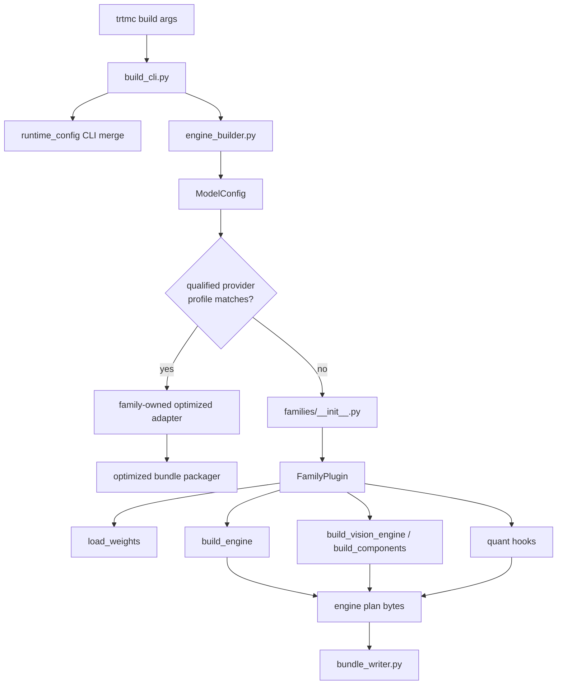
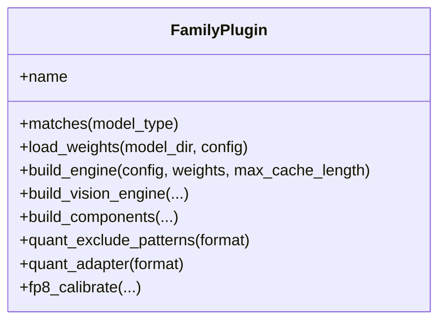
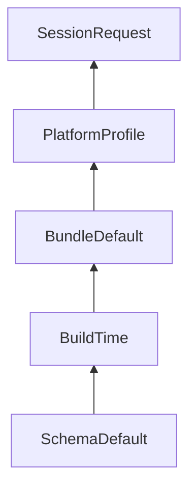

The Python builder turns a Python-first checkpoint into a native runtime bundle. It owns model understanding, graph construction, quantization preparation, and bundle serialization.

## CLI

`python/tensorrt_model_connect/build_cli.py` owns command parsing for `trtmc build`. It handles early `--rtx` backend selection, auto method selection, Python profile re-exec, config resolution, quantization flags, and inspection.

The CLI should stay thin. It should translate user intent into builder options and leave model-specific behavior to family plugins or engine builders.

## Engine builder

`python/tensorrt_model_connect/engine_builder.py` orchestrates model resolution,
optimized-provider selection, native plugin selection, weight loading, engine
building, and bundle writing.

Think of `engine_builder.py` as the build coordinator:

1. Resolve the model path or ID.
2. Read `config.json` through `ModelConfig`.
3. Resolve the owning family without loading every family package.
4. Probe optimized implementations only inside that family. If exactly one
   qualified model/revision/target/options profile claims the request, run its
   adapter and write a generic optimized-runtime bundle.
5. Otherwise select the native `FamilyPlugin` and build the requested engine
   components.
6. Collect tokenizer and asset files for the selected path.
7. Write `BundleInfo` and `BundleSection` entries.

## Family plugins

`python/tensorrt_model_connect/families/` owns raw TRT family support. Each
family package has a `MODEL.toml` descriptor and exports its package-level
`plugin` from `__init__.py`; the implementation normally lives in `plugin.py`.
The descriptor's `module` field is specialization/tooling metadata and does
not select an arbitrary runtime-discovery module. Discovery in
`families/__init__.py` has three input-specific flows:

1. A full config uses `architecture_patterns` to import bounded candidates and
   check `matches_config()` first. If none matches, `_ensure_discovered()`
   preserves the legacy compatibility fallback:
   `pkgutil.iter_modules()` imports every non-private module/package under
   `families/` and runs its `matches_config()`/`matches()` predicates.
2. A string or `model_type` tries a direct descriptor ID first, then
   alias/prefix candidates, and finally the same all-package fallback.
3. A Diffusers pipeline class uses descriptor
   `diffusion_pipeline_classes` only; matching packages are imported, and
   there is no `pkgutil` fallback.

A loose `families/<family>.py` file can therefore be observed by the legacy
scan, but it does not participate in the complete descriptor contract and is
not sufficient for supported model ownership. Keep aliases and architecture
patterns accurate so normal requests remain on the bounded descriptor-first
route.

The `FamilyPlugin` protocol is the contract. Required methods are:

| Method | Purpose |
| --- | --- |
| `matches(model_type)` | Decide whether this plugin handles a HuggingFace model type. |
| `load_weights(model_dir, config, precision=...)` | Read and normalize checkpoint tensors. |
| `build_engine(config, weights, max_cache_length, ...)` | Build the main TensorRT engine plan. |

Optional methods add modality and optimization behavior:

| Optional method | Used for |
| --- | --- |
| `build_vision_engine` and `get_vl_config` | Vision-language models. |
| `build_components` and `get_diffusion_config` | Diffusion models with text encoder, denoiser, and VAE components. |
| `quant_exclude_patterns`, `calibration_data`, `quant_adapter` | Family-specific quantization control. |
| `fp8_calibrate` | FP8 calibration flows. |

## Graph construction

| Unit | Purpose |
| --- | --- |
| `families/<family>/graph_ops.py` | Family-owned TensorRT graph operations when that family defines them. |
| `families/<family>/graph_blocks.py` | Family-owned reusable blocks when that family defines them. |
| `families/<family>/standard_decoder_builder.py` | A family-owned decoder engine builder where present. |
| Dedicated builders | Vision, encoder, diffusion, codec, and model-specific engines. |

There are no repository-root `graph_ops.py` or `graph_blocks.py` modules.
Reuse within a family is encouraged, while helpers whose assumptions are
model-specific remain under the owning family package.

## Optimized-runtime build path

Both the CLI and public Python `build()` API try the optimized path before the
native builder. They resolve the checkpoint and family, inspect only that
family's implementation manifests, and describe the active CUDA target. A
model-owned provider profile must match all of these:

- canonical HuggingFace model ID and pinned revision;
- exact target OS, architecture, platform kind, GPU architecture/name, and
  minimum memory;
- supported public build options; and
- a current qualification state and semantic-source hash.

One successful claim invokes that adapter in an isolated process and writes a
bundle that is self-contained for the implementation DSO and provider-produced
artifacts: `optimized_runtime.json`, opaque implementation metadata,
`optimized_runtime_artifacts/...`, and the exact `libtrtmc_impl_*.so`. It is
not a hermetic operating-system or GPU-runtime image. The host must still
supply the matching NVIDIA driver (`libcuda.so.1`), versioned CUDA runtime
(`libcudart.so.<major>`), TensorRT (`libnvinfer.so.<major>`), dynamic loader,
and compatible system libraries. More than one claim is an error. No claim
returns control to the native build; a selected adapter's build failure is
terminal.

The current Qwen TensorRT Edge-LLM adapter owns three qualified Qwen3/A100
SM80/FP16 profiles. This is exact profile support, not a generic preference for
Edge-LLM on every Qwen request.

## Native TRT build path

When no optimized profile claims the tuple, `trtmc build` uses native TRT
family plugins under `python/tensorrt_model_connect/families/`. The builder
emits TensorRT plans and the exact model-owned `runtime_strategy` consumed by
the C++ native loader. That key must match one strategy declared by a single
`src/runtime/models/<owner>/MODEL.toml`.

## Runtime config

`python/tensorrt_model_connect/runtime_config/` mirrors C++ config schema logic for build-time and bundle-time config resolution.

The merge order is:

Higher layers override lower layers only where the schema allows them. The
builder writes bundle defaults; successful runtime resolution writes
`<bundle>.effective_config.json` next to the bundle.

## Builder unit test strategy

Builder changes should usually have tests in `tests/builder/`:

| Change | Test shape |
| --- | --- |
| Family matching or config parsing | Synthetic `ModelConfig` and family plugin tests. |
| Weight mapping | Tiny checkpoint or fixture-based mapper tests. |
| Graph builder behavior | Focused graph construction or mock TensorRT tests. |
| Quantization | Plan, calibration, scale-provider, and exclusion tests. |
| Bundle output | Inspect `BundleInfo`, sections, and `config.json` fields. |
